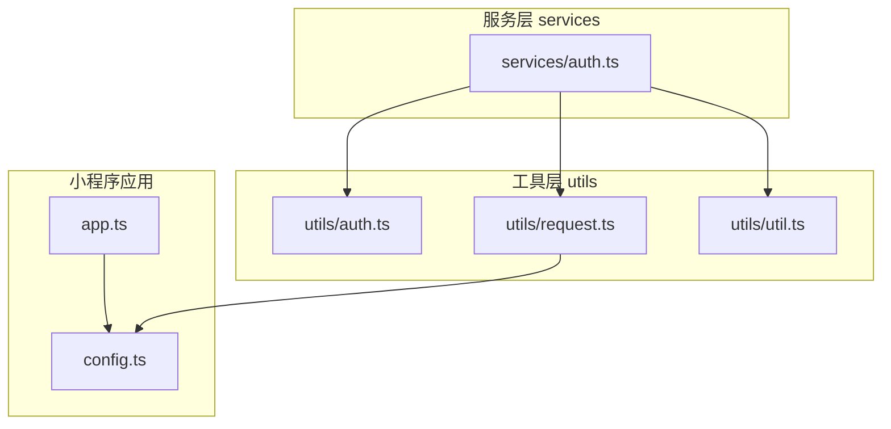
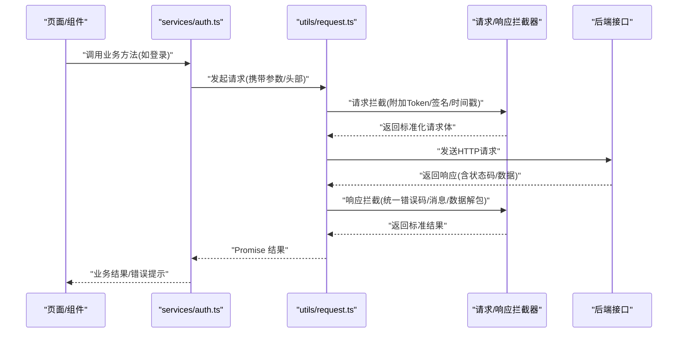
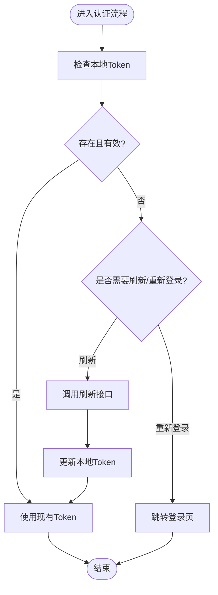
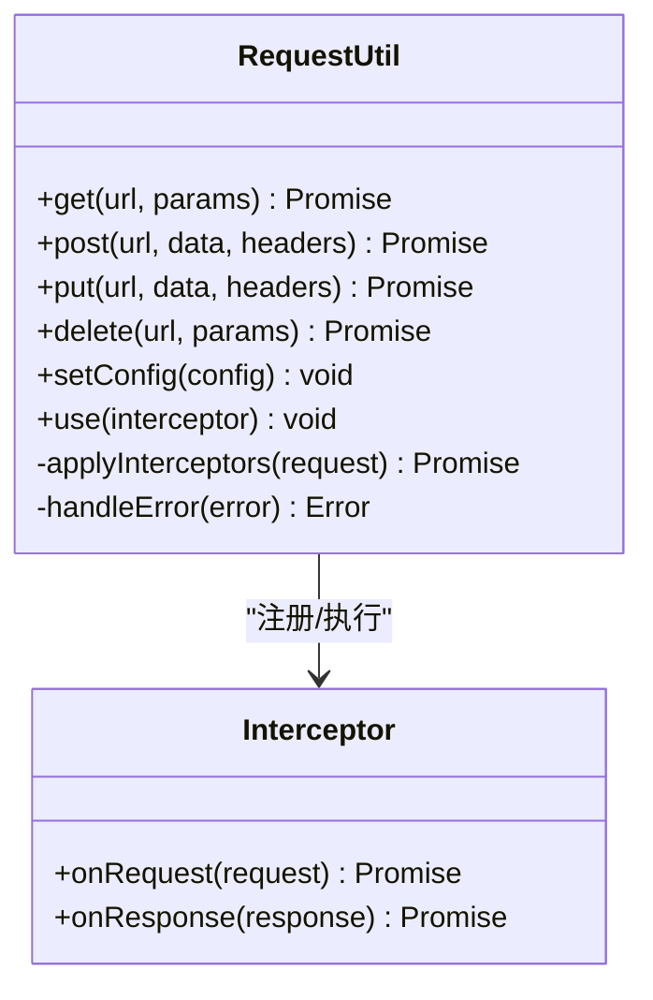
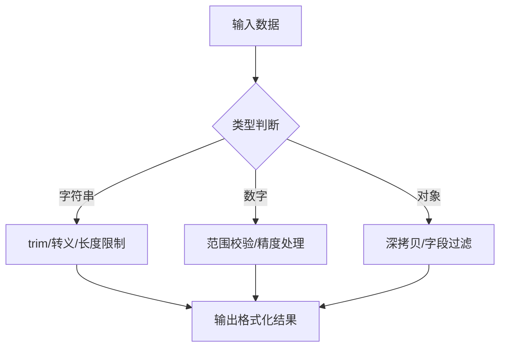
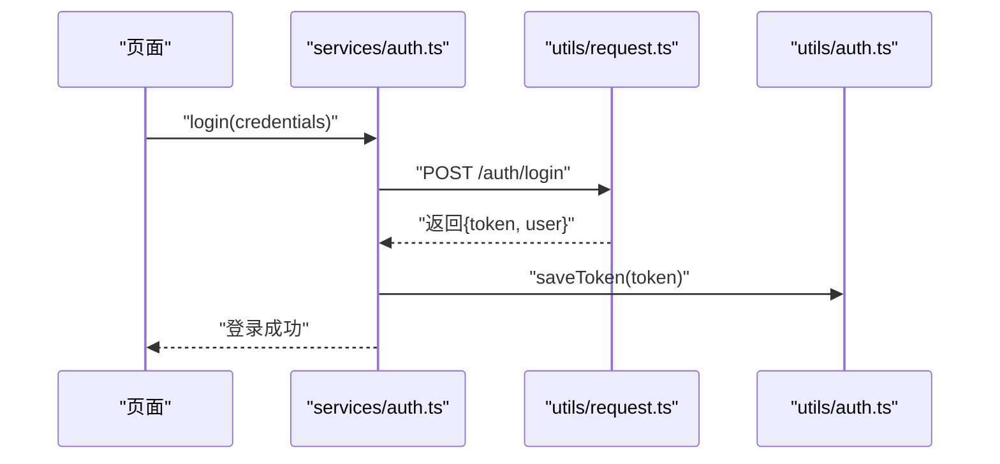
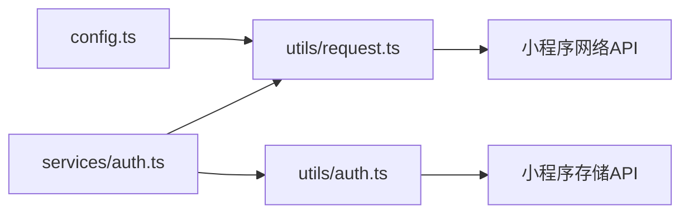

# 工具函数库

<cite>
**本文引用的文件**   
- [utils/auth.ts](file://miniprogram/utils/auth.ts)
- [utils/request.ts](file://miniprogram/utils/request.ts)
- [utils/util.ts](file://miniprogram/utils/util.ts)
- [services/auth.ts](file://miniprogram/services/auth.ts)
- [config.ts](file://miniprogram/config.ts)
</cite>

## 目录
1. [简介](#简介)
2. [项目结构](#项目结构)
3. [核心组件](#核心组件)
4. [架构总览](#架构总览)
5. [详细组件分析](#详细组件分析)
6. [依赖分析](#依赖分析)
7. [性能考虑](#性能考虑)
8. [故障排查指南](#故障排查指南)
9. [结论](#结论)
10. [附录](#附录)

## 简介
本文件为微信小程序项目的工具函数库文档，聚焦以下能力：
- 认证工具：登录态管理、Token 存取与刷新策略
- 请求封装：统一的 HTTP 请求封装、拦截器（请求/响应）、错误处理与重试机制
- 通用工具：数据格式化、日期时间处理、参数校验等实用方法
- 扩展与配置：可插拔的拦截器、自定义错误码映射、请求超时与重试策略配置

目标读者包括前端开发者与需要集成或二次开发该工具库的工程师。

## 项目结构
工具函数库位于 miniprogram/utils 目录下，按职责划分：
- auth.ts：认证相关工具（登录态、Token 存取）
- request.ts：HTTP 请求封装与拦截器
- util.ts：通用工具函数（数据格式化、日期时间、校验等）

服务层 services 中的 auth.ts 使用 utils/auth.ts 提供的认证能力；全局配置在 config.ts 中集中管理。

**图表来源** 
- [config.ts](file://miniprogram/config.ts)
- [utils/auth.ts](file://miniprogram/utils/auth.ts)
- [utils/request.ts](file://miniprogram/utils/request.ts)
- [utils/util.ts](file://miniprogram/utils/util.ts)
- [services/auth.ts](file://miniprogram/services/auth.ts)

**章节来源**
- [config.ts](file://miniprogram/config.ts)
- [utils/auth.ts](file://miniprogram/utils/auth.ts)
- [utils/request.ts](file://miniprogram/utils/request.ts)
- [utils/util.ts](file://miniprogram/utils/util.ts)
- [services/auth.ts](file://miniprogram/services/auth.ts)

## 核心组件
- 认证工具（auth.ts）
  - 功能：获取/设置/清除 Token，判断登录态，安全存储
  - 典型用法：页面初始化时检查登录态；登录后保存 Token；退出时清理
- 请求封装（request.ts）
  - 功能：统一发起网络请求，自动附加 Token，请求/响应拦截器，错误处理，超时控制，可选重试
  - 典型用法：业务服务通过封装方法发起 GET/POST 等请求，统一处理成功与失败分支
- 通用工具（util.ts）
  - 功能：数据格式化工具（如金额、百分比、空值处理），日期时间格式化与计算，基础校验（非空、邮箱、手机号等）
  - 典型用法：列表渲染前格式化数据；表单提交前进行输入校验

**章节来源**
- [utils/auth.ts](file://miniprogram/utils/auth.ts)
- [utils/request.ts](file://miniprogram/utils/request.ts)
- [utils/util.ts](file://miniprogram/utils/util.ts)

## 架构总览
下图展示从业务服务到网络层的调用链路与拦截点：

**图表来源** 
- [services/auth.ts](file://miniprogram/services/auth.ts)
- [utils/request.ts](file://miniprogram/utils/request.ts)
- [utils/auth.ts](file://miniprogram/utils/auth.ts)

## 详细组件分析

### 认证工具（utils/auth.ts）
- 职责
  - 登录态检测：根据本地存储是否存在有效 Token 判定是否已登录
  - Token 管理：读取、写入、删除 Token；支持过期时间与刷新策略
  - 安全存储：优先使用小程序安全存储能力，降级到普通存储
- 关键方法与行为
  - 获取 Token：若不存在则返回空；若存在且未过期则返回
  - 设置 Token：写入并记录过期时间；必要时触发刷新任务
  - 清除 Token：登出时调用，清理本地缓存
  - 登录态判断：综合 Token 有效性、用户信息等
- 错误处理
  - 存储异常捕获与降级
  - Token 无效时的统一处理（跳转登录页或静默刷新）
- 扩展点
  - 自定义存储键名
  - 自定义 Token 验证逻辑（如解析 JWT）
  - 自定义刷新流程（如刷新令牌接口）

**图表来源** 
- [utils/auth.ts](file://miniprogram/utils/auth.ts)

**章节来源**
- [utils/auth.ts](file://miniprogram/utils/auth.ts)

### 请求封装（utils/request.ts）
- 职责
  - 统一发起网络请求，屏蔽底层差异
  - 请求拦截：自动附加 Token、公共头、签名、时间戳等
  - 响应拦截：统一解包数据、错误码映射、消息提示
  - 错误处理：网络异常、超时、业务错误分类处理
  - 重试机制：对幂等请求支持指数退避重试
- 关键方法与行为
  - 封装请求方法：GET/POST/PUT/DELETE 等
  - 拦截器注册：请求前/后、响应前/后
  - 配置项：超时、重试次数、基础 URL、默认头
- 错误处理
  - 将后端错误码映射为统一错误对象
  - 区分网络错误与业务错误，提供友好提示
  - 敏感错误（如鉴权失败）自动跳转登录
- 扩展点
  - 自定义拦截器链
  - 自定义错误码映射表
  - 自定义重试策略（最大次数、退避算法）

**图表来源** 
- [utils/request.ts](file://miniprogram/utils/request.ts)

**章节来源**
- [utils/request.ts](file://miniprogram/utils/request.ts)

### 通用工具（utils/util.ts）
- 职责
  - 数据格式化：金额、百分比、单位转换、空值回退
  - 日期时间：格式化、相对时间、时区处理、区间计算
  - 校验：必填、邮箱、手机号、URL、数字范围等
  - 其他：深拷贝、防抖/节流、随机数、哈希等
- 关键方法与行为
  - formatMoney(value, decimals?)：金额格式化，支持小数位与千分位
  - formatDate(date, fmt?)：日期格式化，支持多种模板
  - relativeTime(timestamp)：显示“刚刚”、“x分钟前”等
  - validateEmail/email/mobile/url：常用字段校验
- 错误处理
  - 输入非法时返回默认值或抛出明确错误信息
- 扩展点
  - 自定义格式化规则
  - 自定义校验器集合
  - 国际化文案注入

**图表来源** 
- [utils/util.ts](file://miniprogram/utils/util.ts)

**章节来源**
- [utils/util.ts](file://miniprogram/utils/util.ts)

### 服务层集成（services/auth.ts）
- 职责
  - 封装认证相关业务流程：登录、注册、刷新 Token、退出
  - 调用 utils/auth.ts 与 utils/request.ts 完成具体实现
- 关键方法与行为
  - login(credentials)：提交凭证，成功后保存 Token
  - refresh()：刷新 Token，失败则引导重新登录
  - logout()：清理本地状态并跳转
- 错误处理
  - 统一错误提示与跳转逻辑
  - 结合请求拦截器的鉴权失败处理

**图表来源** 
- [services/auth.ts](file://miniprogram/services/auth.ts)
- [utils/request.ts](file://miniprogram/utils/request.ts)
- [utils/auth.ts](file://miniprogram/utils/auth.ts)

**章节来源**
- [services/auth.ts](file://miniprogram/services/auth.ts)

## 依赖分析
- 模块耦合
  - services/auth.ts 依赖 utils/auth.ts 与 utils/request.ts
  - utils/request.ts 依赖全局配置（如基础 URL、超时、默认头）
  - utils/util.ts 无外部依赖，纯工具函数
- 外部依赖
  - 小程序原生网络与存储 API
  - 可能的第三方加密/签名库（按需引入）
- 潜在循环依赖
  - 当前设计避免循环引用，建议保持单向依赖

**图表来源** 
- [config.ts](file://miniprogram/config.ts)
- [utils/request.ts](file://miniprogram/utils/request.ts)
- [utils/auth.ts](file://miniprogram/utils/auth.ts)
- [services/auth.ts](file://miniprogram/services/auth.ts)

**章节来源**
- [config.ts](file://miniprogram/config.ts)
- [utils/request.ts](file://miniprogram/utils/request.ts)
- [utils/auth.ts](file://miniprogram/utils/auth.ts)
- [services/auth.ts](file://miniprogram/services/auth.ts)

## 性能考虑
- 请求优化
  - 合理设置超时与重试次数，避免雪崩
  - 对重复请求做去重（相同 URL+参数）
  - 大列表数据分页加载与虚拟滚动
- 存储优化
  - Token 与敏感数据最小化存储
  - 定期清理过期数据
- 工具函数
  - 避免在渲染路径中进行高开销计算，采用缓存或预计算
  - 防抖/节流用于高频事件（搜索、滚动）

[本节为通用指导，不直接分析具体文件]

## 故障排查指南
- 常见问题
  - 网络请求失败：检查基础 URL、超时配置、跨域与证书
  - 鉴权失败：确认 Token 是否过期、刷新流程是否正常
  - 数据格式错误：检查服务端返回结构与前端解包逻辑
- 定位步骤
  - 开启请求日志（打印 URL、方法、请求头、响应码）
  - 查看拦截器日志（请求/响应阶段）
  - 检查本地存储中的 Token 与过期时间
- 恢复措施
  - 清理缓存并重试
  - 强制刷新 Token 或引导重新登录
  - 降级到备用接口或离线模式

**章节来源**
- [utils/request.ts](file://miniprogram/utils/request.ts)
- [utils/auth.ts](file://miniprogram/utils/auth.ts)

## 结论
本工具函数库围绕认证、请求封装与通用工具三大方向，提供了稳定、可扩展的前端基础设施。通过拦截器与统一错误处理，显著降低业务代码复杂度；通过丰富的工具函数提升开发与维护效率。建议在实际项目中遵循本文的配置与最佳实践，确保一致性与可维护性。

[本节为总结性内容，不直接分析具体文件]

## 附录
- 配置项说明（示例）
  - baseURL：后端基础地址
  - timeout：请求超时毫秒数
  - retry：重试次数
  - defaultHeaders：默认请求头（如 Content-Type、Authorization）
- 扩展建议
  - 新增拦截器：在请求/响应阶段注入签名、埋点、监控
  - 自定义错误码映射：将不同服务的错误码统一映射为前端友好提示
  - 国际化：将提示信息抽离为多语言资源

[本节为补充信息，不直接分析具体文件]