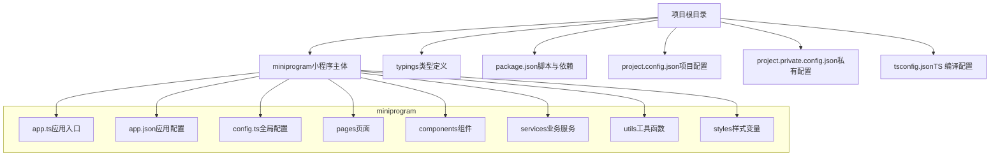
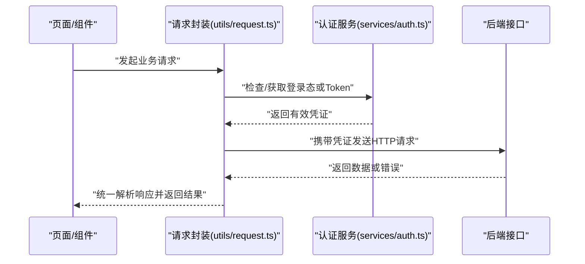
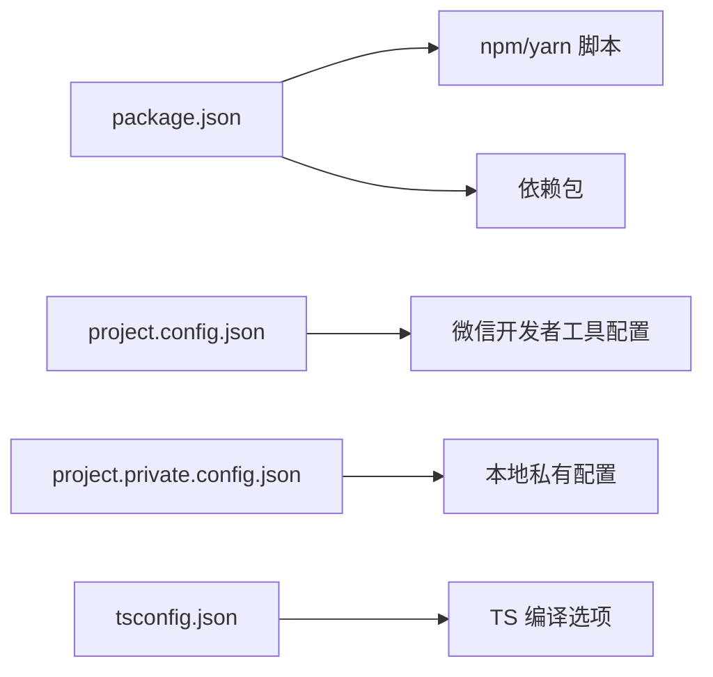

# 快速开始

<cite>
**本文引用的文件**   
- [package.json](file://package.json)
- [project.config.json](file://project.config.json)
- [project.private.config.json](file://project.private.config.json)
- [tsconfig.json](file://tsconfig.json)
- [miniprogram/app.ts](file://miniprogram/app.ts)
- [miniprogram/config.ts](file://miniprogram/config.ts)
- [miniprogram/app.json](file://miniprogram/app.json)
- [miniprogram/utils/request.ts](file://miniprogram/utils/request.ts)
- [miniprogram/services/auth.ts](file://miniprogram/services/auth.ts)
</cite>

## 目录
1. [简介](#简介)
2. [项目结构](#项目结构)
3. [核心组件](#核心组件)
4. [架构总览](#架构总览)
5. [详细组件分析](#详细组件分析)
6. [依赖分析](#依赖分析)
7. [性能注意事项](#性能注意事项)
8. [故障排除指南](#故障排除指南)
9. [结论](#结论)
10. [附录](#附录)

## 简介
本指南面向首次接触该微信小程序项目的开发者，目标是帮助你在最短时间内完成环境准备、依赖安装、项目配置与首次运行，并理解基本操作流程。项目基于微信开发者工具与 TypeScript 构建，采用模块化服务层与通用请求封装，便于快速迭代与维护。

## 项目结构
项目为典型的微信小程序工程，核心代码位于 miniprogram 目录，包含页面、组件、服务、工具与样式等；根目录包含项目配置与类型定义。

**图表来源** 
- [project.config.json](file://project.config.json)
- [miniprogram/app.json](file://miniprogram/app.json)
- [miniprogram/app.ts](file://miniprogram/app.ts)
- [miniprogram/config.ts](file://miniprogram/config.ts)

**章节来源**
- [project.config.json](file://project.config.json)
- [miniprogram/app.json](file://miniprogram/app.json)
- [miniprogram/app.ts](file://miniprogram/app.ts)
- [miniprogram/config.ts](file://miniprogram/config.ts)

## 核心组件
- 应用入口与初始化：负责小程序生命周期、全局状态与基础能力初始化。
- 全局配置：集中管理接口地址、功能开关、主题变量等。
- 网络请求：统一封装请求、响应拦截、错误处理与鉴权流程。
- 认证服务：登录态管理、Token 获取与刷新、权限校验。
- 业务服务：按领域划分的服务模块（如用户、游戏、订单、空间等）。

**章节来源**
- [miniprogram/app.ts](file://miniprogram/app.ts)
- [miniprogram/config.ts](file://miniprogram/config.ts)
- [miniprogram/utils/request.ts](file://miniprogram/utils/request.ts)
- [miniprogram/services/auth.ts](file://miniprogram/services/auth.ts)

## 架构总览
下图展示了从页面到服务再到后端的典型调用链，以及鉴权与请求封装的协作关系。

**图表来源** 
- [miniprogram/utils/request.ts](file://miniprogram/utils/request.ts)
- [miniprogram/services/auth.ts](file://miniprogram/services/auth.ts)

## 详细组件分析

### 应用入口与初始化（app.ts）
- 职责：注册应用生命周期、初始化全局配置、设置默认页面、加载必要插件或能力。
- 关键点：确保在启动时读取全局配置，并在必要时进行环境检测与降级处理。

**章节来源**
- [miniprogram/app.ts](file://miniprogram/app.ts)

### 全局配置（config.ts）
- 职责：集中管理接口域名、超时时间、调试开关、功能特性开关等。
- 建议：区分开发与生产环境，避免硬编码敏感信息；通过环境变量或配置文件注入。

**章节来源**
- [miniprogram/config.ts](file://miniprogram/config.ts)

### 网络请求封装（utils/request.ts）
- 职责：封装 wx.request，提供统一的请求/响应拦截、错误提示、重试机制、鉴权注入。
- 关键点：
  - 请求前注入 Token 或会话标识。
  - 响应后统一处理业务码与错误码。
  - 支持超时、重试与失败回调。

**章节来源**
- [miniprogram/utils/request.ts](file://miniprogram/utils/request.ts)

### 认证服务（services/auth.ts）
- 职责：管理登录流程、Token 存储与刷新、权限判断。
- 关键点：
  - 首次登录获取授权码并换取 Token。
  - 本地安全存储 Token，过期自动刷新。
  - 提供 isLogin、getUserId 等便捷方法。

**章节来源**
- [miniprogram/services/auth.ts](file://miniprogram/services/auth.ts)

### 页面与组件（pages 与 components）
- 页面：按角色与场景划分（用户端、员工端），每个页面包含 JSON/WXML/TS/SCSS。
- 组件：可复用 UI 块（聊天气泡、空状态、游戏卡片、导航栏、时间网格等）。
- 建议：保持页面职责单一，组件尽量无状态或受控。

**章节来源**
- [miniprogram/pages](file://miniprogram/pages)
- [miniprogram/components](file://miniprogram/components)

### 应用配置（app.json）
- 职责：声明页面路由、窗口样式、底部 TabBar、分包与权限等。
- 关键点：确保入口页正确配置，TabBar 与路由一致。

**章节来源**
- [miniprogram/app.json](file://miniprogram/app.json)

## 依赖分析
- 项目依赖与脚本由 package.json 管理，通常包含开发依赖（TypeScript、打包工具等）。
- 小程序项目配置由 project.config.json 与 project.private.config.json 管理，前者为共享配置，后者为本地私有配置（如 AppID、调试选项）。
- TypeScript 编译配置由 tsconfig.json 管理，需确保目标平台与模块系统匹配。

**图表来源** 
- [package.json](file://package.json)
- [project.config.json](file://project.config.json)
- [project.private.config.json](file://project.private.config.json)
- [tsconfig.json](file://tsconfig.json)

**章节来源**
- [package.json](file://package.json)
- [project.config.json](file://project.config.json)
- [project.private.config.json](file://project.private.config.json)
- [tsconfig.json](file://tsconfig.json)

## 性能注意事项
- 减少不必要的网络请求，合理缓存与分页。
- 组件按需渲染，避免大列表直接渲染。
- 图片资源压缩与懒加载。
- 使用分包加载降低首屏体积。
- 避免在 onShow/onLoad 中执行耗时同步操作。

[本节为通用指导，不直接分析具体文件]

## 故障排除指南
- 无法打开项目
  - 确认微信开发者工具版本满足要求，且已导入正确的 AppID。
  - 检查 project.config.json 与 project.private.config.json 是否冲突。
- 页面空白或白屏
  - 检查 app.json 的 pages 数组是否包含当前页面路径。
  - 查看控制台是否有 TS 编译错误或运行时异常。
- 接口请求失败
  - 检查 config.ts 中的接口域名与协议是否正确。
  - 确认鉴权流程是否正常，Token 是否过期或未注入。
  - 查看 request.ts 的错误拦截逻辑与后端返回的业务码。
- 登录态异常
  - 确认 services/auth.ts 的登录流程与本地存储逻辑。
  - 检查网络请求是否被拦截或重定向。
- 样式不生效
  - 检查 SCSS 变量与引入路径。
  - 确认组件的 JSON 中是否声明了 usingComponents。

**章节来源**
- [miniprogram/config.ts](file://miniprogram/config.ts)
- [miniprogram/utils/request.ts](file://miniprogram/utils/request.ts)
- [miniprogram/services/auth.ts](file://miniprogram/services/auth.ts)
- [miniprogram/app.json](file://miniprogram/app.json)

## 结论
通过以上步骤，你可以在最短时间内完成环境搭建、依赖安装、项目配置与首次运行，并掌握基本的开发与调试流程。建议在熟悉项目结构后，逐步深入各服务与组件的实现细节，结合单元测试与调试工具提升开发效率。

## 附录

### 环境要求
- 操作系统：Windows 10/11 或 macOS
- 微信开发者工具：建议使用最新稳定版
- Node.js：根据项目依赖选择合适版本（可通过 nvm 管理多版本）
- 编辑器：VS Code（推荐安装 TypeScript 与 SCSS 扩展）

### 安装与运行步骤
- 克隆或下载项目到本地目录。
- 安装依赖：在项目根目录执行依赖安装命令（参考 package.json 的脚本）。
- 配置项目：
  - 在微信开发者工具中导入项目根目录。
  - 填写 AppID 与必要的调试选项（可在 project.private.config.json 中配置）。
- 首次运行：
  - 在微信开发者工具中点击“编译”或“预览”。
  - 若涉及登录，请先完成登录流程以获取 Token。
- 常用命令：
  - 安装依赖：参考 package.json 的 scripts。
  - 类型检查：执行 TypeScript 类型检查命令。
  - 构建与预览：使用微信开发者工具的内置功能。

**章节来源**
- [package.json](file://package.json)
- [project.config.json](file://project.config.json)
- [project.private.config.json](file://project.private.config.json)
- [tsconfig.json](file://tsconfig.json)