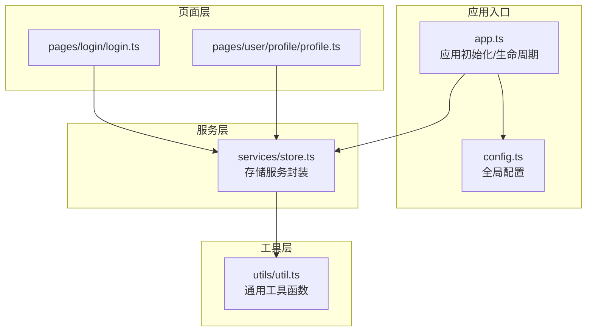
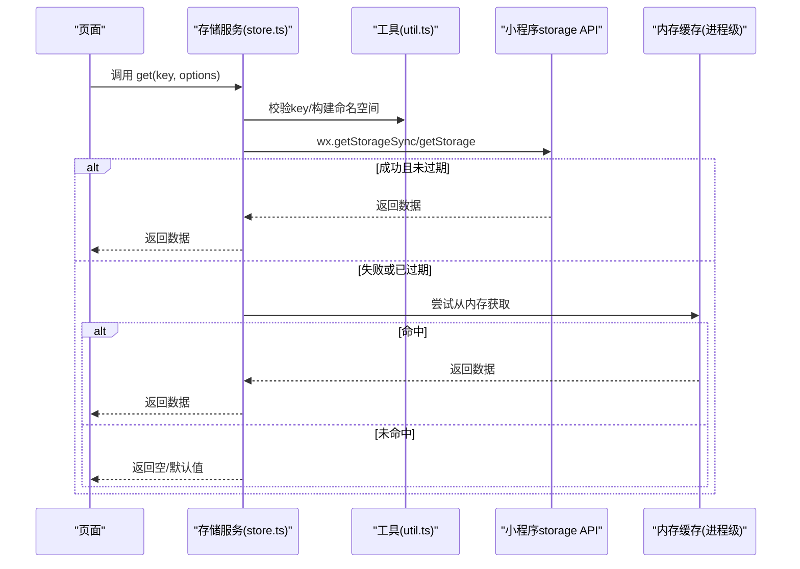
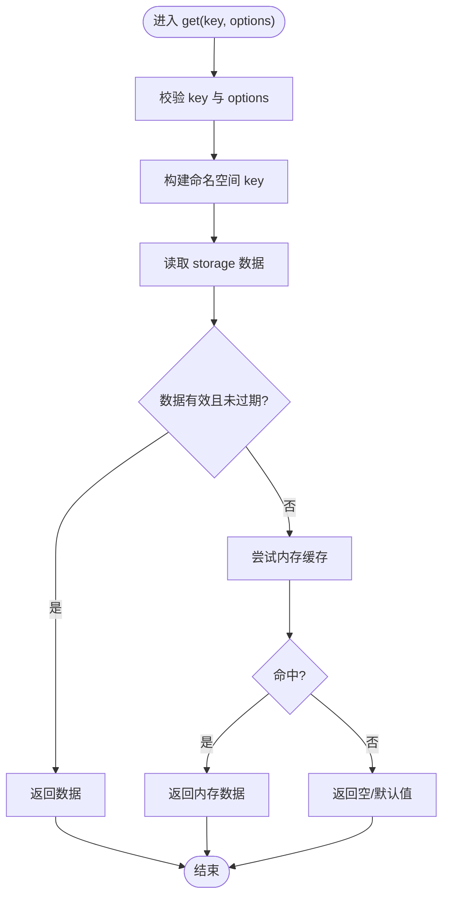
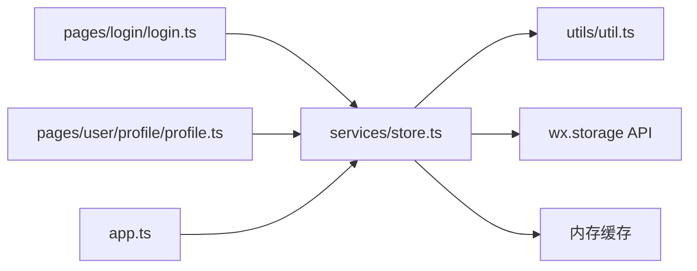

# 存储服务

<cite>
**本文引用的文件**   
- [services/store.ts](file://miniprogram/services/store.ts)
- [app.ts](file://miniprogram/app.ts)
- [config.ts](file://miniprogram/config.ts)
- [utils/util.ts](file://miniprogram/utils/util.ts)
- [pages/login/login.ts](file://miniprogram/pages/login/login.ts)
- [pages/user/profile/profile.ts](file://miniprogram/pages/user/profile/profile.ts)
</cite>

## 目录
1. [简介](#简介)
2. [项目结构](#项目结构)
3. [核心组件](#核心组件)
4. [架构总览](#架构总览)
5. [详细组件分析](#详细组件分析)
6. [依赖分析](#依赖分析)
7. [性能考虑](#性能考虑)
8. [故障排查指南](#故障排查指南)
9. [结论](#结论)
10. [附录](#附录) 

## 简介
本文件面向微信小程序项目的“存储服务”，聚焦本地存储、缓存管理与数据持久化策略。文档涵盖：
- 数据存储结构与命名规范
- 读写优化与并发控制
- 过期机制与清理策略
- 数据迁移方案（版本升级）
- 不同数据类型（用户信息、配置、临时数据）的存储最佳实践
- 对小程序 storage API 的封装与扩展能力

## 项目结构
本项目采用分层组织方式，存储服务位于 services 层，通过 utils 工具提供通用能力，并在 app 初始化时完成全局配置与状态恢复。页面层仅通过服务接口访问数据，避免直接调用底层 storage API。

图表来源 
- [app.ts](file://miniprogram/app.ts)
- [config.ts](file://miniprogram/config.ts)
- [services/store.ts](file://miniprogram/services/store.ts)
- [utils/util.ts](file://miniprogram/utils/util.ts)
- [pages/login/login.ts](file://miniprogram/pages/login/login.ts)
- [pages/user/profile/profile.ts](file://miniprogram/pages/user/profile/profile.ts)

章节来源
- [app.ts](file://miniprogram/app.ts)
- [config.ts](file://miniprogram/config.ts)
- [services/store.ts](file://miniprogram/services/store.ts)
- [utils/util.ts](file://miniprogram/utils/util.ts)
- [pages/login/login.ts](file://miniprogram/pages/login/login.ts)
- [pages/user/profile/profile.ts](file://miniprogram/pages/user/profile/profile.ts)

## 核心组件
- 存储服务（services/store.ts）
  - 职责：统一封装小程序 storage API，提供 get/set/remove/clear、批量操作、过期时间管理、命名空间隔离、序列化/反序列化、错误处理与降级策略。
  - 关键能力：
    - 键名前缀与命名空间：按模块划分 key，避免冲突
    - 过期时间：支持 TTL（秒），读取时自动判断是否过期并返回空或默认值
    - 序列化：对象/数组自动 JSON 序列化，异常回退为字符串或空值
    - 异步安全：基于 Promise 封装，保证调用一致性
    - 降级：当 storage 不可用时，回退到内存缓存（进程级）
- 工具函数（utils/util.ts）
  - 职责：提供通用工具，如时间戳计算、JSON 安全解析、随机 ID 生成等，供存储服务使用
- 应用初始化（app.ts）
  - 职责：在应用启动时加载必要的全局配置与用户会话，必要时触发数据迁移
- 配置中心（config.ts）
  - 职责：集中定义存储相关常量（如前缀、TTL 默认值、版本号等）

章节来源
- [services/store.ts](file://miniprogram/services/store.ts)
- [utils/util.ts](file://miniprogram/utils/util.ts)
- [app.ts](file://miniprogram/app.ts)
- [config.ts](file://miniprogram/config.ts)

## 架构总览
存储服务作为中间层，屏蔽底层 storage 差异，向上暴露稳定接口；向下兼容小程序环境限制，并提供内存缓存作为降级路径。

图表来源 
- [services/store.ts](file://miniprogram/services/store.ts)
- [utils/util.ts](file://miniprogram/utils/util.ts)

## 详细组件分析

### 存储服务（services/store.ts）
- 设计要点
  - 命名空间：以模块为单位的前缀，如 user、config、temp 等
  - 数据结构：统一包装为 { value, expireAt }，便于过期控制
  - 序列化：写入时 JSON.stringify，读取时 JSON.parse，捕获异常并降级
  - 过期机制：expireAt = now + ttl；读取时比较当前时间与 expireAt
  - 降级策略：storage 异常时回退到内存缓存，保证可用性
  - 批量操作：提供 setBatch/getBatch/removeBatch，减少 I/O 次数
  - 清理策略：定时清理过期键，或在读取时惰性清理
- 复杂度分析
  - get/set/remove：O(1) 时间复杂度
  - 序列化/反序列化：O(n)，n 为数据大小
  - 批量操作：O(k)，k 为键数量
- 错误处理
  - try-catch 包裹 storage 调用，记录日志并降级
  - 非法 key 或过大值快速失败，避免无效 I/O
- 优化建议
  - 热点数据优先内存缓存
  - 大对象分片存储
  - 写多读少场景合并写入

图表来源 
- [services/store.ts](file://miniprogram/services/store.ts)
- [utils/util.ts](file://miniprogram/utils/util.ts)

章节来源
- [services/store.ts](file://miniprogram/services/store.ts)
- [utils/util.ts](file://miniprogram/utils/util.ts)

### 工具函数（utils/util.ts）
- 职责
  - 时间戳与 TTL 计算
  - JSON 安全解析与序列化
  - 随机 ID 生成与字符串校验
- 复杂度
  - 均为 O(1) 或 O(n)（n 为字符串长度）
- 错误处理
  - 解析失败返回默认值，不抛异常
- 优化建议
  - 缓存常用计算结果（如日期格式化模板）

章节来源
- [utils/util.ts](file://miniprogram/utils/util.ts)

### 应用初始化（app.ts）
- 职责
  - 初始化全局配置
  - 加载用户会话与必要缓存
  - 触发数据迁移（如版本号变更）
- 流程
  - 启动 -> 读取配置 -> 恢复用户状态 -> 可选迁移 -> 就绪

章节来源
- [app.ts](file://miniprogram/app.ts)

### 配置中心（config.ts）
- 职责
  - 集中定义存储前缀、默认 TTL、版本号、内存缓存上限等
- 优点
  - 统一管理，便于维护与切换环境

章节来源
- [config.ts](file://miniprogram/config.ts)

### 页面集成示例（login.ts、profile.ts）
- login.ts
  - 登录成功后设置用户令牌与会话信息，设置合理 TTL
  - 失败时清理敏感数据
- profile.ts
  - 读取并更新用户资料，注意大字段分片或延迟加载

章节来源
- [pages/login/login.ts](file://miniprogram/pages/login/login.ts)
- [pages/user/profile/profile.ts](file://miniprogram/pages/user/profile/profile.ts)

## 依赖分析
- 内聚性
  - 存储服务高度内聚，对外暴露稳定接口
- 耦合度
  - 页面与服务层解耦，仅依赖服务接口
  - 工具函数被服务层复用，低耦合
- 外部依赖
  - 小程序 storage API
  - 内存缓存（进程级 Map）
- 循环依赖
  - 无循环依赖

图表来源 
- [services/store.ts](file://miniprogram/services/store.ts)
- [utils/util.ts](file://miniprogram/utils/util.ts)
- [app.ts](file://miniprogram/app.ts)
- [pages/login/login.ts](file://miniprogram/pages/login/login.ts)
- [pages/user/profile/profile.ts](file://miniprogram/pages/user/profile/profile.ts)

章节来源
- [services/store.ts](file://miniprogram/services/store.ts)
- [utils/util.ts](file://miniprogram/utils/util.ts)
- [app.ts](file://miniprogram/app.ts)
- [pages/login/login.ts](file://miniprogram/pages/login/login.ts)
- [pages/user/profile/profile.ts](file://miniprogram/pages/user/profile/profile.ts)

## 性能考虑
- 读写优化
  - 热点数据优先内存缓存，降低 I/O 开销
  - 批量操作减少多次 storage 调用
  - 大对象分片存储，避免单次写入过大
- 过期机制
  - 读取时惰性清理过期键，避免频繁扫描
  - 定时任务定期清理，控制内存占用
- 序列化成本
  - 避免频繁序列化大对象，必要时使用二进制或压缩
- 并发控制
  - 同一 key 的并发写进行排队，避免覆盖
- 降级策略
  - storage 不可用时回退内存缓存，保证基本可用

## 故障排查指南
- 常见问题
  - 读取为空：检查 key 是否正确、命名空间是否匹配、是否已过期
  - 写入失败：检查数据大小、权限、存储空间不足
  - 序列化异常：检查对象是否可 JSON 序列化
- 定位步骤
  - 启用日志输出，记录 key、value、错误堆栈
  - 检查内存缓存是否命中
  - 验证配置中的 TTL 与前缀
- 修复建议
  - 修正 key 命名规范
  - 调整 TTL 或清理策略
  - 增加异常重试与降级逻辑

章节来源
- [services/store.ts](file://miniprogram/services/store.ts)
- [utils/util.ts](file://miniprogram/utils/util.ts)

## 结论
存储服务通过统一的封装与扩展，提供了可靠的本地存储、缓存管理与数据持久化能力。结合命名空间、过期机制、降级策略与批量操作，能够有效提升性能与稳定性。建议在业务中遵循最佳实践，确保数据安全与一致性。

## 附录
- 数据存储结构建议
  - 用户信息：user:profile、user:token，TTL 根据会话策略设定
  - 配置：config:app、config:feature，长期有效或按需刷新
  - 临时数据：temp:cache、temp:form，短 TTL 或页面级内存缓存
- 迁移方案
  - 版本号管理：每次 schema 变更递增版本号
  - 迁移脚本：在 app 启动时执行，向后兼容旧数据
  - 灰度发布：逐步迁移，保留回滚能力
- 与小程序 storage API 的封装与扩展
  - 统一接口：get/set/remove/clear/batch
  - 扩展功能：过期时间、命名空间、序列化、降级、监控
  - 类型安全：TS 类型定义，约束 key 与 value 结构