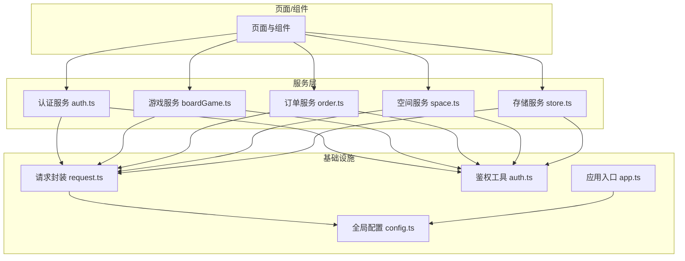
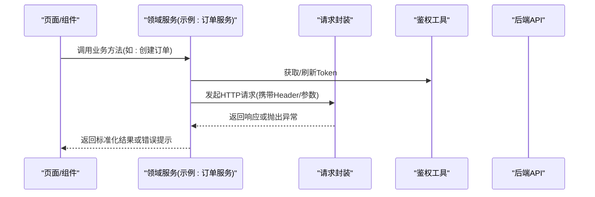
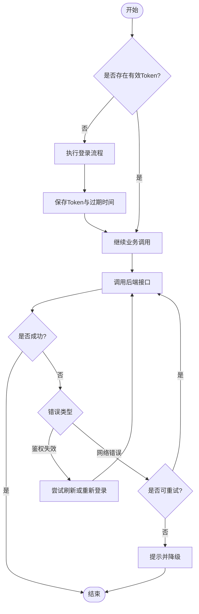
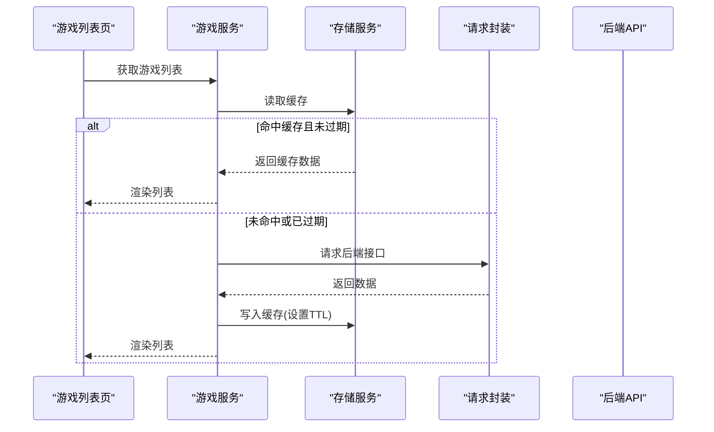
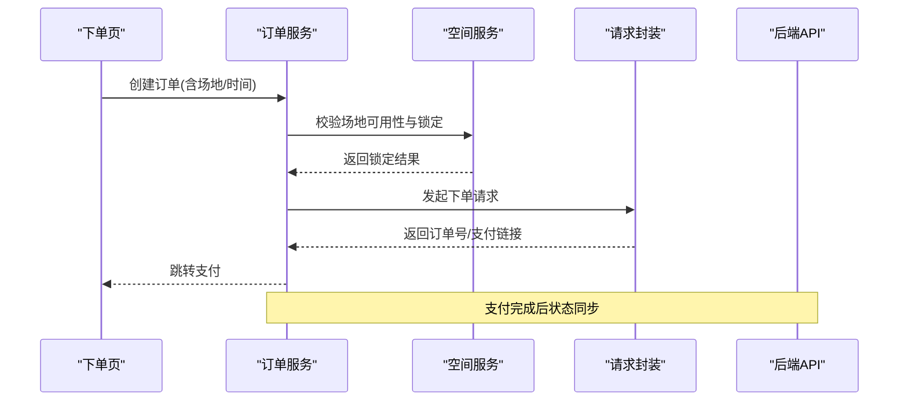
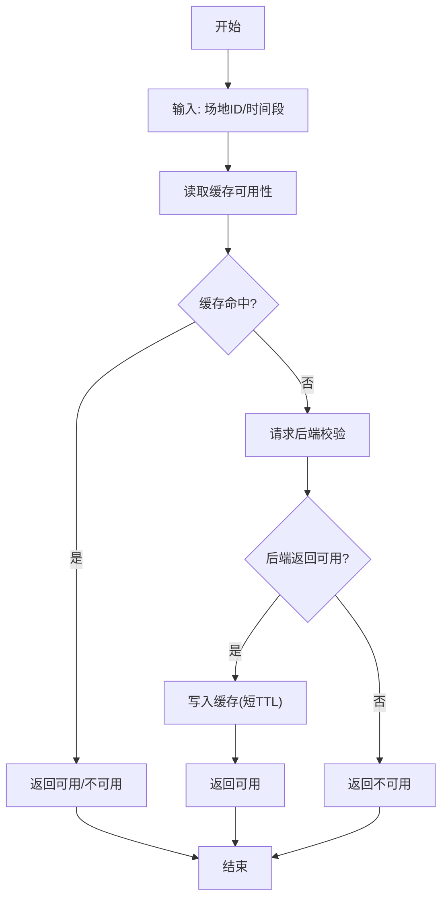
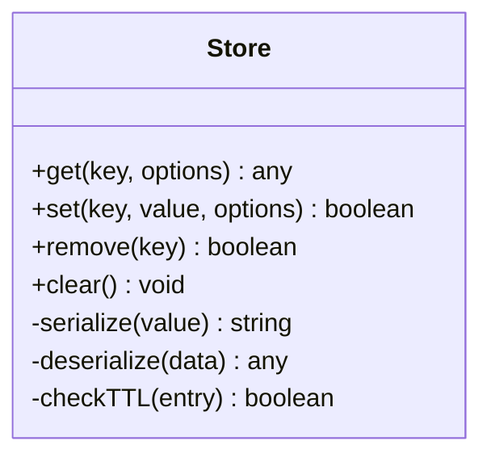
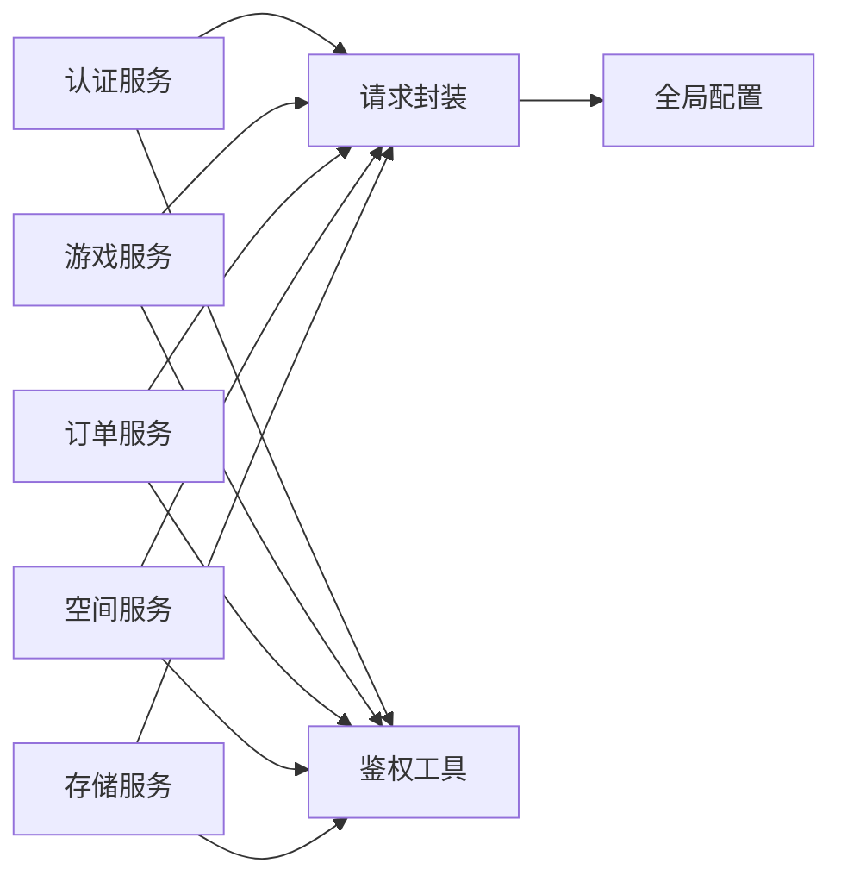

# 服务层设计

<cite>
**本文引用的文件**   
- [services/auth.ts](file://miniprogram/services/auth.ts)
- [services/boardGame.ts](file://miniprogram/services/boardGame.ts)
- [services/order.ts](file://miniprogram/services/order.ts)
- [services/space.ts](file://miniprogram/services/space.ts)
- [services/store.ts](file://miniprogram/services/store.ts)
- [utils/request.ts](file://miniprogram/utils/request.ts)
- [utils/auth.ts](file://miniprogram/utils/auth.ts)
- [config.ts](file://miniprogram/config.ts)
- [app.ts](file://miniprogram/app.ts)
</cite>

## 目录
1. [简介](#简介)
2. [项目结构](#项目结构)
3. [核心组件](#核心组件)
4. [架构总览](#架构总览)
5. [详细组件分析](#详细组件分析)
6. [依赖关系分析](#依赖关系分析)
7. [性能考量](#性能考量)
8. [故障排查指南](#故障排查指南)
9. [结论](#结论)
10. [附录](#附录)

## 简介
本文件面向微信小程序前端的服务层设计与实现，聚焦认证、游戏、订单、空间与存储五大服务模块。文档从系统架构、职责划分、调用模式出发，结合API封装、错误处理、缓存策略与重试逻辑，给出可落地的最佳实践，帮助读者快速理解并扩展服务层能力。

## 项目结构
服务层位于 miniprogram/services 目录，按业务域拆分：auth（认证）、boardGame（游戏）、order（订单）、space（空间）、store（存储）。网络请求统一由 utils/request.ts 提供，鉴权状态由 utils/auth.ts 管理，全局配置集中于 config.ts，应用入口在 app.ts。

图表来源
- [services/auth.ts](file://miniprogram/services/auth.ts)
- [services/boardGame.ts](file://miniprogram/services/boardGame.ts)
- [services/order.ts](file://miniprogram/services/order.ts)
- [services/space.ts](file://miniprogram/services/space.ts)
- [services/store.ts](file://miniprogram/services/store.ts)
- [utils/request.ts](file://miniprogram/utils/request.ts)
- [utils/auth.ts](file://miniprogram/utils/auth.ts)
- [config.ts](file://miniprogram/config.ts)
- [app.ts](file://miniprogram/app.ts)

章节来源
- [app.ts](file://miniprogram/app.ts)
- [config.ts](file://miniprogram/config.ts)

## 核心组件
- 认证服务（auth）：负责登录、注册、Token 获取与刷新、权限校验等。
- 游戏服务（boardGame）：负责游戏列表、详情、预约、状态查询等。
- 订单服务（order）：负责下单、支付、退款、订单查询等。
- 空间服务（space）：负责场地/房间信息、可用性检查、预订管理等。
- 存储服务（store）：本地缓存、用户偏好、临时数据持久化。

这些服务通过统一的请求封装进行HTTP交互，并通过鉴权工具维护会话与令牌。

章节来源
- [services/auth.ts](file://miniprogram/services/auth.ts)
- [services/boardGame.ts](file://miniprogram/services/boardGame.ts)
- [services/order.ts](file://miniprogram/services/order.ts)
- [services/space.ts](file://miniprogram/services/space.ts)
- [services/store.ts](file://miniprogram/services/store.ts)
- [utils/request.ts](file://miniprogram/utils/request.ts)
- [utils/auth.ts](file://miniprogram/utils/auth.ts)

## 架构总览
服务层采用“领域服务 + 基础设施”的分层模式：
- 领域服务：按业务域组织，对外暴露清晰的接口方法。
- 基础设施：请求封装、鉴权、配置、本地存储等通用能力。
- 调用模式：页面/组件仅依赖服务层，不直接操作网络或存储。

图表来源
- [services/order.ts](file://miniprogram/services/order.ts)
- [utils/request.ts](file://miniprogram/utils/request.ts)
- [utils/auth.ts](file://miniprogram/utils/auth.ts)

## 详细组件分析

### 认证服务（auth）
- 职责
  - 登录/注册流程
  - Token 的获取、存储与自动刷新
  - 权限判断与会话生命周期管理
- 关键流程
  - 登录成功后保存凭证，后续请求自动注入鉴权头
  - 遇到未授权时触发刷新或重新登录
- 错误处理
  - 区分网络错误、业务错误、鉴权错误
  - 对敏感错误进行友好提示与降级
- 缓存策略
  - 短期缓存登录态，避免重复登录
  - 长过期Token配合刷新机制
- 重试逻辑
  - 针对瞬时失败（如网络抖动）进行有限次重试
  - 幂等接口支持重试，非幂等接口需明确提示

图表来源
- [services/auth.ts](file://miniprogram/services/auth.ts)
- [utils/auth.ts](file://miniprogram/utils/auth.ts)
- [utils/request.ts](file://miniprogram/utils/request.ts)

章节来源
- [services/auth.ts](file://miniprogram/services/auth.ts)
- [utils/auth.ts](file://miniprogram/utils/auth.ts)

### 游戏服务（boardGame）
- 职责
  - 游戏列表、详情、分类、搜索
  - 预约/占位、状态同步
- 关键流程
  - 列表页优先读取缓存，再异步更新
  - 详情页强一致拉取，必要时带条件缓存
- 错误处理
  - 空数据兜底展示
  - 网络异常回退到缓存或友好提示
- 缓存策略
  - 列表短TTL缓存，详情页较长TTL
  - 变更后主动失效相关缓存
- 重试逻辑
  - 弱一致性场景允许重试；强一致场景避免重复提交

图表来源
- [services/boardGame.ts](file://miniprogram/services/boardGame.ts)
- [services/store.ts](file://miniprogram/services/store.ts)
- [utils/request.ts](file://miniprogram/utils/request.ts)

章节来源
- [services/boardGame.ts](file://miniprogram/services/boardGame.ts)
- [services/store.ts](file://miniprogram/services/store.ts)

### 订单服务（order）
- 职责
  - 下单、支付、退款、订单查询
  - 订单状态机管理与事件通知
- 关键流程
  - 下单前校验库存/可用性
  - 支付回调后状态同步
- 错误处理
  - 支付失败、超时、重复支付等分支处理
  - 幂等键保证重复提交安全
- 缓存策略
  - 订单列表可缓存，详情强一致
  - 支付状态轮询或WebSocket推送
- 重试逻辑
  - 支付回调幂等重试
  - 网络抖动下的有限重试

图表来源
- [services/order.ts](file://miniprogram/services/order.ts)
- [services/space.ts](file://miniprogram/services/space.ts)
- [utils/request.ts](file://miniprogram/utils/request.ts)

章节来源
- [services/order.ts](file://miniprogram/services/order.ts)
- [services/space.ts](file://miniprogram/services/space.ts)

### 空间服务（space）
- 职责
  - 场地/房间信息查询、可用性检查、预订锁定
- 关键流程
  - 时间片粒度校验，并发锁控制
  - 冲突检测与回滚
- 错误处理
  - 资源不可用、冲突、超时的差异化处理
- 缓存策略
  - 热点场地短时缓存，变更立即失效
- 重试逻辑
  - 锁定失败可短暂重试，避免竞态

图表来源
- [services/space.ts](file://miniprogram/services/space.ts)
- [services/store.ts](file://miniprogram/services/store.ts)
- [utils/request.ts](file://miniprogram/utils/request.ts)

章节来源
- [services/space.ts](file://miniprogram/services/space.ts)
- [services/store.ts](file://miniprogram/services/store.ts)

### 存储服务（store）
- 职责
  - 本地缓存读写、过期管理、序列化/反序列化
  - 用户偏好、临时数据持久化
- 关键流程
  - 统一读写接口，内部处理过期与容量
- 错误处理
  - 存储配额不足、序列化失败的降级
- 缓存策略
  - 支持TTL、优先级、冷热分层
- 重试逻辑
  - 写失败可重试一次，避免频繁IO

图表来源
- [services/store.ts](file://miniprogram/services/store.ts)

章节来源
- [services/store.ts](file://miniprogram/services/store.ts)

## 依赖关系分析
- 服务层依赖请求封装与鉴权工具，解耦具体网络实现与鉴权细节。
- 存储服务为各服务提供本地缓存能力，降低网络压力。
- 配置集中管理，便于环境切换与灰度发布。

图表来源
- [services/auth.ts](file://miniprogram/services/auth.ts)
- [services/boardGame.ts](file://miniprogram/services/boardGame.ts)
- [services/order.ts](file://miniprogram/services/order.ts)
- [services/space.ts](file://miniprogram/services/space.ts)
- [services/store.ts](file://miniprogram/services/store.ts)
- [utils/request.ts](file://miniprogram/utils/request.ts)
- [utils/auth.ts](file://miniprogram/utils/auth.ts)
- [config.ts](file://miniprogram/config.ts)

章节来源
- [utils/request.ts](file://miniprogram/utils/request.ts)
- [utils/auth.ts](file://miniprogram/utils/auth.ts)
- [config.ts](file://miniprogram/config.ts)

## 性能考量
- 缓存优先：列表类数据采用短TTL缓存，详情页按需缓存，减少重复请求。
- 请求合并：同一周期内相同请求合并，避免抖动放大。
- 懒加载：首屏只加载必要数据，其他按需拉取。
- 增量更新：使用ETag/Last-Modified等机制减少带宽。
- 限流与降级：高峰期限制非关键请求，失败快速降级。

[本节为通用指导，无需特定文件引用]

## 故障排查指南
- 常见问题
  - 鉴权失败：检查Token有效期、刷新流程与重定向逻辑
  - 网络异常：查看请求封装的错误码映射与重试策略
  - 缓存不一致：核对TTL设置与失效时机
  - 并发冲突：确认资源锁定与回滚逻辑
- 定位步骤
  - 开启调试日志，记录请求/响应与缓存命中情况
  - 复现路径最小化，隔离问题范围
  - 对比不同环境的配置差异
- 恢复策略
  - 快速回滚与降级开关
  - 用户侧友好提示与引导

章节来源
- [utils/request.ts](file://miniprogram/utils/request.ts)
- [utils/auth.ts](file://miniprogram/utils/auth.ts)
- [services/store.ts](file://miniprogram/services/store.ts)

## 结论
本服务层以清晰的分层与职责边界为基础，结合统一的请求封装、鉴权与缓存能力，实现了高内聚、低耦合的业务服务。通过合理的错误处理、缓存策略与重试逻辑，提升了用户体验与系统稳定性。建议持续完善监控与可观测性，逐步引入更细粒度的缓存与重试策略，以应对复杂业务场景。

[本节为总结性内容，无需特定文件引用]

## 附录
- 术语
  - TTL：生存时间，用于缓存过期控制
  - 幂等：多次执行结果一致，适合重试
  - 降级：在异常情况下提供简化功能或默认值
- 最佳实践清单
  - 所有外部调用必须经过请求封装
  - 鉴权失败必须统一处理并引导用户
  - 缓存必须有明确的TTL与失效策略
  - 重试仅限幂等接口，且限制次数与间隔
  - 错误信息对用户友好，对开发者可追踪

[本节为补充说明，无需特定文件引用]