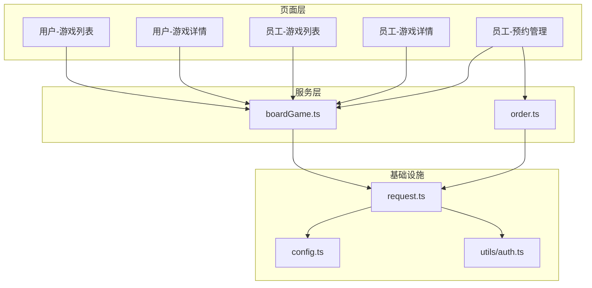
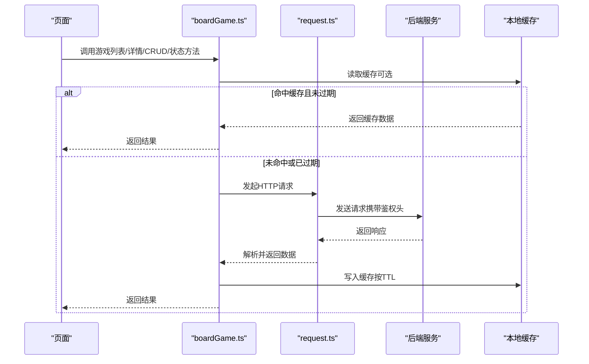
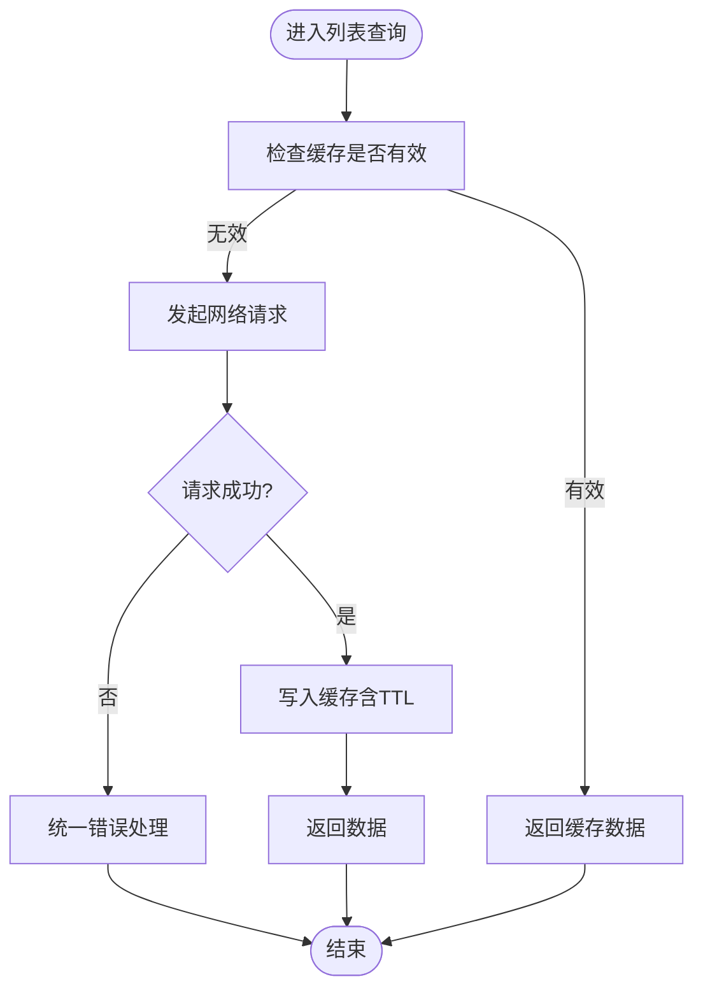
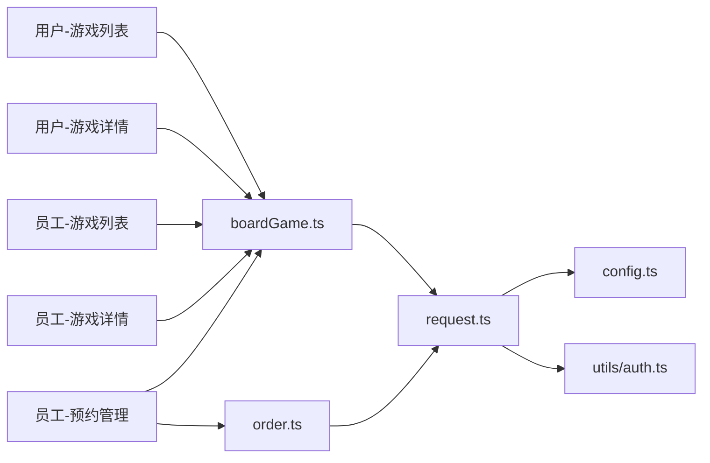

# 游戏服务

<cite>
**本文档引用的文件**   
- [boardGame.ts](file://miniprogram/services/boardGame.ts)
- [games.ts（用户端）](file://miniprogram/pages/user/games/games.ts)
- [game-detail.ts（用户端）](file://miniprogram/pages/user/game-detail/game-detail.ts)
- [games.ts（员工端）](file://miniprogram/pages/staff/games/games.ts)
- [game-detail.ts（员工端）](file://miniprogram/pages/staff/game-detail/game-detail.ts)
- [request.ts](file://miniprogram/utils/request.ts)
- [config.ts](file://miniprogram/config.ts)
- [auth.ts（工具）](file://miniprogram/utils/auth.ts)
- [reservation-mgmt.ts](file://miniprogram/pages/staff/reservation-mgmt/reservation-mgmt.ts)
- [order.ts](file://miniprogram/services/order.ts)
</cite>

## 目录
1. [简介](#简介)
2. [项目结构](#项目结构)
3. [核心组件](#核心组件)
4. [架构总览](#架构总览)
5. [详细组件分析](#详细组件分析)
6. [依赖关系分析](#依赖关系分析)
7. [性能考虑](#性能考虑)
8. [故障排查指南](#故障排查指南)
9. [结论](#结论)
10. [附录：API 接口文档](#附录api-接口文档)

## 简介
本文件面向“桌面游戏”服务，覆盖以下能力：
- 游戏的增删改查（CRUD）、列表查询、详情获取与状态管理
- 游戏分类、搜索过滤、分页加载与缓存策略
- 完整的 API 接口说明（请求参数、响应格式、错误码）
- 与服务层其他模块的交互模式与数据流转

该服务主要运行在微信小程序前端，通过统一的 HTTP 请求封装调用后端接口，并在本地进行必要的缓存与状态管理。

## 项目结构
本项目采用小程序页面 + 服务层的分层组织方式：
- 页面层：用户端与员工端各自拥有“游戏列表”和“游戏详情”页面
- 服务层：boardGame.ts 提供游戏相关的业务方法；order.ts 提供订单相关能力；reservation-mgmt.ts 负责预约管理
- 基础设施：request.ts 统一网络请求封装；config.ts 集中配置；utils/auth.ts 处理鉴权信息

图表来源
- [boardGame.ts](file://miniprogram/services/boardGame.ts)
- [games.ts（用户端）](file://miniprogram/pages/user/games/games.ts)
- [game-detail.ts（用户端）](file://miniprogram/pages/user/game-detail/game-detail.ts)
- [games.ts（员工端）](file://miniprogram/pages/staff/games/games.ts)
- [game-detail.ts（员工端）](file://miniprogram/pages/staff/game-detail/game-detail.ts)
- [reservation-mgmt.ts](file://miniprogram/pages/staff/reservation-mgmt/reservation-mgmt.ts)
- [order.ts](file://miniprogram/services/order.ts)
- [request.ts](file://miniprogram/utils/request.ts)
- [config.ts](file://miniprogram/config.ts)
- [auth.ts（工具）](file://miniprogram/utils/auth.ts)

章节来源
- [boardGame.ts](file://miniprogram/services/boardGame.ts)
- [games.ts（用户端）](file://miniprogram/pages/user/games/games.ts)
- [game-detail.ts（用户端）](file://miniprogram/pages/user/game-detail/game-detail.ts)
- [games.ts（员工端）](file://miniprogram/pages/staff/games/games.ts)
- [game-detail.ts（员工端）](file://miniprogram/pages/staff/game-detail/game-detail.ts)
- [reservation-mgmt.ts](file://miniprogram/pages/staff/reservation-mgmt/reservation-mgmt.ts)
- [order.ts](file://miniprogram/services/order.ts)
- [request.ts](file://miniprogram/utils/request.ts)
- [config.ts](file://miniprogram/config.ts)
- [auth.ts（工具）](file://miniprogram/utils/auth.ts)

## 核心组件
- boardGame.ts：对外暴露游戏服务的核心方法，包括列表查询、详情获取、创建/更新/删除、状态变更等
- request.ts：统一封装 wx.request，负责拦截器、超时、重试、错误处理与鉴权头注入
- config.ts：集中管理基础 URL、超时、缓存过期时间等配置
- utils/auth.ts：读取/设置 token、用户信息等鉴权上下文
- 页面层：用户/员工端的 games 与 game-detail 页面分别负责 UI 与交互，调用 boardGame.ts 完成数据操作

章节来源
- [boardGame.ts](file://miniprogram/services/boardGame.ts)
- [request.ts](file://miniprogram/utils/request.ts)
- [config.ts](file://miniprogram/config.ts)
- [auth.ts（工具）](file://miniprogram/utils/auth.ts)

## 架构总览
整体数据流遵循“页面 -> 服务层 -> 网络层 -> 后端”的单向调用路径，配合本地缓存提升体验。

图表来源
- [boardGame.ts](file://miniprogram/services/boardGame.ts)
- [request.ts](file://miniprogram/utils/request.ts)
- [config.ts](file://miniprogram/config.ts)

## 详细组件分析

### 游戏服务（boardGame.ts）
职责
- 提供游戏列表查询（支持分类、关键词、分页）
- 提供游戏详情获取
- 提供游戏创建、更新、删除
- 提供游戏状态管理（如上架/下架、启用/禁用等）
- 结合本地缓存与配置实现合理的缓存策略

关键流程
- 列表查询：优先读缓存，未命中则请求后端，成功后写缓存并返回
- 详情获取：根据 ID 获取单条记录，支持按需缓存
- CRUD：对数据进行写操作后，主动失效相关缓存，保证一致性
- 状态管理：调用状态变更接口后，刷新本地数据或缓存

图表来源
- [boardGame.ts](file://miniprogram/services/boardGame.ts)
- [request.ts](file://miniprogram/utils/request.ts)
- [config.ts](file://miniprogram/config.ts)

章节来源
- [boardGame.ts](file://miniprogram/services/boardGame.ts)

### 用户端-游戏列表（user/games/games.ts）
职责
- 渲染游戏卡片列表
- 支持分类筛选、关键词搜索、分页加载
- 触发 boardGame.ts 的列表查询方法，并展示结果与错误提示

交互要点
- 首次加载：无参或默认条件加载第一页
- 筛选变化：重置页码并重新拉取
- 上拉加载更多：基于当前页码追加数据
- 下拉刷新：清空缓存并重新拉取

章节来源
- [games.ts（用户端）](file://miniprogram/pages/user/games/games.ts)
- [boardGame.ts](file://miniprogram/services/boardGame.ts)

### 用户端-游戏详情（user/game-detail/game-detail.ts）
职责
- 根据游戏 ID 获取详情
- 展示基本信息、规则、图片、状态等
- 支持从列表跳转携带 ID，或从收藏/历史进入

交互要点
- 进入页面即拉取详情，必要时带缓存键
- 若状态为不可用，给出相应提示

章节来源
- [game-detail.ts（用户端）](file://miniprogram/pages/user/game-detail/game-detail.ts)
- [boardGame.ts](file://miniprogram/services/boardGame.ts)

### 员工端-游戏列表（staff/games/games.ts）
职责
- 管理游戏条目（增删改查）
- 支持更丰富的筛选条件（如状态、分类、上架标记）
- 提供新建/编辑弹窗与确认逻辑

交互要点
- 新增：表单校验通过后调用创建接口
- 编辑：回填数据，提交后刷新列表
- 删除：二次确认后调用删除接口并刷新

章节来源
- [games.ts（员工端）](file://miniprogram/pages/staff/games/games.ts)
- [boardGame.ts](file://miniprogram/services/boardGame.ts)

### 员工端-游戏详情（staff/game-detail/game-detail.ts）
职责
- 查看与编辑游戏详情
- 修改状态（如上架/下架、启用/禁用）
- 保存后同步刷新列表与缓存

章节来源
- [game-detail.ts（员工端）](file://miniprogram/pages/staff/game-detail/game-detail.ts)
- [boardGame.ts](file://miniprogram/services/boardGame.ts)

### 预约管理与订单（reservation-mgmt.ts 与 order.ts）
职责
- reservation-mgmt.ts：管理游戏预约（创建、查询、取消等）
- order.ts：订单相关能力（下单、支付、退款等）
- 与 boardGame.ts 协作：在预约/下单前校验游戏可用性与状态

章节来源
- [reservation-mgmt.ts](file://miniprogram/pages/staff/reservation-mgmt/reservation-mgmt.ts)
- [order.ts](file://miniprogram/services/order.ts)
- [boardGame.ts](file://miniprogram/services/boardGame.ts)

## 依赖关系分析
- 页面依赖服务层：所有页面通过 boardGame.ts 访问游戏数据
- 服务层依赖网络层：boardGame.ts 使用 request.ts 发起请求
- 网络层依赖配置与鉴权：request.ts 使用 config.ts 的基础配置与 auth.ts 的鉴权信息
- 业务耦合点：预约与订单模块在游戏状态校验时依赖 boardGame.ts 提供的状态能力

图表来源
- [boardGame.ts](file://miniprogram/services/boardGame.ts)
- [games.ts（用户端）](file://miniprogram/pages/user/games/games.ts)
- [game-detail.ts（用户端）](file://miniprogram/pages/user/game-detail/game-detail.ts)
- [games.ts（员工端）](file://miniprogram/pages/staff/games/games.ts)
- [game-detail.ts（员工端）](file://miniprogram/pages/staff/game-detail/game-detail.ts)
- [reservation-mgmt.ts](file://miniprogram/pages/staff/reservation-mgmt/reservation-mgmt.ts)
- [order.ts](file://miniprogram/services/order.ts)
- [request.ts](file://miniprogram/utils/request.ts)
- [config.ts](file://miniprogram/config.ts)
- [auth.ts（工具）](file://miniprogram/utils/auth.ts)

章节来源
- [boardGame.ts](file://miniprogram/services/boardGame.ts)
- [request.ts](file://miniprogram/utils/request.ts)
- [config.ts](file://miniprogram/config.ts)
- [auth.ts（工具）](file://miniprogram/utils/auth.ts)

## 性能考虑
- 缓存策略
  - 列表缓存：按分类+关键词+页码作为缓存键，设置合理 TTL，避免频繁请求
  - 详情缓存：按游戏 ID 缓存，缩短详情页打开耗时
  - 写操作失效：创建/更新/删除后，主动清除相关缓存键，保证数据一致性
- 分页加载
  - 首屏只加载第一页，后续上拉增量加载，减少内存占用
  - 合并重复请求，避免快速切换筛选导致的多发请求
- 网络优化
  - 统一超时与重试策略，降低弱网失败率
  - 压缩非必要字段，减少传输体积
- 渲染优化
  - 列表项懒加载与虚拟滚动（如数据量大）
  - 图片资源按需加载与占位图

[本节为通用指导，不直接分析具体文件]

## 故障排查指南
常见问题与定位思路
- 列表为空或数据不更新
  - 检查缓存键是否正确生成（分类、关键词、页码）
  - 检查写操作后是否清除了对应缓存
  - 查看网络请求是否被拦截或返回异常
- 详情无法加载
  - 确认传入的游戏 ID 是否正确
  - 检查权限与鉴权头是否携带
- 状态变更后未生效
  - 确认状态接口调用成功
  - 检查缓存是否及时失效
  - 页面是否需要主动刷新或重新拉取

建议的调试手段
- 在 request.ts 中打印请求与响应日志
- 在 boardGame.ts 中输出缓存命中/失效的关键节点
- 在页面层增加错误提示与重试入口

章节来源
- [request.ts](file://miniprogram/utils/request.ts)
- [boardGame.ts](file://miniprogram/services/boardGame.ts)

## 结论
本游戏服务以清晰的分层结构与统一的网络封装为基础，实现了游戏列表、详情、CRUD 与状态管理的完整闭环。通过合理的缓存策略与分页加载，兼顾了用户体验与系统性能。同时，与预约、订单等模块的解耦设计，使扩展与维护更加便捷。

[本节为总结性内容，不直接分析具体文件]

## 附录：API 接口文档

说明
- 以下为通用接口规范示例，实际字段以后端定义为准
- 所有接口均通过 request.ts 统一封装，自动携带鉴权头与基础配置

通用约定
- 基础路径：由 config.ts 中的 baseUrl 决定
- 鉴权：Authorization 头携带 Token（由 auth.ts 管理）
- 分页：page 与 pageSize，或 cursor 游标（依后端实现）
- 统一响应体：{ code, message, data }

游戏列表查询
- 方法：GET
- 路径：/api/games
- 请求参数
  - category: string | 空，游戏分类
  - keyword: string | 空，关键词搜索
  - status: string | 空，状态筛选（如上架/下架）
  - page: number | 默认 1
  - pageSize: number | 默认 20
- 响应体
  - code: number
  - message: string
  - data: { list: Game[], total: number, page: number, pageSize: number }
- 错误码
  - 401：未授权
  - 403：权限不足
  - 500：服务端错误

游戏详情获取
- 方法：GET
- 路径：/api/games/:id
- 路径参数
  - id: string，游戏唯一标识
- 响应体
  - code: number
  - message: string
  - data: Game
- 错误码
  - 404：游戏不存在
  - 401/403：鉴权失败

创建游戏
- 方法：POST
- 路径：/api/games
- 请求体
  - name: string
  - category: string
  - description: string
  - images: string[]
  - rules: string
  - status: string
- 响应体
  - code: number
  - message: string
  - data: Game
- 错误码
  - 400：参数校验失败
  - 401/403：鉴权失败

更新游戏
- 方法：PUT
- 路径：/api/games/:id
- 路径参数
  - id: string
- 请求体：同创建接口（仅传需更新的字段）
- 响应体：同创建接口
- 错误码：同创建接口

删除游戏
- 方法：DELETE
- 路径：/api/games/:id
- 路径参数
  - id: string
- 响应体
  - code: number
  - message: string
  - data: null
- 错误码
  - 404：游戏不存在
  - 401/403：鉴权失败

游戏状态管理
- 方法：PATCH
- 路径：/api/games/:id/status
- 路径参数
  - id: string
- 请求体
  - status: string，目标状态（如上架/下架）
- 响应体
  - code: number
  - message: string
  - data: Game
- 错误码
  - 400：状态非法
  - 404：游戏不存在
  - 401/403：鉴权失败

与预约/订单的交互
- 预约前校验：调用 /api/games/:id/status 或 /api/games/:id 获取状态
- 下单校验：确保游戏处于可预约/可售状态
- 冲突处理：并发下单时，后端应返回冲突码，前端提示重试

章节来源
- [boardGame.ts](file://miniprogram/services/boardGame.ts)
- [request.ts](file://miniprogram/utils/request.ts)
- [config.ts](file://miniprogram/config.ts)
- [auth.ts（工具）](file://miniprogram/utils/auth.ts)