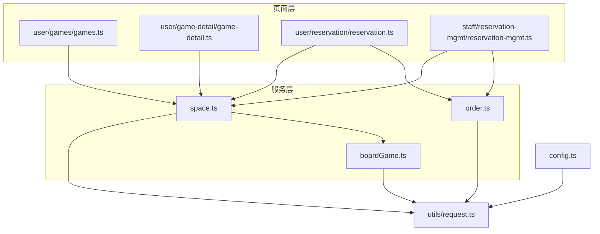
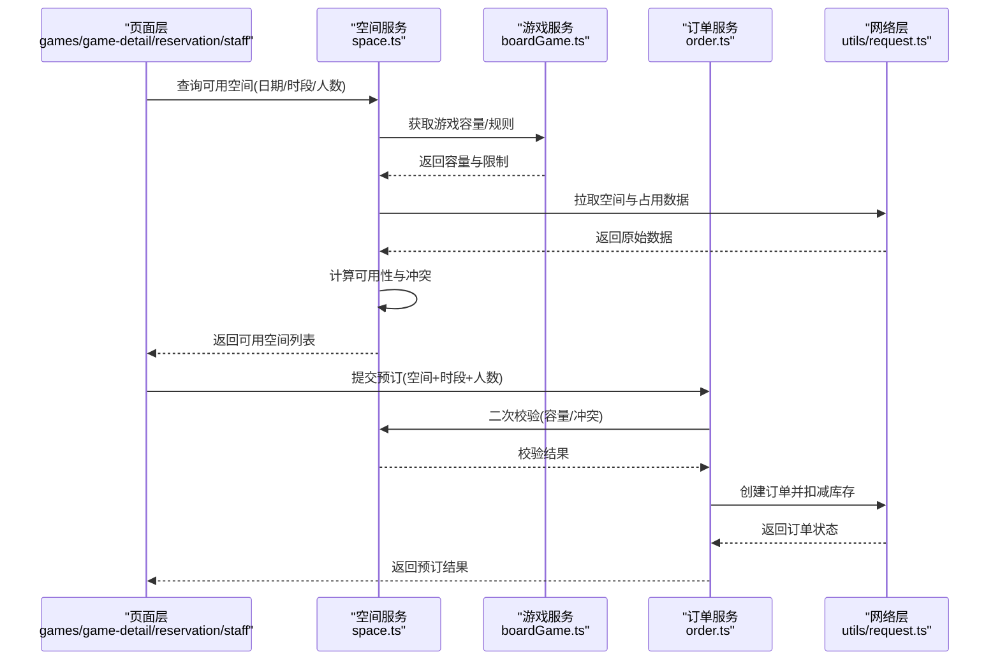
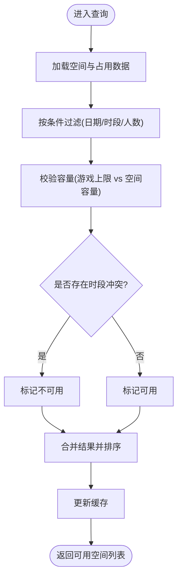
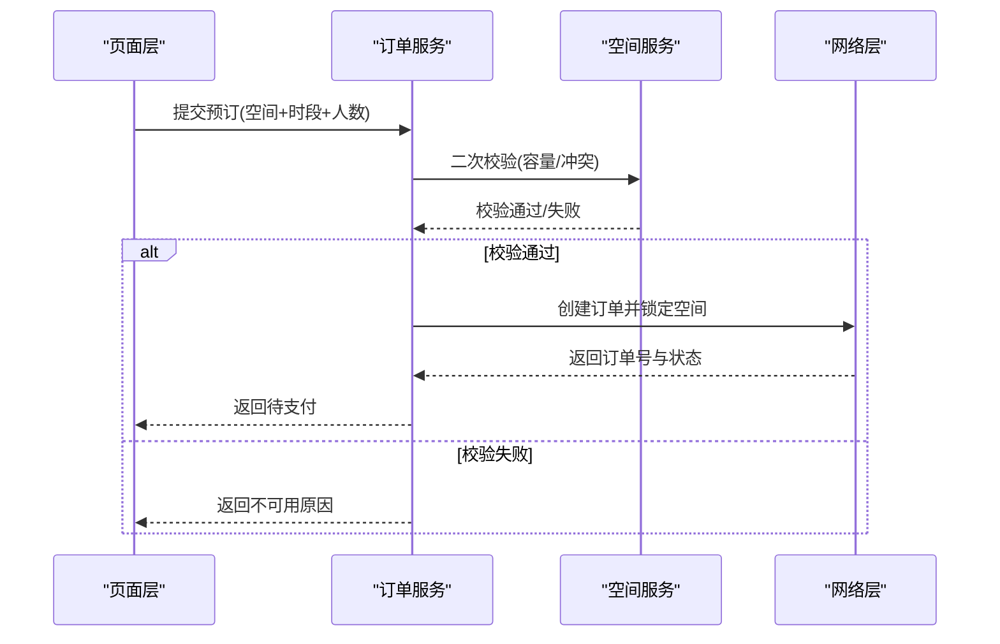
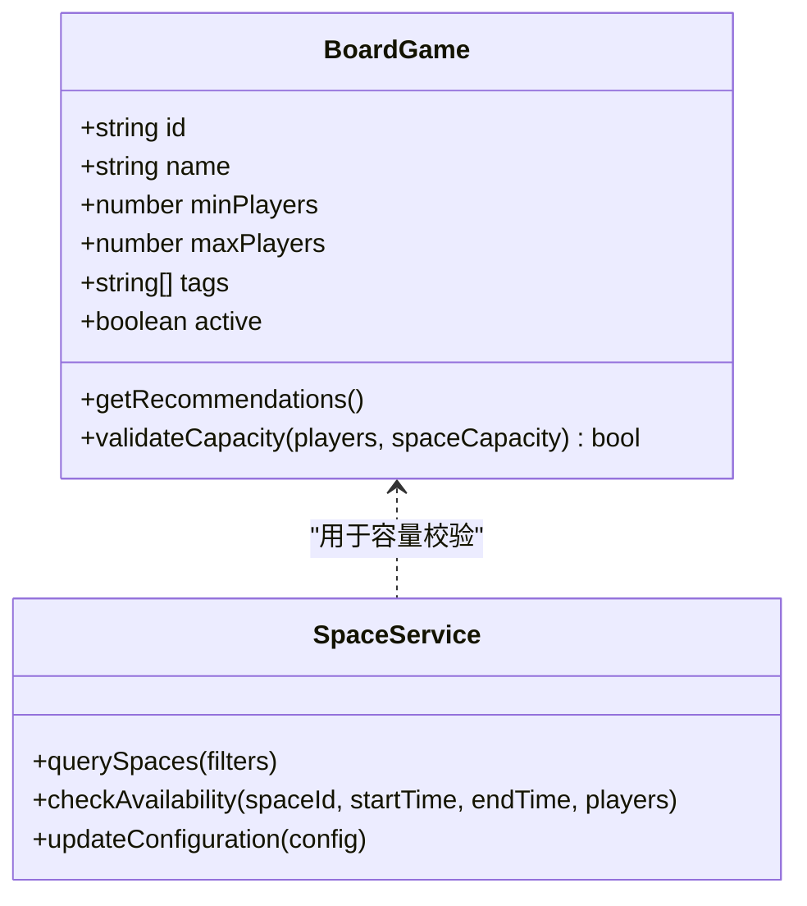
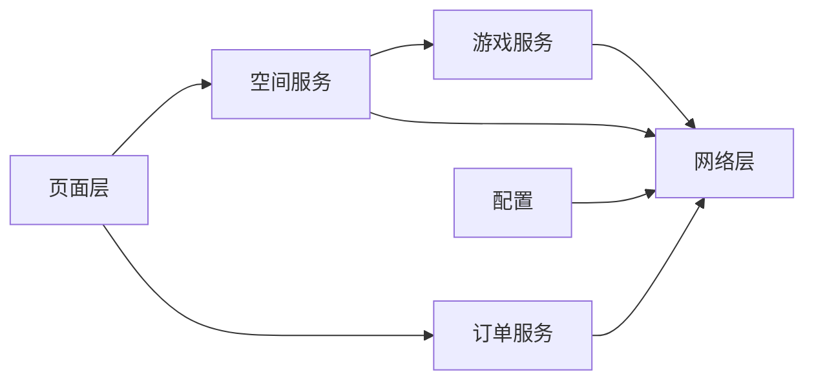

# 空间服务

<cite>
**本文引用的文件**   
- [space.ts](file://miniprogram/services/space.ts)
- [order.ts](file://miniprogram/services/order.ts)
- [boardGame.ts](file://miniprogram/services/boardGame.ts)
- [reservation-mgmt.ts](file://miniprogram/pages/staff/reservation-mgmt/reservation-mgmt.ts)
- [games.ts](file://miniprogram/pages/user/games/games.ts)
- [game-detail.ts](file://miniprogram/pages/user/game-detail/game-detail.ts)
- [reservation.ts](file://miniprogram/pages/user/reservation/reservation.ts)
- [config.ts](file://miniprogram/config.ts)
- [request.ts](file://miniprogram/utils/request.ts)
</cite>

## 目录
1. [简介](#简介)
2. [项目结构](#项目结构)
3. [核心组件](#核心组件)
4. [架构总览](#架构总览)
5. [详细组件分析](#详细组件分析)
6. [依赖关系分析](#依赖关系分析)
7. [性能考虑](#性能考虑)
8. [故障排查指南](#故障排查指南)
9. [结论](#结论)
10. [附录](#附录)

## 简介
本文件面向“空间服务”的完整技术文档，聚焦于小程序端的空间查询、管理与预订能力。内容涵盖：
- 空间信息获取与展示
- 容量管理与时间段检查
- 可用性验证与冲突检测
- 空间配置管理与动态调整
- 与游戏服务和订单服务的数据同步机制与一致性保证

该服务主要位于 miniprogram/services/space.ts，并通过请求工具与后端交互；在用户侧与员工侧页面中分别承担查询、预订与管理职责。

## 项目结构
空间服务相关代码分布在 services 层与 pages 层：
- services/space.ts：空间服务的核心实现（查询、容量、时段、可用性、配置）
- services/order.ts：订单服务（与空间预订联动）
- services/boardGame.ts：游戏服务（与空间绑定、容量校验）
- pages/staff/reservation-mgmt/reservation-mgmt.ts：员工端的预约管理
- pages/user/games/games.ts：用户端游戏列表与空间筛选
- pages/user/game-detail/game-detail.ts：用户端游戏详情与空间选择
- pages/user/reservation/reservation.ts：用户端预约流程
- config.ts：全局配置（如接口前缀、默认值等）
- utils/request.ts：统一请求封装（错误处理、重试、鉴权等）

图表来源
- [space.ts](file://miniprogram/services/space.ts)
- [order.ts](file://miniprogram/services/order.ts)
- [boardGame.ts](file://miniprogram/services/boardGame.ts)
- [reservation-mgmt.ts](file://miniprogram/pages/staff/reservation-mgmt/reservation-mgmt.ts)
- [games.ts](file://miniprogram/pages/user/games/games.ts)
- [game-detail.ts](file://miniprogram/pages/user/game-detail/game-detail.ts)
- [reservation.ts](file://miniprogram/pages/user/reservation/reservation.ts)
- [config.ts](file://miniprogram/config.ts)
- [request.ts](file://miniprogram/utils/request.ts)

章节来源
- [space.ts](file://miniprogram/services/space.ts)
- [order.ts](file://miniprogram/services/order.ts)
- [boardGame.ts](file://miniprogram/services/boardGame.ts)
- [reservation-mgmt.ts](file://miniprogram/pages/staff/reservation-mgmt/reservation-mgmt.ts)
- [games.ts](file://miniprogram/pages/user/games/games.ts)
- [game-detail.ts](file://miniprogram/pages/user/game-detail/game-detail.ts)
- [reservation.ts](file://miniprogram/pages/user/reservation/reservation.ts)
- [config.ts](file://miniprogram/config.ts)
- [request.ts](file://miniprogram/utils/request.ts)

## 核心组件
- 空间服务（services/space.ts）
  - 功能：空间信息查询、容量管理、时间段检查、可用性验证、配置读取与更新
  - 关键职责：
    - 提供统一的查询入口（按日期/时间区间过滤可用空间）
    - 维护本地缓存与状态，减少重复请求
    - 与游戏服务协同进行容量校验与冲突检测
    - 与订单服务协作完成预订创建与状态同步
- 订单服务（services/order.ts）
  - 功能：下单、支付回调、取消、退款、状态查询
  - 与空间服务协作：基于空间+时间段生成订单，确保库存扣减与状态一致
- 游戏服务（services/boardGame.ts）
  - 功能：游戏元数据、规则、推荐、与空间绑定关系
  - 与空间服务协作：根据游戏人数上限与空间容量进行匹配与校验

章节来源
- [space.ts](file://miniprogram/services/space.ts)
- [order.ts](file://miniprogram/services/order.ts)
- [boardGame.ts](file://miniprogram/services/boardGame.ts)

## 架构总览
空间服务作为前端业务编排的核心，串联用户与员工页面的交互，并与游戏服务、订单服务协同工作。整体调用链如下：

图表来源
- [space.ts](file://miniprogram/services/space.ts)
- [boardGame.ts](file://miniprogram/services/boardGame.ts)
- [order.ts](file://miniprogram/services/order.ts)
- [request.ts](file://miniprogram/utils/request.ts)
- [games.ts](file://miniprogram/pages/user/games/games.ts)
- [game-detail.ts](file://miniprogram/pages/user/game-detail/game-detail.ts)
- [reservation.ts](file://miniprogram/pages/user/reservation/reservation.ts)
- [reservation-mgmt.ts](file://miniprogram/pages/staff/reservation-mgmt/reservation-mgmt.ts)

## 详细组件分析

### 空间服务（services/space.ts）
- 设计要点
  - 分层清晰：数据获取、缓存、计算、对外 API
  - 幂等与容错：对查询类接口做缓存与去重；对写入类接口做重试与失败回滚
  - 可扩展性：通过配置项支持不同门店/空间的差异化策略
- 关键能力
  - 空间信息查询：按条件过滤、分页、排序
  - 容量管理：实时计算剩余座位/桌数，支持动态调整
  - 时间段检查：基于时间区间的重叠检测算法，避免冲突
  - 可用性验证：结合游戏人数上限、空间容量、已有预订进行综合判断
  - 配置管理：读取与更新空间配置（如最大容纳人数、最小起订时长、节假日策略）
- 数据结构建议
  - 空间实体：id、名称、类型、容量、标签、状态、关联游戏集合
  - 时段实体：开始时间、结束时间、占用状态、预订ID
  - 配置实体：门店/空间维度、策略开关、阈值参数
- 复杂度与优化
  - 时间段冲突检测为 O(n) 或 O(log n)（取决于索引），建议在服务端建立时段索引
  - 缓存策略：LRU + TTL，热点空间与热门时段优先缓存
  - 批量查询：合并多次小请求为一次批量请求，降低网络开销

图表来源
- [space.ts](file://miniprogram/services/space.ts)

章节来源
- [space.ts](file://miniprogram/services/space.ts)

### 订单服务（services/order.ts）
- 设计要点
  - 事务边界：下单、支付回调、取消需保证状态机一致性
  - 幂等控制：基于订单号与操作类型防止重复提交
  - 补偿机制：超时未支付自动释放库存，异常时回滚
- 关键能力
  - 创建订单：携带空间、时段、人数、游戏信息
  - 支付与回调：更新订单状态，触发库存扣减与空间锁定
  - 取消与退款：释放空间占用，恢复容量
  - 状态查询：供页面与服务间同步使用
- 与空间服务的一致性
  - 下单前二次校验空间可用性
  - 支付成功后持久化占用记录
  - 取消/退款后及时释放占用

图表来源
- [order.ts](file://miniprogram/services/order.ts)
- [space.ts](file://miniprogram/services/space.ts)
- [request.ts](file://miniprogram/utils/request.ts)

章节来源
- [order.ts](file://miniprogram/services/order.ts)
- [space.ts](file://miniprogram/services/space.ts)

### 游戏服务（services/boardGame.ts）
- 设计要点
  - 数据模型：游戏元数据、人数限制、规则、推荐策略
  - 与空间绑定：每个空间可关联多个游戏，支持动态调整
- 关键能力
  - 获取游戏列表与详情
  - 根据人数与空间容量进行匹配
  - 提供推荐与排序策略

图表来源
- [boardGame.ts](file://miniprogram/services/boardGame.ts)
- [space.ts](file://miniprogram/services/space.ts)

章节来源
- [boardGame.ts](file://miniprogram/services/boardGame.ts)
- [space.ts](file://miniprogram/services/space.ts)

### 页面集成与交互

#### 用户端游戏列表（pages/user/games/games.ts）
- 功能：展示游戏与空间筛选，支持按人数、时段快速查找可用空间
- 与空间服务交互：调用查询接口，渲染可用空间卡片

章节来源
- [games.ts](file://miniprogram/pages/user/games/games.ts)
- [space.ts](file://miniprogram/services/space.ts)

#### 用户端游戏详情（pages/user/game-detail/game-detail.ts）
- 功能：展示游戏详情、可选空间与时段、价格与规则
- 与空间服务交互：获取特定游戏的可用空间与时段

章节来源
- [game-detail.ts](file://miniprogram/pages/user/game-detail/game-detail.ts)
- [space.ts](file://miniprogram/services/space.ts)

#### 用户端预约（pages/user/reservation/reservation.ts）
- 功能：确认空间与时段、填写人数与备注、提交订单
- 与空间/订单服务交互：最终下单前再次校验可用性，下单成功后跳转支付

章节来源
- [reservation.ts](file://miniprogram/pages/user/reservation/reservation.ts)
- [space.ts](file://miniprogram/services/space.ts)
- [order.ts](file://miniprogram/services/order.ts)

#### 员工端预约管理（pages/staff/reservation-mgmt/reservation-mgmt.ts）
- 功能：查看当日预约、修改/取消、手动调整空间容量与配置
- 与空间/订单服务交互：更新配置、释放/锁定空间、同步订单状态

章节来源
- [reservation-mgmt.ts](file://miniprogram/pages/staff/reservation-mgmt/reservation-mgmt.ts)
- [space.ts](file://miniprogram/services/space.ts)
- [order.ts](file://miniprogram/services/order.ts)

## 依赖关系分析
- 模块耦合
  - 空间服务依赖游戏服务进行容量校验，依赖订单服务进行预订状态同步
  - 页面层仅依赖服务层，保持低耦合与高内聚
- 外部依赖
  - 网络层统一封装请求、鉴权、错误处理与重试
  - 配置中心提供全局参数（如接口前缀、默认容量、节假日策略）

图表来源
- [space.ts](file://miniprogram/services/space.ts)
- [order.ts](file://miniprogram/services/order.ts)
- [boardGame.ts](file://miniprogram/services/boardGame.ts)
- [request.ts](file://miniprogram/utils/request.ts)
- [config.ts](file://miniprogram/config.ts)

章节来源
- [space.ts](file://miniprogram/services/space.ts)
- [order.ts](file://miniprogram/services/order.ts)
- [boardGame.ts](file://miniprogram/services/boardGame.ts)
- [request.ts](file://miniprogram/utils/request.ts)
- [config.ts](file://miniprogram/config.ts)

## 性能考虑
- 缓存策略
  - 对查询类接口采用 LRU + TTL 缓存，热点空间与热门时段优先命中
  - 页面级缓存与服务级缓存结合，减少重复请求
- 并发与批处理
  - 合并多次小请求为批量请求，降低网络往返
  - 对耗时操作使用异步队列，避免阻塞主线程
- 资源优化
  - 图片与静态资源懒加载
  - 按需加载页面与组件，减小首屏体积
- 监控与降级
  - 关键路径埋点与错误上报
  - 服务降级策略：当后端不可用时返回缓存或友好提示

[本节为通用指导，不直接分析具体文件]

## 故障排查指南
- 常见问题
  - 时间段冲突：检查时段重叠算法与已有预订数据
  - 容量不足：核对游戏人数上限与空间容量配置
  - 订单状态不一致：检查支付回调与库存扣减逻辑
  - 缓存过期：确认 TTL 设置与刷新策略
- 定位方法
  - 查看网络请求日志与错误堆栈
  - 检查本地缓存内容与失效时间
  - 对比前后端数据快照，定位差异点
- 修复建议
  - 增加幂等键与重试退避
  - 完善状态机与补偿任务
  - 加强输入校验与边界测试

章节来源
- [request.ts](file://miniprogram/utils/request.ts)
- [space.ts](file://miniprogram/services/space.ts)
- [order.ts](file://miniprogram/services/order.ts)

## 结论
空间服务通过清晰的职责划分与良好的模块化设计，实现了空间查询、容量管理、时间段检查与可用性验证等核心能力。与游戏服务、订单服务的紧密协作确保了数据一致性与用户体验。通过合理的缓存、批处理与监控策略，系统在性能与稳定性方面具备良好表现。后续可进一步优化冲突检测算法、增强配置管理能力与提升端到端一致性保障。

[本节为总结性内容，不直接分析具体文件]

## 附录
- 术语表
  - 空间：可供玩家使用的物理或虚拟场地，具有容量与属性
  - 时段：预订的时间区间，包含开始与结束时间
  - 容量：空间可容纳的最大人数或桌数
  - 可用性：在指定条件下空间是否可被预订
- 最佳实践
  - 所有写入操作需具备幂等与补偿机制
  - 查询接口应充分利用缓存与索引
  - 跨服务调用需定义明确的契约与错误码

[本节为补充信息，不直接分析具体文件]