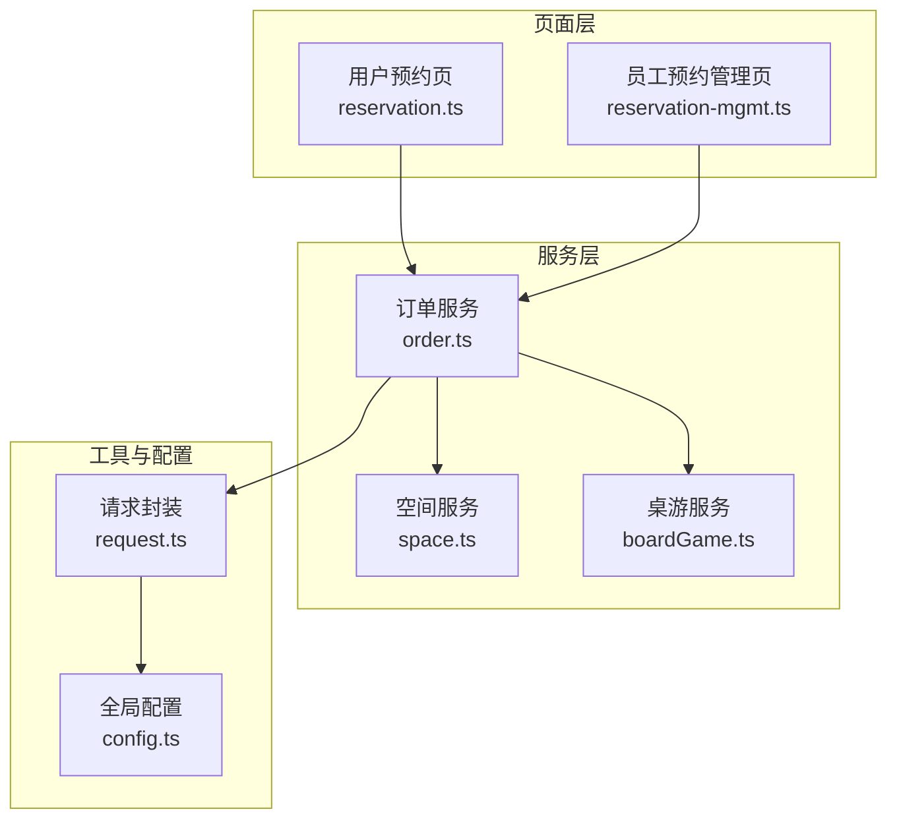
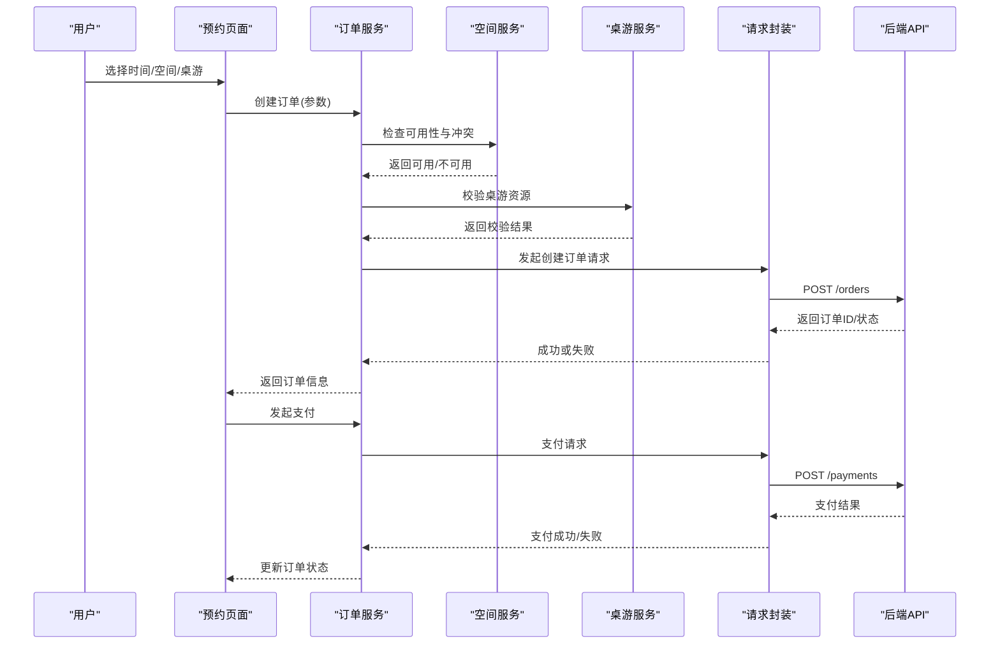
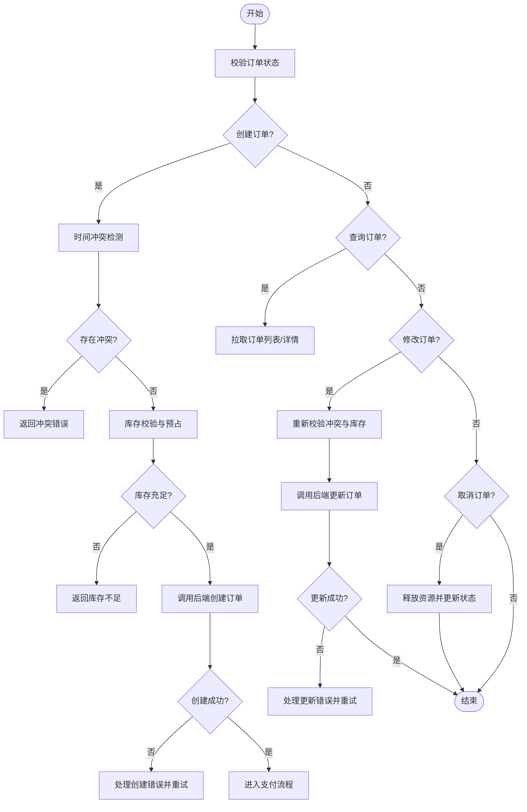
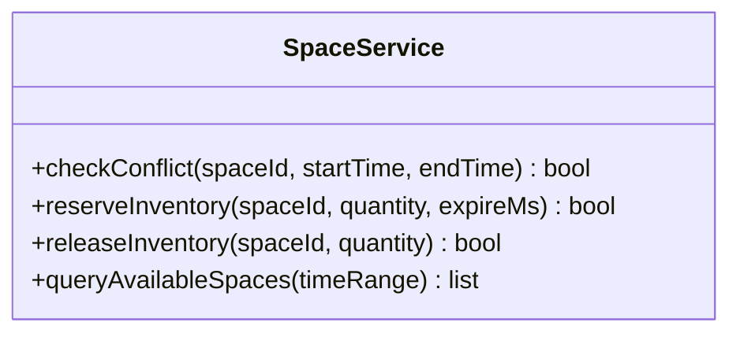
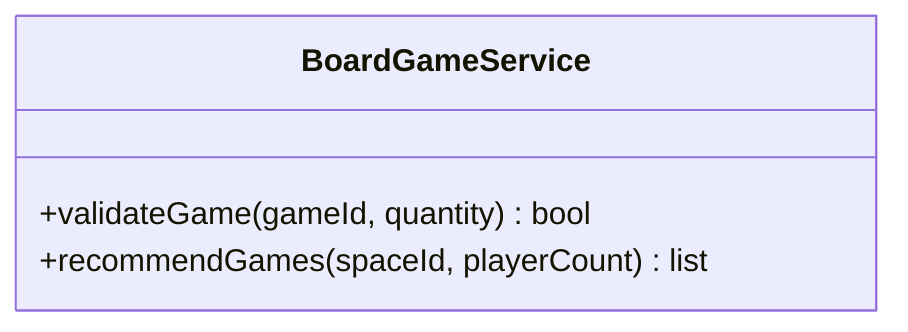
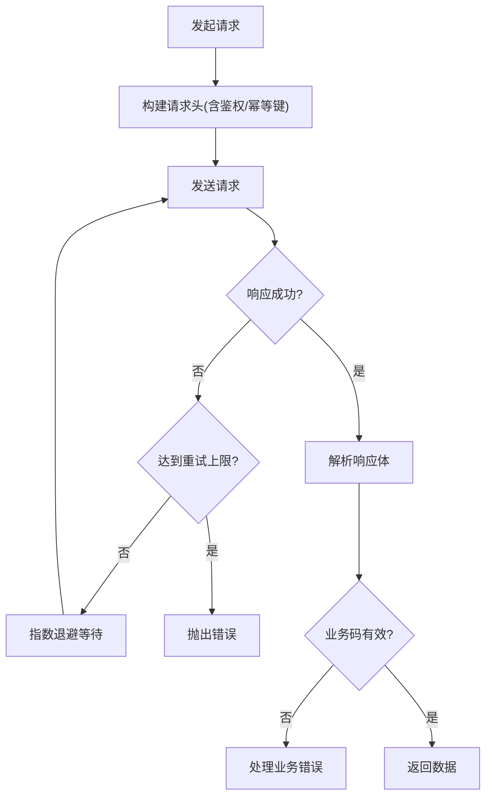
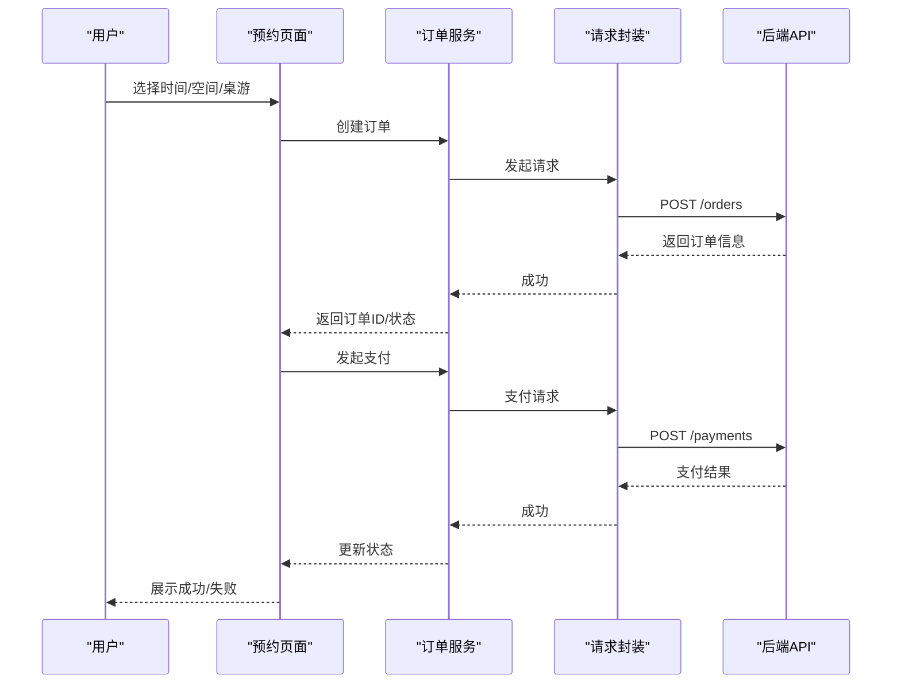
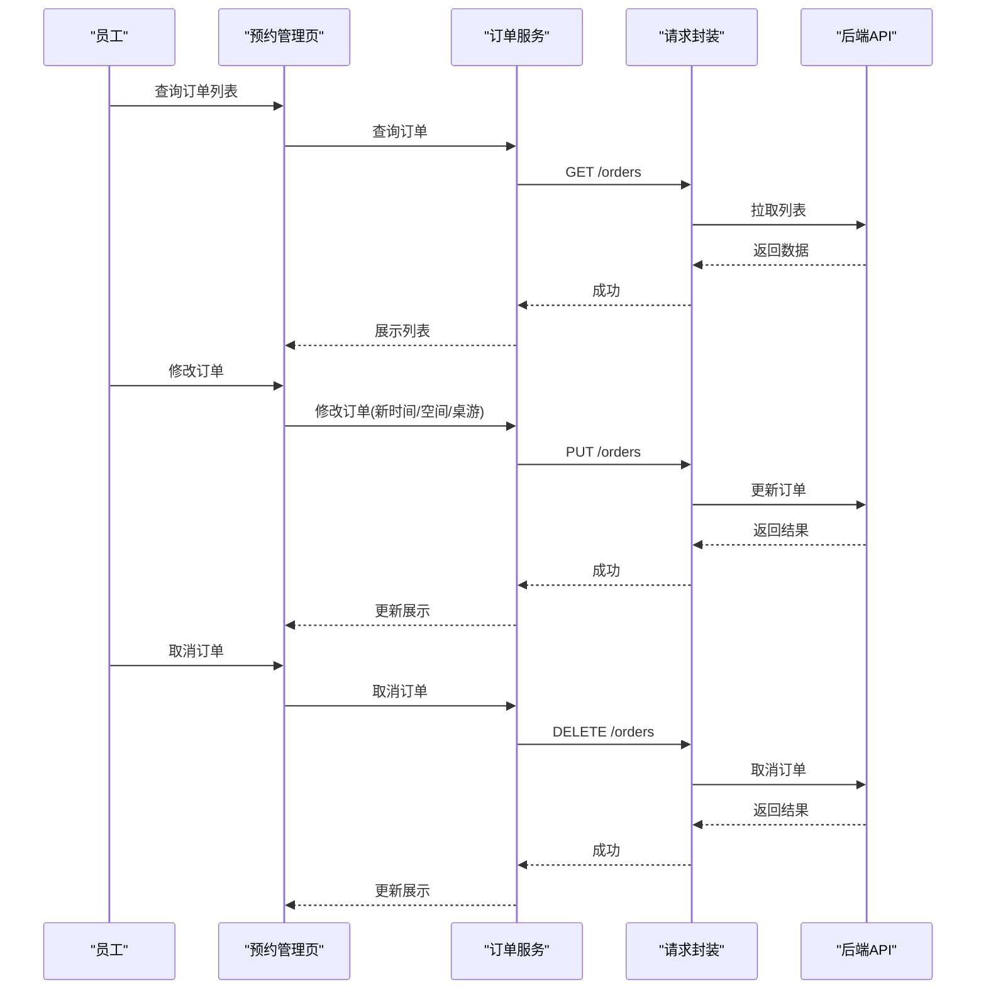
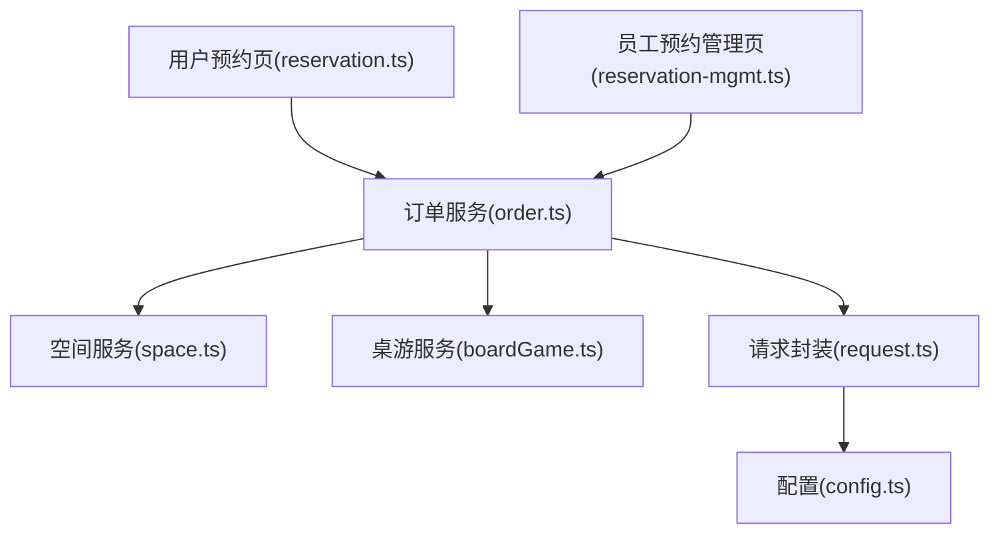
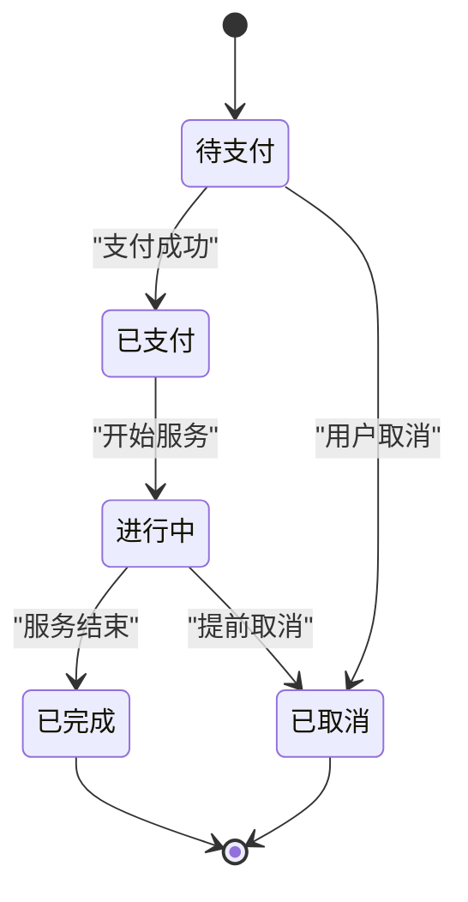

# 订单服务

<cite>
**本文引用的文件**   
- [services/order.ts](file://miniprogram/services/order.ts)
- [services/space.ts](file://miniprogram/services/space.ts)
- [services/boardGame.ts](file://miniprogram/services/boardGame.ts)
- [utils/request.ts](file://miniprogram/utils/request.ts)
- [pages/user/reservation/reservation.ts](file://miniprogram/pages/user/reservation/reservation.ts)
- [pages/staff/reservation-mgmt/reservation-mgmt.ts](file://miniprogram/pages/staff/reservation-mgmt/reservation-mgmt.ts)
- [config.ts](file://miniprogram/config.ts)
</cite>

## 目录
1. [简介](#简介)
2. [项目结构](#项目结构)
3. [核心组件](#核心组件)
4. [架构总览](#架构总览)
5. [详细组件分析](#详细组件分析)
6. [依赖关系分析](#依赖关系分析)
7. [性能考量](#性能考量)
8. [故障排查指南](#故障排查指南)
9. [结论](#结论)
10. [附录](#附录)

## 简介
本文件为“预约订单”服务的完整技术文档，覆盖订单的创建、查询、修改与取消流程；阐述订单状态管理、时间冲突检测、库存管理与支付集成；提供订单生命周期管理的示例（含异常处理与重试机制）；并展示与游戏服务和空间服务的协作模式。读者可据此理解小程序端订单相关的前端实现与服务调用方式，以及前后端交互的关键点。

## 项目结构
订单相关能力集中在小程序前端：
- services 层封装对后端的请求（订单、空间、桌游等）。
- pages 层包含用户侧预约页面与员工侧预约管理页面。
- utils 层提供通用网络请求封装。
- config.ts 提供全局配置（如接口基地址、超时等）。

**图示来源** 
- [pages/user/reservation/reservation.ts](file://miniprogram/pages/user/reservation/reservation.ts)
- [pages/staff/reservation-mgmt/reservation-mgmt.ts](file://miniprogram/pages/staff/reservation-mgmt/reservation-mgmt.ts)
- [services/order.ts](file://miniprogram/services/order.ts)
- [services/space.ts](file://miniprogram/services/space.ts)
- [services/boardGame.ts](file://miniprogram/services/boardGame.ts)
- [utils/request.ts](file://miniprogram/utils/request.ts)
- [config.ts](file://miniprogram/config.ts)

**章节来源**
- [services/order.ts](file://miniprogram/services/order.ts)
- [services/space.ts](file://miniprogram/services/space.ts)
- [services/boardGame.ts](file://miniprogram/services/boardGame.ts)
- [utils/request.ts](file://miniprogram/utils/request.ts)
- [pages/user/reservation/reservation.ts](file://miniprogram/pages/user/reservation/reservation.ts)
- [pages/staff/reservation-mgmt/reservation-mgmt.ts](file://miniprogram/pages/staff/reservation-mgmt/reservation-mgmt.ts)
- [config.ts](file://miniprogram/config.ts)

## 核心组件
- 订单服务（services/order.ts）
  - 负责订单的创建、查询、修改、取消等主流程编排。
  - 协调空间服务与桌游服务完成资源校验与锁定。
  - 统一错误处理与重试策略。
- 空间服务（services/space.ts）
  - 提供空间可用性检查、时间冲突检测、库存扣减/释放等能力。
- 桌游服务（services/boardGame.ts）
  - 提供桌游资源校验、数量与版本一致性检查等。
- 请求封装（utils/request.ts）
  - 统一网络请求、超时、重试、鉴权头注入、响应拦截。
- 页面层
  - 用户预约页：发起创建订单、选择时间与空间、提交支付。
  - 员工预约管理页：查询、修改、取消订单，处理异常与重试。

**章节来源**
- [services/order.ts](file://miniprogram/services/order.ts)
- [services/space.ts](file://miniprogram/services/space.ts)
- [services/boardGame.ts](file://miniprogram/services/boardGame.ts)
- [utils/request.ts](file://miniprogram/utils/request.ts)
- [pages/user/reservation/reservation.ts](file://miniprogram/pages/user/reservation/reservation.ts)
- [pages/staff/reservation-mgmt/reservation-mgmt.ts](file://miniprogram/pages/staff/reservation-mgmt/reservation-mgmt.ts)

## 架构总览
订单服务作为前端编排中心，串联用户操作、资源校验、支付与结果回写。整体数据流如下：

**图示来源** 
- [services/order.ts](file://miniprogram/services/order.ts)
- [services/space.ts](file://miniprogram/services/space.ts)
- [services/boardGame.ts](file://miniprogram/services/boardGame.ts)
- [utils/request.ts](file://miniprogram/utils/request.ts)

## 详细组件分析

### 订单服务（services/order.ts）
- 职责
  - 订单创建：组装参数，调用空间与桌游服务进行校验，发起创建订单请求。
  - 订单查询：按条件查询订单列表与详情。
  - 订单修改：支持修改时间、空间、桌游等字段，重新进行冲突检测与资源校验。
  - 订单取消：执行取消逻辑，释放已占用的空间与库存。
  - 支付集成：根据订单状态触发支付流程，处理回调与状态同步。
  - 异常处理与重试：对网络错误、业务异常进行捕获与重试，保障最终一致性。
- 关键流程
  - 创建订单：先做时间冲突检测与库存预占，再调用后端创建订单，成功后进入待支付或已支付状态。
  - 修改订单：校验新时间是否冲突，若涉及空间/桌游变更则重新校验资源。
  - 取消订单：校验当前状态是否允许取消，释放资源并更新状态。
  - 支付：根据订单金额与支付方式发起支付，监听支付结果并更新订单状态。
- 错误处理
  - 网络异常：自动重试（指数退避），超过阈值上报错误。
  - 业务异常：如时间冲突、库存不足、权限不足等，返回明确错误码与提示。
  - 幂等性：创建与支付请求具备幂等键，避免重复提交导致的数据不一致。

**图示来源** 
- [services/order.ts](file://miniprogram/services/order.ts)

**章节来源**
- [services/order.ts](file://miniprogram/services/order.ts)

### 空间服务（services/space.ts）
- 职责
  - 时间冲突检测：基于时间段与空间ID判断是否存在重叠。
  - 库存管理：空间座位/房间数量的可用性与预占、释放。
  - 可用性查询：返回指定时间段的可用空间集合。
- 关键方法
  - 检查冲突：输入空间ID、开始时间、结束时间，返回冲突详情。
  - 预占库存：在创建订单前对空间资源进行临时占用，设置过期时间。
  - 释放库存：在取消或失败时释放预占资源。
- 错误处理
  - 并发冲突：使用分布式锁或乐观锁保证一致性。
  - 超时与重试：对远端调用进行超时控制与重试。

**图示来源** 
- [services/space.ts](file://miniprogram/services/space.ts)

**章节来源**
- [services/space.ts](file://miniprogram/services/space.ts)

### 桌游服务（services/boardGame.ts）
- 职责
  - 资源校验：验证桌游版本、数量、归属等。
  - 库存联动：与空间服务协同确保桌游与空间匹配。
- 关键方法
  - 校验桌游：输入桌游ID与数量，返回校验结果。
  - 获取推荐：根据空间与人数推荐合适桌游。
- 错误处理
  - 资源不存在或版本不匹配：返回明确错误码。
  - 库存不足：提示调整数量或更换桌游。

**图示来源** 
- [services/boardGame.ts](file://miniprogram/services/boardGame.ts)

**章节来源**
- [services/boardGame.ts](file://miniprogram/services/boardGame.ts)

### 请求封装（utils/request.ts）
- 职责
  - 统一HTTP请求封装，支持超时、重试、鉴权头注入。
  - 响应拦截：统一错误码处理、消息提示、日志记录。
- 关键特性
  - 重试策略：指数退避、最大重试次数、可配置。
  - 幂等键：为创建与支付请求生成唯一幂等键。
  - 错误分类：区分网络错误、业务错误、服务端错误。

**图示来源** 
- [utils/request.ts](file://miniprogram/utils/request.ts)

**章节来源**
- [utils/request.ts](file://miniprogram/utils/request.ts)

### 用户预约页（pages/user/reservation/reservation.ts）
- 职责
  - 用户选择时间、空间、桌游，发起创建订单。
  - 展示订单状态、支付入口、结果反馈。
  - 处理异常与重试，提升用户体验。
- 关键流程
  - 初始化：加载可选空间与桌游。
  - 创建订单：调用订单服务，显示加载态。
  - 支付：根据订单状态触发支付，监听结果。
  - 结果：更新UI并引导下一步操作。

**图示来源** 
- [pages/user/reservation/reservation.ts](file://miniprogram/pages/user/reservation/reservation.ts)
- [services/order.ts](file://miniprogram/services/order.ts)
- [utils/request.ts](file://miniprogram/utils/request.ts)

**章节来源**
- [pages/user/reservation/reservation.ts](file://miniprogram/pages/user/reservation/reservation.ts)

### 员工预约管理页（pages/staff/reservation-mgmt/reservation-mgmt.ts）
- 职责
  - 查询订单列表与详情。
  - 修改订单（时间、空间、桌游）。
  - 取消订单，释放资源。
  - 处理异常与重试，提供操作反馈。
- 关键流程
  - 列表查询：分页拉取订单。
  - 详情查询：获取订单详细信息。
  - 修改：重新校验冲突与库存，调用更新接口。
  - 取消：校验状态，释放资源，更新状态。

**图示来源** 
- [pages/staff/reservation-mgmt/reservation-mgmt.ts](file://miniprogram/pages/staff/reservation-mgmt/reservation-mgmt.ts)
- [services/order.ts](file://miniprogram/services/order.ts)
- [utils/request.ts](file://miniprogram/utils/request.ts)

**章节来源**
- [pages/staff/reservation-mgmt/reservation-mgmt.ts](file://miniprogram/pages/staff/reservation-mgmt/reservation-mgmt.ts)

## 依赖关系分析
订单服务依赖空间服务与桌游服务进行资源校验，所有网络请求通过统一的请求封装进行。页面层仅关注用户交互与状态展示。

**图示来源** 
- [services/order.ts](file://miniprogram/services/order.ts)
- [services/space.ts](file://miniprogram/services/space.ts)
- [services/boardGame.ts](file://miniprogram/services/boardGame.ts)
- [utils/request.ts](file://miniprogram/utils/request.ts)
- [config.ts](file://miniprogram/config.ts)
- [pages/user/reservation/reservation.ts](file://miniprogram/pages/user/reservation/reservation.ts)
- [pages/staff/reservation-mgmt/reservation-mgmt.ts](file://miniprogram/pages/staff/reservation-mgmt/reservation-mgmt.ts)

**章节来源**
- [services/order.ts](file://miniprogram/services/order.ts)
- [services/space.ts](file://miniprogram/services/space.ts)
- [services/boardGame.ts](file://miniprogram/services/boardGame.ts)
- [utils/request.ts](file://miniprogram/utils/request.ts)
- [config.ts](file://miniprogram/config.ts)
- [pages/user/reservation/reservation.ts](file://miniprogram/pages/user/reservation/reservation.ts)
- [pages/staff/reservation-mgmt/reservation-mgmt.ts](file://miniprogram/pages/staff/reservation-mgmt/reservation-mgmt.ts)

## 性能考量
- 减少不必要的请求：合并查询、缓存常用数据（如空间与桌游选项）。
- 合理重试策略：指数退避、限制最大重试次数，避免雪崩。
- 超时控制：为每个请求设置合理超时，快速失败。
- 资源预占与释放：缩短预占时间，避免长时间占用导致资源紧张。
- 前端状态管理：避免频繁重渲染，批量更新UI。

[本节为通用指导，无需引用具体文件]

## 故障排查指南
- 常见错误
  - 时间冲突：检查所选时间段是否与已有订单重叠。
  - 库存不足：确认空间与桌游数量是否满足需求。
  - 网络异常：检查网络连通性、超时设置、重试策略。
  - 支付失败：核对支付参数、商户配置、回调处理。
- 排查步骤
  - 查看请求日志：确认请求参数与响应内容。
  - 检查订单状态机：确认当前状态是否允许操作。
  - 验证资源校验：调用空间与桌游服务进行独立校验。
  - 重试与补偿：对失败操作进行重试或补偿。

**章节来源**
- [services/order.ts](file://miniprogram/services/order.ts)
- [services/space.ts](file://miniprogram/services/space.ts)
- [services/boardGame.ts](file://miniprogram/services/boardGame.ts)
- [utils/request.ts](file://miniprogram/utils/request.ts)

## 结论
订单服务通过清晰的分层与协作模式，实现了预约订单的创建、查询、修改与取消全流程。借助空间与桌游服务完成资源校验与库存管理，结合统一的请求封装实现健壮的网络交互与错误处理。页面层专注于用户交互与状态展示，整体架构易于扩展与维护。

[本节为总结，无需引用具体文件]

## 附录
- 订单状态机（概念示意）

[本图为概念示意，无需引用具体文件]