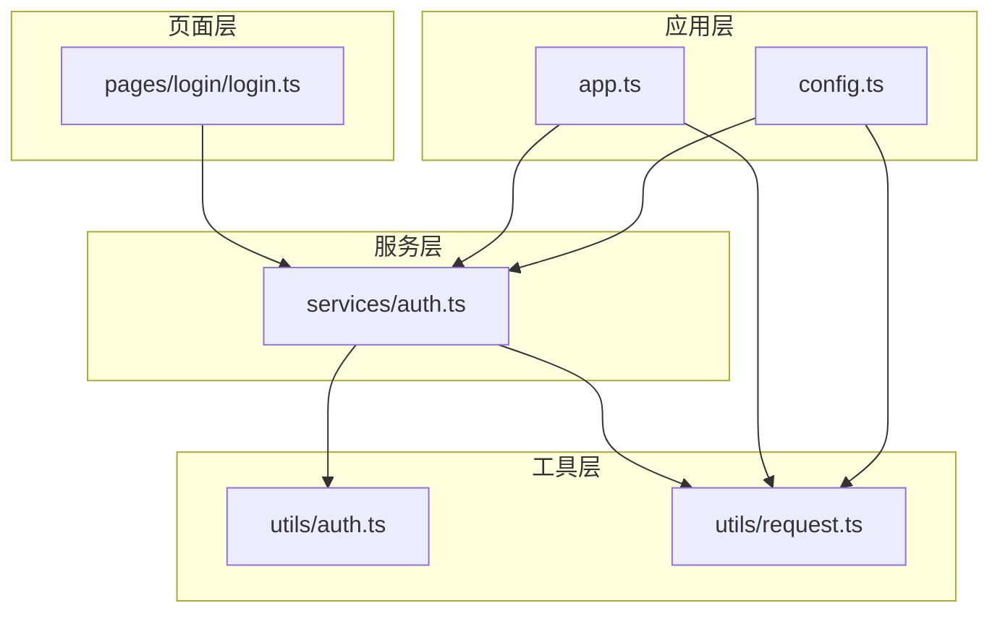
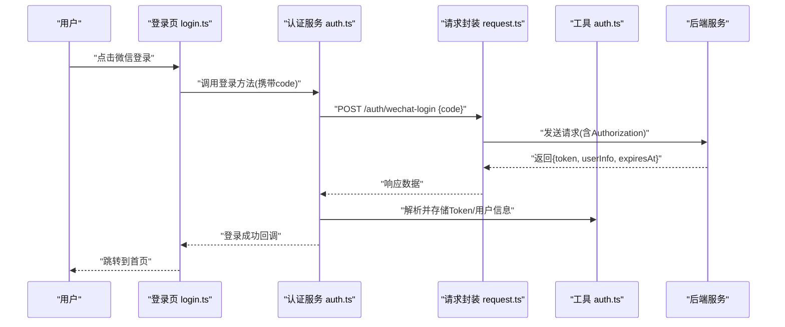
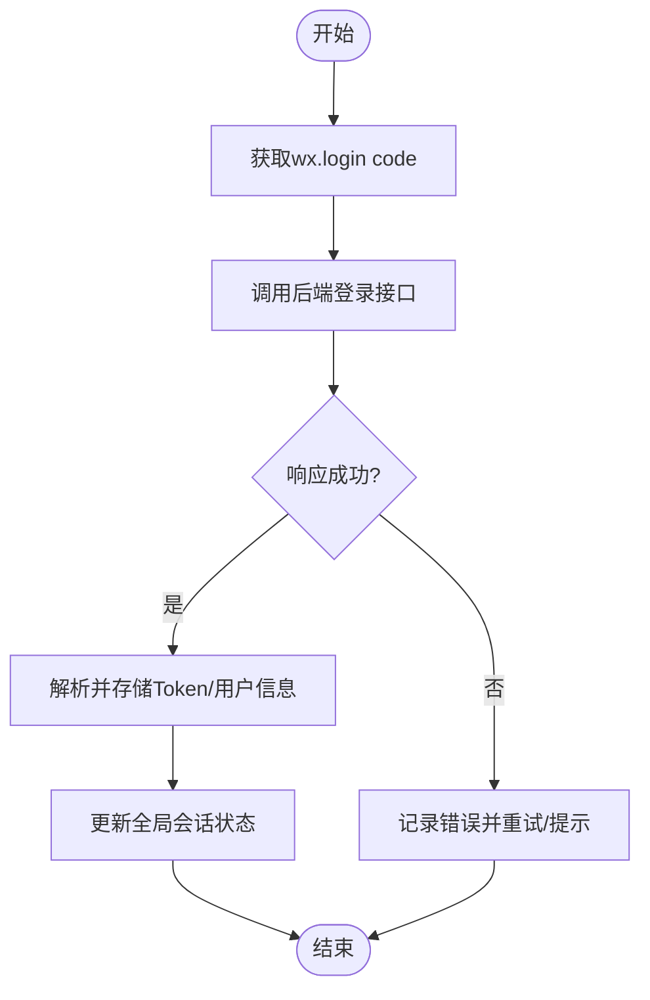
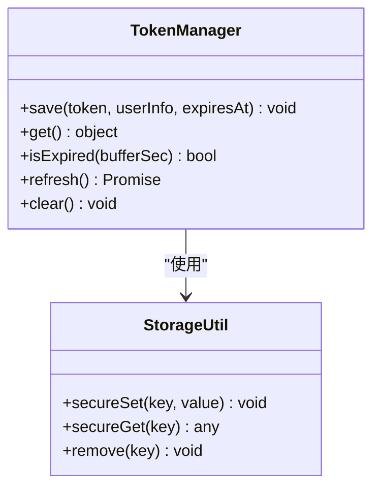
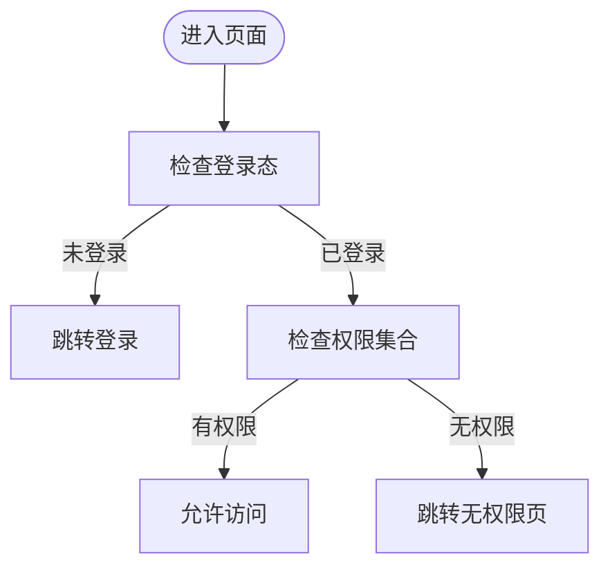
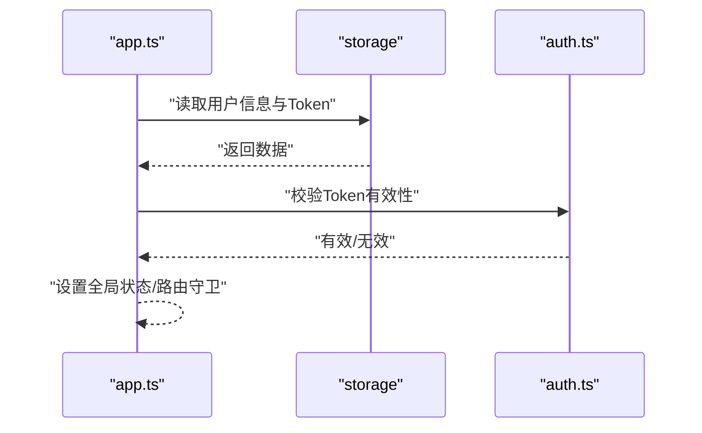
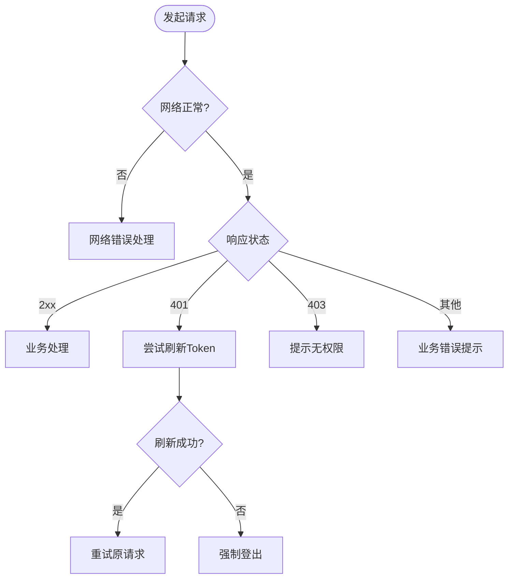
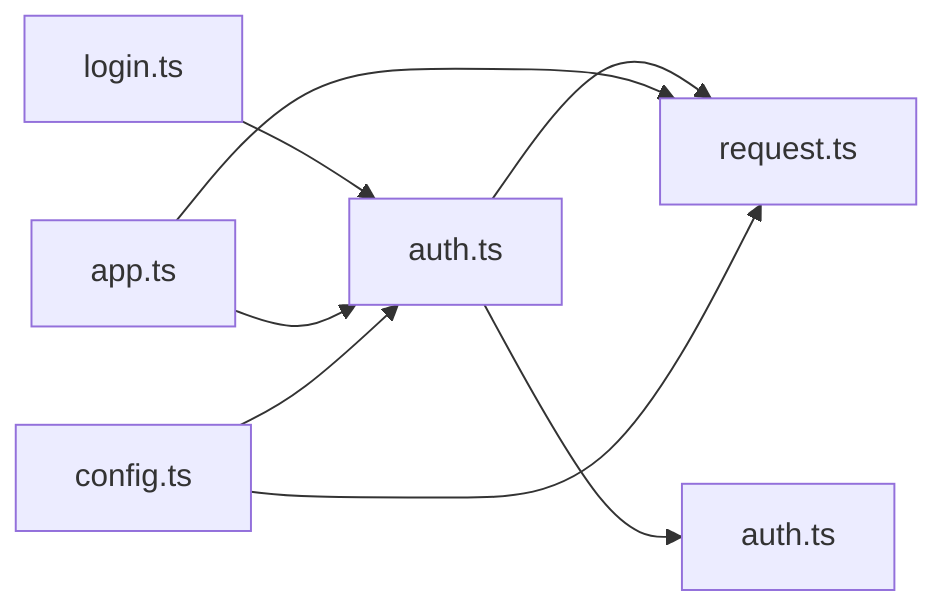

# 认证服务

<cite>
**本文引用的文件**   
- [miniprogram/services/auth.ts](file://miniprogram/services/auth.ts)
- [miniprogram/utils/auth.ts](file://miniprogram/utils/auth.ts)
- [miniprogram/utils/request.ts](file://miniprogram/utils/request.ts)
- [miniprogram/pages/login/login.ts](file://miniprogram/pages/login/login.ts)
- [miniprogram/app.ts](file://miniprogram/app.ts)
- [miniprogram/config.ts](file://miniprogram/config.ts)
</cite>

## 目录
1. [简介](#简介)
2. [项目结构](#项目结构)
3. [核心组件](#核心组件)
4. [架构总览](#架构总览)
5. [详细组件分析](#详细组件分析)
6. [依赖分析](#依赖分析)
7. [性能考虑](#性能考虑)
8. [故障排查指南](#故障排查指南)
9. [结论](#结论)
10. [附录](#附录)

## 简介
本文件为小程序端“认证服务”的完整技术文档，覆盖用户登录、注册、权限验证与会话管理。重点说明：
- 微信授权登录流程（获取 code、换取 openid/unionid、后端签发 Token）
- Token 生命周期管理（存储、刷新、失效处理）
- 权限控制策略（页面级与接口级）
- 错误处理策略（网络异常、鉴权失败、业务错误）
- 与 utils/auth.ts 工具的集成方式与最佳实践
- API 调用示例、参数说明与返回值格式约定

## 项目结构
认证相关代码主要分布在以下模块：
- services/auth.ts：认证领域服务，封装登录、注册、登出、Token 管理等业务逻辑
- utils/auth.ts：认证工具库，提供加密、签名、校验、本地存储等通用能力
- utils/request.ts：HTTP 请求封装，统一拦截器、重试、错误映射
- pages/login/login.ts：登录页 UI 与交互，触发微信登录并调用 services/auth.ts
- app.ts：应用初始化，全局会话状态、路由守卫、Token 自动刷新
- config.ts：环境配置（如服务端地址、超时、重试次数、功能开关）

图表来源
- [miniprogram/pages/login/login.ts](file://miniprogram/pages/login/login.ts)
- [miniprogram/services/auth.ts](file://miniprogram/services/auth.ts)
- [miniprogram/utils/auth.ts](file://miniprogram/utils/auth.ts)
- [miniprogram/utils/request.ts](file://miniprogram/utils/request.ts)
- [miniprogram/app.ts](file://miniprogram/app.ts)
- [miniprogram/config.ts](file://miniprogram/config.ts)

章节来源
- [miniprogram/services/auth.ts](file://miniprogram/services/auth.ts)
- [miniprogram/utils/auth.ts](file://miniprogram/utils/auth.ts)
- [miniprogram/utils/request.ts](file://miniprogram/utils/request.ts)
- [miniprogram/pages/login/login.ts](file://miniprogram/pages/login/login.ts)
- [miniprogram/app.ts](file://miniprogram/app.ts)
- [miniprogram/config.ts](file://miniprogram/config.ts)

## 核心组件
- 认证服务 services/auth.ts
  - 职责：封装微信登录、账号注册、密码登录、登出、Token 获取与刷新、权限判断、会话状态同步
  - 关键能力：
    - 微信登录：调用 wx.login 获取 code，提交至后端换取 Token
    - 注册/登录：提交手机号+验证码或用户名+密码，成功后保存 Token
    - 权限校验：根据角色/权限集合判断是否可访问页面或执行操作
    - 会话管理：维护当前用户信息、Token、过期时间，支持自动刷新
- 认证工具 utils/auth.ts
  - 职责：提供加密/解密、签名生成与校验、Token 解析、本地存储封装、时间戳与过期计算
  - 关键能力：
    - 安全存储：敏感数据加密后写入 storage
    - Token 解析：解码 payload，提取角色、权限、过期时间
    - 过期判断：基于过期时间戳与缓冲时间判定是否需要刷新
- HTTP 请求 utils/request.ts
  - 职责：统一发起网络请求，注入 Authorization 头，处理 401/403 等鉴权错误，支持重试与降级
  - 关键能力：
    - 拦截器：请求前附加 Token，响应后统一错误处理
    - 鉴权错误：捕获 401/403，触发刷新或跳转登录
    - 重试机制：对瞬时错误进行有限次重试
- 登录页 pages/login/login.ts
  - 职责：展示登录界面，触发微信授权，收集用户信息，调用 services/auth.ts 完成登录
  - 关键能力：
    - 微信授权弹窗与回调处理
    - 表单校验与错误提示
    - 登录成功后的页面跳转与状态更新
- 应用入口 app.ts
  - 职责：应用启动时恢复会话、设置路由守卫、监听 Token 变化
  - 关键能力：
    - 启动时从 storage 恢复用户信息与 Token
    - 路由守卫：未登录或无权限时重定向到登录或无权限页
    - 监听 Token 刷新事件，同步全局状态
- 配置 config.ts
  - 职责：集中管理环境变量与功能开关
  - 关键能力：
    - 服务端基础地址、超时、重试次数
    - 微信 AppID、登录态有效期、权限策略开关

章节来源
- [miniprogram/services/auth.ts](file://miniprogram/services/auth.ts)
- [miniprogram/utils/auth.ts](file://miniprogram/utils/auth.ts)
- [miniprogram/utils/request.ts](file://miniprogram/utils/request.ts)
- [miniprogram/pages/login/login.ts](file://miniprogram/pages/login/login.ts)
- [miniprogram/app.ts](file://miniprogram/app.ts)
- [miniprogram/config.ts](file://miniprogram/config.ts)

## 架构总览
认证服务采用分层架构：页面层负责交互，服务层封装业务，工具层提供通用能力，应用层负责全局状态与守卫。

图表来源
- [miniprogram/pages/login/login.ts](file://miniprogram/pages/login/login.ts)
- [miniprogram/services/auth.ts](file://miniprogram/services/auth.ts)
- [miniprogram/utils/request.ts](file://miniprogram/utils/request.ts)
- [miniprogram/utils/auth.ts](file://miniprogram/utils/auth.ts)

## 详细组件分析

### 微信授权登录流程
- 步骤
  - 页面触发 wx.login 获取临时 code
  - 将 code 提交至后端 /auth/wechat-login
  - 后端返回 Token、用户信息与过期时间
  - 客户端使用 utils/auth.ts 解析并安全存储
  - 后续请求通过 utils/request.ts 自动注入 Authorization
- 关键点
  - code 时效短，需立即使用
  - Token 刷新策略：接近过期时静默刷新
  - 失败重试：网络抖动时有限次重试

图表来源
- [miniprogram/pages/login/login.ts](file://miniprogram/pages/login/login.ts)
- [miniprogram/services/auth.ts](file://miniprogram/services/auth.ts)
- [miniprogram/utils/auth.ts](file://miniprogram/utils/auth.ts)
- [miniprogram/utils/request.ts](file://miniprogram/utils/request.ts)

章节来源
- [miniprogram/pages/login/login.ts](file://miniprogram/pages/login/login.ts)
- [miniprogram/services/auth.ts](file://miniprogram/services/auth.ts)
- [miniprogram/utils/auth.ts](file://miniprogram/utils/auth.ts)
- [miniprogram/utils/request.ts](file://miniprogram/utils/request.ts)

### Token 管理
- 存储
  - 使用 utils/auth.ts 的安全存储方法，避免明文泄露
  - 存储字段包括：access_token、refresh_token、expires_at、user_info
- 刷新
  - 在请求拦截器中检测即将过期的 Token，调用刷新接口
  - 刷新失败则清除本地会话并跳转登录
- 失效处理
  - 收到 401/403 时，优先尝试刷新；仍失败则强制登出
- 最佳实践
  - 最小化敏感信息暴露，仅保留必要字段
  - 刷新令牌与访问令牌分离，降低风险

图表来源
- [miniprogram/utils/auth.ts](file://miniprogram/utils/auth.ts)
- [miniprogram/services/auth.ts](file://miniprogram/services/auth.ts)

章节来源
- [miniprogram/utils/auth.ts](file://miniprogram/utils/auth.ts)
- [miniprogram/services/auth.ts](file://miniprogram/services/auth.ts)

### 权限控制
- 页面级权限
  - 路由守卫在进入页面时检查用户角色/权限集合
  - 无权限时重定向到无权限页或登录页
- 接口级权限
  - 请求拦截器附加权限标识，后端校验
  - 403 响应统一提示“无权限”
- 实现要点
  - 权限模型：角色+资源+动作三元组
  - 前端缓存权限集合，减少重复校验
  - 动态菜单与按钮级显示控制

图表来源
- [miniprogram/app.ts](file://miniprogram/app.ts)
- [miniprogram/services/auth.ts](file://miniprogram/services/auth.ts)

章节来源
- [miniprogram/app.ts](file://miniprogram/app.ts)
- [miniprogram/services/auth.ts](file://miniprogram/services/auth.ts)

### 会话管理
- 启动恢复
  - 应用启动时从 storage 恢复用户信息与 Token
  - 若 Token 有效则直接进入主页，否则跳转登录
- 状态同步
  - 登录/登出/刷新 Token 时广播事件，更新全局状态
- 生命周期
  - 退出应用或长时间无操作时清理敏感数据

图表来源
- [miniprogram/app.ts](file://miniprogram/app.ts)
- [miniprogram/utils/auth.ts](file://miniprogram/utils/auth.ts)

章节来源
- [miniprogram/app.ts](file://miniprogram/app.ts)
- [miniprogram/utils/auth.ts](file://miniprogram/utils/auth.ts)

### 错误处理策略
- 网络错误
  - 超时、断网、DNS 解析失败等，提示“网络异常”，支持重试
- 鉴权错误
  - 401：刷新 Token 失败则强制登出
  - 403：提示“无权限”，必要时跳转无权限页
- 业务错误
  - 后端返回的业务码非 0，统一提示具体错误信息
- 用户体验
  - 错误提示去抖，避免重复弹窗
  - 关键路径失败时提供“重试”与“联系客服”入口

图表来源
- [miniprogram/utils/request.ts](file://miniprogram/utils/request.ts)
- [miniprogram/services/auth.ts](file://miniprogram/services/auth.ts)

章节来源
- [miniprogram/utils/request.ts](file://miniprogram/utils/request.ts)
- [miniprogram/services/auth.ts](file://miniprogram/services/auth.ts)

### API 调用示例与规范
- 微信登录
  - 方法：POST /auth/wechat-login
  - 请求体：{ code: string }
  - 返回体：{ token: string, userInfo: object, expiresAt: number }
  - 错误码：400（code无效）、401（授权失败）、500（服务器错误）
- 账号注册
  - 方法：POST /auth/register
  - 请求体：{ phone: string, smsCode: string } 或 { username: string, password: string }
  - 返回体：{ token: string, userInfo: object, expiresAt: number }
- 刷新 Token
  - 方法：POST /auth/refresh
  - 请求体：{ refreshToken: string }
  - 返回体：{ token: string, expiresAt: number }
- 登出
  - 方法：POST /auth/logout
  - 请求体：{ token: string }
  - 返回体：{ success: boolean }

注意：
- 所有接口需在请求头携带 Authorization: Bearer <token>
- 统一错误响应格式：{ code: number, message: string }
- 分页与列表接口遵循统一的 page/pageSize 参数约定

章节来源
- [miniprogram/services/auth.ts](file://miniprogram/services/auth.ts)
- [miniprogram/utils/request.ts](file://miniprogram/utils/request.ts)

### 与 utils/auth.ts 的集成与最佳实践
- 集成点
  - 登录成功后调用 secureSet 存储 Token 与用户信息
  - 每次请求前调用 get 获取 Token 并注入 Authorization
  - 过期判断使用 isExpired 与缓冲时间
  - 刷新失败调用 clear 清理本地数据
- 最佳实践
  - 避免在日志中打印敏感信息
  - 使用最小权限原则，仅暴露必要方法
  - 对敏感操作增加二次确认或生物识别
  - 定期轮换 refresh_token，缩短 access_token 有效期

章节来源
- [miniprogram/utils/auth.ts](file://miniprogram/utils/auth.ts)
- [miniprogram/services/auth.ts](file://miniprogram/services/auth.ts)

## 依赖分析
认证服务依赖关系如下：
- 页面层依赖服务层
- 服务层依赖工具层与请求封装
- 应用层依赖服务层与配置
- 配置影响请求与服务行为

图表来源
- [miniprogram/pages/login/login.ts](file://miniprogram/pages/login/login.ts)
- [miniprogram/services/auth.ts](file://miniprogram/services/auth.ts)
- [miniprogram/utils/request.ts](file://miniprogram/utils/request.ts)
- [miniprogram/utils/auth.ts](file://miniprogram/utils/auth.ts)
- [miniprogram/app.ts](file://miniprogram/app.ts)
- [miniprogram/config.ts](file://miniprogram/config.ts)

章节来源
- [miniprogram/pages/login/login.ts](file://miniprogram/pages/login/login.ts)
- [miniprogram/services/auth.ts](file://miniprogram/services/auth.ts)
- [miniprogram/utils/request.ts](file://miniprogram/utils/request.ts)
- [miniprogram/utils/auth.ts](file://miniprogram/utils/auth.ts)
- [miniprogram/app.ts](file://miniprogram/app.ts)
- [miniprogram/config.ts](file://miniprogram/config.ts)

## 性能考虑
- 减少不必要的网络请求：合并登录与用户信息获取
- Token 刷新节流：同一时刻仅允许一次刷新
- 本地缓存：用户基本信息缓存，减少重复拉取
- 错误重试退避：指数退避避免雪崩
- 内存优化：及时清理不再使用的敏感数据

## 故障排查指南
- 常见问题
  - 微信登录失败：检查 code 是否过期、AppID 是否正确、网络连通性
  - Token 刷新失败：检查 refresh_token 是否有效、服务端时钟同步
  - 权限不足：检查用户角色与资源权限映射
  - 网络异常：检查代理、防火墙、DNS 解析
- 定位方法
  - 开启调试日志，记录请求/响应与错误堆栈
  - 使用抓包工具验证报文格式与签名
  - 逐步隔离问题域（网络、鉴权、业务）
- 修复建议
  - 完善错误码与提示信息
  - 增加重试与降级策略
  - 加强输入校验与安全加固

章节来源
- [miniprogram/utils/request.ts](file://miniprogram/utils/request.ts)
- [miniprogram/services/auth.ts](file://miniprogram/services/auth.ts)

## 结论
认证服务通过清晰的分层设计与完善的工具支撑，实现了安全的微信授权登录、健壮的 Token 管理、严格的权限控制与可靠的错误处理。遵循本文档的最佳实践，可有效提升安全性与用户体验。

## 附录
- 术语表
  - Token：访问令牌，用于身份认证
  - Refresh Token：刷新令牌，用于续期访问令牌
  - 权限模型：角色+资源+动作的三维权限体系
- 参考实现
  - 登录页交互：[miniprogram/pages/login/login.ts](file://miniprogram/pages/login/login.ts)
  - 认证服务：[miniprogram/services/auth.ts](file://miniprogram/services/auth.ts)
  - 请求封装：[miniprogram/utils/request.ts](file://miniprogram/utils/request.ts)
  - 认证工具：[miniprogram/utils/auth.ts](file://miniprogram/utils/auth.ts)
  - 应用入口：[miniprogram/app.ts](file://miniprogram/app.ts)
  - 配置项：[miniprogram/config.ts](file://miniprogram/config.ts)