# 数据流设计

<cite>
**本文档引用的文件**   
- [app.ts](file://miniprogram/app.ts)
- [config.ts](file://miniprogram/config.ts)
- [request.ts](file://miniprogram/utils/request.ts)
- [auth.ts](file://miniprogram/utils/auth.ts)
- [auth.ts](file://miniprogram/services/auth.ts)
- [boardGame.ts](file://miniprogram/services/boardGame.ts)
- [order.ts](file://miniprogram/services/order.ts)
- [space.ts](file://miniprogram/services/space.ts)
- [store.ts](file://miniprogram/services/store.ts)
- [login.ts](file://miniprogram/pages/login/login.ts)
- [games.ts](file://miniprogram/pages/user/games/games.ts)
- [game-detail.ts](file://miniprogram/pages/user/game-detail/game-detail.ts)
- [reservation.ts](file://miniprogram/pages/user/reservation/reservation.ts)
- [workbench.ts](file://miniprogram/pages/staff/workbench/workbench.ts)
- [reservation-mgmt.ts](file://miniprogram/pages/staff/reservation-mgmt/reservation-mgmt.ts)
</cite>

## 目录
1. [简介](#简介)
2. [项目结构](#项目结构)
3. [核心组件](#核心组件)
4. [架构总览](#架构总览)
5. [详细组件分析](#详细组件分析)
6. [依赖关系分析](#依赖关系分析)
7. [性能考量](#性能考量)
8. [故障排查指南](#故障排查指南)
9. [结论](#结论)
10. [附录](#附录)

## 简介
本文件面向“小程序桌面游戏预约系统”的数据流设计，聚焦从用户交互到API请求、再到状态更新的完整链路。文档涵盖：
- 请求封装机制与统一网络层
- 认证流程与会话管理
- 缓存策略（本地存储与内存）
- 错误处理与重试/降级
- 数据验证规则、类型定义与状态管理方案
- 异步数据处理模式（Promise/async-await）与异常捕获
- 数据流图与状态转换图，展示跨组件与服务的数据传递

## 项目结构
本项目采用分层组织：
- 页面层（pages）：承载用户界面与交互逻辑
- 服务层（services）：封装业务接口与领域操作
- 工具层（utils）：通用能力（网络请求、鉴权、工具函数）
- 应用配置（app.ts、config.ts）：全局初始化与配置
- 组件（components）：可复用UI组件
- 样式与类型（styles、typings）：主题变量与类型声明

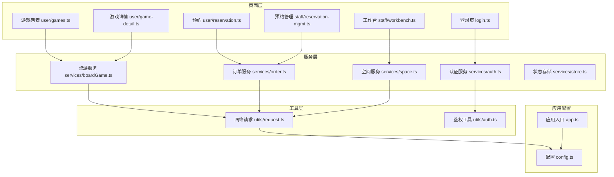

**图表来源** 
- [app.ts](file://miniprogram/app.ts)
- [config.ts](file://miniprogram/config.ts)
- [request.ts](file://miniprogram/utils/request.ts)
- [auth.ts](file://miniprogram/utils/auth.ts)
- [auth.ts](file://miniprogram/services/auth.ts)
- [boardGame.ts](file://miniprogram/services/boardGame.ts)
- [order.ts](file://miniprogram/services/order.ts)
- [space.ts](file://miniprogram/services/space.ts)
- [store.ts](file://miniprogram/services/store.ts)
- [login.ts](file://miniprogram/pages/login/login.ts)
- [games.ts](file://miniprogram/pages/user/games/games.ts)
- [game-detail.ts](file://miniprogram/pages/user/game-detail/game-detail.ts)
- [reservation.ts](file://miniprogram/pages/user/reservation/reservation.ts)
- [workbench.ts](file://miniprogram/pages/staff/workbench/workbench.ts)
- [reservation-mgmt.ts](file://miniprogram/pages/staff/reservation-mgmt/reservation-mgmt.ts)

**章节来源**
- [app.ts](file://miniprogram/app.ts)
- [config.ts](file://miniprogram/config.ts)

## 核心组件
- 网络请求封装（utils/request.ts）
  - 统一拦截器：附加Token、超时控制、重试策略、错误码映射、响应体解包
  - 缓存开关：按URL或参数生成缓存键，支持GET缓存与失效策略
  - 类型化返回：对成功/失败进行泛型约束，便于上层消费
- 鉴权工具（utils/auth.ts）
  - Token存取、过期检测、自动刷新、静默登录
- 认证服务（services/auth.ts）
  - 登录、注册、获取用户信息、权限校验
- 业务服务（services/boardGame.ts, order.ts, space.ts）
  - 聚合API调用，封装领域语义，处理业务级错误
- 状态存储（services/store.ts）
  - 轻量状态容器，提供订阅/发布或响应式更新能力
- 应用入口与配置（app.ts, config.ts）
  - 全局配置、环境切换、日志与埋点初始化

**章节来源**
- [request.ts](file://miniprogram/utils/request.ts)
- [auth.ts](file://miniprogram/utils/auth.ts)
- [auth.ts](file://miniprogram/services/auth.ts)
- [boardGame.ts](file://miniprogram/services/boardGame.ts)
- [order.ts](file://miniprogram/services/order.ts)
- [space.ts](file://miniprogram/services/space.ts)
- [store.ts](file://miniprogram/services/store.ts)
- [app.ts](file://miniprogram/app.ts)
- [config.ts](file://miniprogram/config.ts)

## 架构总览
整体数据流遵循“页面→服务→网络层→服务端→缓存/状态”的单向流动，配合事件驱动的状态更新。

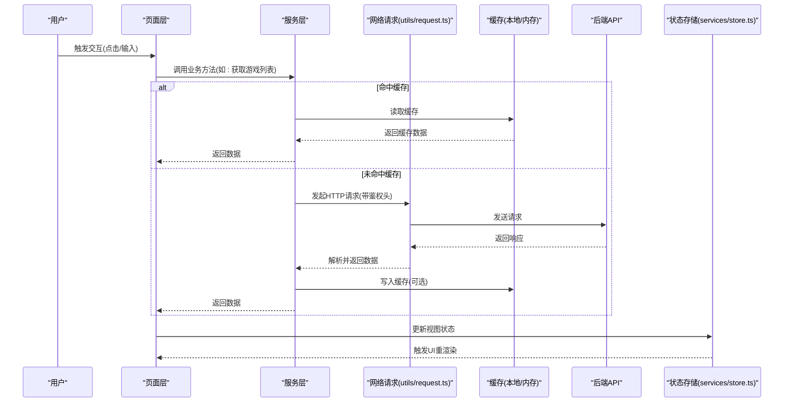

**图表来源** 
- [request.ts](file://miniprogram/utils/request.ts)
- [auth.ts](file://miniprogram/utils/auth.ts)
- [auth.ts](file://miniprogram/services/auth.ts)
- [boardGame.ts](file://miniprogram/services/boardGame.ts)
- [order.ts](file://miniprogram/services/order.ts)
- [space.ts](file://miniprogram/services/space.ts)
- [store.ts](file://miniprogram/services/store.ts)

## 详细组件分析

### 网络请求封装（utils/request.ts）
- 功能要点
  - 统一请求拦截：注入Authorization、TraceId、设备信息等
  - 响应拦截：统一错误码处理、消息提示、重试/退避
  - 缓存策略：GET请求可按URL+参数生成缓存键；支持TTL与手动失效
  - 类型安全：泛型约束请求/响应结构，减少运行时错误
- 关键流程
  - 构建请求对象 → 鉴权处理 → 缓存命中判断 → 发送请求 → 响应处理 → 缓存写入 → 返回结果

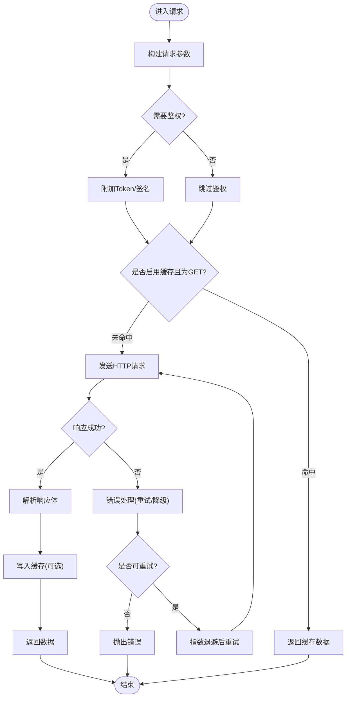

**图表来源** 
- [request.ts](file://miniprogram/utils/request.ts)

**章节来源**
- [request.ts](file://miniprogram/utils/request.ts)

### 鉴权工具（utils/auth.ts）
- 功能要点
  - Token生命周期管理：获取、存储、过期检测、自动刷新
  - 静默登录：无感刷新，失败时引导重新登录
  - 权限检查：基于角色/权限标记快速判定
- 典型流程
  - 获取Token → 校验有效性 → 必要时刷新 → 设置请求头

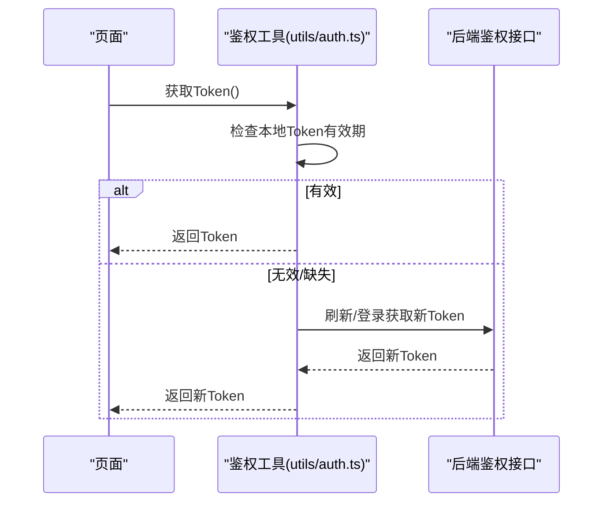

**图表来源** 
- [auth.ts](file://miniprogram/utils/auth.ts)

**章节来源**
- [auth.ts](file://miniprogram/utils/auth.ts)

### 认证服务（services/auth.ts）
- 职责
  - 登录/注册：收集表单数据、调用鉴权接口、保存会话
  - 用户信息：拉取并缓存用户资料
  - 权限校验：结合路由与页面级权限控制
- 与工具层协作
  - 使用鉴权工具维护Token
  - 通过网络层发起认证相关请求

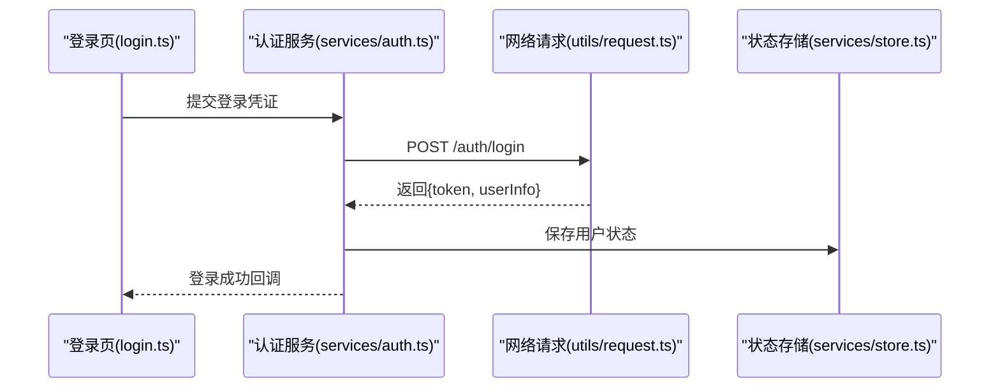

**图表来源** 
- [auth.ts](file://miniprogram/services/auth.ts)
- [request.ts](file://miniprogram/utils/request.ts)
- [store.ts](file://miniprogram/services/store.ts)
- [login.ts](file://miniprogram/pages/login/login.ts)

**章节来源**
- [auth.ts](file://miniprogram/services/auth.ts)
- [login.ts](file://miniprogram/pages/login/login.ts)

### 业务服务：桌游（services/boardGame.ts）
- 职责
  - 游戏列表/详情查询、搜索过滤、推荐
  - 缓存策略：列表页开启短时缓存，详情页按需缓存
  - 错误处理：网络异常、业务错误码映射、用户提示
- 数据流
  - 页面调用 → 服务封装 → 网络请求 → 缓存读写 → 状态更新

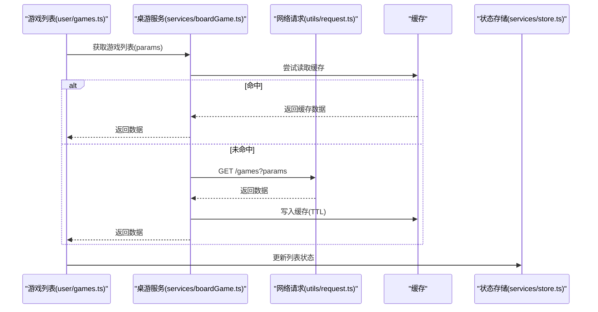

**图表来源** 
- [boardGame.ts](file://miniprogram/services/boardGame.ts)
- [request.ts](file://miniprogram/utils/request.ts)
- [store.ts](file://miniprogram/services/store.ts)
- [games.ts](file://miniprogram/pages/user/games/games.ts)

**章节来源**
- [boardGame.ts](file://miniprogram/services/boardGame.ts)
- [games.ts](file://miniprogram/pages/user/games/games.ts)

### 业务服务：订单（services/order.ts）
- 职责
  - 创建预约、查询订单、取消/修改预约
  - 幂等性：通过唯一请求ID避免重复提交
  - 乐观锁：版本号或时间戳防止并发覆盖
- 数据流
  - 页面选择时间与座位 → 服务组装订单 → 网络提交 → 状态同步

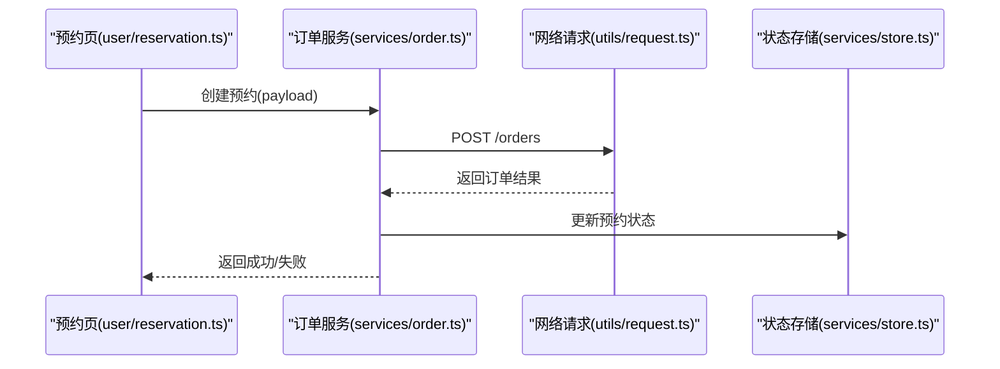

**图表来源** 
- [order.ts](file://miniprogram/services/order.ts)
- [request.ts](file://miniprogram/utils/request.ts)
- [store.ts](file://miniprogram/services/store.ts)
- [reservation.ts](file://miniprogram/pages/user/reservation/reservation.ts)

**章节来源**
- [order.ts](file://miniprogram/services/order.ts)
- [reservation.ts](file://miniprogram/pages/user/reservation/reservation.ts)

### 业务服务：空间（services/space.ts）
- 职责
  - 空间列表、房间状态、容量与可用性查询
  - 与订单服务联动，确保资源一致性
- 数据流
  - 后台工作台查询空间 → 服务封装 → 网络请求 → 状态更新

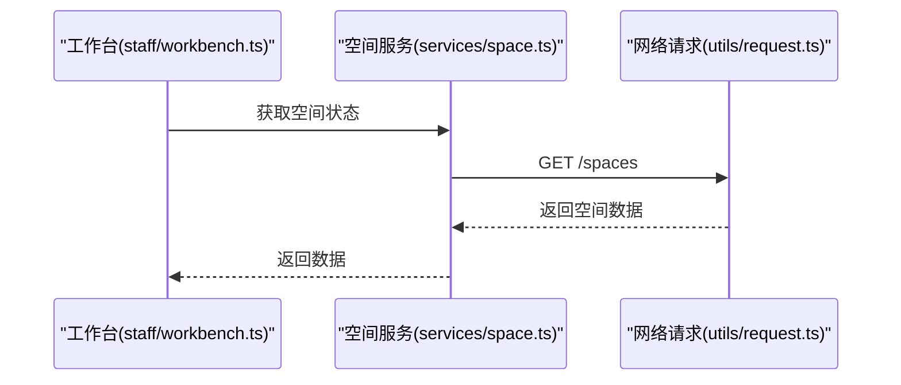

**图表来源** 
- [space.ts](file://miniprogram/services/space.ts)
- [request.ts](file://miniprogram/utils/request.ts)
- [workbench.ts](file://miniprogram/pages/staff/workbench/workbench.ts)

**章节来源**
- [space.ts](file://miniprogram/services/space.ts)
- [workbench.ts](file://miniprogram/pages/staff/workbench/workbench.ts)

### 状态存储（services/store.ts）
- 职责
  - 集中式状态管理：用户信息、权限、缓存开关、全局提示
  - 订阅/发布：组件订阅状态变化，实现最小化重渲染
  - 持久化：关键状态落盘，保证重启恢复
- 状态转换示例（登录态）

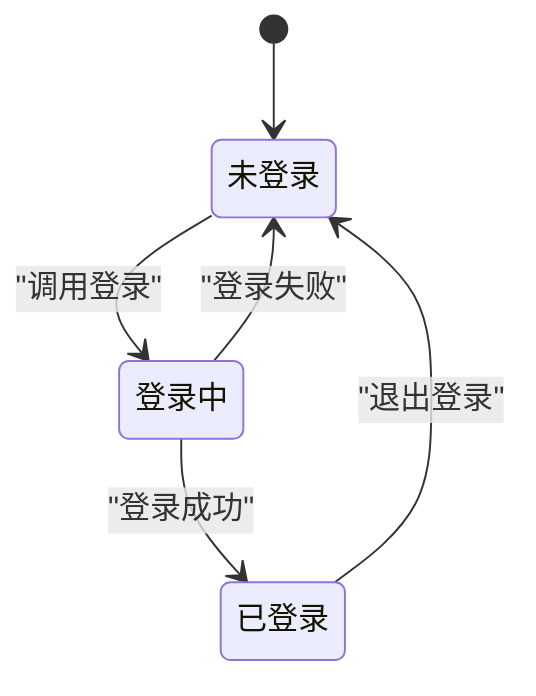

**图表来源** 
- [store.ts](file://miniprogram/services/store.ts)

**章节来源**
- [store.ts](file://miniprogram/services/store.ts)

### 页面层数据流示例
- 游戏详情（user/game-detail.ts）
  - 从路由参数解析游戏ID → 调用桌游服务 → 缓存优先 → 更新详情状态
- 预约管理（staff/reservation-mgmt.ts）
  - 拉取预约列表 → 筛选/分页 → 批量操作（确认/取消）→ 状态同步

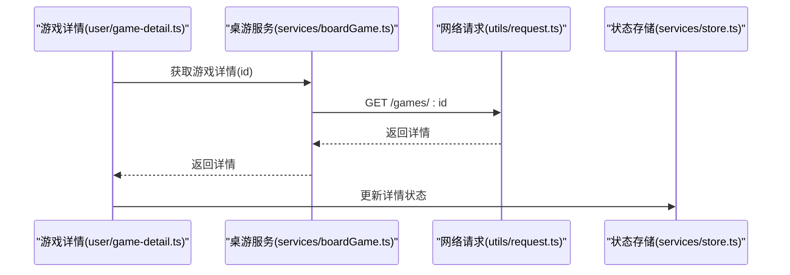

**图表来源** 
- [game-detail.ts](file://miniprogram/pages/user/game-detail/game-detail.ts)
- [boardGame.ts](file://miniprogram/services/boardGame.ts)
- [request.ts](file://miniprogram/utils/request.ts)
- [store.ts](file://miniprogram/services/store.ts)

**章节来源**
- [game-detail.ts](file://miniprogram/pages/user/game-detail/game-detail.ts)

## 依赖关系分析
- 页面层依赖服务层，服务层依赖工具层与应用配置
- 服务层之间通过状态存储共享数据，避免直接耦合
- 网络层作为唯一出口，保证一致的错误处理与缓存策略

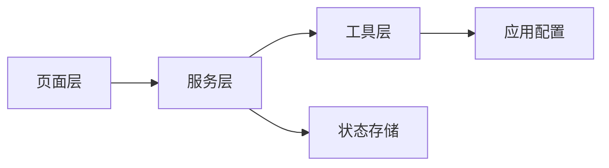

**图表来源** 
- [app.ts](file://miniprogram/app.ts)
- [config.ts](file://miniprogram/config.ts)
- [request.ts](file://miniprogram/utils/request.ts)
- [auth.ts](file://miniprogram/utils/auth.ts)
- [auth.ts](file://miniprogram/services/auth.ts)
- [boardGame.ts](file://miniprogram/services/boardGame.ts)
- [order.ts](file://miniprogram/services/order.ts)
- [space.ts](file://miniprogram/services/space.ts)
- [store.ts](file://miniprogram/services/store.ts)

**章节来源**
- [app.ts](file://miniprogram/app.ts)
- [config.ts](file://miniprogram/config.ts)

## 性能考量
- 缓存策略
  - GET请求启用短时缓存，合理设置TTL，避免频繁请求
  - 列表页分页加载，首屏优先，懒加载详情
- 请求优化
  - 合并重复请求（防抖/节流），减少网络抖动
  - 超时与重试：指数退避，限制最大重试次数
- 状态更新
  - 局部更新，避免全量重渲染
  - 大对象深拷贝谨慎使用，优先浅比较
- 内存管理
  - 及时释放无用订阅，避免内存泄漏
  - 图片与媒体资源按需加载

[本节为通用指导，不直接分析具体文件]

## 故障排查指南
- 常见问题定位
  - 网络错误：检查超时、重试、错误码映射与用户提示
  - 鉴权失败：确认Token有效期、刷新逻辑与静默登录
  - 缓存不一致：清理缓存键、强制刷新、对比服务端数据
  - 状态不同步：检查订阅/发布是否正确，是否存在竞态条件
- 调试建议
  - 开启请求日志与TraceId追踪
  - 在关键路径添加断点与埋点
  - 使用Mock数据隔离后端问题

**章节来源**
- [request.ts](file://miniprogram/utils/request.ts)
- [auth.ts](file://miniprogram/utils/auth.ts)
- [store.ts](file://miniprogram/services/store.ts)

## 结论
本数据流设计以“统一网络层 + 领域服务 + 轻量状态存储”为核心，实现了清晰的数据流向与良好的可维护性。通过缓存、鉴权、错误处理与状态管理的系统化设计，提升了用户体验与系统稳定性。后续可在以下方面持续优化：
- 引入更细粒度的缓存失效策略
- 增强请求去重与并发控制
- 完善监控与告警体系

[本节为总结性内容，不直接分析具体文件]

## 附录
- 数据验证规则
  - 前端基础校验：非空、格式、范围
  - 服务端权威校验：业务规则、权限、一致性
- 类型定义
  - 使用TypeScript定义请求/响应结构，确保类型安全
- 异步模式
  - 统一使用async/await，避免回调地狱
  - 异常捕获：try/catch包裹关键路径，兜底错误处理

[本节为补充说明，不直接分析具体文件]