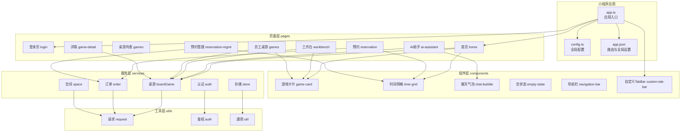
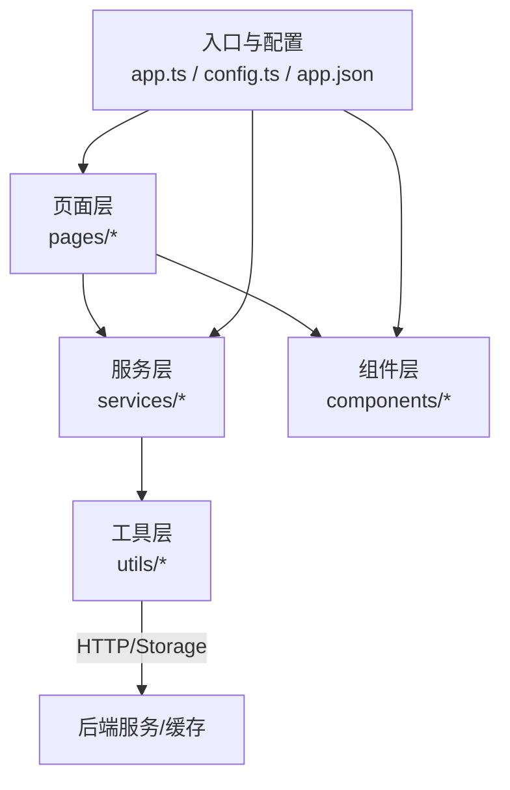
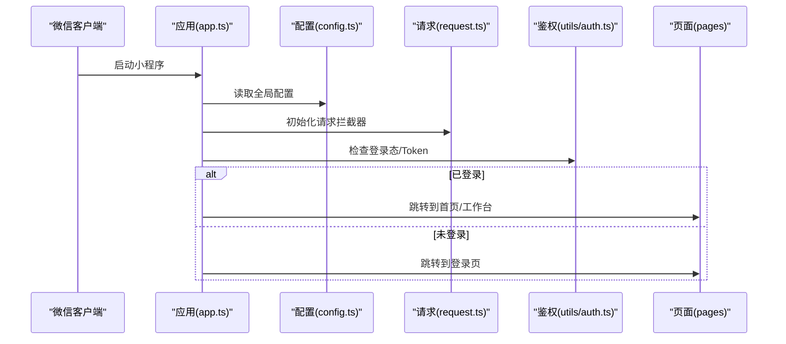
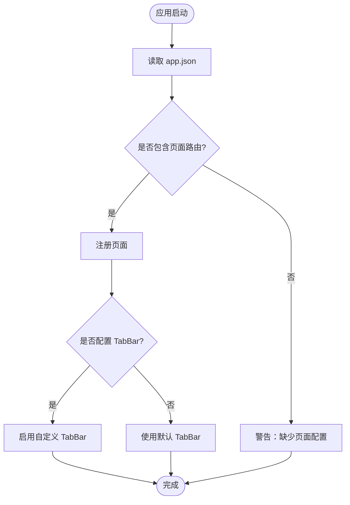
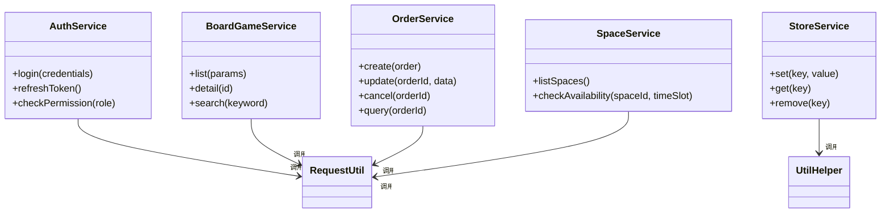
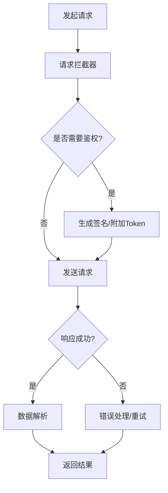
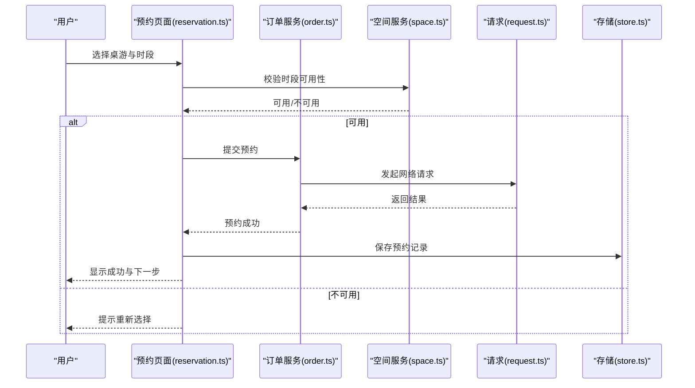
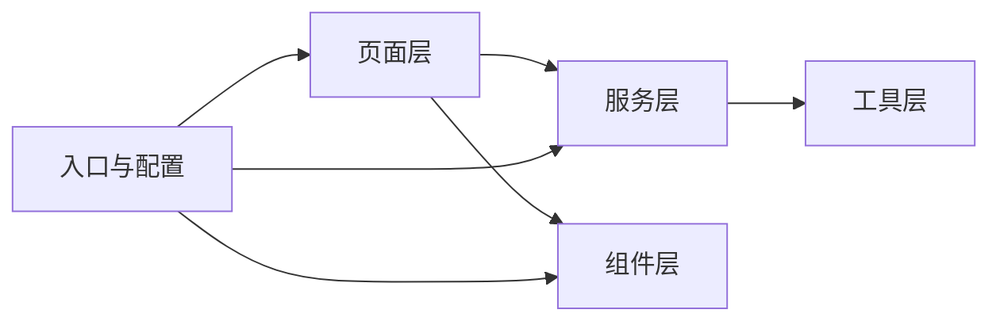

# 整体架构设计

<cite>
**本文引用的文件**   
- [app.ts](file://miniprogram/app.ts)
- [app.json](file://miniprogram/app.json)
- [config.ts](file://miniprogram/config.ts)
- [request.ts](file://miniprogram/utils/request.ts)
- [auth.ts](file://miniprogram/utils/auth.ts)
- [util.ts](file://miniprogram/utils/util.ts)
- [auth.ts](file://miniprogram/services/auth.ts)
- [boardGame.ts](file://miniprogram/services/boardGame.ts)
- [order.ts](file://miniprogram/services/order.ts)
- [space.ts](file://miniprogram/services/space.ts)
- [store.ts](file://miniprogram/services/store.ts)
- [variables.scss](file://miniprogram/styles/variables.scss)
- [game-card.ts](file://miniprogram/components/game-card/game-card.ts)
- [time-grid.ts](file://miniprogram/components/time-grid/time-grid.ts)
- [chat-bubble.ts](file://miniprogram/components/chat-bubble/chat-bubble.ts)
- [empty-state.ts](file://miniprogram/components/empty-state/empty-state.ts)
- [navigation-bar.ts](file://miniprogram/components/navigation-bar/navigation-bar.ts)
- [index.ts](file://miniprogram/custom-tab-bar/index.ts)
- [login.ts](file://miniprogram/pages/login/login.ts)
- [home.ts](file://miniprogram/pages/user/home/home.ts)
- [games.ts](file://miniprogram/pages/user/games/games.ts)
- [reservation.ts](file://miniprogram/pages/user/reservation/reservation.ts)
- [ai-assistant.ts](file://miniprogram/pages/user/ai-assistant/ai-assistant.ts)
- [workbench.ts](file://miniprogram/pages/staff/workbench/workbench.ts)
- [games.ts](file://miniprogram/pages/staff/games/games.ts)
- [reservation-mgmt.ts](file://miniprogram/pages/staff/reservation-mgmt/reservation-mgmt.ts)
- [game-detail.ts](file://miniprogram/pages/staff/game-detail/game-detail.ts)
- [tsconfig.json](file://tsconfig.json)
- [project.config.json](file://project.config.json)
</cite>

## 目录
1. [简介](#简介)
2. [项目结构](#项目结构)
3. [核心组件](#核心组件)
4. [架构总览](#架构总览)
5. [详细组件分析](#详细组件分析)
6. [依赖关系分析](#依赖关系分析)
7. [性能考量](#性能考量)
8. [故障排查指南](#故障排查指南)
9. [结论](#结论)
10. [附录](#附录)

## 简介
本文件面向“小程序桌面游戏预约系统”的整体架构设计，采用模块化+组件化架构模式与分层设计（页面层、服务层、工具层），目标是清晰划分职责、提升可维护性与可扩展性。文档重点包括：
- 小程序入口 app.ts 的配置与初始化流程
- app.json 的页面路由与全局设置
- 技术栈选择与协同方式（TypeScript、SCSS、微信小程序框架）
- 系统架构图与各层级数据流向
- 关键模块的职责边界与交互契约

## 项目结构
项目遵循微信小程序标准目录组织，结合模块化与服务化拆分：
- miniprogram/pages：按角色与功能划分的页面（用户端与员工端）
- miniprogram/components：可复用 UI 组件（游戏卡片、时间网格、聊天气泡、空状态、导航栏等）
- miniprogram/services：业务服务层（认证、桌游、订单、空间、本地存储）
- miniprogram/utils：通用工具（网络请求封装、鉴权工具、通用函数）
- miniprogram/styles：样式变量与全局样式
- miniprogram/custom-tab-bar：自定义底部 TabBar
- typings：类型定义
- 根级配置：tsconfig.json、project.config.json、package.json



图表来源 
- [app.ts](file://miniprogram/app.ts)
- [app.json](file://miniprogram/app.json)
- [config.ts](file://miniprogram/config.ts)
- [game-card.ts](file://miniprogram/components/game-card/game-card.ts)
- [time-grid.ts](file://miniprogram/components/time-grid/time-grid.ts)
- [chat-bubble.ts](file://miniprogram/components/chat-bubble/chat-bubble.ts)
- [empty-state.ts](file://miniprogram/components/empty-state/empty-state.ts)
- [navigation-bar.ts](file://miniprogram/components/navigation-bar/navigation-bar.ts)
- [index.ts](file://miniprogram/custom-tab-bar/index.ts)
- [auth.ts](file://miniprogram/services/auth.ts)
- [boardGame.ts](file://miniprogram/services/boardGame.ts)
- [order.ts](file://miniprogram/services/order.ts)
- [space.ts](file://miniprogram/services/space.ts)
- [store.ts](file://miniprogram/services/store.ts)
- [request.ts](file://miniprogram/utils/request.ts)
- [auth.ts](file://miniprogram/utils/auth.ts)
- [util.ts](file://miniprogram/utils/util.ts)

章节来源
- [app.ts](file://miniprogram/app.ts)
- [app.json](file://miniprogram/app.json)
- [config.ts](file://miniprogram/config.ts)
- [tsconfig.json](file://tsconfig.json)
- [project.config.json](file://project.config.json)

## 核心组件
- 应用入口与配置
  - app.ts：负责应用生命周期、全局状态初始化、权限检查与路由跳转策略
  - config.ts：集中管理接口域名、超时、重试、环境切换等配置
  - app.json：声明页面路由、窗口外观、TabBar、分包与插件等全局设置
- 服务层
  - auth.ts：登录态管理、Token 获取与刷新、权限校验
  - boardGame.ts：桌游信息获取、详情查询、搜索与筛选
  - order.ts：预约下单、改期、取消、状态查询
  - space.ts：场地/空间信息查询与可用性判断
  - store.ts：本地缓存封装（用户信息、偏好、临时数据）
- 工具层
  - request.ts：统一 HTTP 请求封装（拦截器、错误处理、重试、日志）
  - auth.ts：鉴权辅助（签名、时间戳、参数排序等）
  - util.ts：通用工具（日期格式化、ID生成、防抖节流等）
- 组件层
  - game-card：展示桌游封面、名称、评分、标签等
  - time-grid：时间段选择与冲突检测
  - chat-bubble：消息气泡渲染（用户/AI）
  - empty-state：无数据占位提示
  - navigation-bar：自定义导航栏（标题、返回、右侧操作）
- 自定义 TabBar
  - index.ts：控制底部 Tab 切换、徽标、选中态

章节来源
- [app.ts](file://miniprogram/app.ts)
- [config.ts](file://miniprogram/config.ts)
- [app.json](file://miniprogram/app.json)
- [auth.ts](file://miniprogram/services/auth.ts)
- [boardGame.ts](file://miniprogram/services/boardGame.ts)
- [order.ts](file://miniprogram/services/order.ts)
- [space.ts](file://miniprogram/services/space.ts)
- [store.ts](file://miniprogram/services/store.ts)
- [request.ts](file://miniprogram/utils/request.ts)
- [auth.ts](file://miniprogram/utils/auth.ts)
- [util.ts](file://miniprogram/utils/util.ts)
- [game-card.ts](file://miniprogram/components/game-card/game-card.ts)
- [time-grid.ts](file://miniprogram/components/time-grid/time-grid.ts)
- [chat-bubble.ts](file://miniprogram/components/chat-bubble/chat-bubble.ts)
- [empty-state.ts](file://miniprogram/components/empty-state/empty-state.ts)
- [navigation-bar.ts](file://miniprogram/components/navigation-bar/navigation-bar.ts)
- [index.ts](file://miniprogram/custom-tab-bar/index.ts)

## 架构总览
系统采用“模块化 + 组件化 + 分层”架构：
- 页面层（pages）：承载具体业务场景与用户交互，仅做视图与轻量逻辑编排
- 服务层（services）：聚合领域能力，屏蔽外部 API 差异，提供稳定接口
- 工具层（utils）：提供跨模块复用的基础设施（网络、鉴权、通用方法）
- 组件层（components）：UI 原子与复合组件，强调高内聚、低耦合
- 配置与入口（app.ts、config.ts、app.json）：统一入口、全局配置与路由治理



图表来源 
- [app.ts](file://miniprogram/app.ts)
- [config.ts](file://miniprogram/config.ts)
- [app.json](file://miniprogram/app.json)
- [request.ts](file://miniprogram/utils/request.ts)
- [store.ts](file://miniprogram/services/store.ts)

章节来源
- [app.ts](file://miniprogram/app.ts)
- [config.ts](file://miniprogram/config.ts)
- [app.json](file://miniprogram/app.json)

## 详细组件分析

### 应用入口与初始化流程（app.ts）
- 职责
  - 应用启动：注册全局配置、监听生命周期事件
  - 权限与环境：读取配置、初始化网络与鉴权、检查登录态
  - 路由策略：根据角色或状态决定初始页面
- 初始化关键点
  - 加载全局配置（config.ts）
  - 初始化请求拦截器（request.ts）
  - 校验登录态并决定跳转（如未登录则进入登录页）
  - 初始化 TabBar 与全局样式变量（variables.scss）



图表来源 
- [app.ts](file://miniprogram/app.ts)
- [config.ts](file://miniprogram/config.ts)
- [request.ts](file://miniprogram/utils/request.ts)
- [auth.ts](file://miniprogram/utils/auth.ts)

章节来源
- [app.ts](file://miniprogram/app.ts)
- [config.ts](file://miniprogram/config.ts)
- [request.ts](file://miniprogram/utils/request.ts)
- [auth.ts](file://miniprogram/utils/auth.ts)

### 页面路由与全局设置（app.json）
- 职责
  - 声明所有页面路径与窗口外观
  - 配置 TabBar、分包、插件、网络超时等
- 关键点
  - 页面路由：用户端与员工端页面分别注册
  - 全局样式与主题：引用 variables.scss
  - 自定义 TabBar：启用 custom-tab-bar



图表来源 
- [app.json](file://miniprogram/app.json)
- [index.ts](file://miniprogram/custom-tab-bar/index.ts)

章节来源
- [app.json](file://miniprogram/app.json)
- [index.ts](file://miniprogram/custom-tab-bar/index.ts)

### 服务层职责与协作（services/*）
- 认证服务（auth.ts）
  - 登录、获取 Token、刷新 Token、权限校验
  - 与工具层鉴权（utils/auth.ts）协作完成签名与校验
- 桌游服务（boardGame.ts）
  - 列表、详情、搜索、推荐等
  - 通过 request.ts 发起网络请求
- 订单服务（order.ts）
  - 创建预约、修改、取消、查询
  - 与空间服务（space.ts）协作校验时段可用性
- 空间服务（space.ts）
  - 查询空间、时段占用情况
- 存储服务（store.ts）
  - 封装本地缓存（用户信息、偏好、临时数据）



图表来源 
- [auth.ts](file://miniprogram/services/auth.ts)
- [boardGame.ts](file://miniprogram/services/boardGame.ts)
- [order.ts](file://miniprogram/services/order.ts)
- [space.ts](file://miniprogram/services/space.ts)
- [store.ts](file://miniprogram/services/store.ts)
- [request.ts](file://miniprogram/utils/request.ts)
- [util.ts](file://miniprogram/utils/util.ts)

章节来源
- [auth.ts](file://miniprogram/services/auth.ts)
- [boardGame.ts](file://miniprogram/services/boardGame.ts)
- [order.ts](file://miniprogram/services/order.ts)
- [space.ts](file://miniprogram/services/space.ts)
- [store.ts](file://miniprogram/services/store.ts)

### 工具层（utils/*）
- request.ts：统一请求封装
  - 拦截器：附加 Token、统一错误码处理、重试机制
  - 日志与埋点：记录请求耗时、失败原因
- auth.ts：鉴权辅助
  - 参数签名、时间戳、排序规则
- util.ts：通用工具
  - 日期格式化、ID 生成、防抖节流、深拷贝等



图表来源 
- [request.ts](file://miniprogram/utils/request.ts)
- [auth.ts](file://miniprogram/utils/auth.ts)
- [util.ts](file://miniprogram/utils/util.ts)

章节来源
- [request.ts](file://miniprogram/utils/request.ts)
- [auth.ts](file://miniprogram/utils/auth.ts)
- [util.ts](file://miniprogram/utils/util.ts)

### 组件层（components/*）
- game-card.ts：展示桌游基本信息，支持点击跳转详情
- time-grid.ts：时间段选择、冲突提示、多选/单选模式
- chat-bubble.ts：消息气泡渲染（用户/AI），支持滚动到底部
- empty-state.ts：无数据占位图与引导文案
- navigation-bar.ts：自定义导航栏，支持标题、返回、右侧按钮

```mermaid
classDiagram
class GameCard {
+props : { title, cover, tags, rating }
+onClick()
}
class TimeGrid {
+props : { slots, selected }
+onSelect(slot)
+validateConflict(slots)
}
class ChatBubble {
+props : { messages, role }
+scrollToBottom()
}
class EmptyState {
+props : { icon, text, action }
+onAction()
}
class NavBar {
+props : { title, showBack, rightActions }
+onBack()
+onRight(index)
}
```

图表来源 
- [game-card.ts](file://miniprogram/components/game-card/game-card.ts)
- [time-grid.ts](file://miniprogram/components/time-grid/time-grid.ts)
- [chat-bubble.ts](file://miniprogram/components/chat-bubble/chat-bubble.ts)
- [empty-state.ts](file://miniprogram/components/empty-state/empty-state.ts)
- [navigation-bar.ts](file://miniprogram/components/navigation-bar/navigation-bar.ts)

章节来源
- [game-card.ts](file://miniprogram/components/game-card/game-card.ts)
- [time-grid.ts](file://miniprogram/components/time-grid/time-grid.ts)
- [chat-bubble.ts](file://miniprogram/components/chat-bubble/chat-bubble.ts)
- [empty-state.ts](file://miniprogram/components/empty-state/empty-state.ts)
- [navigation-bar.ts](file://miniprogram/components/navigation-bar/navigation-bar.ts)

### 页面层（pages/*）
- 用户端
  - login.ts：登录流程、授权、跳转首页
  - home.ts：首页聚合（推荐、热门、活动）
  - games.ts：桌游列表、搜索、筛选
  - reservation.ts：预约流程（选时段、确认、支付）
  - ai-assistant.ts：AI 助手对话
- 员工端
  - workbench.ts：工作台概览（待办、统计）
  - games.ts：员工视角桌游管理
  - reservation-mgmt.ts：预约管理与调度
  - game-detail.ts：桌游详情编辑与发布



图表来源 
- [reservation.ts](file://miniprogram/pages/user/reservation/reservation.ts)
- [order.ts](file://miniprogram/services/order.ts)
- [space.ts](file://miniprogram/services/space.ts)
- [request.ts](file://miniprogram/utils/request.ts)
- [store.ts](file://miniprogram/services/store.ts)

章节来源
- [login.ts](file://miniprogram/pages/login/login.ts)
- [home.ts](file://miniprogram/pages/user/home/home.ts)
- [games.ts](file://miniprogram/pages/user/games/games.ts)
- [reservation.ts](file://miniprogram/pages/user/reservation/reservation.ts)
- [ai-assistant.ts](file://miniprogram/pages/user/ai-assistant/ai-assistant.ts)
- [workbench.ts](file://miniprogram/pages/staff/workbench/workbench.ts)
- [games.ts](file://miniprogram/pages/staff/games/games.ts)
- [reservation-mgmt.ts](file://miniprogram/pages/staff/reservation-mgmt/reservation-mgmt.ts)
- [game-detail.ts](file://miniprogram/pages/staff/game-detail/game-detail.ts)

## 依赖关系分析
- 页面层依赖服务层，服务层依赖工具层
- 组件层被页面层组合使用，不直接依赖服务层（通过 props 暴露数据）
- 工具层为横切关注点，被服务层与部分页面层复用
- 配置与入口贯穿全局，影响路由、网络、鉴权等行为



图表来源 
- [app.ts](file://miniprogram/app.ts)
- [config.ts](file://miniprogram/config.ts)
- [app.json](file://miniprogram/app.json)

章节来源
- [app.ts](file://miniprogram/app.ts)
- [config.ts](file://miniprogram/config.ts)
- [app.json](file://miniprogram/app.json)

## 性能考量
- 网络优化
  - 请求合并与去重（request.ts）
  - 合理分页与懒加载（games.ts、reservation.ts）
  - 图片资源压缩与 CDN 加速（建议）
- 渲染优化
  - 组件粒度拆分（components/*）减少重绘
  - 避免在 onShow/onLoad 中执行重型计算
- 存储优化
  - 本地缓存策略（store.ts）：过期时间、容量限制
- 包体优化
  - 分包加载（app.json）按需引入
  - 移除无用依赖与调试代码

[本节为通用指导，无需特定文件来源]

## 故障排查指南
- 登录失败
  - 检查 Token 有效性（utils/auth.ts）
  - 查看请求拦截器错误码（utils/request.ts）
  - 确认后端鉴权接口返回格式
- 预约失败
  - 校验时段可用性（services/space.ts）
  - 检查订单接口参数与签名（services/order.ts + utils/auth.ts）
  - 查看网络请求日志与重试次数（utils/request.ts）
- 页面白屏
  - 检查 app.json 路由配置是否正确（app.json）
  - 确认组件依赖与 props 传递（components/*）
- 样式异常
  - 检查 variables.scss 变量覆盖（styles/variables.scss）
  - 确认自定义 TabBar 样式冲突（custom-tab-bar/index.ts）

章节来源
- [auth.ts](file://miniprogram/utils/auth.ts)
- [request.ts](file://miniprogram/utils/request.ts)
- [space.ts](file://miniprogram/services/space.ts)
- [order.ts](file://miniprogram/services/order.ts)
- [app.json](file://miniprogram/app.json)
- [game-card.ts](file://miniprogram/components/game-card/game-card.ts)
- [time-grid.ts](file://miniprogram/components/time-grid/time-grid.ts)
- [chat-bubble.ts](file://miniprogram/components/chat-bubble/chat-bubble.ts)
- [empty-state.ts](file://miniprogram/components/empty-state/empty-state.ts)
- [navigation-bar.ts](file://miniprogram/components/navigation-bar/navigation-bar.ts)
- [index.ts](file://miniprogram/custom-tab-bar/index.ts)
- [variables.scss](file://miniprogram/styles/variables.scss)

## 结论
本系统以模块化+组件化为核心，配合分层架构明确职责边界：页面层专注交互编排，服务层聚合业务能力，工具层提供基础设施，组件层实现 UI 复用。通过统一的入口与配置（app.ts、config.ts、app.json），确保路由、网络、鉴权等行为一致可控。该架构具备良好的扩展性与可维护性，适合持续迭代与团队协作。

[本节为总结性内容，无需特定文件来源]

## 附录
- 技术栈选择与协同
  - TypeScript：类型安全、静态检查、IDE 智能提示，提升开发效率与质量
  - SCSS：样式模块化、变量复用、嵌套语法，便于主题与样式管理
  - 微信小程序框架：原生生态、性能优化、平台能力丰富
- 构建与类型
  - tsconfig.json：TypeScript 编译选项与路径映射
  - project.config.json：小程序项目配置（AppID、编译选项、插件等）

章节来源
- [tsconfig.json](file://tsconfig.json)
- [project.config.json](file://project.config.json)