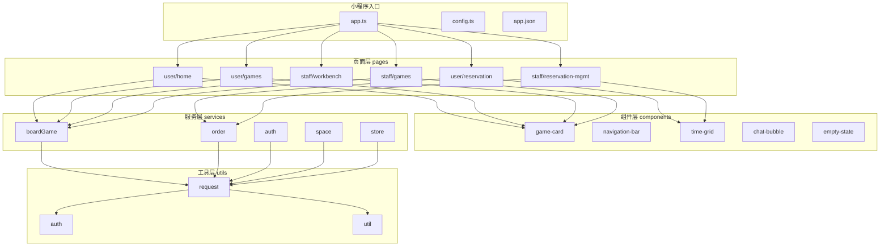
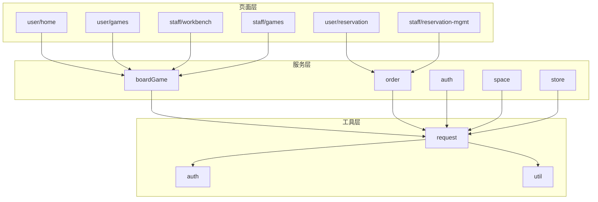
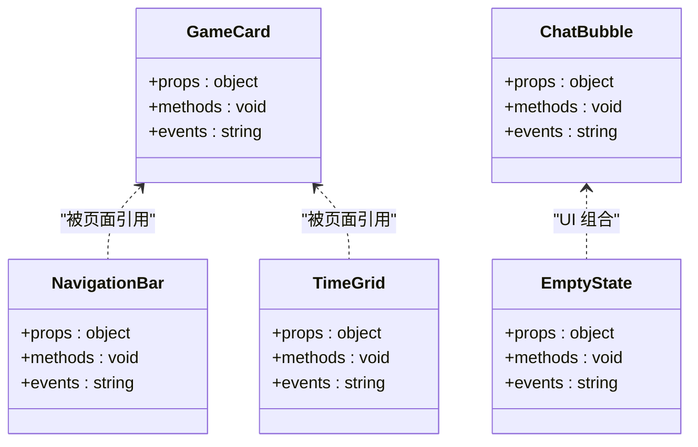
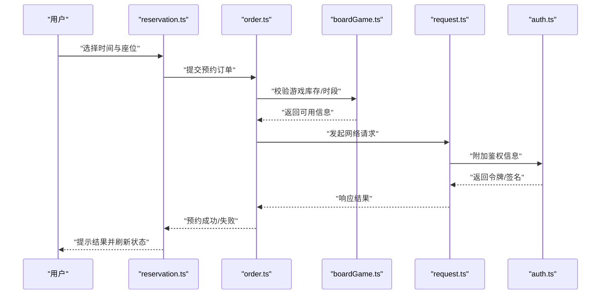
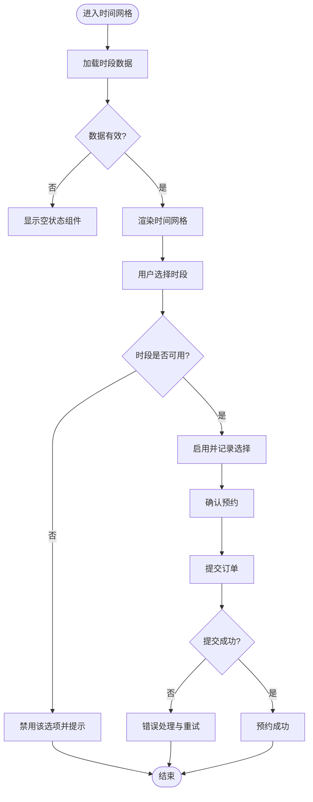

# 架构设计

<cite>
**本文引用的文件**   
- [app.ts](file://miniprogram/app.ts)
- [config.ts](file://miniprogram/config.ts)
- [app.json](file://miniprogram/app.json)
- [project.config.json](file://project.config.json)
- [tsconfig.json](file://tsconfig.json)
- [utils/request.ts](file://miniprogram/utils/request.ts)
- [utils/auth.ts](file://miniprogram/utils/auth.ts)
- [utils/util.ts](file://miniprogram/utils/util.ts)
- [services/auth.ts](file://miniprogram/services/auth.ts)
- [services/boardGame.ts](file://miniprogram/services/boardGame.ts)
- [services/order.ts](file://miniprogram/services/order.ts)
- [services/space.ts](file://miniprogram/services/space.ts)
- [services/store.ts](file://miniprogram/services/store.ts)
- [components/game-card/game-card.ts](file://miniprogram/components/game-card/game-card.ts)
- [components/navigation-bar/navigation-bar.ts](file://miniprogram/components/navigation-bar/navigation-bar.ts)
- [components/time-grid/time-grid.ts](file://miniprogram/components/time-grid/time-grid.ts)
- [components/chat-bubble/chat-bubble.ts](file://miniprogram/components/chat-bubble/chat-bubble.ts)
- [components/empty-state/empty-state.ts](file://miniprogram/components/empty-state/empty-state.ts)
- [pages/user/home/home.ts](file://miniprogram/pages/user/home/home.ts)
- [pages/user/games/games.ts](file://miniprogram/pages/user/games/games.ts)
- [pages/user/reservation/reservation.ts](file://miniprogram/pages/user/reservation/reservation.ts)
- [pages/staff/workbench/workbench.ts](file://miniprogram/pages/staff/workbench/workbench.ts)
- [pages/staff/games/games.ts](file://miniprogram/pages/staff/games/games.ts)
- [pages/staff/reservation-mgmt/reservation-mgmt.ts](file://miniprogram/pages/staff/reservation-mgmt/reservation-mgmt.ts)
</cite>

## 目录
1. [简介](#简介)
2. [项目结构](#项目结构)
3. [核心组件](#核心组件)
4. [架构总览](#架构总览)
5. [详细组件分析](#详细组件分析)
6. [依赖关系分析](#依赖关系分析)
7. [性能考量](#性能考量)
8. [故障排查指南](#故障排查指南)
9. [结论](#结论)
10. [附录](#附录)

## 简介
本文件为“小程序桌面游戏预约系统”的架构设计文档。系统采用模块化与组件化相结合的设计，遵循分层架构（页面层、服务层、工具层），通过清晰的职责边界与数据流向，实现用户端与员工端的预约、游戏管理、工作台等核心能力。本文档重点阐述：
- 整体架构模式与分层设计
- 数据流向与组件交互关系
- 技术选型的原因与权衡（TypeScript、SCSS 预处理器等）
- 系统边界、模块职责划分与扩展点设计
- 架构图与数据流图，帮助开发者快速理解系统设计思路

## 项目结构
项目基于微信小程序工程组织，关键目录与职责如下：
- miniprogram/pages：页面层，按角色（user、staff）与功能域（home、games、reservation、workbench 等）组织
- miniprogram/components：可复用组件（game-card、navigation-bar、time-grid、chat-bubble、empty-state）
- miniprogram/services：业务服务层，封装领域逻辑（auth、boardGame、order、space、store）
- miniprogram/utils：工具层，提供网络请求、鉴权、通用工具函数
- miniprogram/styles：全局样式变量与主题
- typings：TypeScript 类型定义（微信 API 与自定义类型）
- 根配置：app.json、project.config.json、tsconfig.json、config.ts、app.ts

**图表来源** 
- [app.ts](file://miniprogram/app.ts)
- [config.ts](file://miniprogram/config.ts)
- [app.json](file://miniprogram/app.json)
- [utils/request.ts](file://miniprogram/utils/request.ts)
- [utils/auth.ts](file://miniprogram/utils/auth.ts)
- [utils/util.ts](file://miniprogram/utils/util.ts)
- [services/auth.ts](file://miniprogram/services/auth.ts)
- [services/boardGame.ts](file://miniprogram/services/boardGame.ts)
- [services/order.ts](file://miniprogram/services/order.ts)
- [services/space.ts](file://miniprogram/services/space.ts)
- [services/store.ts](file://miniprogram/services/store.ts)
- [components/game-card/game-card.ts](file://miniprogram/components/game-card/game-card.ts)
- [components/navigation-bar/navigation-bar.ts](file://miniprogram/components/navigation-bar/navigation-bar.ts)
- [components/time-grid/time-grid.ts](file://miniprogram/components/time-grid/time-grid.ts)
- [components/chat-bubble/chat-bubble.ts](file://miniprogram/components/chat-bubble/chat-bubble.ts)
- [components/empty-state/empty-state.ts](file://miniprogram/components/empty-state/empty-state.ts)
- [pages/user/home/home.ts](file://miniprogram/pages/user/home/home.ts)
- [pages/user/games/games.ts](file://miniprogram/pages/user/games/games.ts)
- [pages/user/reservation/reservation.ts](file://miniprogram/pages/user/reservation/reservation.ts)
- [pages/staff/workbench/workbench.ts](file://miniprogram/pages/staff/workbench/workbench.ts)
- [pages/staff/games/games.ts](file://miniprogram/pages/staff/games/games.ts)
- [pages/staff/reservation-mgmt/reservation-mgmt.ts](file://miniprogram/pages/staff/reservation-mgmt/reservation-mgmt.ts)

**章节来源**
- [app.ts](file://miniprogram/app.ts)
- [config.ts](file://miniprogram/config.ts)
- [app.json](file://miniprogram/app.json)
- [project.config.json](file://project.config.json)
- [tsconfig.json](file://tsconfig.json)

## 核心组件
- 游戏卡片（game-card）：展示游戏基本信息与状态，供列表页与详情页复用
- 导航栏（navigation-bar）：统一顶部导航行为与样式
- 时间网格（time-grid）：渲染时间段选择与占用状态
- 聊天气泡（chat-bubble）：用于 AI 助手对话展示
- 空状态（empty-state）：无数据时的占位提示

这些组件以 TypeScript 编写，配合 SCSS 样式，具备高内聚、低耦合特性，便于在多个页面中复用。

**章节来源**
- [components/game-card/game-card.ts](file://miniprogram/components/game-card/game-card.ts)
- [components/navigation-bar/navigation-bar.ts](file://miniprogram/components/navigation-bar/navigation-bar.ts)
- [components/time-grid/time-grid.ts](file://miniprogram/components/time-grid/time-grid.ts)
- [components/chat-bubble/chat-bubble.ts](file://miniprogram/components/chat-bubble/chat-bubble.ts)
- [components/empty-state/empty-state.ts](file://miniprogram/components/empty-state/empty-state.ts)

## 架构总览
系统采用“模块化 + 组件化”的整体架构，结合“页面层 - 服务层 - 工具层”的分层设计：
- 页面层：负责路由、视图渲染与用户交互，调用服务层获取数据并驱动 UI
- 服务层：封装领域逻辑与外部接口，聚合工具层能力，向上暴露稳定的 API
- 工具层：提供网络请求、鉴权、通用工具函数，屏蔽平台差异与细节

**图表来源** 
- [pages/user/home/home.ts](file://miniprogram/pages/user/home/home.ts)
- [pages/user/games/games.ts](file://miniprogram/pages/user/games/games.ts)
- [pages/user/reservation/reservation.ts](file://miniprogram/pages/user/reservation/reservation.ts)
- [pages/staff/workbench/workbench.ts](file://miniprogram/pages/staff/workbench/workbench.ts)
- [pages/staff/games/games.ts](file://miniprogram/pages/staff/games/games.ts)
- [pages/staff/reservation-mgmt/reservation-mgmt.ts](file://miniprogram/pages/staff/reservation-mgmt/reservation-mgmt.ts)
- [services/auth.ts](file://miniprogram/services/auth.ts)
- [services/boardGame.ts](file://miniprogram/services/boardGame.ts)
- [services/order.ts](file://miniprogram/services/order.ts)
- [services/space.ts](file://miniprogram/services/space.ts)
- [services/store.ts](file://miniprogram/services/store.ts)
- [utils/request.ts](file://miniprogram/utils/request.ts)
- [utils/auth.ts](file://miniprogram/utils/auth.ts)
- [utils/util.ts](file://miniprogram/utils/util.ts)

## 详细组件分析

### 组件类图（示例：game-card、navigation-bar、time-grid）

**图表来源** 
- [components/game-card/game-card.ts](file://miniprogram/components/game-card/game-card.ts)
- [components/navigation-bar/navigation-bar.ts](file://miniprogram/components/navigation-bar/navigation-bar.ts)
- [components/time-grid/time-grid.ts](file://miniprogram/components/time-grid/time-grid.ts)
- [components/chat-bubble/chat-bubble.ts](file://miniprogram/components/chat-bubble/chat-bubble.ts)
- [components/empty-state/empty-state.ts](file://miniprogram/components/empty-state/empty-state.ts)

**章节来源**
- [components/game-card/game-card.ts](file://miniprogram/components/game-card/game-card.ts)
- [components/navigation-bar/navigation-bar.ts](file://miniprogram/components/navigation-bar/navigation-bar.ts)
- [components/time-grid/time-grid.ts](file://miniprogram/components/time-grid/time-grid.ts)
- [components/chat-bubble/chat-bubble.ts](file://miniprogram/components/chat-bubble/chat-bubble.ts)
- [components/empty-state/empty-state.ts](file://miniprogram/components/empty-state/empty-state.ts)

### API 调用时序（用户预约流程）

**图表来源** 
- [pages/user/reservation/reservation.ts](file://miniprogram/pages/user/reservation/reservation.ts)
- [services/order.ts](file://miniprogram/services/order.ts)
- [services/boardGame.ts](file://miniprogram/services/boardGame.ts)
- [utils/request.ts](file://miniprogram/utils/request.ts)
- [utils/auth.ts](file://miniprogram/utils/auth.ts)

**章节来源**
- [pages/user/reservation/reservation.ts](file://miniprogram/pages/user/reservation/reservation.ts)
- [services/order.ts](file://miniprogram/services/order.ts)
- [services/boardGame.ts](file://miniprogram/services/boardGame.ts)
- [utils/request.ts](file://miniprogram/utils/request.ts)
- [utils/auth.ts](file://miniprogram/utils/auth.ts)

### 复杂逻辑流程图（时间网格选择与可用性校验）

**图表来源** 
- [components/time-grid/time-grid.ts](file://miniprogram/components/time-grid/time-grid.ts)
- [services/boardGame.ts](file://miniprogram/services/boardGame.ts)
- [services/order.ts](file://miniprogram/services/order.ts)
- [components/empty-state/empty-state.ts](file://miniprogram/components/empty-state/empty-state.ts)

**章节来源**
- [components/time-grid/time-grid.ts](file://miniprogram/components/time-grid/time-grid.ts)
- [services/boardGame.ts](file://miniprogram/services/boardGame.ts)
- [services/order.ts](file://miniprogram/services/order.ts)
- [components/empty-state/empty-state.ts](file://miniprogram/components/empty-state/empty-state.ts)

## 依赖关系分析
- 页面层依赖服务层：各页面通过 services 获取数据与执行操作，避免直接访问网络或存储
- 服务层依赖工具层：统一使用 request 进行网络请求，auth 进行鉴权，util 提供通用方法
- 组件层相对独立：组件仅依赖 props/events 与少量工具函数，保持高内聚与可测试性

**图表来源** 
- [pages/user/home/home.ts](file://miniprogram/pages/user/home/home.ts)
- [pages/user/games/games.ts](file://miniprogram/pages/user/games/games.ts)
- [pages/user/reservation/reservation.ts](file://miniprogram/pages/user/reservation/reservation.ts)
- [pages/staff/workbench/workbench.ts](file://miniprogram/pages/staff/workbench/workbench.ts)
- [pages/staff/games/games.ts](file://miniprogram/pages/staff/games/games.ts)
- [pages/staff/reservation-mgmt/reservation-mgmt.ts](file://miniprogram/pages/staff/reservation-mgmt/reservation-mgmt.ts)
- [services/auth.ts](file://miniprogram/services/auth.ts)
- [services/boardGame.ts](file://miniprogram/services/boardGame.ts)
- [services/order.ts](file://miniprogram/services/order.ts)
- [services/space.ts](file://miniprogram/services/space.ts)
- [services/store.ts](file://miniprogram/services/store.ts)
- [utils/request.ts](file://miniprogram/utils/request.ts)
- [utils/auth.ts](file://miniprogram/utils/auth.ts)
- [utils/util.ts](file://miniprogram/utils/util.ts)

**章节来源**
- [utils/request.ts](file://miniprogram/utils/request.ts)
- [utils/auth.ts](file://miniprogram/utils/auth.ts)
- [utils/util.ts](file://miniprogram/utils/util.ts)
- [services/auth.ts](file://miniprogram/services/auth.ts)
- [services/boardGame.ts](file://miniprogram/services/boardGame.ts)
- [services/order.ts](file://miniprogram/services/order.ts)
- [services/space.ts](file://miniprogram/services/space.ts)
- [services/store.ts](file://miniprogram/services/store.ts)

## 性能考量
- 网络请求优化：在工具层集中处理请求拦截、缓存策略与重试机制，减少重复请求与无效传输
- 组件渲染优化：将频繁更新的数据下沉至服务层，页面按需订阅，避免不必要的重渲染
- 资源加载优化：按需引入组件与页面，利用小程序分包与懒加载机制降低首屏体积
- 样式与主题：通过 SCSS 变量统一管理主题与尺寸，减少重复样式计算与编译开销

[本节为通用指导，不直接分析具体文件]

## 故障排查指南
- 网络异常：检查 request 工具的拦截器与错误码映射，确认鉴权令牌是否过期
- 鉴权失败：核对 auth 工具中的令牌获取与刷新逻辑，确保服务端会话一致
- 数据为空：优先查看 empty-state 组件的触发条件，确认服务层数据源与分页参数
- 预约失败：定位 order 与 boardGame 服务的校验逻辑，检查时段冲突与库存不足原因

**章节来源**
- [utils/request.ts](file://miniprogram/utils/request.ts)
- [utils/auth.ts](file://miniprogram/utils/auth.ts)
- [services/order.ts](file://miniprogram/services/order.ts)
- [services/boardGame.ts](file://miniprogram/services/boardGame.ts)
- [components/empty-state/empty-state.ts](file://miniprogram/components/empty-state/empty-state.ts)

## 结论
本系统通过“模块化 + 组件化”与“页面层 - 服务层 - 工具层”的分层设计，实现了清晰的责任边界与良好的可扩展性。TypeScript 提供了强类型约束与更好的开发体验，SCSS 提升了样式维护效率。未来可在服务层进一步抽象领域模型，增强缓存与离线能力，并在组件层引入更多可复用的业务组件以提升开发效率。

[本节为总结性内容，不直接分析具体文件]

## 附录
- 技术选型说明
  - TypeScript：提升代码健壮性与可维护性，便于团队协作与重构
  - SCSS：支持变量、混入与嵌套，提高样式的一致性与可复用性
  - 小程序原生框架：充分利用平台能力与生态，保证兼容性与性能
- 系统边界
  - 内部边界：页面与服务、服务与工具之间的接口契约明确，组件间通过 props/events 通信
  - 外部边界：通过 request 工具统一对外部 API 的访问，便于替换与扩展

[本节为补充信息，不直接分析具体文件]