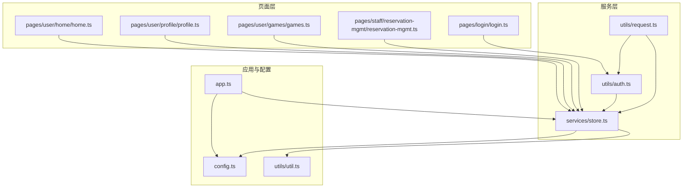
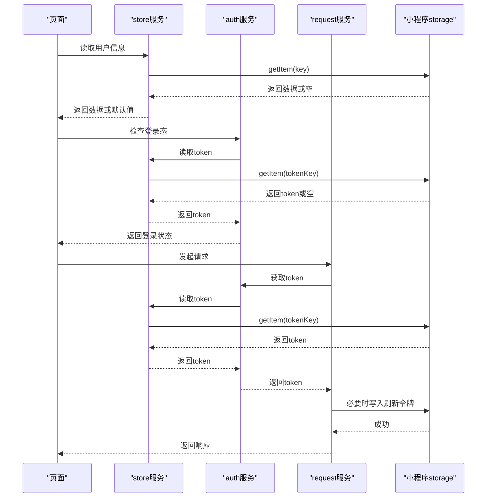
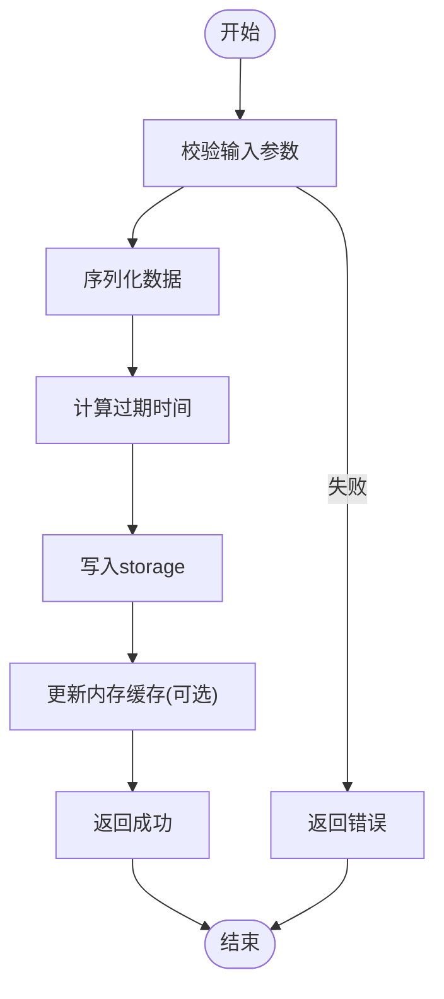
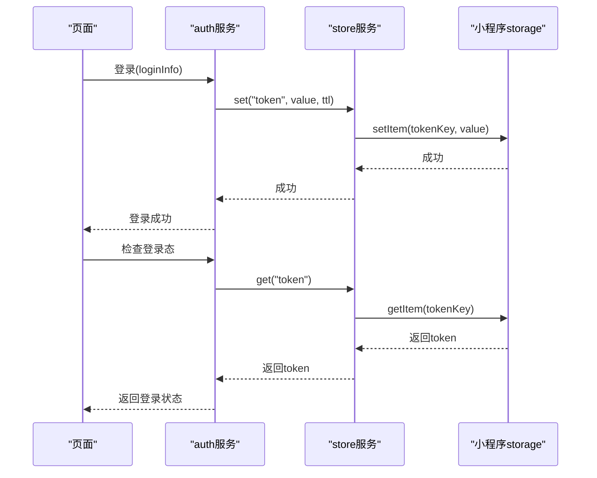
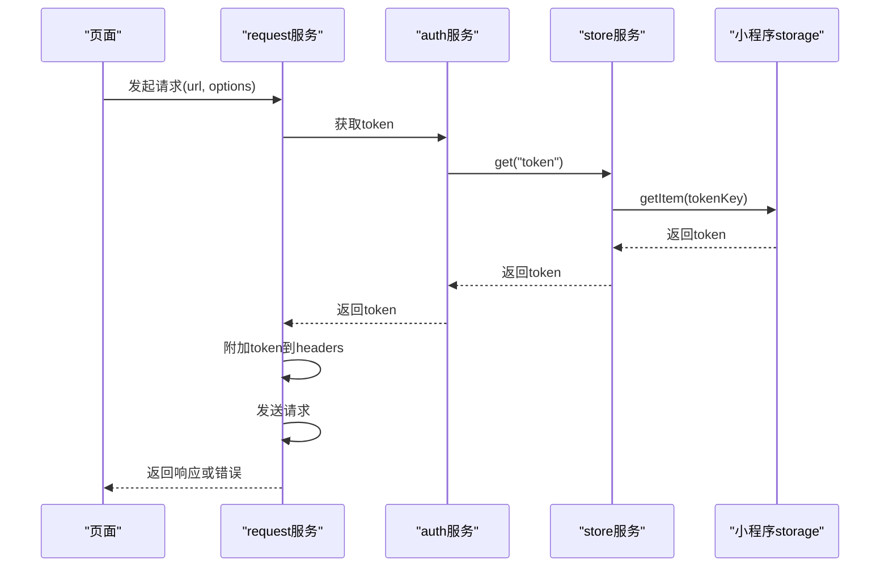
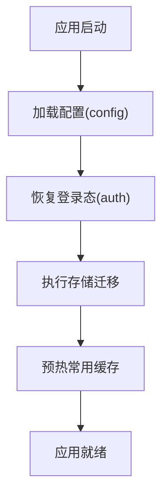
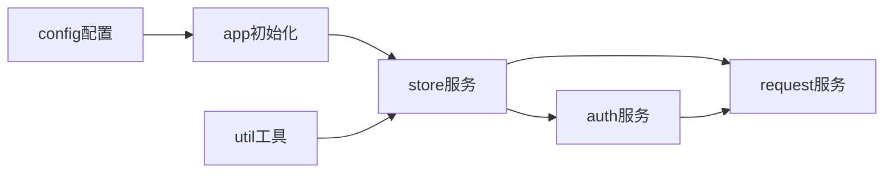

# 存储模块

<cite>
**本文引用的文件**   
- [store.ts](file://miniprogram/services/store.ts)
- [app.ts](file://miniprogram/app.ts)
- [config.ts](file://miniprogram/config.ts)
- [auth.ts](file://miniprogram/utils/auth.ts)
- [request.ts](file://miniprogram/utils/request.ts)
- [util.ts](file://miniprogram/utils/util.ts)
- [login.ts](file://miniprogram/pages/login/login.ts)
- [home.ts](file://miniprogram/pages/user/home/home.ts)
- [profile.ts](file://miniprogram/pages/user/profile/profile.ts)
- [games.ts](file://miniprogram/pages/user/games/games.ts)
- [reservation-mgmt.ts](file://miniprogram/pages/staff/reservation-mgmt/reservation-mgmt.ts)
</cite>

## 目录
1. [简介](#简介)
2. [项目结构](#项目结构)
3. [核心组件](#核心组件)
4. [架构总览](#架构总览)
5. [详细组件分析](#详细组件分析)
6. [依赖分析](#依赖分析)
7. [性能考虑](#性能考虑)
8. [故障排查指南](#故障排查指南)
9. [结论](#结论)
10. [附录](#附录)

## 简介
本文件为小程序“存储模块”的完整技术文档，聚焦本地存储策略、数据持久化方案与缓存管理机制。围绕 store 服务层的数据结构设计（用户信息缓存、配置数据存储、临时数据管理等），系统说明对小程序原生 storage API 的封装与使用方式，并给出数据同步策略、存储容量管理与数据清理机制的实现建议。同时提供存储性能优化建议与最佳实践，帮助开发者在复杂业务场景下构建稳定高效的本地存储体系。

## 项目结构
存储相关能力主要分布在以下位置：
- services/store.ts：统一存储抽象与服务层入口，负责 key 管理、读写封装、过期策略、批量操作等。
- app.ts：应用生命周期中初始化全局配置、登录态恢复、存储版本迁移等。
- config.ts：全局配置常量（如存储命名空间、过期时间默认值、容量阈值等）。
- utils/auth.ts：登录态与鉴权相关的本地存储读写（token、用户信息等）。
- utils/request.ts：网络请求拦截器，结合本地存储进行 token 注入、刷新与错误处理。
- utils/util.ts：通用工具函数（序列化/反序列化、时间戳、随机ID等）。
- pages/*：页面层通过 store 或 auth 等模块访问本地存储，完成登录、个人资料、游戏列表等数据的展示与更新。

图表来源
- [store.ts](file://miniprogram/services/store.ts)
- [app.ts](file://miniprogram/app.ts)
- [config.ts](file://miniprogram/config.ts)
- [auth.ts](file://miniprogram/utils/auth.ts)
- [request.ts](file://miniprogram/utils/request.ts)
- [util.ts](file://miniprogram/utils/util.ts)
- [login.ts](file://miniprogram/pages/login/login.ts)
- [home.ts](file://miniprogram/pages/user/home/home.ts)
- [profile.ts](file://miniprogram/pages/user/profile/profile.ts)
- [games.ts](file://miniprogram/pages/user/games/games.ts)
- [reservation-mgmt.ts](file://miniprogram/pages/staff/reservation-mgmt/reservation-mgmt.ts)

章节来源
- [store.ts](file://miniprogram/services/store.ts)
- [app.ts](file://miniprogram/app.ts)
- [config.ts](file://miniprogram/config.ts)
- [auth.ts](file://miniprogram/utils/auth.ts)
- [request.ts](file://miniprogram/utils/request.ts)
- [util.ts](file://miniprogram/utils/util.ts)
- [login.ts](file://miniprogram/pages/login/login.ts)
- [home.ts](file://miniprogram/pages/user/home/home.ts)
- [profile.ts](file://miniprogram/pages/user/profile/profile.ts)
- [games.ts](file://miniprogram/pages/user/games/games.ts)
- [reservation-mgmt.ts](file://miniprogram/pages/staff/reservation-mgmt/reservation-mgmt.ts)

## 核心组件
- 存储抽象服务（store）
  - 职责：统一封装小程序 storage API，提供 get/set/remove/clear、批量操作、过期控制、命名空间隔离、异步队列与重试、容量估算与清理等能力。
  - 关键设计：
    - Key 命名规范：命名空间 + 业务键 + 版本号/时间戳，避免冲突。
    - 数据结构：支持对象、数组、字符串、数字、布尔等基础类型；复杂对象需序列化。
    - 过期策略：可选 TTL（秒），读取时自动判断是否过期。
    - 并发控制：写入串行化，避免竞态条件。
    - 错误处理：捕获异常并降级到内存缓存或返回默认值。
- 登录态与鉴权（auth）
  - 职责：维护登录态、token、用户基本信息；提供登录、登出、刷新、校验等接口。
  - 存储项：token、用户信息、登录时间、过期时间、刷新令牌等。
- 网络请求（request）
  - 职责：统一发起 HTTP 请求，自动附加 token、处理 401/403、触发刷新流程、记录错误日志。
  - 与存储联动：从 store 获取/更新 token，失败时清理无效数据。
- 应用初始化（app）
  - 职责：启动时加载配置、恢复登录态、执行存储版本迁移、预热常用缓存。
- 配置（config）
  - 职责：集中定义存储命名空间、默认过期时间、容量阈值、功能开关等。
- 工具（util）
  - 职责：序列化/反序列化、时间戳转换、随机 ID、安全编码等。

章节来源
- [store.ts](file://miniprogram/services/store.ts)
- [auth.ts](file://miniprogram/utils/auth.ts)
- [request.ts](file://miniprogram/utils/request.ts)
- [app.ts](file://miniprogram/app.ts)
- [config.ts](file://miniprogram/config.ts)
- [util.ts](file://miniprogram/utils/util.ts)

## 架构总览
存储模块采用“服务层抽象 + 页面调用”的分层架构。页面层不直接操作原生 storage，而是通过 store 服务获取/设置数据；auth 与 request 作为横切关注点，与 store 协作完成鉴权与网络请求。app 在启动阶段完成环境初始化与数据恢复。

图表来源
- [store.ts](file://miniprogram/services/store.ts)
- [auth.ts](file://miniprogram/utils/auth.ts)
- [request.ts](file://miniprogram/utils/request.ts)
- [app.ts](file://miniprogram/app.ts)

## 详细组件分析

### 存储抽象服务（store）
- 设计要点
  - 命名空间隔离：按模块划分 key 前缀，避免冲突。
  - 数据类型兼容：统一序列化/反序列化，确保跨端一致性。
  - 过期控制：TTL 字段与读取时的有效性判断。
  - 批量操作：支持多 key 的批量写入/删除，减少 I/O 次数。
  - 容量管理：估算占用大小，超过阈值触发清理策略。
  - 异步队列：写入串行化，避免并发写导致的覆盖。
- 典型流程
  - 设置数据：校验参数 -> 序列化 -> 计算过期时间 -> 写入 storage -> 更新内存缓存（可选）-> 返回结果。
  - 读取数据：校验 key -> 读取 storage -> 判断过期 -> 返回数据或默认值。
  - 删除数据：校验 key -> 删除 storage -> 清理内存缓存。
  - 清理策略：按优先级（最近最少使用 LRU、过期优先、大对象优先）选择清理目标。

图表来源
- [store.ts](file://miniprogram/services/store.ts)
- [util.ts](file://miniprogram/utils/util.ts)

章节来源
- [store.ts](file://miniprogram/services/store.ts)
- [util.ts](file://miniprogram/utils/util.ts)

### 登录态与鉴权（auth）
- 职责
  - 登录：获取 token 与用户信息，写入 store。
  - 登出：清除 token 与敏感数据。
  - 刷新：当 token 过期时，使用刷新令牌换取新 token。
  - 校验：检查登录态与权限。
- 与 store 的交互
  - 读取/写入 token、用户信息、刷新令牌、登录时间等。
  - 利用 store 的过期策略保证 token 的有效性。

图表来源
- [auth.ts](file://miniprogram/utils/auth.ts)
- [store.ts](file://miniprogram/services/store.ts)

章节来源
- [auth.ts](file://miniprogram/utils/auth.ts)
- [store.ts](file://miniprogram/services/store.ts)

### 网络请求（request）
- 职责
  - 统一封装 fetch/axios 等请求库。
  - 自动附加 token、处理 401/403、触发刷新流程。
  - 错误上报与重试策略。
- 与 store 的交互
  - 读取 token 并注入请求头。
  - 刷新成功后更新 token 与用户信息。
  - 失败时清理无效缓存。

图表来源
- [request.ts](file://miniprogram/utils/request.ts)
- [auth.ts](file://miniprogram/utils/auth.ts)
- [store.ts](file://miniprogram/services/store.ts)

章节来源
- [request.ts](file://miniprogram/utils/request.ts)
- [auth.ts](file://miniprogram/utils/auth.ts)
- [store.ts](file://miniprogram/services/store.ts)

### 应用初始化（app）
- 职责
  - 加载全局配置（来自 config.ts）。
  - 恢复登录态与必要缓存。
  - 执行存储版本迁移（升级 key 格式、清理废弃数据）。
  - 预热常用缓存（如首页数据、用户偏好）。

图表来源
- [app.ts](file://miniprogram/app.ts)
- [config.ts](file://miniprogram/config.ts)
- [auth.ts](file://miniprogram/utils/auth.ts)
- [store.ts](file://miniprogram/services/store.ts)

章节来源
- [app.ts](file://miniprogram/app.ts)
- [config.ts](file://miniprogram/config.ts)
- [auth.ts](file://miniprogram/utils/auth.ts)
- [store.ts](file://miniprogram/services/store.ts)

### 页面层使用示例
- 登录页（login）
  - 调用 auth 登录，成功后由 store 持久化 token 与用户信息。
- 首页（home）
  - 从 store 读取用户信息与常用数据，展示个性化内容。
- 个人资料（profile）
  - 读取/更新用户资料，写入 store 并同步到后端。
- 游戏列表（games）
  - 缓存游戏列表与筛选条件，提升加载速度。
- 预约管理（reservation-mgmt）
  - 缓存预约数据与状态，支持离线查看。

章节来源
- [login.ts](file://miniprogram/pages/login/login.ts)
- [home.ts](file://miniprogram/pages/user/home/home.ts)
- [profile.ts](file://miniprogram/pages/user/profile/profile.ts)
- [games.ts](file://miniprogram/pages/user/games/games.ts)
- [reservation-mgmt.ts](file://miniprogram/pages/staff/reservation-mgmt/reservation-mgmt.ts)

## 依赖分析
- 组件耦合
  - store 是核心依赖，被 auth、request、页面层广泛使用。
  - auth 依赖 store 进行 token 与用户信息的持久化。
  - request 依赖 auth 与 store 以完成鉴权与缓存管理。
  - app 依赖 config 与 store 完成初始化与迁移。
- 外部依赖
  - 小程序原生 storage API（get/set/remove/clear）。
  - 网络请求库（如 wx.request 或 axios）。
- 潜在循环依赖
  - 避免 request 与 auth 相互直接调用，应通过 store 解耦。

图表来源
- [store.ts](file://miniprogram/services/store.ts)
- [auth.ts](file://miniprogram/utils/auth.ts)
- [request.ts](file://miniprogram/utils/request.ts)
- [app.ts](file://miniprogram/app.ts)
- [config.ts](file://miniprogram/config.ts)
- [util.ts](file://miniprogram/utils/util.ts)

章节来源
- [store.ts](file://miniprogram/services/store.ts)
- [auth.ts](file://miniprogram/utils/auth.ts)
- [request.ts](file://miniprogram/utils/request.ts)
- [app.ts](file://miniprogram/app.ts)
- [config.ts](file://miniprogram/config.ts)
- [util.ts](file://miniprogram/utils/util.ts)

## 性能考虑
- 读写合并
  - 批量写入减少 I/O 次数，降低阻塞。
  - 使用内存缓存热点数据，缩短读取路径。
- 序列化优化
  - 避免频繁 JSON 序列化/反序列化，必要时缓存解析结果。
  - 对大对象分片存储，按需加载。
- 过期策略
  - 合理设置 TTL，避免长期占用存储。
  - 定期清理过期数据，释放空间。
- 容量管理
  - 监控存储占用，超过阈值触发清理策略（LRU、过期优先、大对象优先）。
  - 限制单 key 大小，防止单个数据过大影响整体性能。
- 并发控制
  - 写入串行化，避免竞态条件导致数据不一致。
  - 读取可并行，但需注意内存占用。

[本节为通用指导，无需特定文件引用]

## 故障排查指南
- 常见问题
  - 读取不到数据：检查 key 命名是否正确、是否被清理、是否过期。
  - 写入失败：检查存储空间是否不足、序列化是否成功、是否有并发写冲突。
  - 登录态丢失：检查 token 是否过期、刷新流程是否正常、是否被清理。
  - 网络请求失败：检查 headers 是否包含有效 token、后端是否返回 401/403。
- 调试建议
  - 启用日志输出，记录 key、value、过期时间、错误堆栈。
  - 使用开发工具的存储面板检查实际存储内容与大小。
  - 模拟不同场景（存储空间不足、网络异常、token 过期）验证容错逻辑。

章节来源
- [store.ts](file://miniprogram/services/store.ts)
- [auth.ts](file://miniprogram/utils/auth.ts)
- [request.ts](file://miniprogram/utils/request.ts)

## 结论
存储模块通过统一的 store 服务抽象了小程序原生 storage API，提供了健壮的本地持久化与缓存管理能力。结合 auth 与 request 的协作，实现了登录态管理、网络请求鉴权与错误处理。通过合理的过期策略、容量管理与并发控制，确保了系统在复杂业务场景下的稳定性与性能。建议在实际使用中遵循本文的最佳实践，持续监控存储占用与性能指标，及时优化与迭代。

[本节为总结性内容，无需特定文件引用]

## 附录
- 最佳实践清单
  - 统一 key 命名规范，使用命名空间隔离。
  - 设置合理的 TTL，避免长期占用存储。
  - 批量写入与读取，减少 I/O 次数。
  - 使用内存缓存热点数据，提升读取性能。
  - 监控存储占用，超过阈值触发清理策略。
  - 写入串行化，避免竞态条件。
  - 完善错误处理与日志记录，便于问题定位。
  - 定期执行存储迁移，清理废弃数据。

[本节为通用指导，无需特定文件引用]