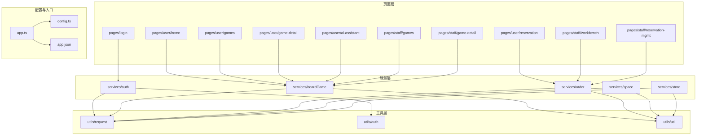
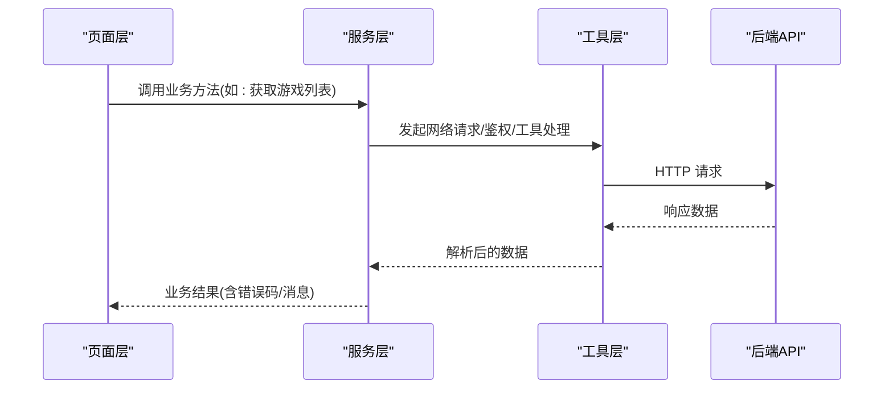
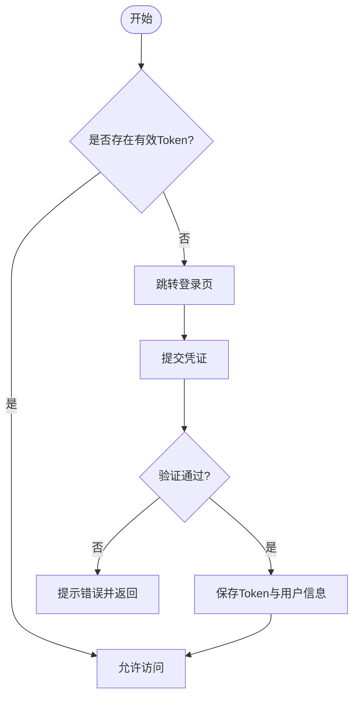
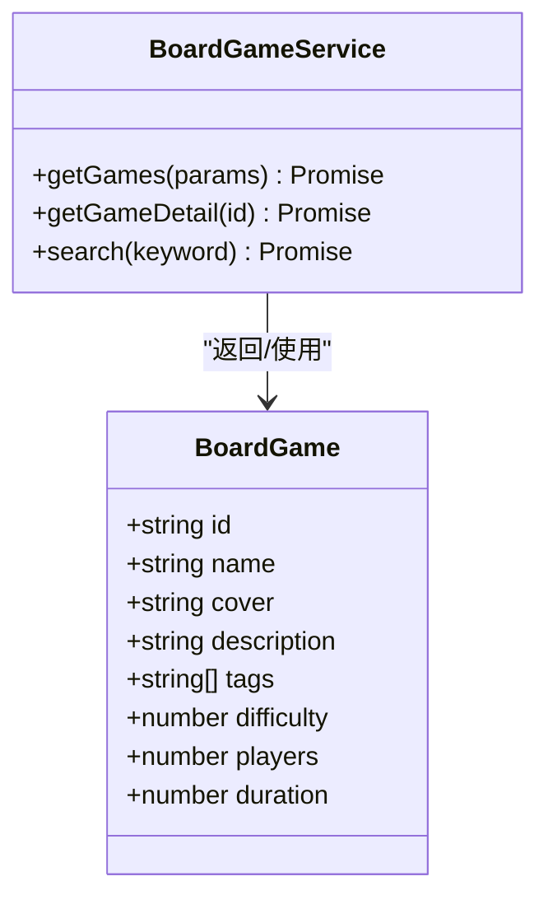
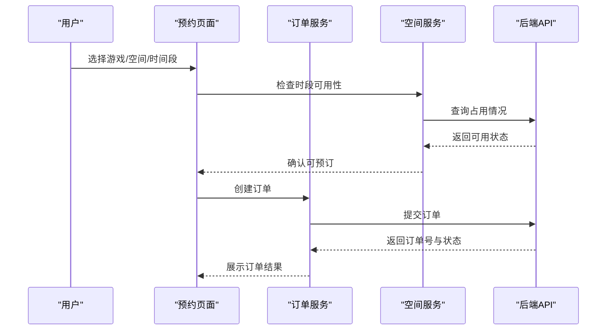
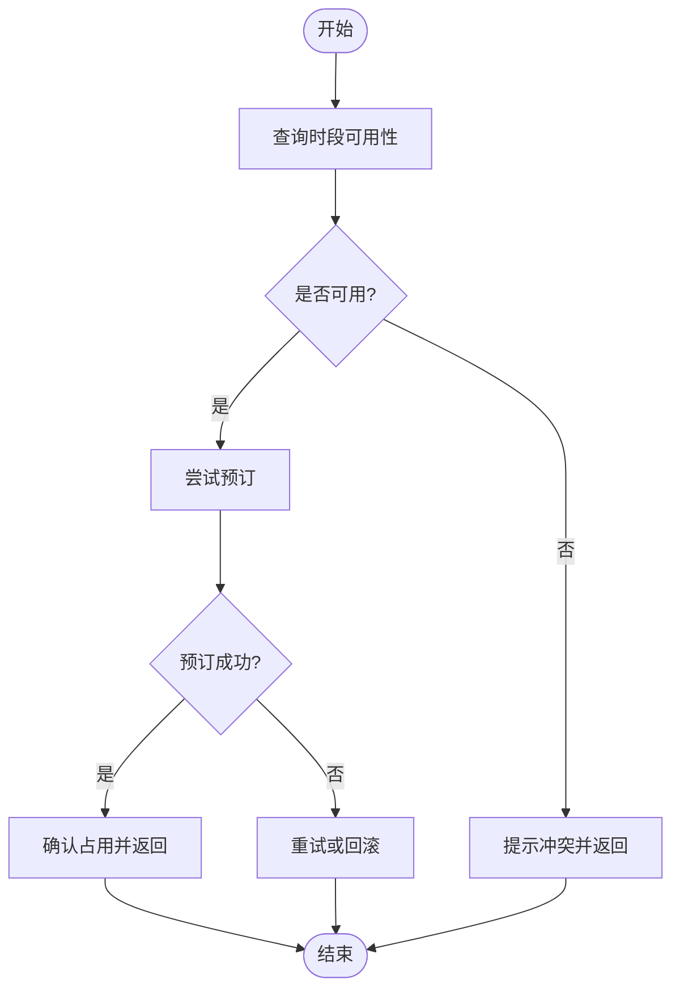
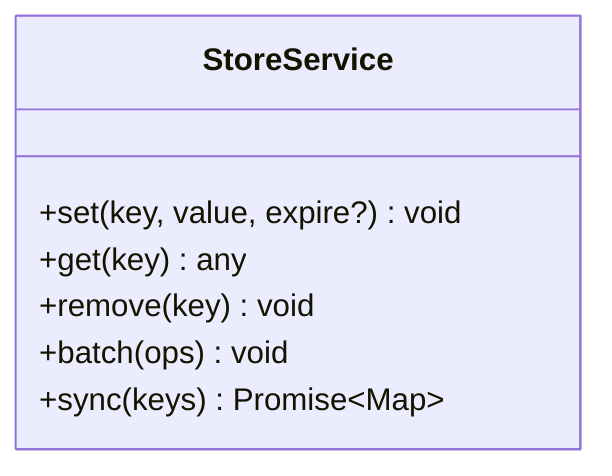
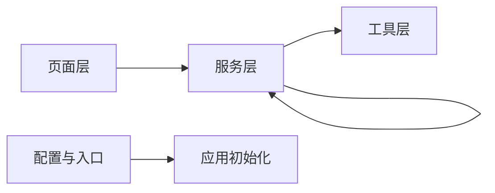

# 模块设计

<cite>
**本文引用的文件**   
- [app.ts](file://miniprogram/app.ts)
- [config.ts](file://miniprogram/config.ts)
- [auth.ts](file://miniprogram/services/auth.ts)
- [boardGame.ts](file://miniprogram/services/boardGame.ts)
- [order.ts](file://miniprogram/services/order.ts)
- [space.ts](file://miniprogram/services/space.ts)
- [store.ts](file://miniprogram/services/store.ts)
- [request.ts](file://miniprogram/utils/request.ts)
- [auth.ts](file://miniprogram/utils/auth.ts)
- [util.ts](file://miniprogram/utils/util.ts)
- [login.ts](file://miniprogram/pages/login/login.ts)
- [home.ts](file://miniprogram/pages/user/home/home.ts)
- [games.ts](file://miniprogram/pages/user/games/games.ts)
- [game-detail.ts](file://miniprogram/pages/user/game-detail/game-detail.ts)
- [reservation.ts](file://miniprogram/pages/user/reservation/reservation.ts)
- [ai-assistant.ts](file://miniprogram/pages/user/ai-assistant/ai-assistant.ts)
- [workbench.ts](file://miniprogram/pages/staff/workbench/workbench.ts)
- [games.ts](file://miniprogram/pages/staff/games/games.ts)
- [game-detail.ts](file://miniprogram/pages/staff/game-detail/game-detail.ts)
- [reservation-mgmt.ts](file://miniprogram/pages/staff/reservation-mgmt/reservation-mgmt.ts)
- [custom-tab-bar/index.ts](file://miniprogram/custom-tab-bar/index.ts)
- [app.json](file://miniprogram/app.json)
</cite>

## 目录
1. [引言](#引言)
2. [项目结构](#项目结构)
3. [核心组件](#核心组件)
4. [架构总览](#架构总览)
5. [详细组件分析](#详细组件分析)
6. [依赖分析](#依赖分析)
7. [性能考虑](#性能考虑)
8. [故障排查指南](#故障排查指南)
9. [结论](#结论)
10. [附录](#附录)

## 引言
本设计文档面向“小程序桌面游戏预约系统”的模块设计与协作方式，围绕认证、游戏、订单、空间、存储等核心业务模块进行职责划分与接口约定说明。文档重点阐述：
- 各模块的职责边界与设计原则（单一职责、分层清晰、可测试性）
- 模块间依赖关系与通信机制（服务层统一数据访问、工具层网络封装、页面仅负责交互）
- 接口设计、数据模型定义与错误处理策略
- 模块依赖图与接口调用关系图，帮助开发者快速理解协作方式

## 项目结构
本项目采用典型的小程序分层组织方式：
- 页面层 pages：按用户端与员工端划分，承载界面与交互逻辑
- 服务层 services：封装业务能力（认证、游戏、订单、空间、存储），对外暴露方法
- 工具层 utils：提供通用能力（网络请求、鉴权、工具函数）
- 组件层 components：复用 UI 组件（聊天气泡、空状态、游戏卡片、导航栏、时间网格）
- 配置与入口：app.ts、app.json、config.ts、project.config.json 等

图表来源
- [app.ts:1-200](file://miniprogram/app.ts#L1-L200)
- [config.ts:1-200](file://miniprogram/config.ts#L1-L200)
- [app.json:1-200](file://miniprogram/app.json#L1-L200)
- [auth.ts](file://miniprogram/services/auth.ts)
- [boardGame.ts](file://miniprogram/services/boardGame.ts)
- [order.ts](file://miniprogram/services/order.ts)
- [space.ts](file://miniprogram/services/space.ts)
- [store.ts](file://miniprogram/services/store.ts)
- [request.ts](file://miniprogram/utils/request.ts)
- [auth.ts](file://miniprogram/utils/auth.ts)
- [util.ts](file://miniprogram/utils/util.ts)

章节来源
- [app.ts:1-200](file://miniprogram/app.ts#L1-L200)
- [config.ts:1-200](file://miniprogram/config.ts#L1-L200)
- [app.json:1-200](file://miniprogram/app.json#L1-L200)

## 核心组件
本节聚焦服务层与工具层的职责划分与关键能力：
- 认证模块（services/auth.ts）：登录、登出、Token 管理、权限校验
- 游戏模块（services/boardGame.ts）：游戏列表、详情、搜索、推荐
- 订单模块（services/order.ts）：创建预约、查询订单、取消订单、状态流转
- 空间模块（services/space.ts）：空间信息、可用时段、预订占用
- 存储模块（services/store.ts）：本地缓存、持久化、会话保持
- 工具层（utils/request.ts, utils/auth.ts, utils/util.ts）：HTTP 封装、鉴权辅助、通用工具

章节来源
- [auth.ts](file://miniprogram/services/auth.ts)
- [boardGame.ts](file://miniprogram/services/boardGame.ts)
- [order.ts](file://miniprogram/services/order.ts)
- [space.ts](file://miniprogram/services/space.ts)
- [store.ts](file://miniprogram/services/store.ts)
- [request.ts](file://miniprogram/utils/request.ts)
- [auth.ts](file://miniprogram/utils/auth.ts)
- [util.ts](file://miniprogram/utils/util.ts)

## 架构总览
整体架构遵循“页面层 -> 服务层 -> 工具层 -> 后端 API”的分层模式：
- 页面层：只负责视图渲染与用户交互，不直接操作网络或复杂业务逻辑
- 服务层：聚合业务用例，协调多个工具与外部接口，返回结构化数据
- 工具层：提供稳定的基础能力（请求封装、鉴权、工具函数）
- 配置与入口：应用初始化、路由配置、全局常量

图表来源
- [request.ts](file://miniprogram/utils/request.ts)
- [auth.ts](file://miniprogram/services/auth.ts)
- [boardGame.ts](file://miniprogram/services/boardGame.ts)
- [order.ts](file://miniprogram/services/order.ts)
- [space.ts](file://miniprogram/services/space.ts)
- [store.ts](file://miniprogram/services/store.ts)

## 详细组件分析

### 认证模块（Auth）
职责与边界
- 登录流程：收集凭证、调用认证接口、保存 Token、设置全局状态
- 权限控制：基于角色/权限判断页面访问与功能可见性
- 会话管理：Token 刷新、过期处理、自动重登

接口设计要点
- 登录：入参包含账号/密码或第三方授权码；返回用户信息与 Token
- 登出：清除本地存储与会话
- 鉴权：提供 isAuthorized(role) 等方法

数据模型建议
- 用户对象：id、昵称、头像、角色、权限集合
- Token：access_token、refresh_token、expires_in

错误处理策略
- 网络异常：统一降级提示与重试
- 认证失败：明确区分账号不存在、密码错误、账户锁定
- Token 过期：自动刷新或引导重新登录

图表来源
- [auth.ts](file://miniprogram/services/auth.ts)
- [auth.ts](file://miniprogram/utils/auth.ts)
- [login.ts](file://miniprogram/pages/login/login.ts)

章节来源
- [auth.ts](file://miniprogram/services/auth.ts)
- [auth.ts](file://miniprogram/utils/auth.ts)
- [login.ts](file://miniprogram/pages/login/login.ts)

### 游戏模块（BoardGame）
职责与边界
- 游戏元数据：名称、封面、描述、标签、难度、人数
- 列表与详情：分页、筛选、排序、详情加载
- 推荐与搜索：关键词匹配、热门推荐

接口设计要点
- 列表：支持分页、分类、关键词、排序
- 详情：基础信息与扩展属性（时长、规则、图片集）
- 搜索：模糊匹配、高亮关键词

数据模型建议
- Game：id、name、cover、description、tags、difficulty、players、duration
- ListResponse：items、total、page、pageSize

错误处理策略
- 无数据：展示空状态组件
- 加载失败：重试按钮与友好提示

图表来源
- [boardGame.ts](file://miniprogram/services/boardGame.ts)

章节来源
- [boardGame.ts](file://miniprogram/services/boardGame.ts)
- [games.ts](file://miniprogram/pages/user/games/games.ts)
- [game-detail.ts](file://miniprogram/pages/user/game-detail/game-detail.ts)
- [game-detail.ts](file://miniprogram/pages/staff/game-detail/game-detail.ts)

### 订单模块（Order）
职责与边界
- 预约创建：选择游戏、空间、时间段，生成订单
- 订单查询：按用户/空间/状态查询
- 状态流转：待支付、已支付、进行中、已完成、已取消

接口设计要点
- 创建订单：入参包含游戏ID、空间ID、时间段、数量、优惠码
- 查询订单：支持多条件过滤与分页
- 取消订单：校验状态与规则

数据模型建议
- Order：id、userId、gameId、spaceId、timeSlot、status、amount、createdAt
- TimeSlot：start、end、available

错误处理策略
- 冲突检测：同一时间段不可重复预订
- 状态校验：非可取消状态禁止取消
- 超时处理：未支付订单自动关闭

图表来源
- [order.ts](file://miniprogram/services/order.ts)
- [space.ts](file://miniprogram/services/space.ts)
- [reservation.ts](file://miniprogram/pages/user/reservation/reservation.ts)

章节来源
- [order.ts](file://miniprogram/services/order.ts)
- [reservation.ts](file://miniprogram/pages/user/reservation/reservation.ts)

### 空间模块（Space）
职责与边界
- 空间信息：名称、容量、设施、位置
- 时段管理：每日时段划分、占用与释放
- 资源调度：避免冲突、并发控制

接口设计要点
- 获取空间列表：支持按容量、设施筛选
- 查询时段：返回某空间在某日期的时段可用性
- 更新占用：预订成功后标记占用，取消后释放

数据模型建议
- Space：id、name、capacity、facilities、location
- Slot：id、spaceId、date、startTime、endTime、status

错误处理策略
- 并发冲突：乐观锁或分布式锁
- 数据不一致：补偿任务与对账

图表来源
- [space.ts](file://miniprogram/services/space.ts)

章节来源
- [space.ts](file://miniprogram/services/space.ts)

### 存储模块（Store）
职责与边界
- 本地缓存：键值存储、过期策略
- 会话保持：用户信息、Token、偏好设置
- 数据同步：与服务器状态一致性保障

接口设计要点
- set/get/remove：基本存取
- batch：批量操作
- sync：增量同步与冲突解决

数据模型建议
- CacheEntry：key、value、expireAt、version

错误处理策略
- 存储满：清理策略与降级
- 版本冲突：以服务端为准

图表来源
- [store.ts](file://miniprogram/services/store.ts)

章节来源
- [store.ts](file://miniprogram/services/store.ts)

### 工具层（Request/Auth/Util）
职责与边界
- request.ts：统一网络请求封装，拦截器、重试、超时、错误映射
- auth.ts：鉴权辅助，Token 注入、权限判断、登录态维护
- util.ts：通用工具函数（日期、格式化、校验）

接口设计要点
- request：封装 wx.request 或自定义 fetch
- interceptors：请求前注入 Token，响应后处理错误码
- helpers：常用格式化与校验方法

错误处理策略
- 网络错误：分类提示（超时、断网、服务器错误）
- 业务错误：统一错误码映射为用户可读消息

章节来源
- [request.ts](file://miniprogram/utils/request.ts)
- [auth.ts](file://miniprogram/utils/auth.ts)
- [util.ts](file://miniprogram/utils/util.ts)

## 依赖分析
模块间的依赖关系如下：
- 页面层依赖服务层，不直接依赖工具层
- 服务层依赖工具层（请求、鉴权、工具函数）
- 服务层之间通过明确的接口协作（如订单与空间）
- 配置与入口提供全局常量与路由

图表来源
- [app.ts](file://miniprogram/app.ts)
- [config.ts](file://miniprogram/config.ts)
- [auth.ts](file://miniprogram/services/auth.ts)
- [boardGame.ts](file://miniprogram/services/boardGame.ts)
- [order.ts](file://miniprogram/services/order.ts)
- [space.ts](file://miniprogram/services/space.ts)
- [store.ts](file://miniprogram/services/store.ts)
- [request.ts](file://miniprogram/utils/request.ts)
- [auth.ts](file://miniprogram/utils/auth.ts)
- [util.ts](file://miniprogram/utils/util.ts)

章节来源
- [app.ts:1-200](file://miniprogram/app.ts#L1-L200)
- [config.ts:1-200](file://miniprogram/config.ts#L1-L200)

## 性能考虑
- 网络优化：请求合并、缓存热点数据、懒加载与分页
- 渲染优化：减少不必要的 setData，使用虚拟列表
- 内存管理：及时释放大对象，避免闭包引用泄漏
- 并发控制：限制同时请求数，避免阻塞主线程
- 错误恢复：重试与降级策略，提升用户体验

[本节为通用指导，无需特定文件来源]

## 故障排查指南
常见问题与定位步骤：
- 登录失败：检查凭证格式、网络连通性、后端认证接口
- 订单冲突：查看时段占用记录、并发锁日志、补偿任务
- 数据不同步：对比本地缓存与服务端版本，触发强制刷新
- 页面空白：检查路由配置、组件加载、数据绑定

章节来源
- [request.ts](file://miniprogram/utils/request.ts)
- [auth.ts](file://miniprogram/utils/auth.ts)
- [order.ts](file://miniprogram/services/order.ts)
- [store.ts](file://miniprogram/services/store.ts)

## 结论
本设计文档明确了小程序桌面游戏预约系统的模块职责、接口约定与协作方式。通过分层架构与清晰的依赖关系，确保系统可扩展、可维护、可测试。建议在后续迭代中持续完善错误处理、性能监控与单元测试覆盖。

[本节为总结性内容，无需特定文件来源]

## 附录
- 术语表：Token、时段、空间、订单、缓存
- 参考实现路径：
  - 认证流程：[login.ts](file://miniprogram/pages/login/login.ts)、[auth.ts](file://miniprogram/services/auth.ts)
  - 游戏浏览：[games.ts](file://miniprogram/pages/user/games/games.ts)、[boardGame.ts](file://miniprogram/services/boardGame.ts)
  - 预约下单：[reservation.ts](file://miniprogram/pages/user/reservation/reservation.ts)、[order.ts](file://miniprogram/services/order.ts)、[space.ts](file://miniprogram/services/space.ts)
  - 员工工作台：[workbench.ts](file://miniprogram/pages/staff/workbench/workbench.ts)、[reservation-mgmt.ts](file://miniprogram/pages/staff/reservation-mgmt/reservation-mgmt.ts)
  - 应用入口：[app.ts](file://miniprogram/app.ts)、[app.json](file://miniprogram/app.json)、[config.ts](file://miniprogram/config.ts)

章节来源
- [login.ts](file://miniprogram/pages/login/login.ts)
- [auth.ts](file://miniprogram/services/auth.ts)
- [games.ts](file://miniprogram/pages/user/games/games.ts)
- [boardGame.ts](file://miniprogram/services/boardGame.ts)
- [reservation.ts](file://miniprogram/pages/user/reservation/reservation.ts)
- [order.ts](file://miniprogram/services/order.ts)
- [space.ts](file://miniprogram/services/space.ts)
- [workbench.ts](file://miniprogram/pages/staff/workbench/workbench.ts)
- [reservation-mgmt.ts](file://miniprogram/pages/staff/reservation-mgmt/reservation-mgmt.ts)
- [app.ts](file://miniprogram/app.ts)
- [app.json](file://miniprogram/app.json)
- [config.ts](file://miniprogram/config.ts)