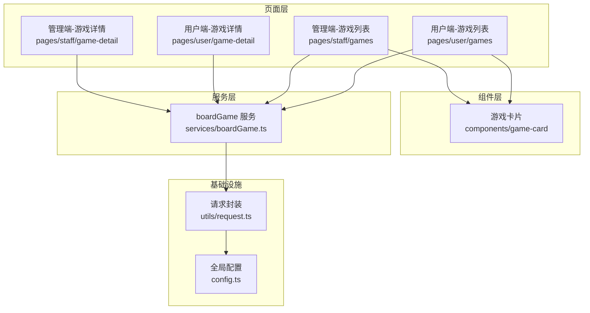
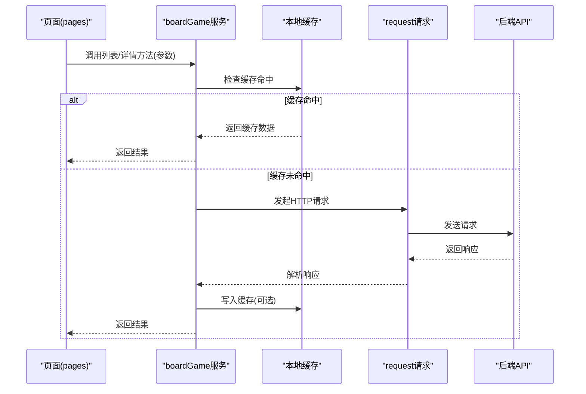
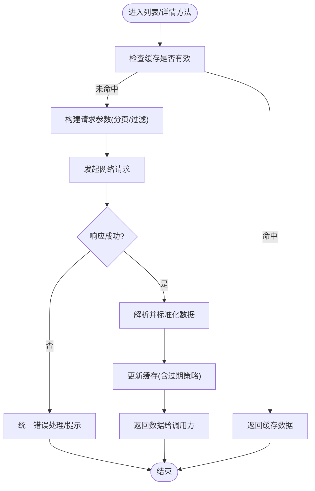
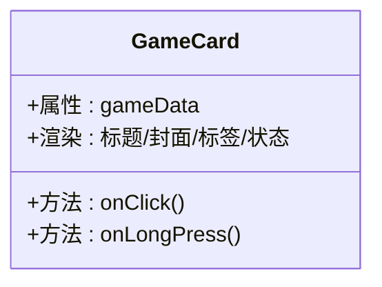
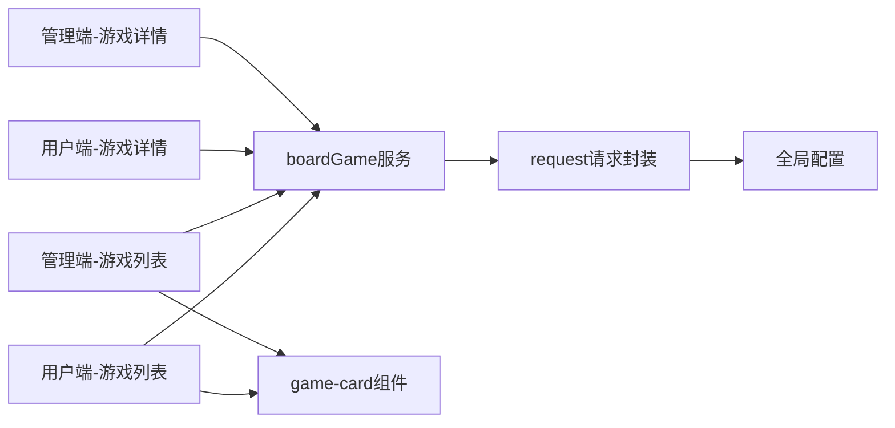

# 游戏模块

<cite>
**本文引用的文件**   
- [boardGame.ts](file://miniprogram/services/boardGame.ts)
- [game-card.ts](file://miniprogram/components/game-card/game-card.ts)
- [games.ts（用户端）](file://miniprogram/pages/user/games/games.ts)
- [games.ts（管理端）](file://miniprogram/pages/staff/games/games.ts)
- [game-detail.ts（用户端）](file://miniprogram/pages/user/game-detail/game-detail.ts)
- [game-detail.ts（管理端）](file://miniprogram/pages/staff/game-detail/game-detail.ts)
- [request.ts](file://miniprogram/utils/request.ts)
- [config.ts](file://miniprogram/config.ts)
</cite>

## 目录
1. [简介](#简介)
2. [项目结构](#项目结构)
3. [核心组件](#核心组件)
4. [架构总览](#架构总览)
5. [详细组件分析](#详细组件分析)
6. [依赖关系分析](#依赖关系分析)
7. [性能考量](#性能考量)
8. [故障排查指南](#故障排查指南)
9. [结论](#结论)
10. [附录：数据模型与API规范](#附录数据模型与api规范)

## 简介
本模块围绕“桌游”业务，提供游戏数据的增删改查、列表展示、详情获取等能力。服务层 boardGame 采用分层与服务化设计，封装了网络请求、缓存策略、分页加载与搜索过滤；页面层区分用户端与管理端，分别承担浏览与管理的职责；UI 层通过 game-card 组件实现数据绑定与交互。文档旨在帮助开发者快速理解并扩展该模块。

## 项目结构
- 服务层 services/boardGame.ts：统一对外暴露游戏相关 API 调用，内部处理缓存、分页、搜索等逻辑。
- 页面层 pages/user/games 与 pages/staff/games：分别实现用户端游戏列表与管理端游戏列表。
- 详情页 pages/user/game-detail 与 pages/staff/game-detail：分别实现用户端详情查看与管理端详情编辑。
- 组件 components/game-card：游戏卡片，负责单项数据展示与点击跳转等交互。
- 工具 utils/request.ts 与配置 config.ts：HTTP 请求封装与全局配置。

图表来源
- [boardGame.ts](file://miniprogram/services/boardGame.ts)
- [game-card.ts](file://miniprogram/components/game-card/game-card.ts)
- [games.ts（用户端）](file://miniprogram/pages/user/games/games.ts)
- [games.ts（管理端）](file://miniprogram/pages/staff/games/games.ts)
- [game-detail.ts（用户端）](file://miniprogram/pages/user/game-detail/game-detail.ts)
- [game-detail.ts（管理端）](file://miniprogram/pages/staff/game-detail/game-detail.ts)
- [request.ts](file://miniprogram/utils/request.ts)
- [config.ts](file://miniprogram/config.ts)

章节来源
- [boardGame.ts](file://miniprogram/services/boardGame.ts)
- [game-card.ts](file://miniprogram/components/game-card/game-card.ts)
- [games.ts（用户端）](file://miniprogram/pages/user/games/games.ts)
- [games.ts（管理端）](file://miniprogram/pages/staff/games/games.ts)
- [game-detail.ts（用户端）](file://miniprogram/pages/user/game-detail/game-detail.ts)
- [game-detail.ts（管理端）](file://miniprogram/pages/staff/game-detail/game-detail.ts)
- [request.ts](file://miniprogram/utils/request.ts)
- [config.ts](file://miniprogram/config.ts)

## 核心组件
- boardGame 服务
  - 职责：封装所有游戏相关的网络请求，提供统一的查询、创建、更新、删除接口；内置缓存、分页、搜索过滤等通用能力。
  - 关键特性：
    - 数据缓存：对热点列表与详情进行本地缓存，减少重复请求。
    - 分页加载：支持页码/游标分页，增量加载更多数据。
    - 搜索过滤：按关键词、分类、状态等维度筛选。
    - 错误处理：统一异常捕获与提示，保证用户体验一致。
- game-card 组件
  - 职责：渲染单个游戏信息，响应点击事件，跳转到对应详情页或操作页。
  - 数据绑定：通过属性接收游戏对象，渲染标题、封面、标签、状态等。
  - 交互逻辑：点击触发导航或回调，支持长按/手势扩展（按需）。
- 页面层
  - 用户端 games：只读展示，支持搜索、分页、排序。
  - 管理端 games：具备新增、编辑、删除、批量操作等管理能力。
  - 详情页：用户端仅查看，管理端可编辑保存。

章节来源
- [boardGame.ts](file://miniprogram/services/boardGame.ts)
- [game-card.ts](file://miniprogram/components/game-card/game-card.ts)
- [games.ts（用户端）](file://miniprogram/pages/user/games/games.ts)
- [games.ts（管理端）](file://miniprogram/pages/staff/games/games.ts)
- [game-detail.ts（用户端）](file://miniprogram/pages/user/game-detail/game-detail.ts)
- [game-detail.ts（管理端）](file://miniprogram/pages/staff/game-detail/game-detail.ts)

## 架构总览
整体采用“页面层 → 服务层 → 请求封装 → 配置”的分层架构，组件与页面解耦，服务层集中处理业务逻辑与数据流。

图表来源
- [boardGame.ts](file://miniprogram/services/boardGame.ts)
- [request.ts](file://miniprogram/utils/request.ts)
- [config.ts](file://miniprogram/config.ts)

## 详细组件分析

### boardGame 服务层
- 设计模式
  - 单例/模块化服务：集中管理游戏相关接口，避免重复初始化。
  - 策略模式（可选）：不同缓存策略（内存/持久化）、不同分页策略（页码/游标）。
  - 观察者/回调：在数据变化时通知页面刷新。
- 数据缓存策略
  - 列表缓存：按查询条件生成键，设置过期时间，避免频繁请求。
  - 详情缓存：按游戏ID缓存，缩短二次打开耗时。
  - 失效策略：写操作后主动失效相关缓存。
- 分页加载
  - 支持 page/pageSize 或 cursor 分页，合并新数据到现有列表。
  - 下拉刷新与上拉加载更多。
- 搜索过滤
  - 前端过滤：对已加载数据进行关键词匹配与分类筛选。
  - 服务端过滤：将筛选条件透传到后端，提高准确性。
- 错误处理
  - 统一网络异常、业务错误码处理，给出友好提示。
  - 重试机制（可选）：对瞬时失败进行有限重试。

图表来源
- [boardGame.ts](file://miniprogram/services/boardGame.ts)

章节来源
- [boardGame.ts](file://miniprogram/services/boardGame.ts)

### game-card 组件
- 数据绑定
  - 输入属性：游戏对象（包含标题、封面、标签、状态等字段）。
  - 输出事件：点击、长按等交互事件。
- 交互逻辑
  - 点击跳转：根据路由规则跳转到用户端详情或管理端详情。
  - 状态展示：根据游戏状态显示不同样式或操作按钮。
- 性能优化
  - 懒加载图片、防抖点击、最小化重渲染。

图表来源
- [game-card.ts](file://miniprogram/components/game-card/game-card.ts)

章节来源
- [game-card.ts](file://miniprogram/components/game-card/game-card.ts)

### 用户端游戏列表（pages/user/games）
- 功能要点
  - 展示游戏列表，支持搜索、分页、排序。
  - 点击卡片进入用户端详情。
  - 下拉刷新、上拉加载更多。
- 数据流
  - 页面调用 boardGame 的列表接口，传入分页与过滤参数。
  - 渲染列表，维护本地状态（loading、error、data）。

章节来源
- [games.ts（用户端）](file://miniprogram/pages/user/games/games.ts)
- [boardGame.ts](file://miniprogram/services/boardGame.ts)

### 管理端游戏列表（pages/staff/games）
- 功能要点
  - 展示游戏列表，支持新增、编辑、删除、批量操作。
  - 管理权限校验，敏感操作二次确认。
  - 列表操作后刷新缓存与数据。
- 数据流
  - 调用 boardGame 的 CRUD 接口，成功后更新本地缓存与视图。

章节来源
- [games.ts（管理端）](file://miniprogram/pages/staff/games/games.ts)
- [boardGame.ts](file://miniprogram/services/boardGame.ts)

### 用户端游戏详情（pages/user/game-detail）
- 功能要点
  - 展示游戏详细信息，支持收藏、分享等只读操作。
  - 首次加载优先读取缓存，未命中再请求网络。
- 数据流
  - 通过游戏ID调用 boardGame 的详情接口。

章节来源
- [game-detail.ts（用户端）](file://miniprogram/pages/user/game-detail/game-detail.ts)
- [boardGame.ts](file://miniprogram/services/boardGame.ts)

### 管理端游戏详情（pages/staff/game-detail）
- 功能要点
  - 编辑游戏信息，提交保存后失效相关缓存。
  - 表单校验、错误提示、草稿暂存（可选）。
- 数据流
  - 调用 boardGame 的更新接口，成功后返回列表或详情页。

章节来源
- [game-detail.ts（管理端）](file://miniprogram/pages/staff/game-detail/game-detail.ts)
- [boardGame.ts](file://miniprogram/services/boardGame.ts)

## 依赖关系分析
- 页面依赖服务：用户端/管理端页面均依赖 boardGame 服务。
- 服务依赖基础设施：boardGame 依赖 request 封装与全局配置。
- 组件与页面解耦：game-card 仅关注展示与交互，不关心数据来源。

图表来源
- [boardGame.ts](file://miniprogram/services/boardGame.ts)
- [game-card.ts](file://miniprogram/components/game-card/game-card.ts)
- [games.ts（用户端）](file://miniprogram/pages/user/games/games.ts)
- [games.ts（管理端）](file://miniprogram/pages/staff/games/games.ts)
- [game-detail.ts（用户端）](file://miniprogram/pages/user/game-detail/game-detail.ts)
- [game-detail.ts（管理端）](file://miniprogram/pages/staff/game-detail/game-detail.ts)
- [request.ts](file://miniprogram/utils/request.ts)
- [config.ts](file://miniprogram/config.ts)

章节来源
- [boardGame.ts](file://miniprogram/services/boardGame.ts)
- [request.ts](file://miniprogram/utils/request.ts)
- [config.ts](file://miniprogram/config.ts)

## 性能考量
- 缓存命中率：合理设置缓存键与过期时间，提升列表与详情加载速度。
- 分页策略：使用游标分页可减少大数据集传输；前端合并数据避免重复渲染。
- 图片优化：懒加载、压缩、占位图，降低首屏压力。
- 请求去抖：搜索输入防抖，减少无效请求。
- 错误重试：对瞬时失败进行有限次重试，提升稳定性。

[本节为通用指导，无需特定文件引用]

## 故障排查指南
- 常见问题
  - 列表不更新：检查缓存失效逻辑与写操作后的刷新流程。
  - 详情为空：确认ID传递正确，缓存键是否冲突。
  - 搜索无结果：核对前后端过滤字段一致性。
  - 网络错误：检查 request 封装的错误处理与后端返回码。
- 调试建议
  - 打印请求参数与响应体，定位问题环节。
  - 临时关闭缓存验证是否为缓存导致。
  - 使用小程序开发者工具的 Network 面板观察请求。

章节来源
- [boardGame.ts](file://miniprogram/services/boardGame.ts)
- [request.ts](file://miniprogram/utils/request.ts)

## 结论
本模块以清晰的分层与职责划分实现了游戏数据的完整生命周期管理。boardGame 服务层集中处理缓存、分页与搜索，提升了复用性与可维护性；页面层区分用户与管理角色，满足差异化需求；game-card 组件专注于展示与交互。建议在后续迭代中完善缓存策略、错误重试与监控埋点，进一步提升性能与稳定性。

[本节为总结，无需特定文件引用]

## 附录：数据模型与API规范

### 数据模型（示例）
- 游戏实体
  - id：唯一标识
  - title：标题
  - cover：封面URL
  - tags：标签数组
  - status：状态（如上架/下架）
  - description：描述
  - createdAt/updatedAt：时间戳

[本节为概念性说明，无需特定文件引用]

### API 接口规范（示例）
- 列表查询
  - 方法：GET
  - 路径：/api/board-games
  - 参数：page, pageSize, keyword, category, status
  - 返回：{ list, total, hasMore }
- 详情查询
  - 方法：GET
  - 路径：/api/board-games/:id
  - 返回：游戏对象
- 创建
  - 方法：POST
  - 路径：/api/board-games
  - 请求体：游戏对象（必填字段校验）
  - 返回：创建成功的新对象
- 更新
  - 方法：PUT
  - 路径：/api/board-games/:id
  - 请求体：待更新字段
  - 返回：更新后的对象
- 删除
  - 方法：DELETE
  - 路径：/api/board-games/:id
  - 返回：操作结果

[本节为概念性说明，无需特定文件引用]