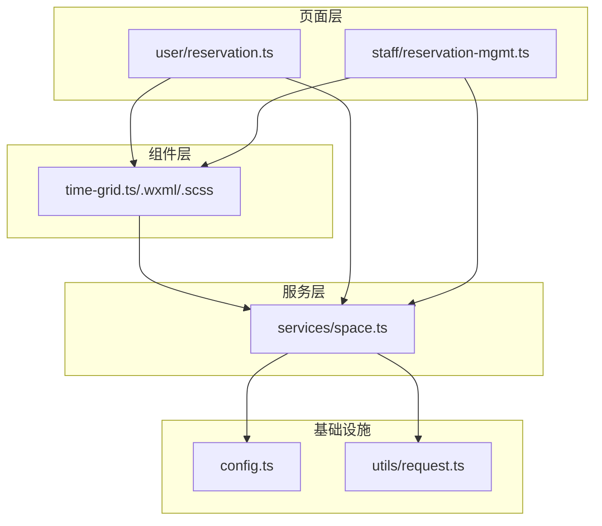
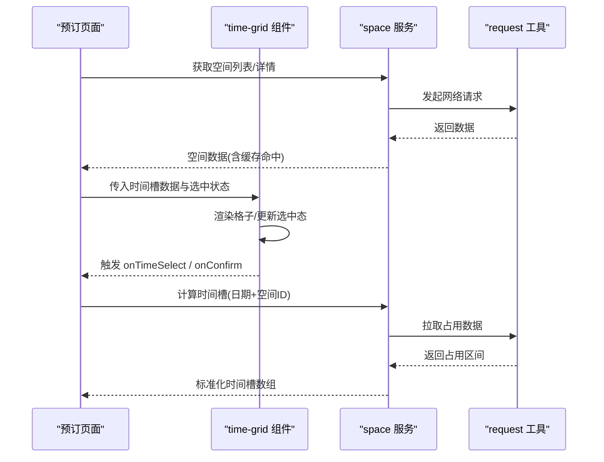
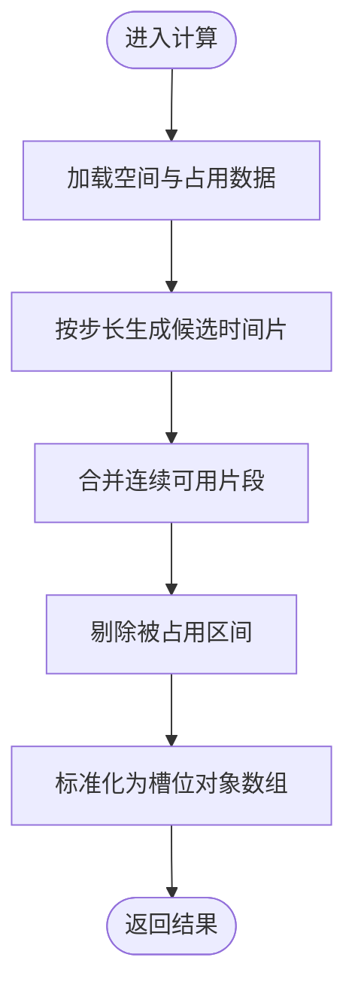
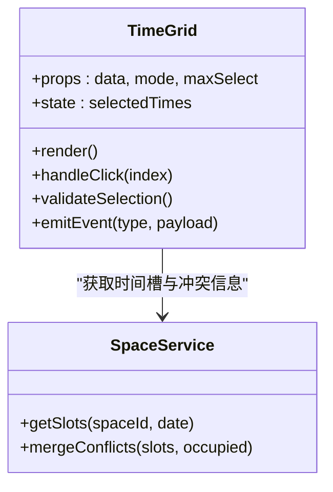
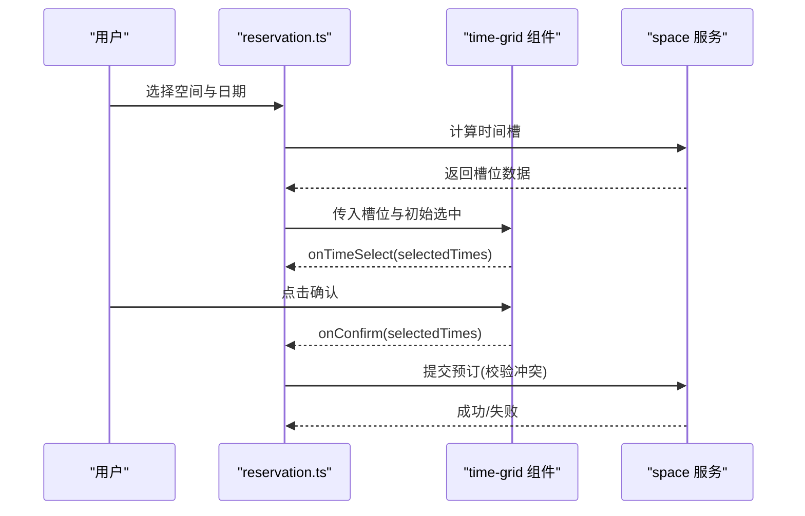
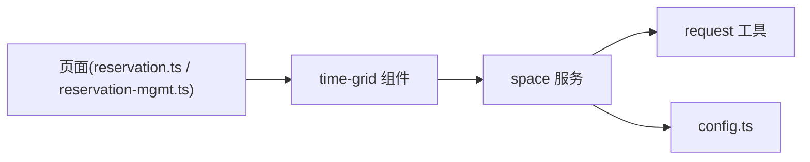

# 空间模块

<cite>
**本文引用的文件**   
- [miniprogram/services/space.ts](file://miniprogram/services/space.ts)
- [miniprogram/components/time-grid/time-grid.ts](file://miniprogram/components/time-grid/time-grid.ts)
- [miniprogram/components/time-grid/time-grid.wxml](file://miniprogram/components/time-grid/time-grid.wxml)
- [miniprogram/components/time-grid/time-grid.scss](file://miniprogram/components/time-grid/time-grid.scss)
- [miniprogram/pages/user/reservation/reservation.ts](file://miniprogram/pages/user/reservation/reservation.ts)
- [miniprogram/pages/staff/reservation-mgmt/reservation-mgmt.ts](file://miniprogram/pages/staff/reservation-mgmt/reservation-mgmt.ts)
- [miniprogram/config.ts](file://miniprogram/config.ts)
- [miniprogram/utils/request.ts](file://miniprogram/utils/request.ts)
</cite>

## 目录
1. [简介](#简介)
2. [项目结构](#项目结构)
3. [核心组件与服务](#核心组件与服务)
4. [架构总览](#架构总览)
5. [详细组件分析](#详细组件分析)
6. [依赖关系分析](#依赖关系分析)
7. [性能与可维护性](#性能与可维护性)
8. [故障排查指南](#故障排查指南)
9. [结论](#结论)
10. [附录：空间布局配置与响应式适配](#附录空间布局配置与响应式适配)

## 简介
本模块聚焦于“空间”在小程序中的展示、选择与时间网格渲染，以及空间服务层的数据管理与时间槽位计算。文档覆盖以下要点：
- space 服务层：空间数据获取、缓存与时间槽位计算逻辑
- time-grid 组件：时间格子的生成、选中状态管理、冲突检测与交互反馈
- 页面集成：用户预订页与员工管理页对空间与时间网格的使用方式
- 布局与响应式：空间卡片与时间网格在不同屏幕下的表现策略
- 可视化设计说明：空间预订界面的信息层次与交互规范

## 项目结构
空间模块相关代码主要分布在 services、components 与 pages 三个层级：
- services/space.ts：空间数据服务（查询、缓存、时间槽位计算）
- components/time-grid/*：时间网格组件（视图、样式、逻辑）
- pages/user/reservation/* 与 pages/staff/reservation-mgmt/*：使用空间与时间网格的页面
- config.ts：全局配置（如默认日期、时间步长等）
- utils/request.ts：网络请求封装

图表来源
- [miniprogram/pages/user/reservation/reservation.ts](file://miniprogram/pages/user/reservation/reservation.ts)
- [miniprogram/pages/staff/reservation-mgmt/reservation-mgmt.ts](file://miniprogram/pages/staff/reservation-mgmt/reservation-mgmt.ts)
- [miniprogram/components/time-grid/time-grid.ts](file://miniprogram/components/time-grid/time-grid.ts)
- [miniprogram/services/space.ts](file://miniprogram/services/space.ts)
- [miniprogram/config.ts](file://miniprogram/config.ts)
- [miniprogram/utils/request.ts](file://miniprogram/utils/request.ts)

章节来源
- [miniprogram/services/space.ts](file://miniprogram/services/space.ts)
- [miniprogram/components/time-grid/time-grid.ts](file://miniprogram/components/time-grid/time-grid.ts)
- [miniprogram/components/time-grid/time-grid.wxml](file://miniprogram/components/time-grid/time-grid.wxml)
- [miniprogram/components/time-grid/time-grid.scss](file://miniprogram/components/time-grid/time-grid.scss)
- [miniprogram/pages/user/reservation/reservation.ts](file://miniprogram/pages/user/reservation/reservation.ts)
- [miniprogram/pages/staff/reservation-mgmt/reservation-mgmt.ts](file://miniprogram/pages/staff/reservation-mgmt/reservation-mgmt.ts)
- [miniprogram/config.ts](file://miniprogram/config.ts)
- [miniprogram/utils/request.ts](file://miniprogram/utils/request.ts)

## 核心组件与服务
- space 服务层
  - 职责：空间列表/详情查询、本地缓存、时间槽位计算（基于业务规则与已有预订）
  - 关键能力：按空间ID与日期范围计算可用时间段、合并冲突区间、返回标准化时间槽数组
- time-grid 组件
  - 职责：接收时间槽数据，渲染网格；处理点击选中、多选、冲突提示；向父组件派发事件
  - 关键能力：根据步长生成格子、标记占用/可选/已选状态、边界校验与回退

章节来源
- [miniprogram/services/space.ts](file://miniprogram/services/space.ts)
- [miniprogram/components/time-grid/time-grid.ts](file://miniprogram/components/time-grid/time-grid.ts)

## 架构总览
空间模块采用“页面-组件-服务”的分层结构：
- 页面负责业务编排（选择空间、选择日期、提交预订）
- time-grid 组件专注时间网格渲染与交互
- space 服务提供数据与计算，屏蔽后端差异与缓存细节

图表来源
- [miniprogram/pages/user/reservation/reservation.ts](file://miniprogram/pages/user/reservation/reservation.ts)
- [miniprogram/components/time-grid/time-grid.ts](file://miniprogram/components/time-grid/time-grid.ts)
- [miniprogram/services/space.ts](file://miniprogram/services/space.ts)
- [miniprogram/utils/request.ts](file://miniprogram/utils/request.ts)

## 详细组件分析

### space 服务层：空间数据管理与时间槽位计算
- 数据管理
  - 空间列表与详情：支持按条件筛选与分页（如有），并做本地缓存以减少重复请求
  - 错误处理：统一异常捕获与降级策略（如返回空数组或默认值）
- 时间槽位计算
  - 输入：空间ID、日期、营业时间、最小时长、步长、已有占用区间
  - 处理：生成候选时间片，过滤被占用的区间，合并相邻可用片段，输出标准化槽位
  - 输出：包含开始时间、结束时间、是否可选、是否已选等字段的时间槽数组

图表来源
- [miniprogram/services/space.ts](file://miniprogram/services/space.ts)

章节来源
- [miniprogram/services/space.ts](file://miniprogram/services/space.ts)

### time-grid 组件：时间格子的生成、选中与冲突检测
- 渲染机制
  - 根据步长与时间范围生成格子矩阵（行=日期/时段，列=时间片）
  - 通过样式区分状态：可选、已选、不可用、冲突
- 状态管理
  - 内部维护 selectedTimes 集合，支持单选/多选模式
  - 点击格子时进行边界校验（如最大选择数量、最小间隔）
- 冲突检测
  - 基于 space 服务返回的占用区间，判断新选中是否与已有预订重叠
  - 若冲突则阻止选中并给出提示

图表来源
- [miniprogram/components/time-grid/time-grid.ts](file://miniprogram/components/time-grid/time-grid.ts)
- [miniprogram/services/space.ts](file://miniprogram/services/space.ts)

章节来源
- [miniprogram/components/time-grid/time-grid.ts](file://miniprogram/components/time-grid/time-grid.ts)
- [miniprogram/components/time-grid/time-grid.wxml](file://miniprogram/components/time-grid/time-grid.wxml)
- [miniprogram/components/time-grid/time-grid.scss](file://miniprogram/components/time-grid/time-grid.scss)

### 页面集成：用户预订与员工管理
- 用户预订页
  - 流程：选择空间 → 选择日期 → 渲染时间网格 → 确认提交
  - 与组件交互：监听 onTimeSelect 与 onConfirm，组装预订参数
- 员工管理页
  - 流程：查看空间占用 → 编辑/新增预订 → 刷新时间网格
  - 与组件交互：双向绑定选中态，实时反馈冲突与可用性

图表来源
- [miniprogram/pages/user/reservation/reservation.ts](file://miniprogram/pages/user/reservation/reservation.ts)
- [miniprogram/components/time-grid/time-grid.ts](file://miniprogram/components/time-grid/time-grid.ts)
- [miniprogram/services/space.ts](file://miniprogram/services/space.ts)

章节来源
- [miniprogram/pages/user/reservation/reservation.ts](file://miniprogram/pages/user/reservation/reservation.ts)
- [miniprogram/pages/staff/reservation-mgmt/reservation-mgmt.ts](file://miniprogram/pages/staff/reservation-mgmt/reservation-mgmt.ts)

## 依赖关系分析
- 组件与服务的耦合
  - time-grid 依赖 space 服务提供的槽位数据与冲突信息，避免在组件内实现复杂计算
  - 页面作为编排者，协调空间选择、时间网格与提交流程
- 外部依赖
  - request 工具用于网络请求封装与错误处理
  - config 提供全局常量（如默认日期、时间步长、最大选择数等）

图表来源
- [miniprogram/pages/user/reservation/reservation.ts](file://miniprogram/pages/user/reservation/reservation.ts)
- [miniprogram/pages/staff/reservation-mgmt/reservation-mgmt.ts](file://miniprogram/pages/staff/reservation-mgmt/reservation-mgmt.ts)
- [miniprogram/components/time-grid/time-grid.ts](file://miniprogram/components/time-grid/time-grid.ts)
- [miniprogram/services/space.ts](file://miniprogram/services/space.ts)
- [miniprogram/utils/request.ts](file://miniprogram/utils/request.ts)
- [miniprogram/config.ts](file://miniprogram/config.ts)

章节来源
- [miniprogram/services/space.ts](file://miniprogram/services/space.ts)
- [miniprogram/components/time-grid/time-grid.ts](file://miniprogram/components/time-grid/time-grid.ts)
- [miniprogram/utils/request.ts](file://miniprogram/utils/request.ts)
- [miniprogram/config.ts](file://miniprogram/config.ts)

## 性能与可维护性
- 性能优化建议
  - 时间槽计算尽量在内存中完成，避免频繁重排；必要时对占用区间排序后线性扫描
  - 大列表渲染时使用虚拟滚动或分页加载（当时间范围较大时）
  - 合理设置缓存策略，减少重复请求
- 可维护性建议
  - 将槽位计算与冲突检测抽象为纯函数，便于单元测试
  - 组件 props 与事件命名保持一致，降低页面集成成本
  - 错误处理集中化，统一提示与降级行为

[本节为通用指导，不直接分析具体文件]

## 故障排查指南
- 常见问题
  - 时间槽为空：检查日期范围、步长配置与占用数据是否正确
  - 冲突检测失效：确认占用区间格式与比较逻辑一致
  - 选中态异常：检查 selectedTimes 更新与去重逻辑
- 定位方法
  - 打印 space 服务返回的槽位数据与占用区间
  - 在 time-grid 组件中记录点击事件与校验结果
  - 使用 request 工具日志查看接口响应码与内容

章节来源
- [miniprogram/services/space.ts](file://miniprogram/services/space.ts)
- [miniprogram/components/time-grid/time-grid.ts](file://miniprogram/components/time-grid/time-grid.ts)
- [miniprogram/utils/request.ts](file://miniprogram/utils/request.ts)

## 结论
空间模块通过清晰的分层设计与职责划分，实现了空间展示、时间网格渲染与预订流程的完整闭环。space 服务层专注于数据管理与时间槽位计算，time-grid 组件专注于渲染与交互，页面层负责业务编排。该结构具备良好的扩展性与可维护性，适合后续增加更多空间类型与预订规则。

[本节为总结性内容，不直接分析具体文件]

## 附录：空间布局配置与响应式适配
- 布局配置
  - 时间网格步长：由配置项控制，影响格子密度与交互粒度
  - 最大选择数量：防止过度选择导致资源紧张
  - 显示模式：支持单列/多列切换，适应不同屏幕宽度
- 响应式适配
  - 小屏设备：压缩格子间距，隐藏次要信息，优先保证核心操作可见
  - 大屏设备：展示更多信息（如备注、容量），提升可读性
  - 横竖屏切换：动态调整网格行列数与字号

[本节为概念性说明，不直接分析具体文件]