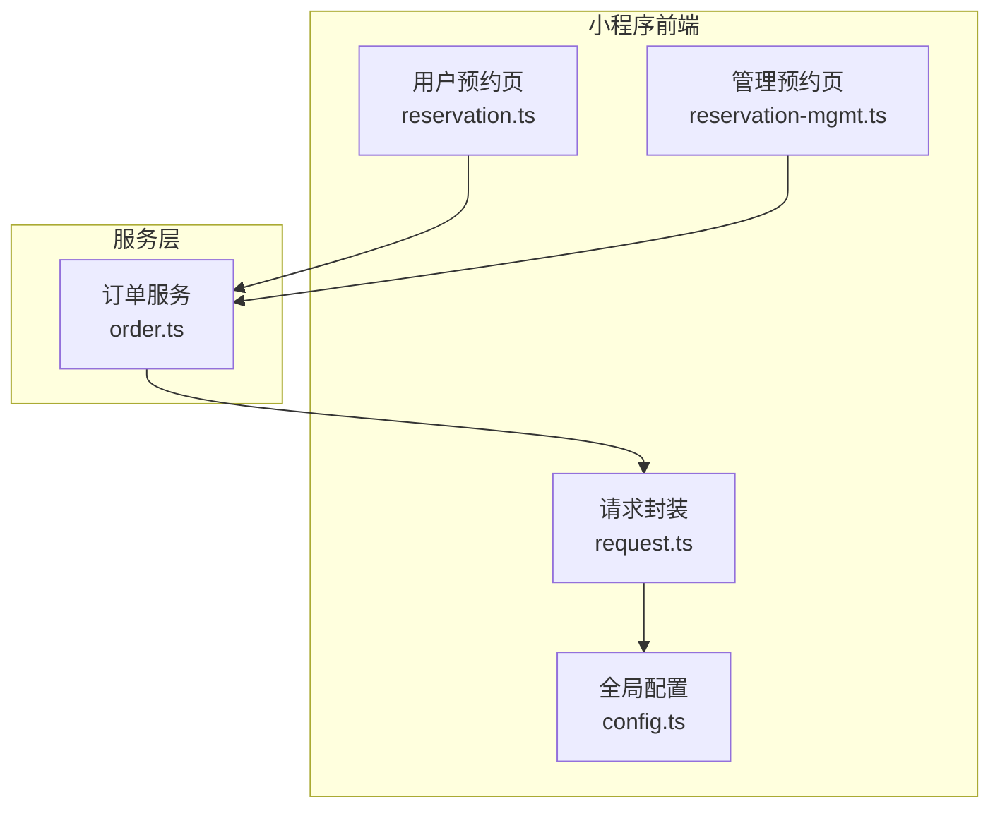
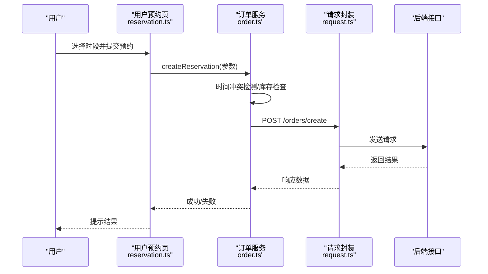
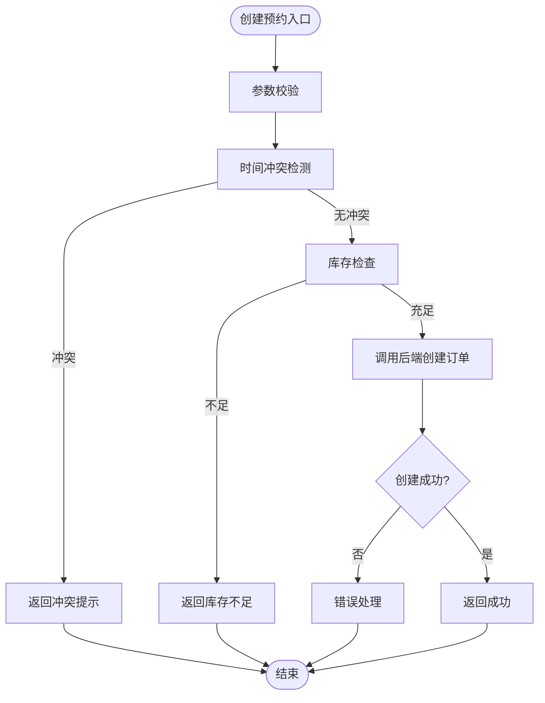
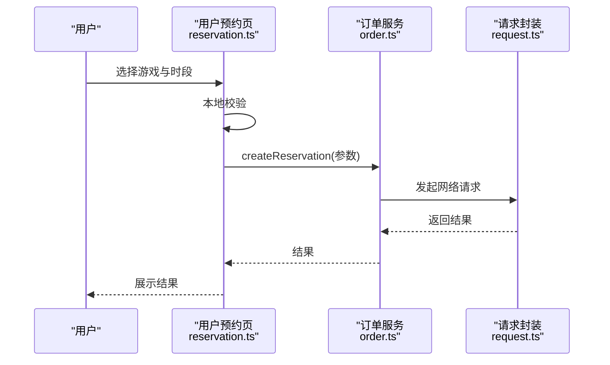
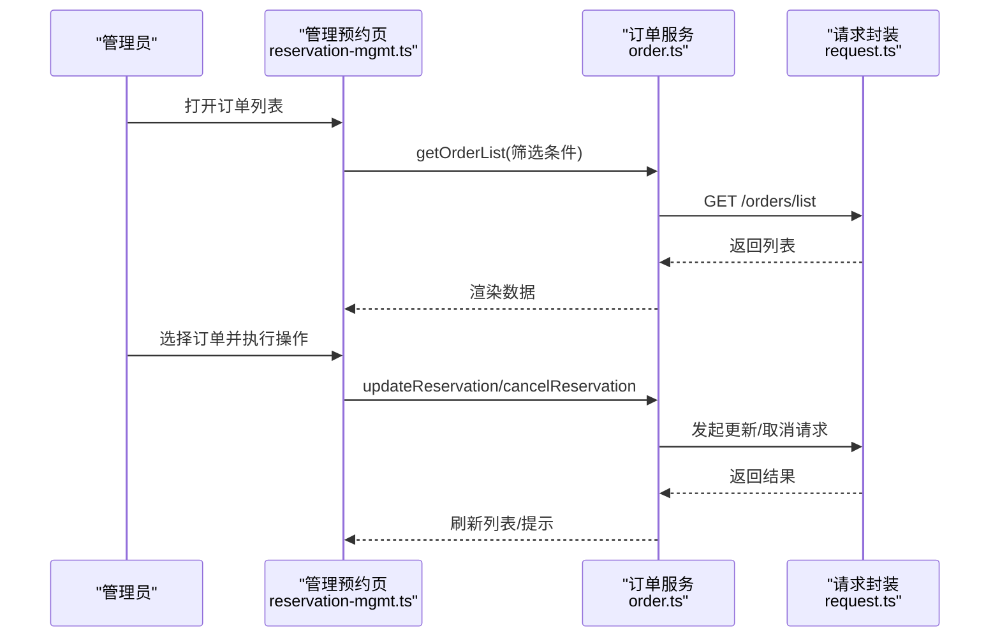
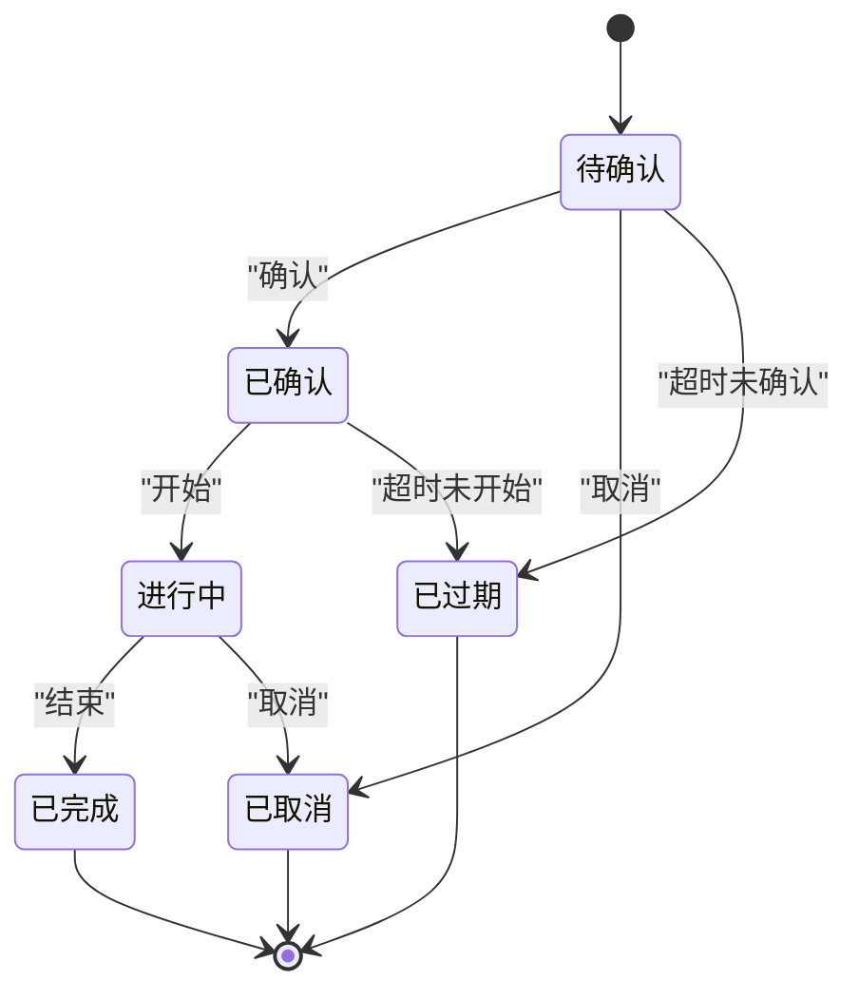
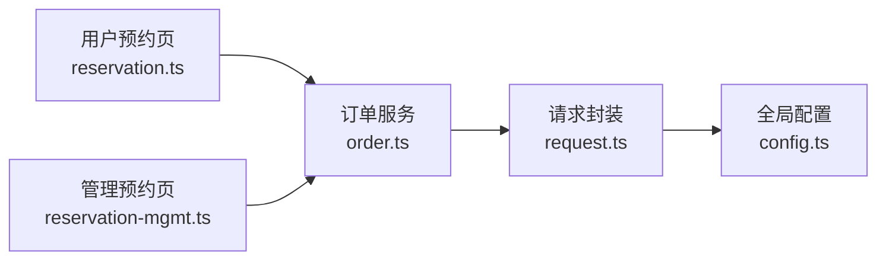

# 订单模块

<cite>
**本文引用的文件**   
- [services/order.ts](file://miniprogram/services/order.ts)
- [pages/user/reservation/reservation.ts](file://miniprogram/pages/user/reservation/reservation.ts)
- [pages/staff/reservation-mgmt/reservation-mgmt.ts](file://miniprogram/pages/staff/reservation-mgmt/reservation-mgmt.ts)
- [utils/request.ts](file://miniprogram/utils/request.ts)
- [config.ts](file://miniprogram/config.ts)
</cite>

## 目录
1. [简介](#简介)
2. [项目结构](#项目结构)
3. [核心组件](#核心组件)
4. [架构总览](#架构总览)
5. [详细组件分析](#详细组件分析)
6. [依赖分析](#依赖分析)
7. [性能考虑](#性能考虑)
8. [故障排查指南](#故障排查指南)
9. [结论](#结论)
10. [附录](#附录)

## 简介
本文件面向桌游预约小程序的“订单模块”，聚焦预约订单的全生命周期管理，包括创建、查询、修改与取消；解释 order 服务层的核心能力（时间冲突检测、库存管理、状态流转）；区分用户端预约流程与管理人员端处理流程的差异；并给出数据模型、状态机设计与并发控制机制的建议。文档同时提供预约规则配置与异常处理策略，帮助读者快速理解与落地实现。

## 项目结构
订单相关代码主要分布在以下位置：
- 服务层：miniprogram/services/order.ts
- 用户端页面：miniprogram/pages/user/reservation/reservation.ts
- 管理端页面：miniprogram/pages/staff/reservation-mgmt/reservation-mgmt.ts
- 请求封装：miniprogram/utils/request.ts
- 全局配置：miniprogram/config.ts

图表来源
- [pages/user/reservation/reservation.ts](file://miniprogram/pages/user/reservation/reservation.ts)
- [pages/staff/reservation-mgmt/reservation-mgmt.ts](file://miniprogram/pages/staff/reservation-mgmt/reservation-mgmt.ts)
- [services/order.ts](file://miniprogram/services/order.ts)
- [utils/request.ts](file://miniprogram/utils/request.ts)
- [config.ts](file://miniprogram/config.ts)

章节来源
- [services/order.ts](file://miniprogram/services/order.ts)
- [pages/user/reservation/reservation.ts](file://miniprogram/pages/user/reservation/reservation.ts)
- [pages/staff/reservation-mgmt/reservation-mgmt.ts](file://miniprogram/pages/staff/reservation-mgmt/reservation-mgmt.ts)
- [utils/request.ts](file://miniprogram/utils/request.ts)
- [config.ts](file://miniprogram/config.ts)

## 核心组件
- 订单服务（order.ts）
  - 职责：聚合预约相关的业务操作，如创建预约、查询订单、修改信息、取消订单等；协调时间冲突检测、库存扣减/释放、状态流转等关键逻辑。
  - 对外接口：建议包含 createReservation、getOrderList、getOrderDetail、updateReservation、cancelReservation 等方法（具体以实际实现为准）。
- 用户端预约页（reservation.ts）
  - 职责：渲染时间网格、展示可约时段、收集用户选择并提交预约；处理本地校验与错误提示。
- 管理端预约页（reservation-mgmt.ts）
  - 职责：展示订单列表、支持审核/确认/改期/取消等操作；用于后台人员处理预约。
- 请求封装（request.ts）
  - 职责：统一网络请求、鉴权头注入、重试与超时控制、错误码映射。
- 全局配置（config.ts）
  - 职责：API 基础地址、超时、重试次数、功能开关等。

章节来源
- [services/order.ts](file://miniprogram/services/order.ts)
- [pages/user/reservation/reservation.ts](file://miniprogram/pages/user/reservation/reservation.ts)
- [pages/staff/reservation-mgmt/reservation-mgmt.ts](file://miniprogram/pages/staff/reservation-mgmt/reservation-mgmt.ts)
- [utils/request.ts](file://miniprogram/utils/request.ts)
- [config.ts](file://miniprogram/config.ts)

## 架构总览
订单模块采用“页面-服务-请求”的分层结构：页面负责交互与展示，服务层封装业务逻辑，请求层负责与后端通信。

图表来源
- [pages/user/reservation/reservation.ts](file://miniprogram/pages/user/reservation/reservation.ts)
- [services/order.ts](file://miniprogram/services/order.ts)
- [utils/request.ts](file://miniprogram/utils/request.ts)

## 详细组件分析

### 订单服务（order.ts）
- 核心能力
  - 创建预约：接收游戏、时段、人数等参数，进行时间冲突检测与库存校验，成功后调用后端创建订单。
  - 查询订单：支持按条件分页查询、详情获取。
  - 修改预约：支持改期、变更人数或座位等，需重新进行冲突与库存校验。
  - 取消预约：根据状态机允许取消，并释放库存。
- 时间冲突检测
  - 输入：游戏ID、日期、开始时间、结束时间、场次容量。
  - 输出：是否冲突及冲突详情。
  - 策略：基于已有订单的时间区间与目标区间做交集判断；若超出容量则拒绝。
- 库存管理
  - 资源维度：座位数/桌数/道具包等。
  - 扣减时机：下单成功时预占或正式扣减（建议预占+支付确认后正式扣减）。
  - 释放时机：取消、过期未支付、人工撤销等。
- 状态流转
  - 典型状态：待确认、已确认、进行中、已完成、已取消、已过期。
  - 转换规则：由用户操作与管理端操作共同驱动，需满足前置条件（如仅待确认可取消）。

图表来源
- [services/order.ts](file://miniprogram/services/order.ts)

章节来源
- [services/order.ts](file://miniprogram/services/order.ts)

### 用户端预约流程（reservation.ts）
- 交互要点
  - 渲染时间网格，禁用不可约时段。
  - 收集用户选择（游戏、日期、时段、人数），提交前本地校验。
  - 调用 order 服务创建预约，展示成功/失败反馈。
- 与 order 服务的协作
  - 将用户输入转换为服务层所需参数。
  - 处理服务层返回的错误码与提示信息。

图表来源
- [pages/user/reservation/reservation.ts](file://miniprogram/pages/user/reservation/reservation.ts)
- [services/order.ts](file://miniprogram/services/order.ts)
- [utils/request.ts](file://miniprogram/utils/request.ts)

章节来源
- [pages/user/reservation/reservation.ts](file://miniprogram/pages/user/reservation/reservation.ts)
- [services/order.ts](file://miniprogram/services/order.ts)

### 管理端预约处理流程（reservation-mgmt.ts）
- 功能要点
  - 订单列表展示、筛选与分页。
  - 订单详情查看、改期、确认、取消等操作。
  - 批量处理与操作审计（建议）。
- 与 order 服务的协作
  - 调用 get 系列接口获取订单数据。
  - 调用 update/cancel 接口执行管理操作。

图表来源
- [pages/staff/reservation-mgmt/reservation-mgmt.ts](file://miniprogram/pages/staff/reservation-mgmt/reservation-mgmt.ts)
- [services/order.ts](file://miniprogram/services/order.ts)
- [utils/request.ts](file://miniprogram/utils/request.ts)

章节来源
- [pages/staff/reservation-mgmt/reservation-mgmt.ts](file://miniprogram/pages/staff/reservation-mgmt/reservation-mgmt.ts)
- [services/order.ts](file://miniprogram/services/order.ts)

### 数据模型（建议）
以下为订单模块常用数据模型的字段建议，便于前后端对齐与校验：
- 订单（Order）
  - id：订单唯一标识
  - userId：用户标识
  - gameId：游戏标识
  - date：预约日期
  - startTime：开始时间
  - endTime：结束时间
  - seats：座位数/人数
  - status：订单状态
  - createdAt：创建时间
  - updatedAt：更新时间
- 库存（Inventory）
  - gameId：游戏标识
  - date：日期
  - slots：时段集合（含开始/结束时间与可用数量）
- 时间槽（Slot）
  - start：开始时间
  - end：结束时间
  - available：可用数量

章节来源
- [services/order.ts](file://miniprogram/services/order.ts)

### 状态机设计（建议）
- 状态集合：待确认、已确认、进行中、已完成、已取消、已过期
- 转换规则（示例）
  - 待确认 → 已确认：管理端确认或自动确认
  - 待确认 → 已取消：用户取消或管理端取消
  - 已确认 → 进行中：到达开始时间或管理端标记
  - 进行中 → 已完成：到达结束时间或管理端标记
  - 任意可取消状态 → 已取消：符合取消规则
  - 超过截止时间未确认 → 已过期

图表来源
- [services/order.ts](file://miniprogram/services/order.ts)

### 并发控制机制（建议）
- 幂等性
  - 为创建订单接口提供幂等键（如 userId+gameId+date+startTime+endTime+seats 的哈希），避免重复提交导致重复订单。
- 分布式锁
  - 对同一游戏+日期的时段加锁，确保并发下库存一致性。
- 乐观锁
  - 在库存表增加版本号字段，更新时比较版本，失败则重试或提示。
- 事务边界
  - 将冲突检测、库存扣减、订单落库放在同一事务中，保证一致性。
- 前端防抖与去重
  - 提交按钮防抖，防止多次点击；记录最近提交参数，避免重复请求。

章节来源
- [services/order.ts](file://miniprogram/services/order.ts)
- [utils/request.ts](file://miniprogram/utils/request.ts)

### 预约规则配置（建议）
- 最小预约时长、最大预约时长
- 提前预约窗口（如最多提前几天）
- 最晚取消时间（如开始前 N 分钟）
- 单人/多人上限
- 特殊节假日规则（如只开放部分时段）
- 库存策略（固定库存 vs 动态库存）

章节来源
- [config.ts](file://miniprogram/config.ts)
- [services/order.ts](file://miniprogram/services/order.ts)

### 异常处理策略（建议）
- 网络异常
  - 超时重试、指数退避、降级提示。
- 业务异常
  - 时间冲突、库存不足、状态不允许操作等，返回明确错误码与提示文案。
- 数据校验
  - 前端基础校验 + 服务端严格校验，避免脏数据进入系统。
- 监控与告警
  - 记录关键错误日志，设置阈值告警。

章节来源
- [utils/request.ts](file://miniprogram/utils/request.ts)
- [services/order.ts](file://miniprogram/services/order.ts)

## 依赖分析
订单模块依赖关系如下：
- 页面层依赖服务层（order.ts）
- 服务层依赖请求封装（request.ts）
- 请求封装依赖全局配置（config.ts）

图表来源
- [pages/user/reservation/reservation.ts](file://miniprogram/pages/user/reservation/reservation.ts)
- [pages/staff/reservation-mgmt/reservation-mgmt.ts](file://miniprogram/pages/staff/reservation-mgmt/reservation-mgmt.ts)
- [services/order.ts](file://miniprogram/services/order.ts)
- [utils/request.ts](file://miniprogram/utils/request.ts)
- [config.ts](file://miniprogram/config.ts)

章节来源
- [services/order.ts](file://miniprogram/services/order.ts)
- [utils/request.ts](file://miniprogram/utils/request.ts)
- [config.ts](file://miniprogram/config.ts)

## 性能考虑
- 减少不必要的请求：合并查询、分页加载、缓存热点数据（如时段可用性）。
- 优化冲突检测：在服务端使用索引与范围查询，避免全表扫描。
- 异步处理：耗时操作（如库存计算）异步化，提升响应速度。
- 前端体验：骨架屏、懒加载、图片压缩。

[本节为通用指导，不直接分析具体文件]

## 故障排查指南
- 常见问题
  - 时间冲突误判：检查时段边界计算与数据库存储格式。
  - 库存不一致：核对并发锁与事务边界，检查扣减与释放路径。
  - 状态流转异常：确认状态机规则与操作权限。
  - 网络错误：检查超时、重试策略与后端可用性。
- 定位方法
  - 查看请求日志与错误码映射。
  - 复现步骤与输入参数记录。
  - 分阶段断点（前端→服务→后端）。

章节来源
- [utils/request.ts](file://miniprogram/utils/request.ts)
- [services/order.ts](file://miniprogram/services/order.ts)

## 结论
订单模块通过清晰的分层与明确的职责划分，实现了预约订单的完整生命周期管理。建议在现有基础上完善状态机、并发控制与异常处理策略，以提升系统的稳定性与用户体验。同时，结合预约规则配置，灵活适配不同场景的业务需求。

[本节为总结性内容，不直接分析具体文件]

## 附录
- 术语
  - 预约：用户在指定时间参与游戏的预订行为。
  - 订单：预约行为产生的业务单据。
  - 库存：可用于预约的资源数量（座位/桌数等）。
- 参考文件
  - [services/order.ts](file://miniprogram/services/order.ts)
  - [pages/user/reservation/reservation.ts](file://miniprogram/pages/user/reservation/reservation.ts)
  - [pages/staff/reservation-mgmt/reservation-mgmt.ts](file://miniprogram/pages/staff/reservation-mgmt/reservation-mgmt.ts)
  - [utils/request.ts](file://miniprogram/utils/request.ts)
  - [config.ts](file://miniprogram/config.ts)