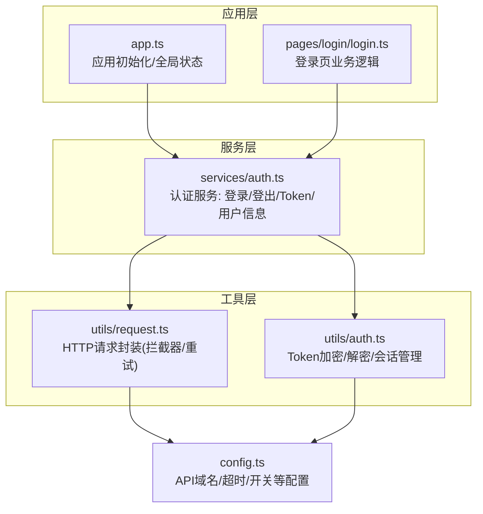
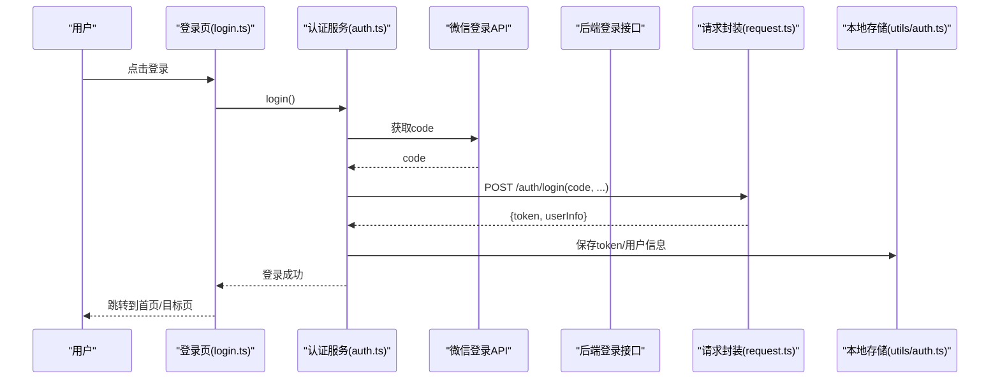
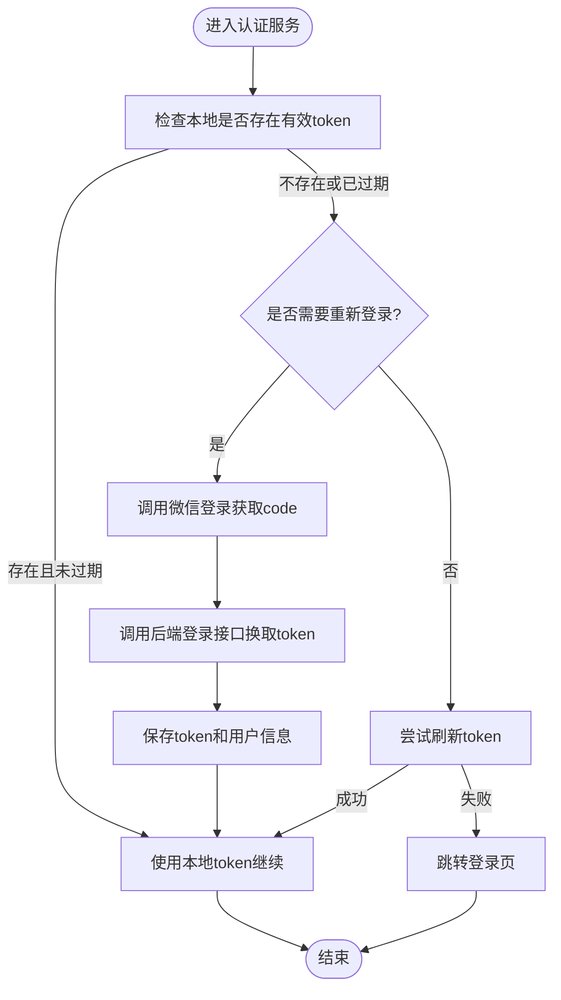
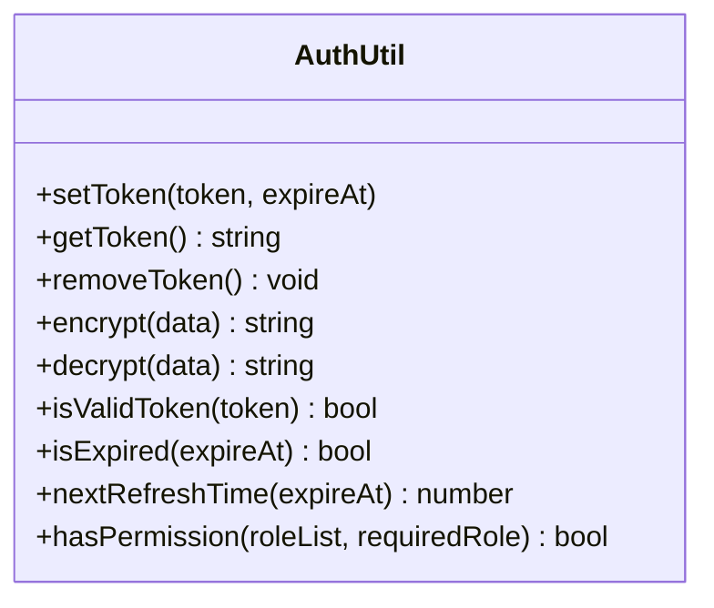
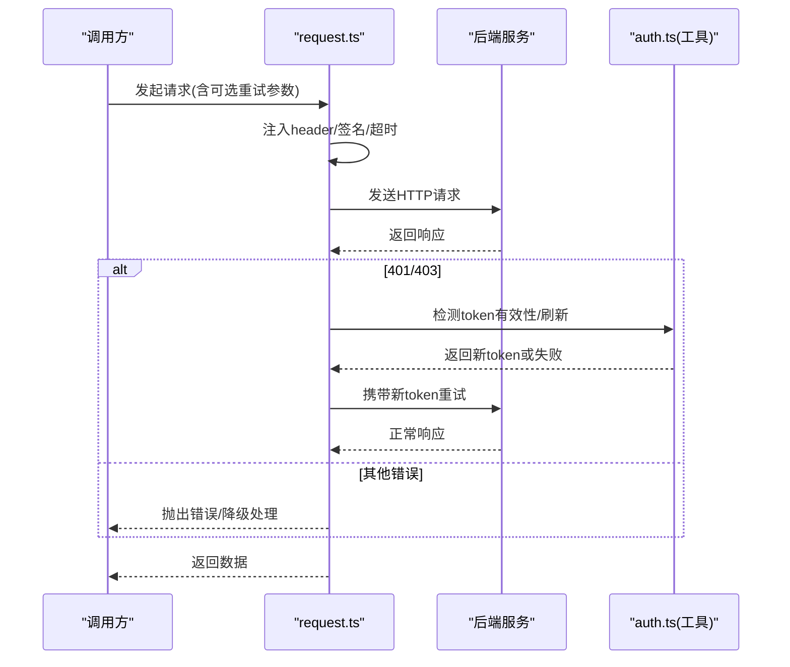
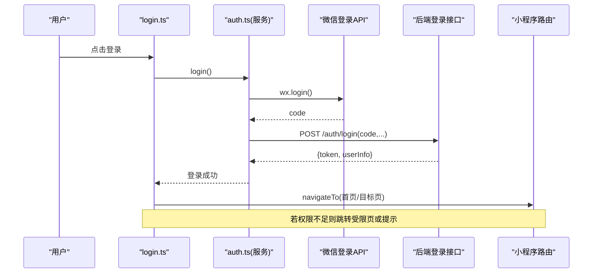
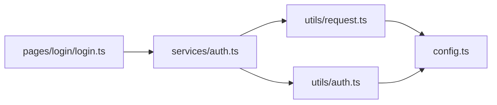

# 认证模块

<cite>
**本文引用的文件**   
- [app.ts](file://miniprogram/app.ts)
- [config.ts](file://miniprogram/config.ts)
- [auth.ts](file://miniprogram/services/auth.ts)
- [auth.ts](file://miniprogram/utils/auth.ts)
- [request.ts](file://miniprogram/utils/request.ts)
- [login.ts](file://miniprogram/pages/login/login.ts)
</cite>

## 目录
1. [简介](#简介)
2. [项目结构](#项目结构)
3. [核心组件](#核心组件)
4. [架构总览](#架构总览)
5. [详细组件分析](#详细组件分析)
6. [依赖关系分析](#依赖关系分析)
7. [性能考虑](#性能考虑)
8. [故障排查指南](#故障排查指南)
9. [结论](#结论)
10. [附录](#附录)

## 简介
本文件面向微信小程序项目的“认证模块”，系统化说明用户认证流程、登录状态管理、权限控制机制，以及 auth 服务层与工具层的实现原理。重点覆盖：
- 微信登录接口调用与后端会话建立
- Token 的存储、刷新与验证
- 用户信息获取与会话生命周期管理
- 页面级与路由级权限判断
- 认证失败错误处理与重试策略
- 登录页面的业务流程

## 项目结构
认证相关代码主要分布在以下位置：
- 应用入口与全局配置：app.ts、config.ts
- 认证服务层：services/auth.ts
- 认证工具层：utils/auth.ts、utils/request.ts
- 登录页面：pages/login/login.ts

图表来源
- [app.ts](file://miniprogram/app.ts)
- [config.ts](file://miniprogram/config.ts)
- [auth.ts](file://miniprogram/services/auth.ts)
- [auth.ts](file://miniprogram/utils/auth.ts)
- [request.ts](file://miniprogram/utils/request.ts)
- [login.ts](file://miniprogram/pages/login/login.ts)

章节来源
- [app.ts](file://miniprogram/app.ts)
- [config.ts](file://miniprogram/config.ts)
- [auth.ts](file://miniprogram/services/auth.ts)
- [auth.ts](file://miniprogram/utils/auth.ts)
- [request.ts](file://miniprogram/utils/request.ts)
- [login.ts](file://miniprogram/pages/login/login.ts)

## 核心组件
- 认证服务（services/auth.ts）
  - 职责：封装微信登录、后端登录、Token 获取与刷新、用户信息拉取、登出清理、鉴权前置检查。
  - 关键能力：
    - 调用微信登录接口获取 code，再调用后端登录接口换取 token
    - 将 token 持久化到本地存储，并在后续请求中自动注入
    - 提供 isLogin、getUserInfo、refreshToken 等便捷方法
- 认证工具（utils/auth.ts）
  - 职责：token 的加密/解密、本地存储键值管理、会话有效性校验、过期时间计算。
  - 关键能力：
    - set/get/clear 封装本地存储
    - encrypt/decrypt 对敏感字段进行加解密
    - isValidToken、isExpired、nextRefreshTime 等辅助函数
- HTTP 请求封装（utils/request.ts）
  - 职责：统一发起网络请求，集中处理请求头注入、响应拦截、错误码映射、重试与退避。
  - 关键能力：
    - 自动附加 Authorization/Bearer 或自定义 header
    - 401/403 时触发刷新或跳转登录
    - 可配置的重试次数与指数退避
- 登录页面（pages/login/login.ts）
  - 职责：引导用户授权登录，调用认证服务完成登录流程，成功后跳转目标页或首页。
  - 关键能力：
    - 拉起微信登录授权
    - 处理登录成功/失败回调
    - 根据权限决定跳转路径

章节来源
- [auth.ts](file://miniprogram/services/auth.ts)
- [auth.ts](file://miniprogram/utils/auth.ts)
- [request.ts](file://miniprogram/utils/request.ts)
- [login.ts](file://miniprogram/pages/login/login.ts)

## 架构总览
认证模块采用“页面 → 服务层 → 工具层”的分层设计，配合统一的 HTTP 请求封装，形成闭环的鉴权链路。

图表来源
- [login.ts](file://miniprogram/pages/login/login.ts)
- [auth.ts](file://miniprogram/services/auth.ts)
- [request.ts](file://miniprogram/utils/request.ts)
- [auth.ts](file://miniprogram/utils/auth.ts)

## 详细组件分析

### 认证服务层（services/auth.ts）
- 登录流程
  - 调用微信登录获取 code
  - 通过 request 封装调用后端登录接口
  - 解析返回的 token 与用户信息，写入本地存储
  - 返回登录结果并触发全局状态更新
- Token 管理
  - 提供 getToken/setToken/removeToken 等方法
  - 支持 token 刷新接口调用与缓存
- 用户信息
  - 提供 getUserInfo/getUserInfoFromStorage 等方法
  - 在需要时主动拉取最新用户信息
- 鉴权前置
  - 提供 checkAuth/isLogin 等方法用于路由守卫或页面级权限判断
  - 未登录时引导至登录页

图表来源
- [auth.ts](file://miniprogram/services/auth.ts)
- [auth.ts](file://miniprogram/utils/auth.ts)
- [request.ts](file://miniprogram/utils/request.ts)

章节来源
- [auth.ts](file://miniprogram/services/auth.ts)
- [auth.ts](file://miniprogram/utils/auth.ts)
- [request.ts](file://miniprogram/utils/request.ts)

### 认证工具层（utils/auth.ts）
- 加密与解密
  - 对 token 或敏感信息进行加密存储与读取
  - 提供安全随机盐或固定密钥策略（依据 config.ts）
- 会话管理
  - 设置/获取/清除本地存储键值
  - 计算 token 有效期、是否过期、下次刷新时间
- 权限判断
  - 基于角色/权限列表判断当前用户是否具备访问权限

图表来源
- [auth.ts](file://miniprogram/utils/auth.ts)

章节来源
- [auth.ts](file://miniprogram/utils/auth.ts)

### HTTP 请求封装（utils/request.ts）
- 请求拦截
  - 自动注入 Authorization 或自定义 header
  - 合并默认配置（超时、重试次数、基础URL等）
- 响应拦截
  - 统一错误码处理（如 401/403 触发刷新或跳转）
  - 数据解包与类型转换
- 重试与退避
  - 支持可配置的重试策略与指数退避
  - 针对网络抖动与临时服务端不可用进行容错

图表来源
- [request.ts](file://miniprogram/utils/request.ts)
- [auth.ts](file://miniprogram/utils/auth.ts)

章节来源
- [request.ts](file://miniprogram/utils/request.ts)
- [auth.ts](file://miniprogram/utils/auth.ts)

### 登录页面（pages/login/login.ts）
- 业务流程
  - 用户点击登录按钮
  - 调用认证服务的登录方法
  - 处理成功回调：保存状态、跳转目标页或首页
  - 处理失败回调：提示错误、允许重试或回退
- 权限判断
  - 登录后根据用户角色/权限决定可访问页面
  - 无权限时展示受限提示或引导升级

图表来源
- [login.ts](file://miniprogram/pages/login/login.ts)
- [auth.ts](file://miniprogram/services/auth.ts)

章节来源
- [login.ts](file://miniprogram/pages/login/login.ts)
- [auth.ts](file://miniprogram/services/auth.ts)

## 依赖关系分析
- 页面层依赖服务层：登录页调用认证服务完成登录与鉴权
- 服务层依赖工具层：认证服务使用工具层进行 token 加解密与本地存储
- 服务层依赖请求封装：所有后端交互通过 request.ts 统一处理
- 配置中心：config.ts 提供 API 域名、超时、重试策略等全局配置

图表来源
- [login.ts](file://miniprogram/pages/login/login.ts)
- [auth.ts](file://miniprogram/services/auth.ts)
- [request.ts](file://miniprogram/utils/request.ts)
- [auth.ts](file://miniprogram/utils/auth.ts)
- [config.ts](file://miniprogram/config.ts)

章节来源
- [login.ts](file://miniprogram/pages/login/login.ts)
- [auth.ts](file://miniprogram/services/auth.ts)
- [request.ts](file://miniprogram/utils/request.ts)
- [auth.ts](file://miniprogram/utils/auth.ts)
- [config.ts](file://miniprogram/config.ts)

## 性能考虑
- Token 本地缓存与最小化网络请求
  - 优先使用本地 token，避免重复登录
  - 仅在必要时刷新 token，减少后端压力
- 请求去抖与合并
  - 对高频鉴权请求进行去抖或合并，降低并发
- 重试与退避
  - 合理设置重试次数与退避间隔，避免雪崩
- 内存与存储优化
  - 及时清理无效 token 与用户信息，避免存储膨胀
- 首屏体验
  - 登录态校验与必要数据预取并行执行，缩短等待时间

[本节为通用指导，不直接分析具体文件]

## 故障排查指南
- 常见问题定位
  - 无法获取 code：检查微信登录授权与网络环境
  - 后端登录失败：核对 code 有效性、后端接口地址与参数
  - Token 无效或过期：检查本地存储是否被清理、刷新逻辑是否生效
  - 权限不足：确认用户角色与页面所需权限匹配
- 错误处理策略
  - 401：尝试刷新 token；失败则跳转登录页并清空本地状态
  - 403：提示权限不足，限制操作或引导升级
  - 网络错误：启用重试与退避，必要时降级显示
- 调试建议
  - 打印关键步骤日志（code、token、过期时间、请求头）
  - 使用小程序开发者工具的 Network 面板查看请求与响应
  - 检查 config.ts 中的超时与重试配置是否合理

章节来源
- [request.ts](file://miniprogram/utils/request.ts)
- [auth.ts](file://miniprogram/utils/auth.ts)
- [auth.ts](file://miniprogram/services/auth.ts)

## 结论
认证模块通过清晰的分层设计与统一的请求封装，实现了稳定的微信登录、Token 管理与权限控制。借助工具层的加解密与本地存储能力，结合服务层的鉴权前置与页面层的流程编排，整体具备良好的可维护性与扩展性。建议在后续迭代中持续完善重试策略、错误提示与监控埋点，以提升用户体验与系统稳定性。

[本节为总结性内容，不直接分析具体文件]

## 附录
- 术语说明
  - Token：后端颁发的身份凭证，通常以 Bearer 形式在请求头中传递
  - 会话：客户端侧对用户登录状态的抽象，包含 token、用户信息与过期时间
  - 权限：基于角色或资源维度的访问控制策略
- 最佳实践
  - 统一错误码与提示文案
  - 严格校验输入与输出，防止越权访问
  - 定期轮换密钥与刷新策略，提升安全性

[本节为概念性内容，不直接分析具体文件]