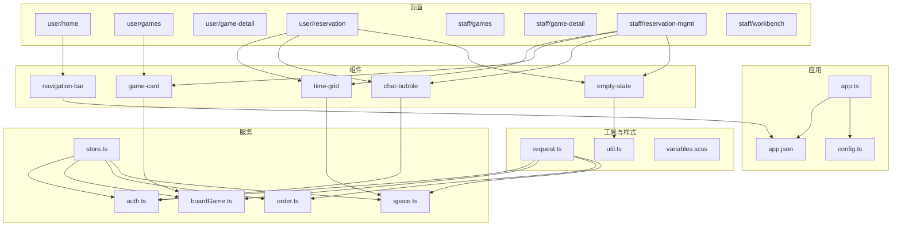
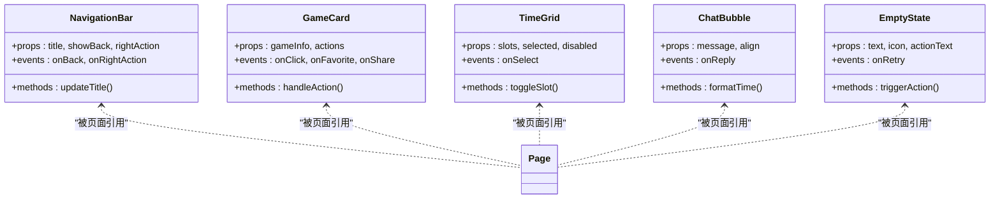
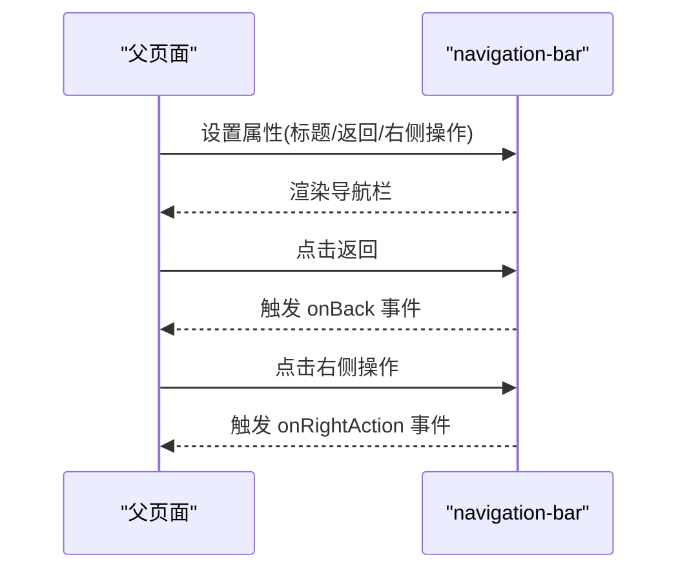
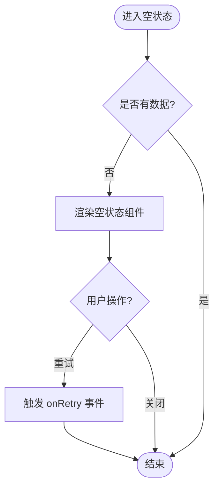
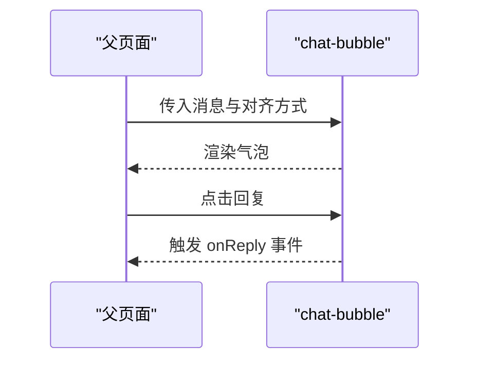
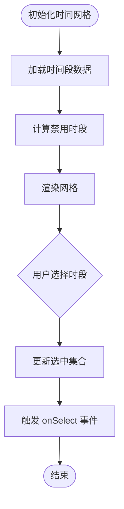
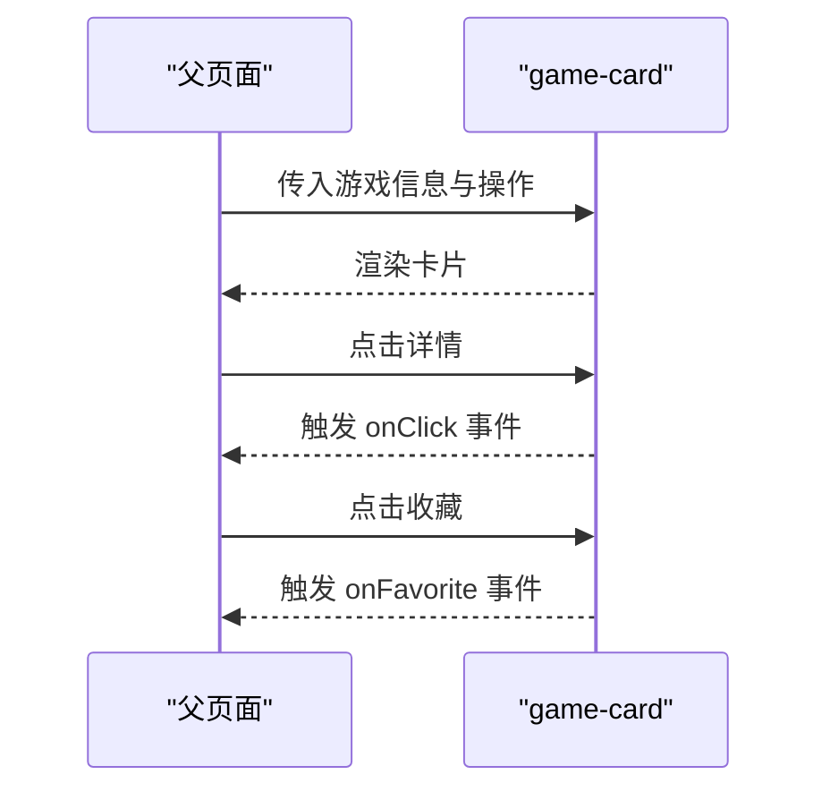
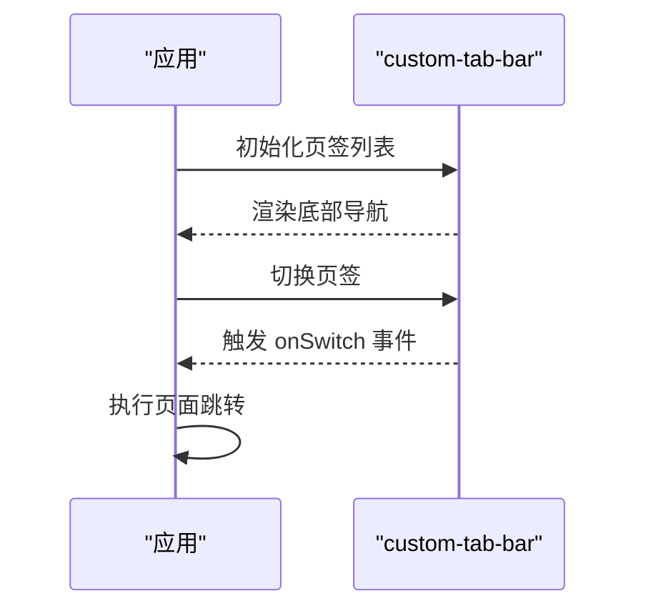
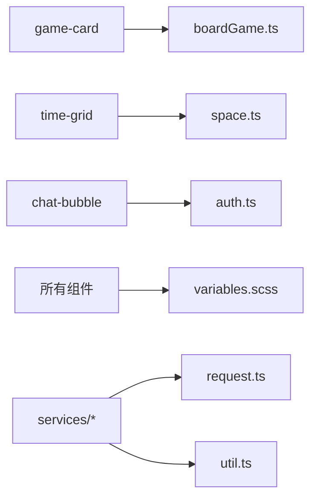

# 组件架构设计

<cite>
**本文档引用的文件**   
- [app.ts](file://miniprogram/app.ts)
- [app.json](file://miniprogram/app.json)
- [config.ts](file://miniprogram/config.ts)
- [chat-bubble.ts](file://miniprogram/components/chat-bubble/chat-bubble.ts)
- [chat-bubble.wxml](file://miniprogram/components/chat-bubble/chat-bubble.wxml)
- [chat-bubble.scss](file://miniprogram/components/chat-bubble/chat-bubble.scss)
- [empty-state.ts](file://miniprogram/components/empty-state/empty-state.ts)
- [empty-state.wxml](file://miniprogram/components/empty-state/empty-state.wxml)
- [empty-state.scss](file://miniprogram/components/empty-state/empty-state.scss)
- [game-card.ts](file://miniprogram/components/game-card/game-card.ts)
- [game-card.wxml](file://miniprogram/components/game-card/game-card.wxml)
- [game-card.scss](file://miniprogram/components/game-card/game-card.scss)
- [navigation-bar.ts](file://miniprogram/components/navigation-bar/navigation-bar.ts)
- [navigation-bar.wxml](file://miniprogram/components/navigation-bar/navigation-bar.wxml)
- [navigation-bar.scss](file://miniprogram/components/navigation-bar/navigation-bar.scss)
- [time-grid.ts](file://miniprogram/components/time-grid/time-grid.ts)
- [time-grid.wxml](file://miniprogram/components/time-grid/time-grid.wxml)
- [time-grid.scss](file://miniprogram/components/time-grid/time-grid.scss)
- [custom-tab-bar/index.ts](file://miniprogram/custom-tab-bar/index.ts)
- [custom-tab-bar/index.wxml](file://miniprogram/custom-tab-bar/index.wxml)
- [custom-tab-bar/index.scss](file://miniprogram/custom-tab-bar/index.scss)
- [services/boardGame.ts](file://miniprogram/services/boardGame.ts)
- [services/order.ts](file://miniprogram/services/order.ts)
- [services/auth.ts](file://miniprogram/services/auth.ts)
- [services/space.ts](file://miniprogram/services/space.ts)
- [services/store.ts](file://miniprogram/services/store.ts)
- [utils/request.ts](file://miniprogram/utils/request.ts)
- [utils/util.ts](file://miniprogram/utils/util.ts)
- [styles/variables.scss](file://miniprogram/styles/variables.scss)
</cite>

## 目录
1. [简介](#简介)
2. [项目结构](#项目结构)
3. [核心组件](#核心组件)
4. [架构总览](#架构总览)
5. [详细组件分析](#详细组件分析)
6. [依赖关系分析](#依赖关系分析)
7. [性能考虑](#性能考虑)
8. [故障排查指南](#故障排查指南)
9. [结论](#结论)
10. [附录](#附录)

## 简介
本文件面向“小程序桌面游戏预约系统”的组件化架构设计，围绕通用组件与业务组件的分类、生命周期、属性传递、事件处理、插槽使用、复用策略、样式隔离与性能优化展开。同时给出父子、兄弟与跨层级通信的实现方式，并以图表展示组件层次结构与交互关系，帮助读者快速理解并落地实现。

## 项目结构
- 组件位于 miniprogram/components，按功能拆分为独立子目录，每个组件包含 .ts/.wxml/.scss/.json 四件套，便于维护与复用。
- 页面位于 miniprogram/pages，按角色（用户/员工）与场景划分，如 user/home、staff/reservation-mgmt 等。
- 服务层位于 miniprogram/services，封装网络请求、订单、空间、认证等业务能力。
- 工具与配置位于 miniprogram/utils 与 miniprogram/styles，提供请求封装、通用方法与全局变量。
- 自定义 TabBar 位于 miniprogram/custom-tab-bar，作为全局导航入口。

**图示来源** 
- [app.ts](file://miniprogram/app.ts)
- [app.json](file://miniprogram/app.json)
- [config.ts](file://miniprogram/config.ts)
- [navigation-bar.ts](file://miniprogram/components/navigation-bar/navigation-bar.ts)
- [game-card.ts](file://miniprogram/components/game-card/game-card.ts)
- [time-grid.ts](file://miniprogram/components/time-grid/time-grid.ts)
- [chat-bubble.ts](file://miniprogram/components/chat-bubble/chat-bubble.ts)
- [empty-state.ts](file://miniprogram/components/empty-state/empty-state.ts)
- [services/boardGame.ts](file://miniprogram/services/boardGame.ts)
- [services/order.ts](file://miniprogram/services/order.ts)
- [services/auth.ts](file://miniprogram/services/auth.ts)
- [services/space.ts](file://miniprogram/services/space.ts)
- [services/store.ts](file://miniprogram/services/store.ts)
- [utils/request.ts](file://miniprogram/utils/request.ts)
- [utils/util.ts](file://miniprogram/utils/util.ts)
- [styles/variables.scss](file://miniprogram/styles/variables.scss)

**章节来源**
- [app.ts](file://miniprogram/app.ts)
- [app.json](file://miniprogram/app.json)
- [config.ts](file://miniprogram/config.ts)

## 核心组件
- 通用组件
  - navigation-bar：统一导航栏，支持标题、返回按钮、右侧操作等；通过属性控制显示，通过事件通知父级跳转或操作。
  - empty-state：空状态占位，用于无数据或加载失败时的提示；通过属性切换文案与图标，支持点击重试事件。
  - chat-bubble：聊天气泡，用于消息展示；支持左右对齐、类型区分、时间戳显示等。
  - time-grid：时间网格，用于选择时间段；支持多选、禁用态、选中高亮等。
- 业务组件
  - game-card：游戏卡片，展示游戏封面、名称、人数、标签、价格等；支持点击跳转详情、收藏、分享等。

这些组件遵循“单一职责、可配置、可组合”的原则，通过属性驱动渲染，通过事件回调向上汇报状态变化。

**章节来源**
- [navigation-bar.ts](file://miniprogram/components/navigation-bar/navigation-bar.ts)
- [empty-state.ts](file://miniprogram/components/empty-state/empty-state.ts)
- [chat-bubble.ts](file://miniprogram/components/chat-bubble/chat-bubble.ts)
- [time-grid.ts](file://miniprogram/components/time-grid/time-grid.ts)
- [game-card.ts](file://miniprogram/components/game-card/game-card.ts)

## 架构总览
整体采用“页面-组件-服务-工具”的分层架构：
- 页面层负责路由与布局编排，调用组件与服务完成业务。
- 组件层聚焦 UI 与交互，通过属性接收数据、通过事件上报动作。
- 服务层封装 API 与状态管理，供页面与组件按需调用。
- 工具层提供请求封装、通用方法、样式变量等基础能力。

**图示来源**
- [navigation-bar.ts](file://miniprogram/components/navigation-bar/navigation-bar.ts)
- [game-card.ts](file://miniprogram/components/game-card/game-card.ts)
- [time-grid.ts](file://miniprogram/components/time-grid/time-grid.ts)
- [chat-bubble.ts](file://miniprogram/components/chat-bubble/chat-bubble.ts)
- [empty-state.ts](file://miniprogram/components/empty-state/empty-state.ts)

## 详细组件分析

### 通用组件：navigation-bar
- 职责：统一顶部导航，控制标题、返回按钮、右侧操作区。
- 属性：标题文本、是否显示返回、右侧操作项数组。
- 事件：返回事件、右侧操作事件。
- 生命周期：初始化时根据属性渲染标题与按钮；监听属性变更更新视图。
- 插槽：可选右侧插槽，允许父级注入自定义内容。
- 样式隔离：使用组件内 scss，避免污染全局样式。
- 性能：仅渲染必要节点，避免频繁重绘。

**图示来源**
- [navigation-bar.ts](file://miniprogram/components/navigation-bar/navigation-bar.ts)
- [navigation-bar.wxml](file://miniprogram/components/navigation-bar/navigation-bar.wxml)
- [navigation-bar.scss](file://miniprogram/components/navigation-bar/navigation-bar.scss)

**章节来源**
- [navigation-bar.ts](file://miniprogram/components/navigation-bar/navigation-bar.ts)
- [navigation-bar.wxml](file://miniprogram/components/navigation-bar/navigation-bar.wxml)
- [navigation-bar.scss](file://miniprogram/components/navigation-bar/navigation-bar.scss)

### 通用组件：empty-state
- 职责：空状态展示，提升用户体验。
- 属性：提示文案、图标、操作文案。
- 事件：重试/操作事件。
- 生命周期：根据属性动态渲染内容与按钮。
- 插槽：可选底部插槽，用于扩展说明。
- 样式隔离：组件内 scss，主题色由变量注入。
- 性能：条件渲染，减少无效节点。

**图示来源**
- [empty-state.ts](file://miniprogram/components/empty-state/empty-state.ts)
- [empty-state.wxml](file://miniprogram/components/empty-state/empty-state.wxml)
- [empty-state.scss](file://miniprogram/components/empty-state/empty-state.scss)

**章节来源**
- [empty-state.ts](file://miniprogram/components/empty-state/empty-state.ts)
- [empty-state.wxml](file://miniprogram/components/empty-state/empty-state.wxml)
- [empty-state.scss](file://miniprogram/components/empty-state/empty-state.scss)

### 通用组件：chat-bubble
- 职责：消息气泡展示，支持左右对齐与类型区分。
- 属性：消息对象、对齐方式、时间戳。
- 事件：回复/转发等。
- 生命周期：根据消息类型渲染不同样式。
- 插槽：可选头像插槽、附加信息插槽。
- 样式隔离：组件内 scss，颜色变量来自全局。
- 性能：列表渲染时使用 key 优化 diff。

**图示来源**
- [chat-bubble.ts](file://miniprogram/components/chat-bubble/chat-bubble.ts)
- [chat-bubble.wxml](file://miniprogram/components/chat-bubble/chat-bubble.wxml)
- [chat-bubble.scss](file://miniprogram/components/chat-bubble/chat-bubble.scss)

**章节来源**
- [chat-bubble.ts](file://miniprogram/components/chat-bubble/chat-bubble.ts)
- [chat-bubble.wxml](file://miniprogram/components/chat-bubble/chat-bubble.wxml)
- [chat-bubble.scss](file://miniprogram/components/chat-bubble/chat-bubble.scss)

### 通用组件：time-grid
- 职责：时间段选择网格，支持多选与禁用态。
- 属性：时间段数组、已选集合、禁用规则。
- 事件：选择变更事件。
- 生命周期：初始化计算可用时段；监听选择变更更新选中态。
- 插槽：可选自定义单元格内容。
- 样式隔离：组件内 scss，选中态高亮。
- 性能：局部更新选中态，避免全量重绘。

**图示来源**
- [time-grid.ts](file://miniprogram/components/time-grid/time-grid.ts)
- [time-grid.wxml](file://miniprogram/components/time-grid/time-grid.wxml)
- [time-grid.scss](file://miniprogram/components/time-grid/time-grid.scss)

**章节来源**
- [time-grid.ts](file://miniprogram/components/time-grid/time-grid.ts)
- [time-grid.wxml](file://miniprogram/components/time-grid/time-grid.wxml)
- [time-grid.scss](file://miniprogram/components/time-grid/time-grid.scss)

### 业务组件：game-card
- 职责：游戏信息卡片，展示封面、名称、人数、标签、价格等。
- 属性：游戏信息对象、操作按钮数组。
- 事件：点击详情、收藏、分享等。
- 生命周期：根据游戏信息渲染不同标签与价格。
- 插槽：可选推荐标签插槽。
- 样式隔离：组件内 scss，主题色与间距一致。
- 性能：图片懒加载与占位图优化。

**图示来源**
- [game-card.ts](file://miniprogram/components/game-card/game-card.ts)
- [game-card.wxml](file://miniprogram/components/game-card/game-card.wxml)
- [game-card.scss](file://miniprogram/components/game-card/game-card.scss)

**章节来源**
- [game-card.ts](file://miniprogram/components/game-card/game-card.ts)
- [game-card.wxml](file://miniprogram/components/game-card/game-card.wxml)
- [game-card.scss](file://miniprogram/components/game-card/game-card.scss)

### 自定义 TabBar
- 职责：全局底部导航，切换页面与状态同步。
- 属性：当前选中页签、页签列表。
- 事件：切换页签事件。
- 生命周期：初始化时读取 app.json 配置；监听页面切换更新选中态。
- 样式隔离：组件内 scss，图标与文字样式统一。
- 性能：仅渲染可见页签，避免多余节点。

**图示来源**
- [custom-tab-bar/index.ts](file://miniprogram/custom-tab-bar/index.ts)
- [custom-tab-bar/index.wxml](file://miniprogram/custom-tab-bar/index.wxml)
- [custom-tab-bar/index.scss](file://miniprogram/custom-tab-bar/index.scss)
- [app.json](file://miniprogram/app.json)

**章节来源**
- [custom-tab-bar/index.ts](file://miniprogram/custom-tab-bar/index.ts)
- [custom-tab-bar/index.wxml](file://miniprogram/custom-tab-bar/index.wxml)
- [custom-tab-bar/index.scss](file://miniprogram/custom-tab-bar/index.scss)
- [app.json](file://miniprogram/app.json)

## 依赖关系分析
- 组件依赖服务：game-card 依赖 boardGame 获取游戏数据；time-grid 依赖 space 获取可用时段；chat-bubble 依赖 auth 校验登录态。
- 页面依赖组件：各页面按需引入通用与业务组件，形成清晰的 UI 组合。
- 服务依赖工具：所有服务通过 request.ts 发起网络请求，util.ts 提供通用方法。
- 样式依赖变量：components 与 pages 共用 styles/variables.scss 中的主题变量。

**图示来源**
- [game-card.ts](file://miniprogram/components/game-card/game-card.ts)
- [time-grid.ts](file://miniprogram/components/time-grid/time-grid.ts)
- [chat-bubble.ts](file://miniprogram/components/chat-bubble/chat-bubble.ts)
- [services/boardGame.ts](file://miniprogram/services/boardGame.ts)
- [services/space.ts](file://miniprogram/services/space.ts)
- [services/auth.ts](file://miniprogram/services/auth.ts)
- [utils/request.ts](file://miniprogram/utils/request.ts)
- [utils/util.ts](file://miniprogram/utils/util.ts)
- [styles/variables.scss](file://miniprogram/styles/variables.scss)

**章节来源**
- [services/boardGame.ts](file://miniprogram/services/boardGame.ts)
- [services/order.ts](file://miniprogram/services/order.ts)
- [services/auth.ts](file://miniprogram/services/auth.ts)
- [services/space.ts](file://miniprogram/services/space.ts)
- [services/store.ts](file://miniprogram/services/store.ts)
- [utils/request.ts](file://miniprogram/utils/request.ts)
- [utils/util.ts](file://miniprogram/utils/util.ts)
- [styles/variables.scss](file://miniprogram/styles/variables.scss)

## 性能考虑
- 组件粒度：将复杂页面拆分为细粒度组件，减少不必要的渲染范围。
- 属性最小化：仅传递必要数据，避免大对象频繁更新。
- 事件节流：对高频事件（如滚动、输入）进行节流或防抖。
- 列表优化：为列表项设置稳定 key，避免重复创建节点。
- 图片优化：使用懒加载与占位图，降低首屏压力。
- 样式隔离：组件内 scss 避免全局污染，减少样式冲突导致的重排。
- 状态集中：通过 services/store.ts 集中管理状态，减少冗余更新。

[本节为通用指导，不直接分析具体文件]

## 故障排查指南
- 组件未渲染：检查属性是否正确传递，确认 wxml 模板绑定无误。
- 事件未触发：确认事件命名与绑定位置，检查父级是否监听对应事件。
- 样式异常：检查组件内 scss 是否被覆盖，确认变量导入路径正确。
- 数据为空：检查服务层接口返回，确认空状态组件是否启用。
- 网络错误：查看 request.ts 的错误处理逻辑，确认超时与重试策略。

**章节来源**
- [utils/request.ts](file://miniprogram/utils/request.ts)
- [utils/util.ts](file://miniprogram/utils/util.ts)
- [services/store.ts](file://miniprogram/services/store.ts)

## 结论
本架构以组件为核心，结合服务与工具层，形成清晰的分层与职责边界。通过属性驱动与事件回调实现松耦合通信，借助样式隔离与性能优化保障体验。建议后续持续完善组件文档与测试用例，提升可维护性与可扩展性。

[本节为总结，不直接分析具体文件]

## 附录
- 组件分类建议
  - 通用组件：navigation-bar、empty-state、chat-bubble、time-grid
  - 业务组件：game-card
- 通信模式
  - 父子通信：属性 down，事件 up
  - 兄弟通信：通过共同父组件中转
  - 跨层级通信：通过 services/store.ts 或全局事件总线
- 插槽使用
  - 默认插槽：用于主体内容替换
  - 具名插槽：用于头部、尾部、侧边等区域扩展

[本节为概念性内容，不直接分析具体文件]