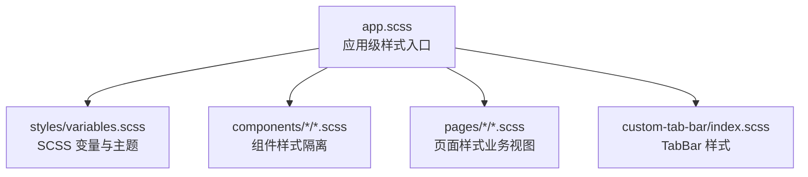
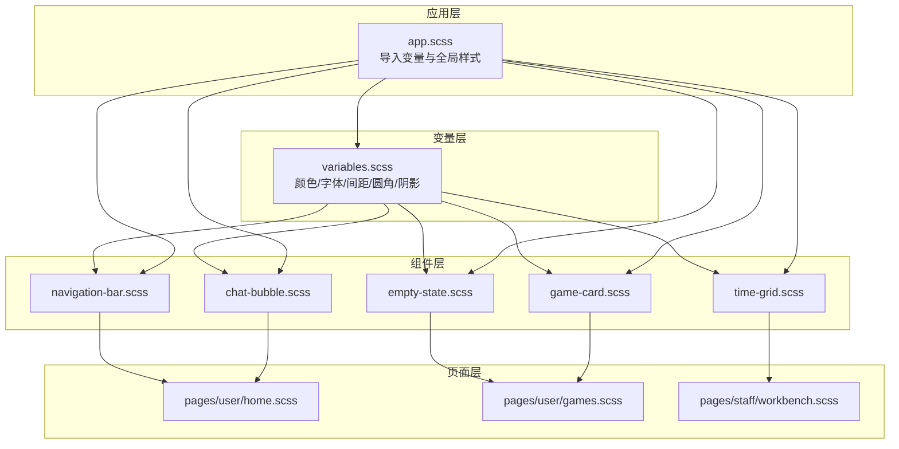
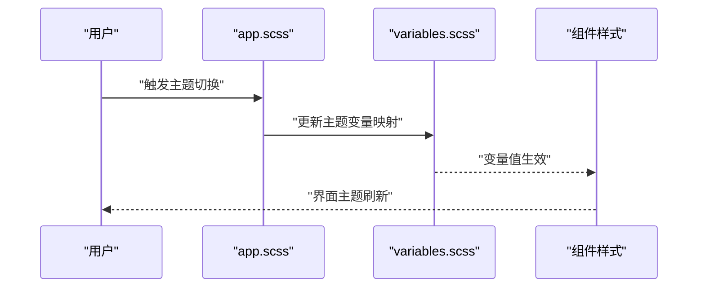
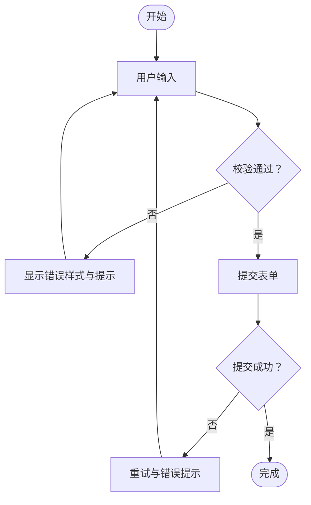
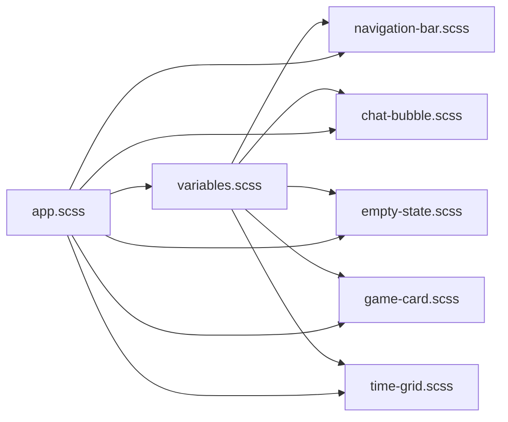

# 样式系统

<cite>
**本文引用的文件**   
- [app.scss](file://miniprogram/app.scss)
- [variables.scss](file://miniprogram/styles/variables.scss)
- [navigation-bar.scss](file://miniprogram/components/navigation-bar/navigation-bar.scss)
- [chat-bubble.scss](file://miniprogram/components/chat-bubble/chat-bubble.scss)
- [empty-state.scss](file://miniprogram/components/empty-state/empty-state.scss)
- [game-card.scss](file://miniprogram/components/game-card/game-card.scss)
- [time-grid.scss](file://miniprogram/components/time-grid/time-grid.scss)
- [index.scss](file://miniprogram/custom-tab-bar/index.scss)
- [login.scss](file://miniprogram/pages/login/login.scss)
- [home.scss](file://miniprogram/pages/user/home/home.scss)
- [games.scss](file://miniprogram/pages/user/games/games.scss)
- [reservation.scss](file://miniprogram/pages/user/reservation/reservation.scss)
- [profile.scss](file://miniprogram/pages/user/profile/profile.scss)
- [ai-assistant.scss](file://miniprogram/pages/user/ai-assistant/ai-assistant.scss)
- [workbench.scss](file://miniprogram/pages/staff/workbench/workbench.scss)
- [games.scss](file://miniprogram/pages/staff/games/games.scss)
- [reservation-mgmt.scss](file://miniprogram/pages/staff/reservation-mgmt/reservation-mgmt.scss)
- [game-detail.scss](file://miniprogram/pages/staff/game-detail/game-detail.scss)
</cite>

## 目录
1. [简介](#简介)
2. [项目结构](#项目结构)
3. [核心组件](#核心组件)
4. [架构总览](#架构总览)
5. [详细组件分析](#详细组件分析)
6. [依赖关系分析](#依赖关系分析)
7. [性能考虑](#性能考虑)
8. [故障排查指南](#故障排查指南)
9. [结论](#结论)
10. [附录](#附录)

## 简介
本样式系统面向微信小程序，采用 SCSS 作为样式语言，围绕变量体系、主题定制与响应式策略构建。文档聚焦颜色规范、字体设置、间距系统与布局模式，并总结样式组织原则、命名规范与最佳实践。同时提供主题切换、样式隔离与性能优化的具体实现方法，帮助团队在统一设计语言下高效协作与维护。

## 项目结构
样式资源按“全局 + 组件 + 页面”分层组织：
- 全局样式入口：应用级样式与变量导入
- 组件样式：每个组件独立维护自身样式，便于复用与隔离
- 页面样式：页面级布局与业务视图样式
- 自定义 TabBar 样式：底部导航栏的专属样式

图表来源
- [app.scss](file://miniprogram/app.scss)
- [variables.scss](file://miniprogram/styles/variables.scss)

章节来源
- [app.scss](file://miniprogram/app.scss)
- [variables.scss](file://miniprogram/styles/variables.scss)

## 核心组件
- 导航栏组件：统一的顶部导航样式与交互状态
- 聊天气泡组件：消息气泡、时间戳与头像等元素样式
- 空状态组件：无数据时的占位与引导文案
- 游戏卡片组件：封面图、标题、标签与操作按钮
- 时间网格组件：时间段展示与选中态
- 自定义 TabBar：底部导航图标与激活态

这些组件各自拥有独立的 .scss 文件，遵循组件内聚与样式隔离原则，避免全局污染。

章节来源
- [navigation-bar.scss](file://miniprogram/components/navigation-bar/navigation-bar.scss)
- [chat-bubble.scss](file://miniprogram/components/chat-bubble/chat-bubble.scss)
- [empty-state.scss](file://miniprogram/components/empty-state/empty-state.scss)
- [game-card.scss](file://miniprogram/components/game-card/game-card.scss)
- [time-grid.scss](file://miniprogram/components/time-grid/time-grid.scss)
- [index.scss](file://miniprogram/custom-tab-bar/index.scss)

## 架构总览
样式架构以“变量驱动 + 组件隔离 + 页面组合”为核心：
- 变量层：集中定义颜色、字体、间距、圆角、阴影等基础设计令牌
- 组件层：基于变量构建可复用的 UI 块，保持样式内聚
- 页面层：组合组件形成业务视图，必要时覆盖或扩展组件样式
- 应用层：统一导入变量与全局样式，确保一致性

图表来源
- [variables.scss](file://miniprogram/styles/variables.scss)
- [app.scss](file://miniprogram/app.scss)
- [navigation-bar.scss](file://miniprogram/components/navigation-bar/navigation-bar.scss)
- [chat-bubble.scss](file://miniprogram/components/chat-bubble/chat-bubble.scss)
- [empty-state.scss](file://miniprogram/components/empty-state/empty-state.scss)
- [game-card.scss](file://miniprogram/components/game-card/game-card.scss)
- [time-grid.scss](file://miniprogram/components/time-grid/time-grid.scss)
- [home.scss](file://miniprogram/pages/user/home/home.scss)
- [games.scss](file://miniprogram/pages/user/games/games.scss)
- [workbench.scss](file://miniprogram/pages/staff/workbench/workbench.scss)

## 详细组件分析

### 颜色规范与主题定制
- 颜色体系：通过变量集中管理主色、辅助色、中性色、成功/警告/错误语义色，确保全链路一致
- 主题定制：使用 SCSS 变量映射不同主题（如浅色/深色），在应用层按需切换变量值
- 对比度与无障碍：保证文本与背景对比度符合可读性标准，支持高对比度模式

章节来源
- [variables.scss](file://miniprogram/styles/variables.scss)
- [app.scss](file://miniprogram/app.scss)

### 字体设置
- 字体族：定义默认字体与回退字体，适配多平台渲染差异
- 字号层级：建立从标题到正文的字号阶梯，保持信息层次清晰
- 行高与字重：统一行高与字重，提升阅读体验与视觉节奏

章节来源
- [variables.scss](file://miniprogram/styles/variables.scss)

### 间距系统与布局模式
- 间距系统：以基础单位（如 4px/8px）为基准，派生多级间距，保证对齐与呼吸感
- 栅格与容器：定义最大宽度与边距，适配不同屏幕尺寸
- 弹性布局：优先使用 Flexbox 进行一维布局，配合对齐与分布属性

章节来源
- [variables.scss](file://miniprogram/styles/variables.scss)
- [navigation-bar.scss](file://miniprogram/components/navigation-bar/navigation-bar.scss)
- [chat-bubble.scss](file://miniprogram/components/chat-bubble/chat-bubble.scss)
- [game-card.scss](file://miniprogram/components/game-card/game-card.scss)

### 响应式设计策略
- 断点体系：基于常见设备宽度定义断点，使用媒体查询切换布局
- 流式布局：百分比与相对单位为主，结合 min/max 约束边界
- 组件自适应：组件内部根据父容器与屏幕尺寸调整排版与间距

章节来源
- [variables.scss](file://miniprogram/styles/variables.scss)
- [home.scss](file://miniprogram/pages/user/home/home.scss)
- [games.scss](file://miniprogram/pages/user/games/games.scss)
- [workbench.scss](file://miniprogram/pages/staff/workbench/workbench.scss)

### 命名规范与样式组织原则
- 命名约定：采用 BEM 风格或组件名前缀，避免冲突与歧义
- 作用域隔离：组件样式仅作用于组件节点，避免全局污染
- 模块化拆分：将通用样式抽离为 mixin 或函数，减少重复代码

章节来源
- [chat-bubble.scss](file://miniprogram/components/chat-bubble/chat-bubble.scss)
- [empty-state.scss](file://miniprogram/components/empty-state/empty-state.scss)
- [time-grid.scss](file://miniprogram/components/time-grid/time-grid.scss)
- [index.scss](file://miniprogram/custom-tab-bar/index.scss)

### 主题切换流程
主题切换通过应用层动态替换变量值实现，典型流程如下：

图表来源
- [app.scss](file://miniprogram/app.scss)
- [variables.scss](file://miniprogram/styles/variables.scss)

章节来源
- [app.scss](file://miniprogram/app.scss)
- [variables.scss](file://miniprogram/styles/variables.scss)

### 复杂逻辑流程图（示例：表单校验与反馈）
以下流程图展示样式如何配合业务逻辑进行输入校验与反馈提示：

[此图为概念流程，不直接对应具体源码文件]

## 依赖关系分析
样式依赖关系以变量为中心，组件与页面均依赖变量层；应用层负责统一导入与初始化。

图表来源
- [variables.scss](file://miniprogram/styles/variables.scss)
- [app.scss](file://miniprogram/app.scss)
- [navigation-bar.scss](file://miniprogram/components/navigation-bar/navigation-bar.scss)
- [chat-bubble.scss](file://miniprogram/components/chat-bubble/chat-bubble.scss)
- [empty-state.scss](file://miniprogram/components/empty-state/empty-state.scss)
- [game-card.scss](file://miniprogram/components/game-card/game-card.scss)
- [time-grid.scss](file://miniprogram/components/time-grid/time-grid.scss)

章节来源
- [variables.scss](file://miniprogram/styles/variables.scss)
- [app.scss](file://miniprogram/app.scss)

## 性能考虑
- 减少重复样式：通过变量与 mixin 抽象公共样式，降低编译体积
- 按需加载：页面与组件样式文件独立，避免全局样式过大
- 媒体查询优化：合理划分断点，避免过多嵌套与冗余规则
- 选择器精简：避免深层嵌套与低效选择器，提升渲染性能

[本节为通用指导，不直接分析具体文件]

## 故障排查指南
- 主题未生效：检查应用层是否正确导入变量与主题映射，确认变量覆盖优先级
- 组件样式冲突：确认命名空间与作用域，避免全局类名污染
- 响应式异常：核对媒体查询断点与单位使用，检查父容器约束
- 字体渲染不一致：确认字体族与回退字体配置，跨端测试验证

章节来源
- [app.scss](file://miniprogram/app.scss)
- [variables.scss](file://miniprogram/styles/variables.scss)
- [navigation-bar.scss](file://miniprogram/components/navigation-bar/navigation-bar.scss)
- [chat-bubble.scss](file://miniprogram/components/chat-bubble/chat-bubble.scss)
- [home.scss](file://miniprogram/pages/user/home/home.scss)
- [games.scss](file://miniprogram/pages/user/games/games.scss)
- [workbench.scss](file://miniprogram/pages/staff/workbench/workbench.scss)

## 结论
本样式系统以变量为核心，结合组件隔离与页面组合，构建了可扩展、可维护的样式架构。通过统一的颜色、字体、间距与布局规范，以及响应式与主题定制能力，满足多端一致性与业务快速迭代的需求。建议持续完善变量体系与组件库，强化样式治理与性能监控，保障长期演进质量。

[本节为总结性内容，不直接分析具体文件]

## 附录
- 页面样式参考：登录、用户首页、游戏列表、预约、个人资料、AI 助手、员工工作台、员工游戏管理、预约管理与详情等页面样式文件
- 组件样式参考：导航栏、聊天气泡、空状态、游戏卡片、时间网格与自定义 TabBar

章节来源
- [login.scss](file://miniprogram/pages/login/login.scss)
- [home.scss](file://miniprogram/pages/user/home/home.scss)
- [games.scss](file://miniprogram/pages/user/games/games.scss)
- [reservation.scss](file://miniprogram/pages/user/reservation/reservation.scss)
- [profile.scss](file://miniprogram/pages/user/profile/profile.scss)
- [ai-assistant.scss](file://miniprogram/pages/user/ai-assistant/ai-assistant.scss)
- [workbench.scss](file://miniprogram/pages/staff/workbench/workbench.scss)
- [games.scss](file://miniprogram/pages/staff/games/games.scss)
- [reservation-mgmt.scss](file://miniprogram/pages/staff/reservation-mgmt/reservation-mgmt.scss)
- [game-detail.scss](file://miniprogram/pages/staff/game-detail/game-detail.scss)