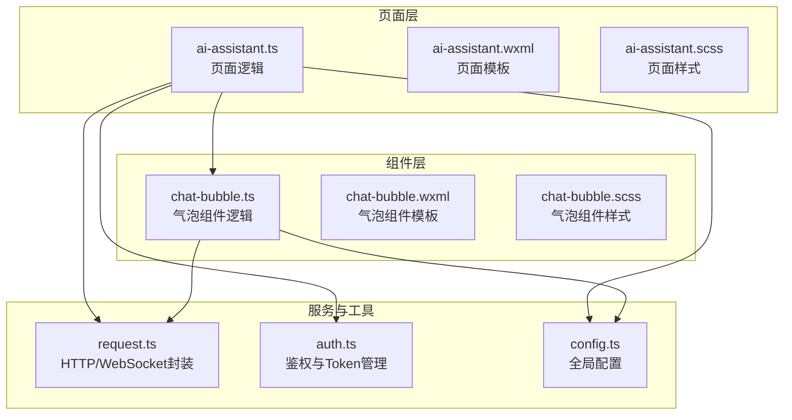
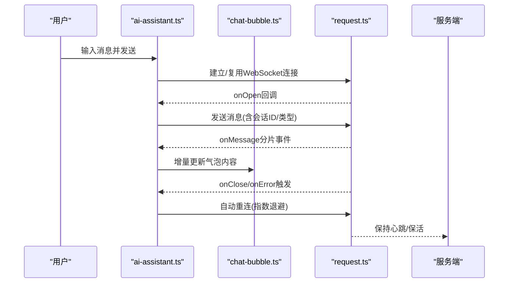
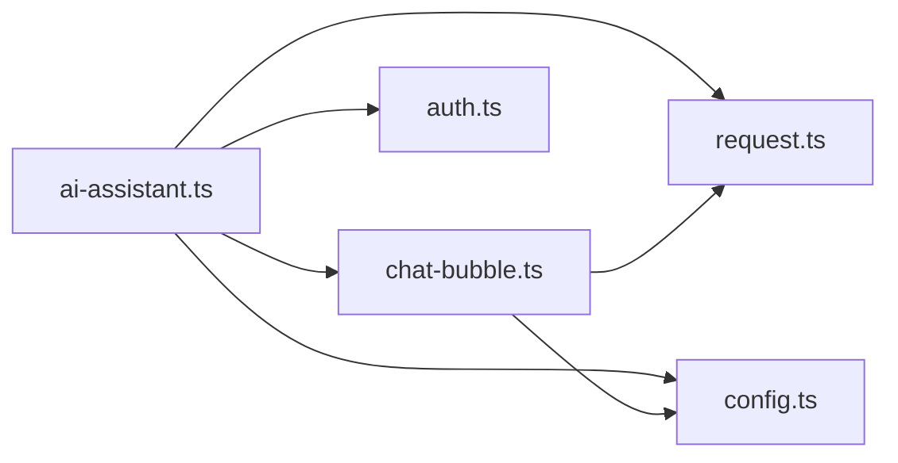
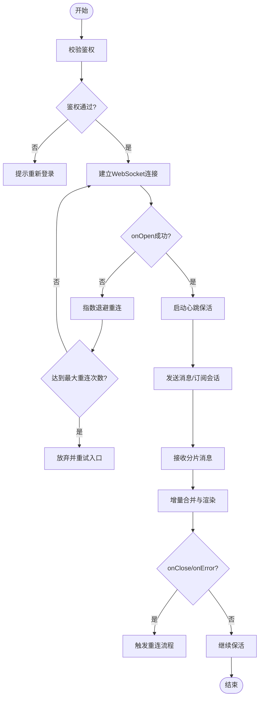
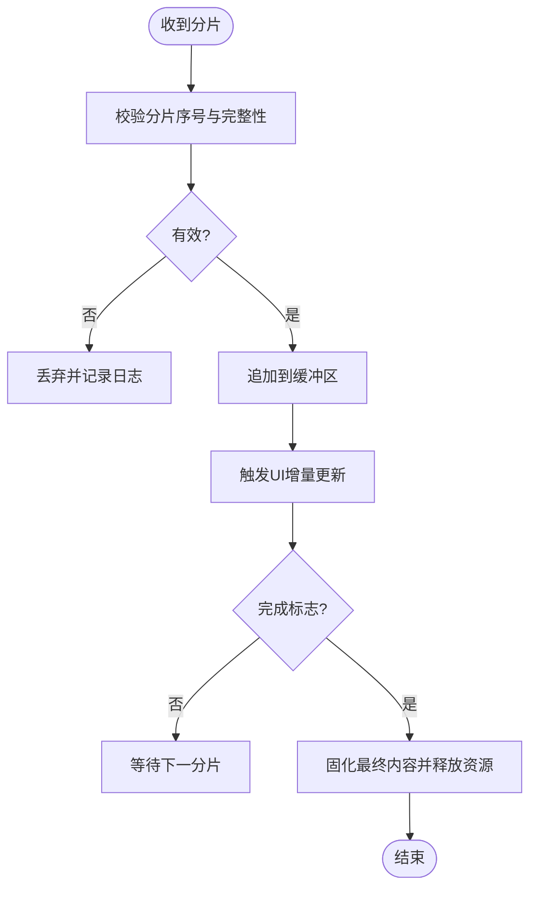

# AI助手模块

<cite>
**本文引用的文件**   
- [ai-assistant.ts](file://miniprogram/pages/user/ai-assistant/ai-assistant.ts)
- [ai-assistant.wxml](file://miniprogram/pages/user/ai-assistant/ai-assistant.wxml)
- [ai-assistant.scss](file://miniprogram/pages/user/ai-assistant/ai-assistant.scss)
- [chat-bubble.ts](file://miniprogram/components/chat-bubble/chat-bubble.ts)
- [chat-bubble.wxml](file://miniprogram/components/chat-bubble/chat-bubble.wxml)
- [chat-bubble.scss](file://miniprogram/components/chat-bubble/chat-bubble.scss)
- [request.ts](file://miniprogram/utils/request.ts)
- [auth.ts](file://miniprogram/utils/auth.ts)
- [config.ts](file://miniprogram/config.ts)
</cite>

## 目录
1. [简介](#简介)
2. [项目结构](#项目结构)
3. [核心组件](#核心组件)
4. [架构总览](#架构总览)
5. [详细组件分析](#详细组件分析)
6. [依赖关系分析](#依赖关系分析)
7. [性能考虑](#性能考虑)
8. [故障排查指南](#故障排查指南)
9. [结论](#结论)
10. [附录](#附录)

## 简介
本章节面向AI助手模块，覆盖聊天界面设计、消息收发、AI回复处理与对话历史管理。重点说明WebSocket连接管理、消息格式定义、流式响应处理与错误重试机制；并给出聊天气泡组件使用方式、输入框智能提示与表情支持等用户体验优化策略。文档以代码级为依据，提供可视化图示与可操作的排错建议，帮助开发者快速理解与集成。

## 项目结构
AI助手模块位于用户端页面目录，包含页面逻辑、模板与样式；聊天气泡为通用组件，供多页面复用；网络请求与鉴权工具在utils中统一封装；全局配置在config.ts中集中管理。

图表来源
- [ai-assistant.ts:1-200](file://miniprogram/pages/user/ai-assistant/ai-assistant.ts#L1-L200)
- [chat-bubble.ts:1-200](file://miniprogram/components/chat-bubble/chat-bubble.ts#L1-L200)
- [request.ts:1-200](file://miniprogram/utils/request.ts#L1-L200)
- [auth.ts:1-200](file://miniprogram/utils/auth.ts#L1-L200)
- [config.ts:1-200](file://miniprogram/config.ts#L1-L200)

章节来源
- [ai-assistant.ts:1-200](file://miniprogram/pages/user/ai-assistant/ai-assistant.ts#L1-L200)
- [chat-bubble.ts:1-200](file://miniprogram/components/chat-bubble/chat-bubble.ts#L1-L200)
- [request.ts:1-200](file://miniprogram/utils/request.ts#L1-L200)
- [auth.ts:1-200](file://miniprogram/utils/auth.ts#L1-L200)
- [config.ts:1-200](file://miniprogram/config.ts#L1-L200)

## 核心组件
- 页面容器：负责会话状态、消息列表、输入交互、WebSocket生命周期管理与错误恢复。
- 聊天气泡组件：负责单条消息的渲染（文本、图片、Markdown片段）、左右对齐、时间戳与加载态展示。
- 网络层：封装HTTP与WebSocket调用，统一错误码、重连策略与超时控制。
- 鉴权与配置：注入Token、基础URL、WebSocket地址与功能开关。

章节来源
- [ai-assistant.ts:1-200](file://miniprogram/pages/user/ai-assistant/ai-assistant.ts#L1-L200)
- [chat-bubble.ts:1-200](file://miniprogram/components/chat-bubble/chat-bubble.ts#L1-L200)
- [request.ts:1-200](file://miniprogram/utils/request.ts#L1-L200)
- [auth.ts:1-200](file://miniprogram/utils/auth.ts#L1-L200)
- [config.ts:1-200](file://miniprogram/config.ts#L1-L200)

## 架构总览
AI助手采用“页面-组件-服务”分层架构。页面维护会话数据与UI状态，通过组件渲染消息；网络层抽象WebSocket与HTTP接口，提供统一的连接、发送、接收与错误处理；鉴权与配置贯穿全链路，确保安全与可配置性。

图表来源
- [ai-assistant.ts:1-200](file://miniprogram/pages/user/ai-assistant/ai-assistant.ts#L1-L200)
- [chat-bubble.ts:1-200](file://miniprogram/components/chat-bubble/chat-bubble.ts#L1-L200)
- [request.ts:1-200](file://miniprogram/utils/request.ts#L1-L200)

## 详细组件分析

### 页面：ai-assistant.ts
职责
- 会话与会话历史：维护消息数组、分页与本地缓存键。
- 输入交互：文本输入、表情选择、快捷指令与粘贴图片。
- WebSocket管理：连接、心跳、断线重连、消息编解码与流式合并。
- UI状态：加载中、错误提示、空状态与滚动定位。

关键流程
- 初始化：读取配置与鉴权信息，尝试恢复上次会话或创建新会话。
- 发送消息：校验输入、构造消息体、写入本地历史、触发发送。
- 接收消息：按分片增量渲染，完成后标记完成态。
- 错误处理：网络异常、鉴权失败、服务端错误码映射与降级提示。
- 资源清理：页面卸载时关闭连接与定时器。

章节来源
- [ai-assistant.ts:1-200](file://miniprogram/pages/user/ai-assistant/ai-assistant.ts#L1-L200)

### 组件：chat-bubble.ts
职责
- 消息渲染：根据角色与类型决定气泡样式、对齐与内容区。
- 流式更新：支持增量追加文本、图片占位与Markdown片段渲染。
- 交互反馈：复制、长按菜单、点击链接与图片预览。
- 无障碍：语义化标签与键盘导航支持。

关键属性与方法
- 属性：消息对象、是否正在生成、是否已完成、主题变量。
- 方法：追加片段、设置完成态、重置状态、暴露滚动到顶部/底部。

章节来源
- [chat-bubble.ts:1-200](file://miniprogram/components/chat-bubble/chat-bubble.ts#L1-L200)

### 网络层：request.ts
职责
- HTTP封装：请求拦截、响应解析、错误码统一处理与重试。
- WebSocket封装：连接建立、心跳保活、断线检测、自动重连与队列缓冲。
- 流式处理：对Server-Sent Events或分片消息进行增量拼接与去重。

关键能力
- 连接管理：最大重连次数、指数退避、抖动、超时与空闲回收。
- 消息协议：定义发送/接收JSON结构，包含会话ID、消息类型、分片序号与完成标志。
- 错误分类：网络错误、鉴权错误、业务错误与超时错误，分别给出提示与恢复策略。

章节来源
- [request.ts:1-200](file://miniprogram/utils/request.ts#L1-L200)

### 鉴权与配置：auth.ts / config.ts
职责
- auth.ts：获取/刷新Token、登录态判断、敏感操作签名。
- config.ts：API基础路径、WebSocket地址、功能开关与日志级别。

章节来源
- [auth.ts:1-200](file://miniprogram/utils/auth.ts#L1-L200)
- [config.ts:1-200](file://miniprogram/config.ts#L1-L200)

## 依赖关系分析
页面依赖组件与网络层；组件依赖网络层用于扩展能力；网络层依赖鉴权与配置。整体耦合清晰，便于替换实现与单元测试。

图表来源
- [ai-assistant.ts:1-200](file://miniprogram/pages/user/ai-assistant/ai-assistant.ts#L1-L200)
- [chat-bubble.ts:1-200](file://miniprogram/components/chat-bubble/chat-bubble.ts#L1-L200)
- [request.ts:1-200](file://miniprogram/utils/request.ts#L1-L200)
- [auth.ts:1-200](file://miniprogram/utils/auth.ts#L1-L200)
- [config.ts:1-200](file://miniprogram/config.ts#L1-L200)

章节来源
- [ai-assistant.ts:1-200](file://miniprogram/pages/user/ai-assistant/ai-assistant.ts#L1-L200)
- [chat-bubble.ts:1-200](file://miniprogram/components/chat-bubble/chat-bubble.ts#L1-L200)
- [request.ts:1-200](file://miniprogram/utils/request.ts#L1-L200)
- [auth.ts:1-200](file://miniprogram/utils/auth.ts#L1-L200)
- [config.ts:1-200](file://miniprogram/config.ts#L1-L200)

## 性能考虑
- 流式渲染：按分片增量更新DOM，避免整段重建；限制单次更新长度与频率。
- 虚拟滚动：长对话场景下按需渲染可见区域，降低内存占用。
- 连接复用：同一会话内复用WebSocket实例，减少握手开销。
- 防抖节流：输入联想、搜索与频繁UI更新使用防抖/节流。
- 图片与媒体：懒加载、压缩与占位图，避免阻塞主线程。
- 离线缓存：本地缓存最近N条消息，提升冷启动速度。

[本节为通用性能建议，不直接分析具体文件]

## 故障排查指南
常见问题与定位步骤
- 无法建立WebSocket连接
  - 检查鉴权Token是否有效与过期时间。
  - 核对WebSocket地址与端口、跨域与证书配置。
  - 查看网络层日志与重连计数。
- 消息未到达或乱序
  - 确认分片序号与完成标志是否正确。
  - 检查客户端合并逻辑与去重策略。
- 流式输出卡顿
  - 检查批量更新频率与DOM操作量。
  - 启用虚拟滚动与增量渲染。
- 错误提示不明确
  - 统一错误码映射与用户可读文案。
  - 区分网络错误、鉴权错误与业务错误。

章节来源
- [request.ts:1-200](file://miniprogram/utils/request.ts#L1-L200)
- [auth.ts:1-200](file://miniprogram/utils/auth.ts#L1-L200)
- [ai-assistant.ts:1-200](file://miniprogram/pages/user/ai-assistant/ai-assistant.ts#L1-L200)

## 结论
AI助手模块通过清晰的页面-组件-服务分层，结合WebSocket流式通信与完善的错误恢复机制，实现了流畅、稳定且易扩展的聊天体验。借助聊天气泡组件与输入增强能力，可在保证性能的同时提升用户满意度。建议在长对话与高并发场景下进一步引入虚拟滚动与连接池优化。

[本节为总结性内容，不直接分析具体文件]

## 附录

### 消息格式定义（示例）
- 发送消息
  - 字段：会话ID、消息类型、内容、分片序号、完成标志、时间戳、签名。
- 接收消息
  - 字段：会话ID、消息类型、内容片段、分片序号、完成标志、时间戳、状态码。

章节来源
- [request.ts:1-200](file://miniprogram/utils/request.ts#L1-L200)
- [ai-assistant.ts:1-200](file://miniprogram/pages/user/ai-assistant/ai-assistant.ts#L1-L200)

### WebSocket连接管理流程图

图表来源
- [request.ts:1-200](file://miniprogram/utils/request.ts#L1-L200)
- [ai-assistant.ts:1-200](file://miniprogram/pages/user/ai-assistant/ai-assistant.ts#L1-L200)

### 流式响应处理流程图

图表来源
- [request.ts:1-200](file://miniprogram/utils/request.ts#L1-L200)
- [chat-bubble.ts:1-200](file://miniprogram/components/chat-bubble/chat-bubble.ts#L1-L200)

### 聊天气泡组件使用要点
- 在页面模板中引入组件，传入消息对象与状态。
- 根据消息类型切换渲染模式（文本、图片、Markdown）。
- 监听组件事件（如点击、复制、长按）以执行后续动作。
- 在流式更新时仅传递新增片段，避免重复渲染。

章节来源
- [chat-bubble.wxml:1-200](file://miniprogram/components/chat-bubble/chat-bubble.wxml#L1-L200)
- [chat-bubble.scss:1-200](file://miniprogram/components/chat-bubble/chat-bubble.scss#L1-L200)
- [chat-bubble.ts:1-200](file://miniprogram/components/chat-bubble/chat-bubble.ts#L1-L200)

### 输入框智能提示与表情支持
- 智能提示：基于关键词匹配与历史记录，提供候选项与快捷键插入。
- 表情支持：内置表情面板与自定义表情上传，支持富文本插入。
- 无障碍：键盘导航、屏幕阅读器兼容与焦点管理。

章节来源
- [ai-assistant.wxml:1-200](file://miniprogram/pages/user/ai-assistant/ai-assistant.wxml#L1-L200)
- [ai-assistant.scss:1-200](file://miniprogram/pages/user/ai-assistant/ai-assistant.scss#L1-L200)
- [ai-assistant.ts:1-200](file://miniprogram/pages/user/ai-assistant/ai-assistant.ts#L1-L200)