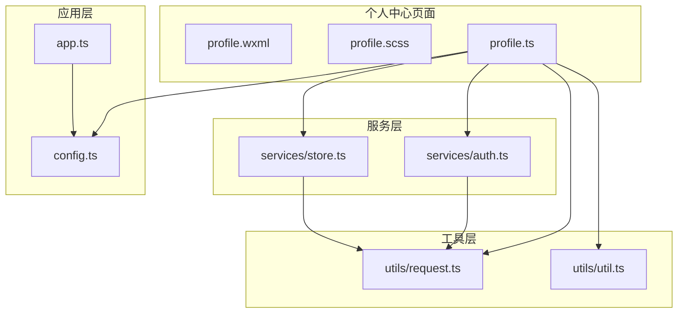
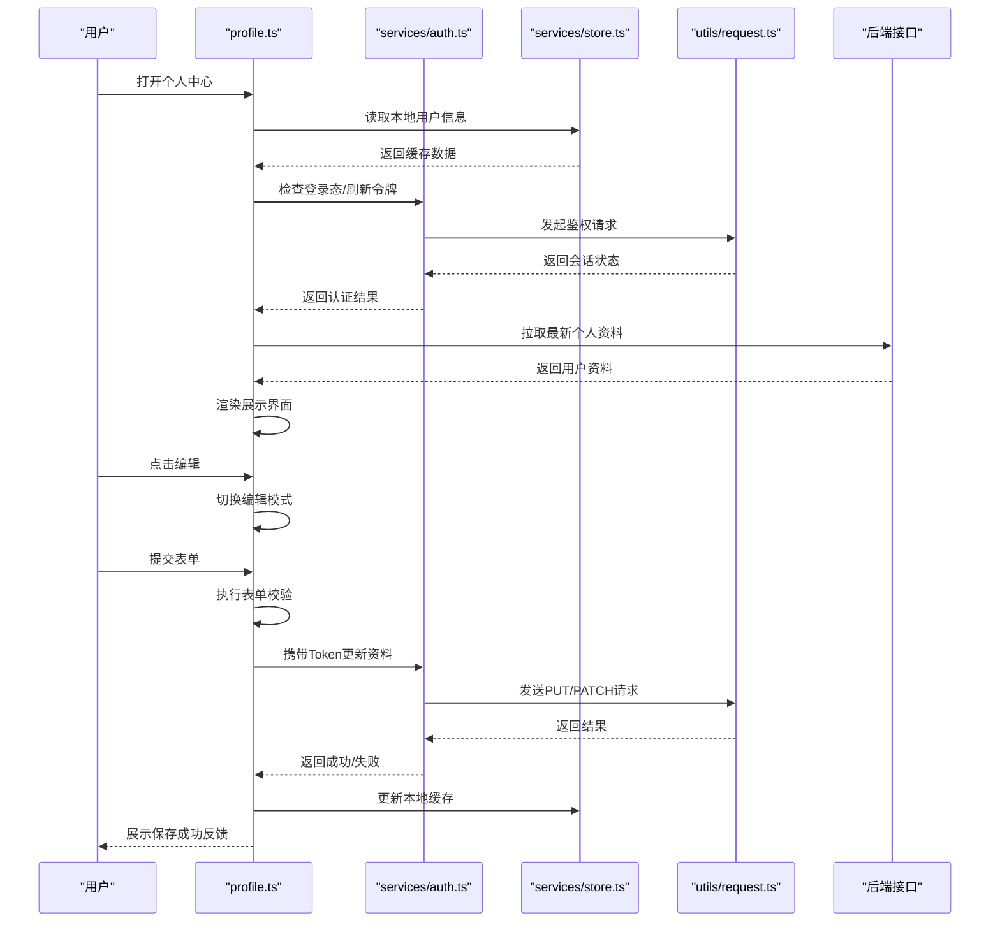
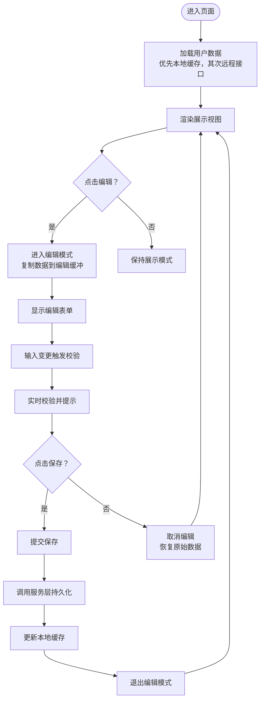
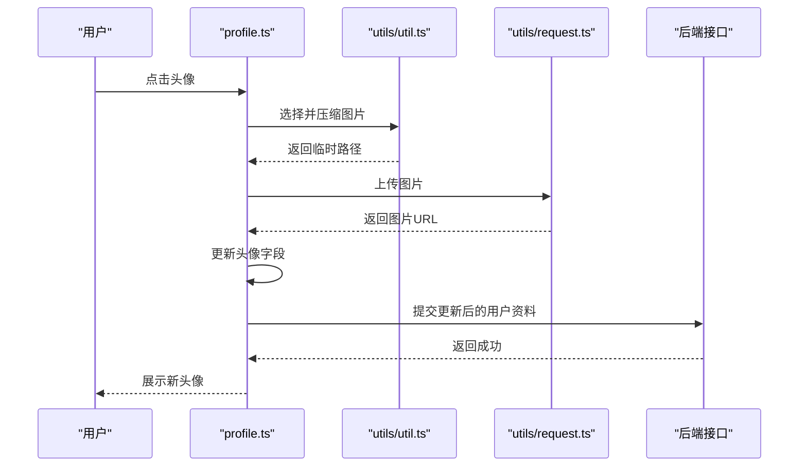
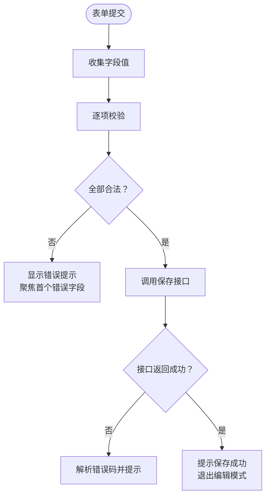
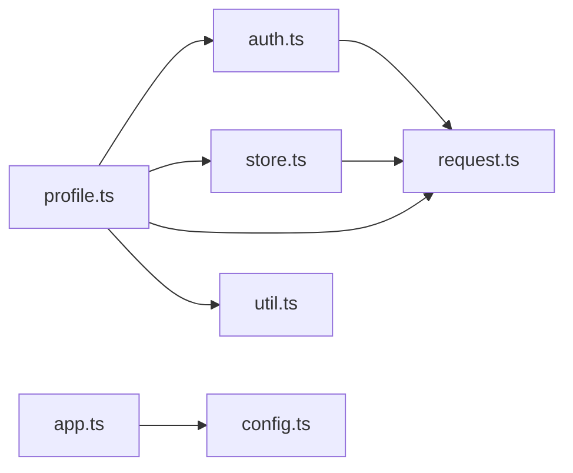

# 个人中心模块

<cite>
**本文引用的文件**   
- [profile.ts](file://miniprogram/pages/user/profile/profile.ts)
- [profile.wxml](file://miniprogram/pages/user/profile/profile.wxml)
- [profile.scss](file://miniprogram/pages/user/profile/profile.scss)
- [auth.ts](file://miniprogram/services/auth.ts)
- [store.ts](file://miniprogram/services/store.ts)
- [request.ts](file://miniprogram/utils/request.ts)
- [util.ts](file://miniprogram/utils/util.ts)
- [app.ts](file://miniprogram/app.ts)
- [config.ts](file://miniprogram/config.ts)
</cite>

## 目录
1. [简介](#简介)
2. [项目结构](#项目结构)
3. [核心组件](#核心组件)
4. [架构总览](#架构总览)
5. [详细组件分析](#详细组件分析)
6. [依赖关系分析](#依赖关系分析)
7. [性能考虑](#性能考虑)
8. [故障排查指南](#故障排查指南)
9. [结论](#结论)
10. [附录](#附录)

## 简介
本模块为微信小程序“个人中心”功能，覆盖用户信息管理、头像上传、个人信息编辑与账户设置。文档从系统架构、数据流、表单验证、持久化、权限控制与隐私保护等维度进行说明，并提供UI设计要点、编辑模式切换与保存反馈的实现思路，以及与认证服务、存储服务的集成方式。

## 项目结构
个人中心页面位于 pages/user/profile 下，包含视图、样式与逻辑文件；相关能力通过 services 与 utils 层提供：
- 页面层：profile.wxml（模板）、profile.scss（样式）、profile.ts（逻辑）
- 服务层：auth.ts（认证与会话）、store.ts（本地状态/缓存）
- 工具层：request.ts（网络请求封装）、util.ts（通用工具）
- 应用层：app.ts（全局初始化）、config.ts（配置项）

图表来源
- [profile.ts](file://miniprogram/pages/user/profile/profile.ts)
- [auth.ts](file://miniprogram/services/auth.ts)
- [store.ts](file://miniprogram/services/store.ts)
- [request.ts](file://miniprogram/utils/request.ts)
- [util.ts](file://miniprogram/utils/util.ts)
- [app.ts](file://miniprogram/app.ts)
- [config.ts](file://miniprogram/config.ts)

章节来源
- [profile.ts](file://miniprogram/pages/user/profile/profile.ts)
- [profile.wxml](file://miniprogram/pages/user/profile/profile.wxml)
- [profile.scss](file://miniprogram/pages/user/profile/profile.scss)
- [auth.ts](file://miniprogram/services/auth.ts)
- [store.ts](file://miniprogram/services/store.ts)
- [request.ts](file://miniprogram/utils/request.ts)
- [util.ts](file://miniprogram/utils/util.ts)
- [app.ts](file://miniprogram/app.ts)
- [config.ts](file://miniprogram/config.ts)

## 核心组件
- 用户信息展示区：显示昵称、头像、性别、生日、地区等基础资料，支持点击进入编辑模式。
- 头像上传区：选择图片、压缩预览、上传至服务端并回写头像URL。
- 个人信息编辑表单：字段校验（必填、长度、格式）、实时提示、取消/保存操作。
- 账户设置：登录态管理、隐私开关、退出登录等。

章节来源
- [profile.wxml](file://miniprogram/pages/user/profile/profile.wxml)
- [profile.scss](file://miniprogram/pages/user/profile/profile.scss)
- [profile.ts](file://miniprogram/pages/user/profile/profile.ts)

## 架构总览
个人中心采用“页面-服务-工具”的分层架构：
- 页面层负责UI渲染、交互与表单状态管理
- 服务层封装认证与会话、本地存储与缓存策略
- 工具层统一网络请求、错误处理与通用方法
- 应用层提供全局配置与生命周期钩子

图表来源
- [profile.ts](file://miniprogram/pages/user/profile/profile.ts)
- [auth.ts](file://miniprogram/services/auth.ts)
- [store.ts](file://miniprogram/services/store.ts)
- [request.ts](file://miniprogram/utils/request.ts)

## 详细组件分析

### 用户信息展示与编辑模式切换
- 展示模式：只读显示用户基本信息与头像，点击头像或“编辑”按钮进入编辑模式。
- 编辑模式：表单可编辑，包含昵称、性别、生日、地区等字段；顶部导航栏提供“取消”和“保存”。
- 切换逻辑：维护一个编辑态标志位，切换时复制当前数据到编辑缓冲区，避免直接修改展示数据。

图表来源
- [profile.ts](file://miniprogram/pages/user/profile/profile.ts)
- [store.ts](file://miniprogram/services/store.ts)

章节来源
- [profile.ts](file://miniprogram/pages/user/profile/profile.ts)
- [profile.wxml](file://miniprogram/pages/user/profile/profile.wxml)
- [profile.scss](file://miniprogram/pages/user/profile/profile.scss)

### 头像上传流程
- 选择图片：调用小程序选择图片API，限制尺寸与类型。
- 压缩预览：对大图进行压缩与裁剪，生成预览图。
- 上传服务端：将图片以multipart/form-data形式上传，获取头像URL。
- 回写资料：将新头像URL写入用户资料并保存。

图表来源
- [profile.ts](file://miniprogram/pages/user/profile/profile.ts)
- [util.ts](file://miniprogram/utils/util.ts)
- [request.ts](file://miniprogram/utils/request.ts)

章节来源
- [profile.ts](file://miniprogram/pages/user/profile/profile.ts)
- [util.ts](file://miniprogram/utils/util.ts)
- [request.ts](file://miniprogram/utils/request.ts)

### 表单验证与反馈
- 校验规则：必填、长度范围、日期格式、地区合法性等。
- 实时校验：输入框失焦或内容变化时触发校验，错误即时提示。
- 提交前校验：阻止非法提交，汇总错误并定位到对应字段。
- 反馈机制：成功使用Toast提示，失败给出明确错误原因。

图表来源
- [profile.ts](file://miniprogram/pages/user/profile/profile.ts)
- [util.ts](file://miniprogram/utils/util.ts)

章节来源
- [profile.ts](file://miniprogram/pages/user/profile/profile.ts)
- [util.ts](file://miniprogram/utils/util.ts)

### 数据持久化与缓存策略
- 本地缓存：使用小程序缓存API存储用户资料，减少重复请求。
- 缓存失效：登录态过期或用户主动退出时清理敏感数据。
- 一致性：先写远端，成功后再更新本地缓存，确保一致性。
- 并发控制：同一时刻仅允许一次保存请求，避免竞态条件。

章节来源
- [store.ts](file://miniprogram/services/store.ts)
- [auth.ts](file://miniprogram/services/auth.ts)
- [request.ts](file://miniprogram/utils/request.ts)

### 权限控制与隐私保护
- 登录态校验：访问个人中心前检查登录态，未登录引导登录。
- Token管理：自动刷新与重试，失败时清除会话并重定向登录。
- 最小权限：仅请求必要字段，敏感信息脱敏展示。
- 隐私开关：提供隐私设置入口，控制是否公开部分资料。

章节来源
- [auth.ts](file://miniprogram/services/auth.ts)
- [store.ts](file://miniprogram/services/store.ts)
- [config.ts](file://miniprogram/config.ts)

### UI设计与交互要点
- 布局：头部展示头像与昵称，下方分区块展示资料与设置。
- 视觉：统一的变量主题色，清晰的分割线与间距。
- 交互：编辑模式切换平滑过渡，保存按钮禁用防重复提交。
- 响应式：适配不同屏幕尺寸，头像圆形裁剪与占位图。

章节来源
- [profile.wxml](file://miniprogram/pages/user/profile/profile.wxml)
- [profile.scss](file://miniprogram/pages/user/profile/profile.scss)

## 依赖关系分析
个人中心模块依赖认证服务、存储服务与网络请求工具，形成清晰的分层依赖：
- profile.ts 依赖 auth.ts、store.ts、request.ts、util.ts
- auth.ts 依赖 request.ts
- store.ts 依赖 request.ts
- app.ts 与 config.ts 提供全局配置与初始化

图表来源
- [profile.ts](file://miniprogram/pages/user/profile/profile.ts)
- [auth.ts](file://miniprogram/services/auth.ts)
- [store.ts](file://miniprogram/services/store.ts)
- [request.ts](file://miniprogram/utils/request.ts)
- [util.ts](file://miniprogram/utils/util.ts)
- [app.ts](file://miniprogram/app.ts)
- [config.ts](file://miniprogram/config.ts)

章节来源
- [profile.ts](file://miniprogram/pages/user/profile/profile.ts)
- [auth.ts](file://miniprogram/services/auth.ts)
- [store.ts](file://miniprogram/services/store.ts)
- [request.ts](file://miniprogram/utils/request.ts)
- [util.ts](file://miniprogram/utils/util.ts)
- [app.ts](file://miniprogram/app.ts)
- [config.ts](file://miniprogram/config.ts)

## 性能考虑
- 图片压缩：上传前压缩与裁剪，降低带宽与延迟。
- 缓存命中：优先读取本地缓存，减少网络请求。
- 请求去抖：保存操作防抖，避免频繁提交。
- 懒加载：非关键信息按需加载，提升首屏速度。

[本节为通用指导，不直接分析具体文件]

## 故障排查指南
- 无法加载用户资料：检查网络请求封装与错误码处理，确认Token有效。
- 头像上传失败：确认图片大小与格式限制，检查服务端返回的URL有效性。
- 表单校验不生效：检查校验规则与事件绑定，确保输入事件正确触发。
- 缓存不一致：确认保存成功后再更新缓存，必要时强制刷新。

章节来源
- [request.ts](file://miniprogram/utils/request.ts)
- [auth.ts](file://miniprogram/services/auth.ts)
- [store.ts](file://miniprogram/services/store.ts)
- [profile.ts](file://miniprogram/pages/user/profile/profile.ts)

## 结论
个人中心模块通过分层架构与完善的校验、持久化、权限控制与隐私保护机制，提供了稳定可靠的个人信息管理体验。建议持续优化图片上传性能与缓存策略，增强错误提示与用户体验。

[本节为总结性内容，不直接分析具体文件]

## 附录
- 常用字段定义：昵称、性别、生日、地区、头像URL等。
- 错误码约定：网络错误、业务错误、权限错误的统一处理。
- 配置项说明：接口地址、超时时间、缓存有效期等。

[本节为补充信息，不直接分析具体文件]