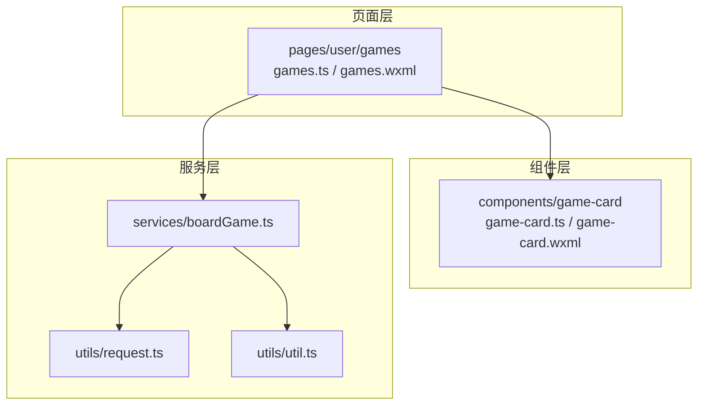
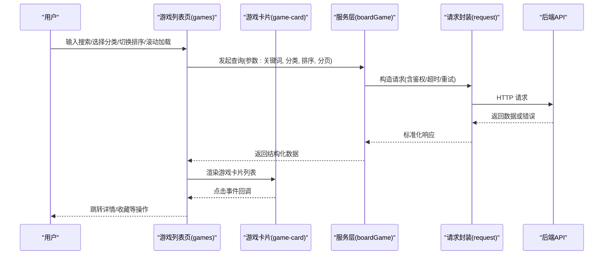
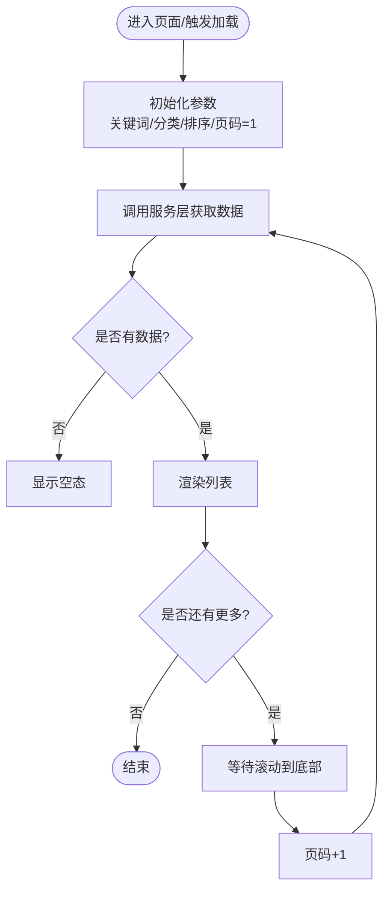
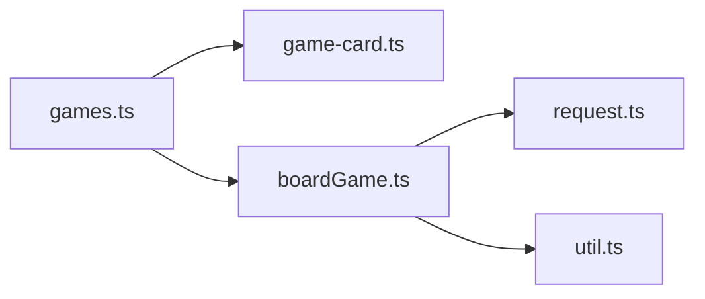

# 游戏浏览模块

<cite>
**本文引用的文件**   
- [games.ts](file://miniprogram/pages/user/games/games.ts)
- [games.wxml](file://miniprogram/pages/user/games/games.wxml)
- [games.scss](file://miniprogram/pages/user/games/games.scss)
- [game-card.ts](file://miniprogram/components/game-card/game-card.ts)
- [game-card.wxml](file://miniprogram/components/game-card/game-card.wxml)
- [boardGame.ts](file://miniprogram/services/boardGame.ts)
- [request.ts](file://miniprogram/utils/request.ts)
- [util.ts](file://miniprogram/utils/util.ts)
- [app.json](file://miniprogram/app.json)
</cite>

## 目录
1. [简介](#简介)
2. [项目结构](#项目结构)
3. [核心组件](#核心组件)
4. [架构总览](#架构总览)
5. [详细组件分析](#详细组件分析)
6. [依赖关系分析](#依赖关系分析)
7. [性能考虑](#性能考虑)
8. [故障排查指南](#故障排查指南)
9. [结论](#结论)
10. [附录](#附录)

## 简介
本模块面向用户端“游戏浏览”场景，提供游戏列表展示、搜索过滤、分类筛选与排序、分页加载等能力。通过页面容器与可复用游戏卡片组件解耦数据渲染与交互逻辑，结合服务层统一请求封装，实现稳定、可扩展的游戏发现体验。

## 项目结构
- 页面层：用户端游戏列表页（user/games）负责状态管理、搜索/筛选/排序、分页控制与服务调用。
- 组件层：游戏卡片组件（components/game-card）负责单条游戏的展示与点击事件。
- 服务层：boardGame.ts 提供游戏相关接口；request.ts 统一网络请求与错误处理；util.ts 提供通用工具函数。
- 配置与路由：app.json 定义页面路由与全局样式变量。

图表来源
- [games.ts](file://miniprogram/pages/user/games/games.ts)
- [games.wxml](file://miniprogram/pages/user/games/games.wxml)
- [game-card.ts](file://miniprogram/components/game-card/game-card.ts)
- [game-card.wxml](file://miniprogram/components/game-card/game-card.wxml)
- [boardGame.ts](file://miniprogram/services/boardGame.ts)
- [request.ts](file://miniprogram/utils/request.ts)
- [util.ts](file://miniprogram/utils/util.ts)

章节来源
- [app.json](file://miniprogram/app.json)

## 核心组件
- 游戏列表页（games）
  - 职责：维护搜索词、分类、排序、分页参数与结果集；触发服务层查询；驱动视图更新；处理空态与错误态。
  - 关键能力：搜索去抖、分类多选/单选、排序切换、上拉加载更多、下拉刷新。
- 游戏卡片（game-card）
  - 职责：接收游戏数据并渲染封面、名称、标签、评分等；响应点击事件，向父级暴露回调。
  - 关键能力：图片懒加载占位、点击反馈、无障碍属性。

章节来源
- [games.ts](file://miniprogram/pages/user/games/games.ts)
- [games.wxml](file://miniprogram/pages/user/games/games.wxml)
- [game-card.ts](file://miniprogram/components/game-card/game-card.ts)
- [game-card.wxml](file://miniprogram/components/game-card/game-card.wxml)

## 架构总览
页面作为控制器，聚合用户输入与状态，调用服务层获取数据，再将数据下发到卡片组件进行渲染。服务层对请求进行统一封装，包含鉴权、重试、错误转换等。

图表来源
- [games.ts](file://miniprogram/pages/user/games/games.ts)
- [game-card.ts](file://miniprogram/components/game-card/game-card.ts)
- [boardGame.ts](file://miniprogram/services/boardGame.ts)
- [request.ts](file://miniprogram/utils/request.ts)

## 详细组件分析

### 游戏列表页（games）
- 数据模型
  - 搜索词：用于模糊匹配标题/描述/标签。
  - 分类：支持按类别筛选，可单选或多选。
  - 排序：支持按热度、评分、更新时间等维度。
  - 分页：页码、每页数量、是否还有更多数据。
  - 结果集：游戏条目数组，供卡片组件渲染。
- 搜索与过滤算法
  - 前端快速过滤：在本地对已加载数据进行二次筛选（适用于小数据集）。
  - 服务端过滤：将关键词与分类、排序参数透传至服务端，保证大数据集下的准确性与性能。
  - 去抖策略：对搜索输入进行防抖，避免频繁请求。
- 分页加载机制
  - 上拉触底：当滚动接近底部时自动加载下一页，合并结果并保持排序一致性。
  - 下拉刷新：重置页码并重新拉取首屏数据。
  - 空态与结束态：无数据时显示空态组件；到达末页提示“没有更多”。
- 用户交互反馈
  - 加载中骨架屏或转圈提示。
  - 错误提示（网络异常、服务不可用、参数校验失败）。
  - 操作成功反馈（收藏、分享等）。
- 与服务层集成
  - 调用 boardGame 的服务方法，传入筛选与分页参数。
  - 统一错误处理：捕获并转换为友好的 UI 提示。
- 代码片段路径
  - 列表渲染与事件绑定：[games.wxml](file://miniprogram/pages/user/games/games.wxml)
  - 页面状态与业务逻辑：[games.ts](file://miniprogram/pages/user/games/games.ts)

章节来源
- [games.ts](file://miniprogram/pages/user/games/games.ts)
- [games.wxml](file://miniprogram/pages/user/games/games.wxml)

#### 分页加载流程图

图表来源
- [games.ts](file://miniprogram/pages/user/games/games.ts)

### 游戏卡片（game-card）
- 输入属性
  - 游戏基础信息：ID、标题、封面图、标签、评分、简介等。
  - 行为回调：点击事件、收藏/分享等扩展动作。
- 渲染优化
  - 图片懒加载与占位图，减少首屏压力。
  - 文本截断与省略，保持布局稳定。
  - 条件渲染标签与评分，避免多余节点。
- 交互反馈
  - 点击缩放/高亮反馈。
  - 长按或双击的扩展操作（可选）。
- 代码片段路径
  - 模板与插槽使用：[game-card.wxml](file://miniprogram/components/game-card/game-card.wxml)
  - 组件逻辑与事件派发：[game-card.ts](file://miniprogram/components/game-card/game-card.ts)

章节来源
- [game-card.ts](file://miniprogram/components/game-card/game-card.ts)
- [game-card.wxml](file://miniprogram/components/game-card/game-card.wxml)

### 服务层（boardGame）
- 职责
  - 封装游戏相关的 API 调用：列表查询、详情获取、收藏/取消收藏等。
  - 参数校验与默认值填充。
  - 统一错误映射与重试策略。
- 与请求层的协作
  - 使用 request 封装发送请求，处理鉴权头、超时、重试、错误码转换。
  - 将后端数据结构转换为前端模型，便于页面与组件消费。
- 代码片段路径
  - 游戏列表接口封装：[boardGame.ts](file://miniprogram/services/boardGame.ts)
  - 请求封装与错误处理：[request.ts](file://miniprogram/utils/request.ts)
  - 工具函数（如时间格式化、字符串处理）：[util.ts](file://miniprogram/utils/util.ts)

章节来源
- [boardGame.ts](file://miniprogram/services/boardGame.ts)
- [request.ts](file://miniproram/utils/request.ts)
- [util.ts](file://miniprogram/utils/util.ts)

## 依赖关系分析
- 页面依赖组件与服务层，组件仅依赖数据与事件回调，降低耦合。
- 服务层依赖请求封装与工具函数，屏蔽底层差异。
- 可能的循环依赖：确保页面不直接依赖组件内部实现，组件不反向依赖页面状态。

图表来源
- [games.ts](file://miniprogram/pages/user/games/games.ts)
- [game-card.ts](file://miniprogram/components/game-card/game-card.ts)
- [boardGame.ts](file://miniprogram/services/boardGame.ts)
- [request.ts](file://miniprogram/utils/request.ts)
- [util.ts](file://miniprogram/utils/util.ts)

章节来源
- [games.ts](file://miniprogram/pages/user/games/games.ts)
- [game-card.ts](file://miniprogram/components/game-card/game-card.ts)
- [boardGame.ts](file://miniprogram/services/boardGame.ts)
- [request.ts](file://miniprogram/utils/request.ts)
- [util.ts](file://miniprogram/utils/util.ts)

## 性能考虑
- 列表渲染
  - 虚拟列表或按需渲染：当数据量较大时，采用分页与懒渲染减少 DOM 压力。
  - 图片优化：启用懒加载、压缩与 CDN，设置合理宽高避免重排。
- 搜索与过滤
  - 优先服务端过滤，避免全量数据在前端计算。
  - 搜索输入防抖，减少无效请求。
- 缓存策略
  - 对热门分类与默认排序结果做短期缓存，提升二次访问速度。
- 错误与降级
  - 网络失败时显示友好提示，并提供重试入口。
  - 图片加载失败回退到占位图。

## 故障排查指南
- 常见问题
  - 搜索无结果：检查关键词编码、服务端字段映射、大小写与空格处理。
  - 分类筛选无效：确认分类参数命名与枚举值一致，避免前后端不一致。
  - 分页不生效：检查页码递增逻辑、是否重复请求、是否覆盖历史数据。
  - 图片不显示：检查 URL 有效性、跨域与权限、占位图配置。
- 调试建议
  - 打开网络面板查看请求参数与响应结构。
  - 在页面打印中间状态，验证筛选与排序是否正确。
  - 使用错误日志定位服务层与请求层异常。
- 错误处理策略
  - 统一错误码映射为可读消息。
  - 区分网络错误、业务错误与参数错误，分别给出不同提示。
  - 提供“重试”和“返回首页”等恢复操作。

章节来源
- [request.ts](file://miniprogram/utils/request.ts)
- [boardGame.ts](file://miniprogram/services/boardGame.ts)
- [games.ts](file://miniprogram/pages/user/games/games.ts)

## 结论
本模块以清晰的页面-组件-服务分层实现游戏浏览的核心能力，兼顾用户体验与性能。通过统一请求封装与错误处理，保障稳定性；通过搜索去抖、分页加载与图片懒加载，提升流畅度。后续可引入虚拟列表、更丰富的筛选维度与缓存策略，进一步优化大规模数据场景下的表现。

## 附录
- 路由与页面注册：参考 app.json 中 pages/user/games 的路由配置。
- 样式变量：全局样式变量位于 styles/variables.scss，可在组件内引用以保持视觉一致。

章节来源
- [app.json](file://miniprogram/app.json)