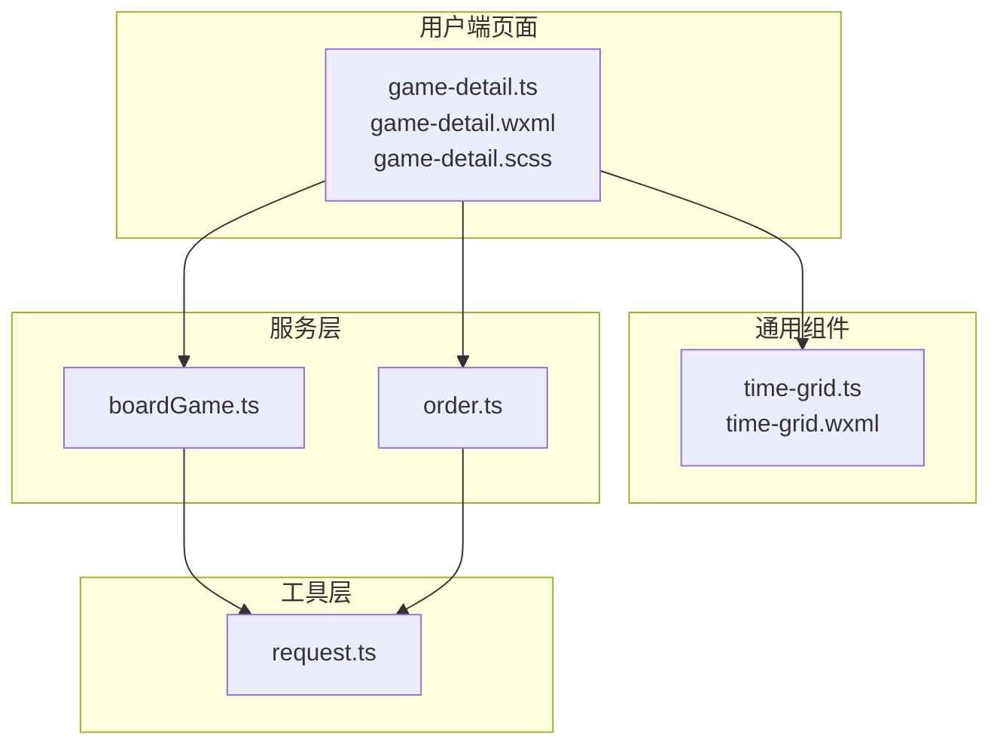
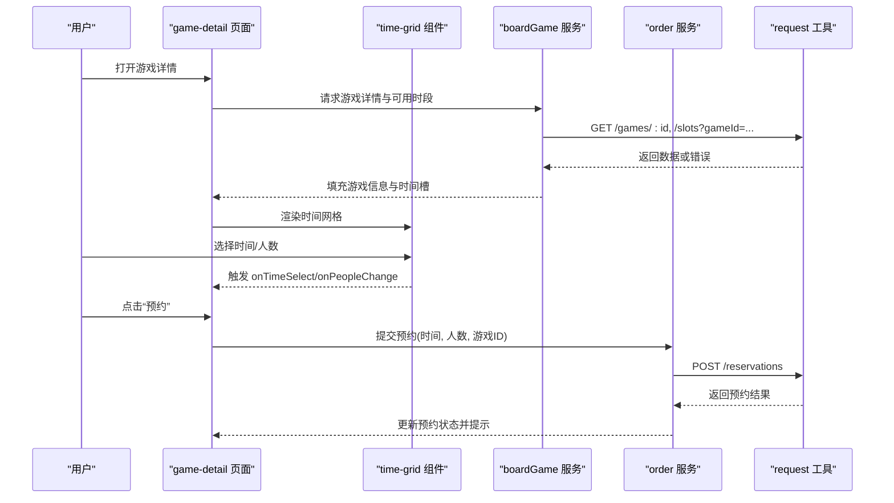
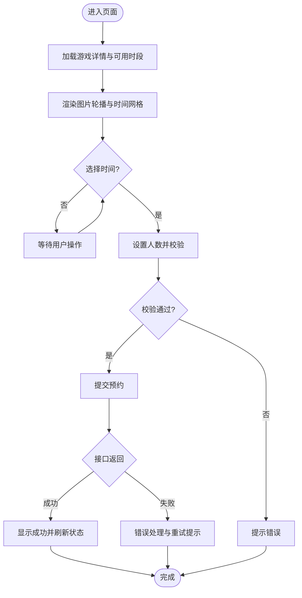
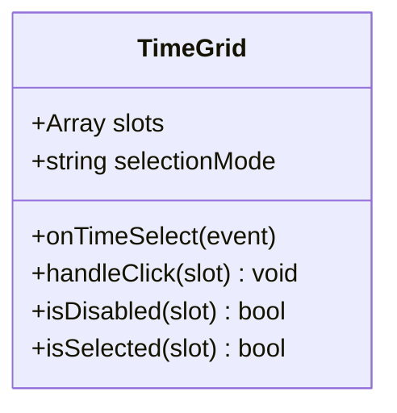
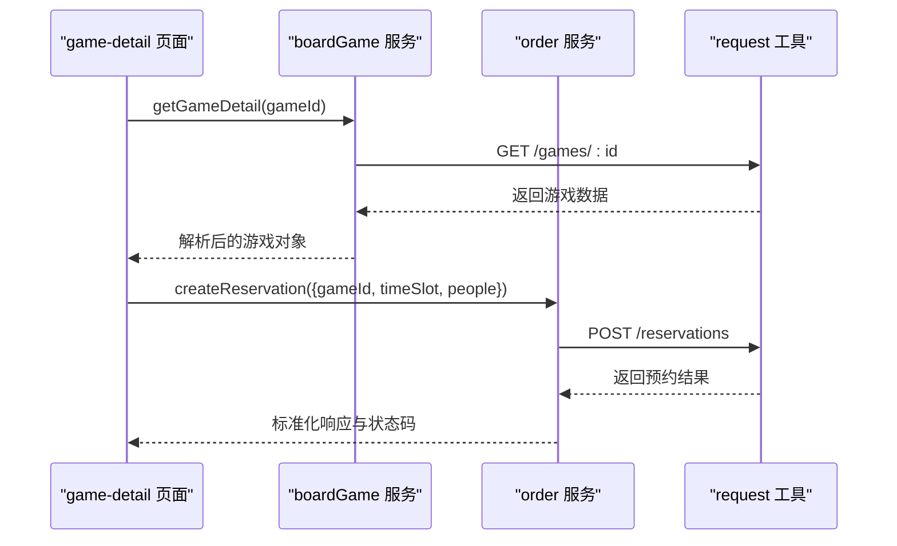
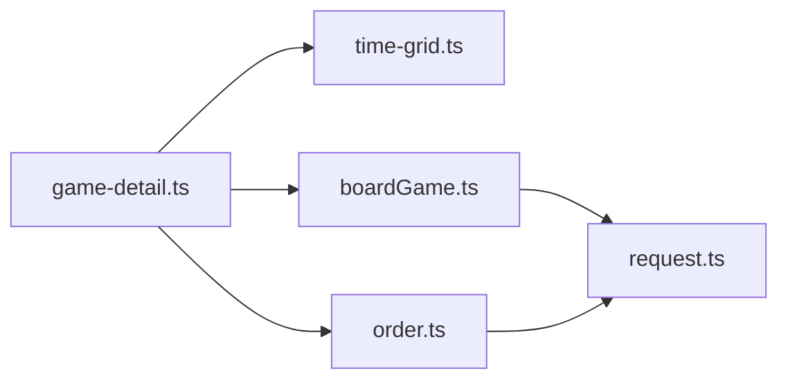

# 游戏详情模块

<cite>
**本文引用的文件**   
- [miniprogram/pages/user/game-detail/game-detail.ts](file://miniprogram/pages/user/game-detail/game-detail.ts)
- [miniprogram/pages/user/game-detail/game-detail.wxml](file://miniprogram/pages/user/game-detail/game-detail.wxml)
- [miniprogram/pages/user/game-detail/game-detail.scss](file://miniprogram/pages/user/game-detail/game-detail.scss)
- [miniprogram/components/time-grid/time-grid.ts](file://miniprogram/components/time-grid/time-grid.ts)
- [miniprogram/components/time-grid/time-grid.wxml](file://miniprogram/components/time-grid/time-grid.wxml)
- [miniprogram/services/boardGame.ts](file://miniprogram/services/boardGame.ts)
- [miniprogram/services/order.ts](file://miniprogram/services/order.ts)
- [miniprogram/utils/request.ts](file://miniprogram/utils/request.ts)
</cite>

## 目录
1. [简介](#简介)
2. [项目结构](#项目结构)
3. [核心组件](#核心组件)
4. [架构总览](#架构总览)
5. [详细组件分析](#详细组件分析)
6. [依赖关系分析](#依赖关系分析)
7. [性能考量](#性能考量)
8. [故障排查指南](#故障排查指南)
9. [结论](#结论)
10. [附录](#附录)

## 简介
本模块面向用户端“游戏详情”页面，提供以下能力：
- 游戏信息展示（名称、描述、封面图轮播等）
- 预约时间选择（基于时间网格组件）
- 人数配置与校验
- 预约确认与提交
- 与后端预约服务的数据交互与状态实时更新

该文档从系统架构、数据流、表单验证、组件集成到错误处理进行系统化说明，帮助开发者快速理解并扩展功能。

## 项目结构
游戏详情模块位于用户端 pages 下，采用小程序 Page + Component 的常见组织方式；业务逻辑通过 services 层封装，网络请求统一由 utils/request.ts 管理。

图表来源
- [miniprogram/pages/user/game-detail/game-detail.ts](file://miniprogram/pages/user/game-detail/game-detail.ts)
- [miniprogram/components/time-grid/time-grid.ts](file://miniprogram/components/time-grid/time-grid.ts)
- [miniprogram/services/boardGame.ts](file://miniprogram/services/boardGame.ts)
- [miniprogram/services/order.ts](file://miniprogram/services/order.ts)
- [miniprogram/utils/request.ts](file://miniprogram/utils/request.ts)

章节来源
- [miniprogram/pages/user/game-detail/game-detail.ts](file://miniprogram/pages/user/game-detail/game-detail.ts)
- [miniprogram/pages/user/game-detail/game-detail.wxml](file://miniprogram/pages/user/game-detail/game-detail.wxml)
- [miniprogram/pages/user/game-detail/game-detail.scss](file://miniprogram/pages/user/game-detail/game-detail.scss)
- [miniprogram/components/time-grid/time-grid.ts](file://miniprogram/components/time-grid/time-grid.ts)
- [miniprogram/components/time-grid/time-grid.wxml](file://miniprogram/components/time-grid/time-grid.wxml)
- [miniprogram/services/boardGame.ts](file://miniprogram/services/boardGame.ts)
- [miniprogram/services/order.ts](file://miniprogram/services/order.ts)
- [miniprogram/utils/request.ts](file://miniprogram/utils/request.ts)

## 核心组件
- 游戏详情页面（user/game-detail）
  - 负责加载游戏基础信息与可用时间段、渲染图片轮播、承载时间网格与人数选择、执行预约提交与结果反馈。
- 时间网格组件（components/time-grid）
  - 以网格形式展示日期/时段，支持选中、禁用、多选或单选策略，向父页面发出选择事件。
- 服务层
  - boardGame.ts：获取游戏详情、可预约时段等数据。
  - order.ts：创建预约订单、查询预约状态等。
- 请求工具
  - request.ts：统一封装 HTTP 请求、错误处理、拦截器与重试策略。

章节来源
- [miniprogram/pages/user/game-detail/game-detail.ts](file://miniprogram/pages/user/game-detail/game-detail.ts)
- [miniprogram/components/time-grid/time-grid.ts](file://miniprogram/components/time-grid/time-grid.ts)
- [miniprogram/services/boardGame.ts](file://miniprogram/services/boardGame.ts)
- [miniprogram/services/order.ts](file://miniprogram/services/order.ts)
- [miniprogram/utils/request.ts](file://miniprogram/utils/request.ts)

## 架构总览
下图展示了用户操作到数据返回的关键调用链，以及各层职责边界。

图表来源
- [miniprogram/pages/user/game-detail/game-detail.ts](file://miniprogram/pages/user/game-detail/game-detail.ts)
- [miniprogram/components/time-grid/time-grid.ts](file://miniprogram/components/time-grid/time-grid.ts)
- [miniprogram/services/boardGame.ts](file://miniprogram/services/boardGame.ts)
- [miniprogram/services/order.ts](file://miniprogram/services/order.ts)
- [miniprogram/utils/request.ts](file://miniprogram/utils/request.ts)

## 详细组件分析

### 游戏详情页面（user/game-detail）
- 数据获取
  - 初始化时根据路由参数获取 gameId，调用 boardGame 服务拉取游戏详情与可用时段。
  - 将返回的游戏基本信息用于标题、描述与图片列表渲染。
- 图片轮播
  - 使用小程序原生 swiper 组件，绑定 images 数组，自动播放与指示点开关可按需配置。
- 时间网格集成
  - 将服务端返回的时间段映射为 time-grid 所需的 slots 数据结构，传入组件渲染。
  - 监听组件的 onTimeSelect 事件，维护当前选中的时间槽。
- 人数配置与校验
  - 提供人数输入或步进控件，限制最小/最大人数，并在提交前进行合法性校验。
- 预约确认流程
  - 校验通过后调用 order 服务创建预约，成功后更新本地状态并给出成功提示。
  - 失败时捕获错误码并提示用户重试或检查网络。
- 状态实时更新
  - 在关键节点（如时间切换、人数变更、提交中/成功/失败）更新页面状态，确保 UI 与数据一致。

图表来源
- [miniprogram/pages/user/game-detail/game-detail.ts](file://miniprogram/pages/user/game-detail/game-detail.ts)
- [miniprogram/services/boardGame.ts](file://miniprogram/services/boardGame.ts)
- [miniprogram/services/order.ts](file://miniprogram/services/order.ts)
- [miniprogram/utils/request.ts](file://miniprogram/utils/request.ts)

章节来源
- [miniprogram/pages/user/game-detail/game-detail.ts](file://miniprogram/pages/user/game-detail/game-detail.ts)
- [miniprogram/pages/user/game-detail/game-detail.wxml](file://miniprogram/pages/user/game-detail/game-detail.wxml)
- [miniprogram/pages/user/game-detail/game-detail.scss](file://miniprogram/pages/user/game-detail/game-detail.scss)

### 时间网格组件（components/time-grid）
- 数据模型
  - slots：包含日期、时段、是否可选、是否已选等字段。
  - selectionMode：单选或多选模式。
- 交互逻辑
  - 点击格子触发选中/取消选中，禁用态不可选。
  - 向父页面抛出 onTimeSelect 事件，携带选中项集合。
- 样式与无障碍
  - 选中态高亮、禁用态置灰，提供 aria 属性提升可访问性。

图表来源
- [miniprogram/components/time-grid/time-grid.ts](file://miniprogram/components/time-grid/time-grid.ts)
- [miniprogram/components/time-grid/time-grid.wxml](file://miniprogram/components/time-grid/time-grid.wxml)

章节来源
- [miniprogram/components/time-grid/time-grid.ts](file://miniprogram/components/time-grid/time-grid.ts)
- [miniprogram/components/time-grid/time-grid.wxml](file://miniprogram/components/time-grid/time-grid.wxml)

### 服务层与数据交互
- boardGame.ts
  - 提供获取游戏详情、获取可用时段等方法，内部调用 request.ts 发起网络请求。
- order.ts
  - 提供创建预约、查询预约状态等方法，统一处理响应结构与错误码。
- request.ts
  - 封装 wx.request，提供请求拦截（如添加 token）、响应拦截（错误码转换、重试）、超时控制与日志记录。

图表来源
- [miniprogram/services/boardGame.ts](file://miniprogram/services/boardGame.ts)
- [miniprogram/services/order.ts](file://miniprogram/services/order.ts)
- [miniprogram/utils/request.ts](file://miniprogram/utils/request.ts)

章节来源
- [miniprogram/services/boardGame.ts](file://miniprogram/services/boardGame.ts)
- [miniprogram/services/order.ts](file://miniprogram/services/order.ts)
- [miniprogram/utils/request.ts](file://miniprogram/utils/request.ts)

## 依赖关系分析
- 页面依赖组件与服务层，服务层依赖请求工具。
- 组件与页面通过事件通信，避免直接耦合。
- 服务层对请求工具解耦，便于替换底层实现或增加拦截逻辑。

图表来源
- [miniprogram/pages/user/game-detail/game-detail.ts](file://miniprogram/pages/user/game-detail/game-detail.ts)
- [miniprogram/components/time-grid/time-grid.ts](file://miniprogram/components/time-grid/time-grid.ts)
- [miniprogram/services/boardGame.ts](file://miniprogram/services/boardGame.ts)
- [miniprogram/services/order.ts](file://miniprogram/services/order.ts)
- [miniprogram/utils/request.ts](file://miniprogram/utils/request.ts)

章节来源
- [miniprogram/pages/user/game-detail/game-detail.ts](file://miniprogram/pages/user/game-detail/game-detail.ts)
- [miniprogram/components/time-grid/time-grid.ts](file://miniprogram/components/time-grid/time-grid.ts)
- [miniprogram/services/boardGame.ts](file://miniprogram/services/boardGame.ts)
- [miniprogram/services/order.ts](file://miniprogram/services/order.ts)
- [miniprogram/utils/request.ts](file://miniprogram/utils/request.ts)

## 性能考量
- 图片优化
  - 使用懒加载与压缩尺寸，减少首屏资源体积。
  - 合理设置 swiper 的 autoplay 与 indicatorDots，避免过度重绘。
- 数据缓存
  - 对游戏详情与常用时段做短期缓存，减少重复请求。
- 渲染优化
  - 时间网格按需渲染，避免一次性生成大量 DOM。
- 网络优化
  - 请求合并与去抖，失败重试与超时控制，降低抖动与卡顿。

[本节为通用指导，不直接分析具体文件]

## 故障排查指南
- 常见问题
  - 时间网格无数据：检查 boardGame 服务返回的 slots 结构是否符合组件期望。
  - 预约提交失败：查看 order 服务的错误码与 request 拦截器的错误处理逻辑。
  - 图片无法加载：确认图片 URL 有效且域名白名单配置正确。
- 调试建议
  - 在 request.ts 中开启详细日志，观察请求头、响应体与错误堆栈。
  - 在 game-detail.ts 中打印关键状态变化，定位 UI 不同步问题。
  - 使用微信小程序开发者工具的 Network 面板核对接口路径与参数。

章节来源
- [miniprogram/utils/request.ts](file://miniprogram/utils/request.ts)
- [miniprogram/services/boardGame.ts](file://miniprogram/services/boardGame.ts)
- [miniprogram/services/order.ts](file://miniprogram/services/order.ts)
- [miniprogram/pages/user/game-detail/game-detail.ts](file://miniprogram/pages/user/game-detail/game-detail.ts)

## 结论
游戏详情模块通过清晰的页面-组件-服务分层，实现了游戏信息展示、时间选择、人数配置与预约提交流程。借助统一的请求工具与标准化的错误处理，保证了良好的用户体验与可维护性。后续可扩展更多交互与优化点，如多人协作预约、动态价格计算与更丰富的可视化反馈。

[本节为总结性内容，不直接分析具体文件]

## 附录
- 关键数据模型建议
  - 游戏详情：id、name、description、images[]、rules、tags
  - 时段槽：date、startTime、endTime、available、selected、disabled
  - 预约请求：gameId、slotId、people、userId、remark
  - 预约响应：code、message、data{reservationId、status}
- 最佳实践
  - 所有用户输入均需前端校验，再交由后端二次校验。
  - 异步操作需提供 loading 与错误提示，保证可感知性。
  - 组件间通过事件通信，保持低耦合与高内聚。

[本节为补充说明，不直接分析具体文件]