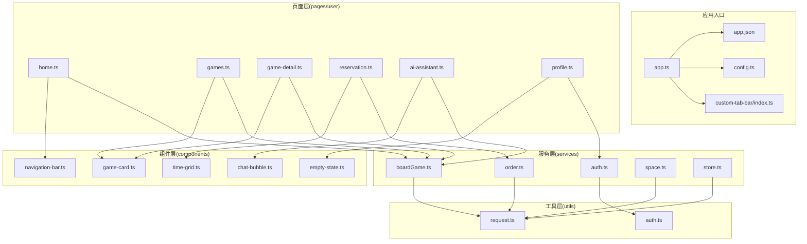
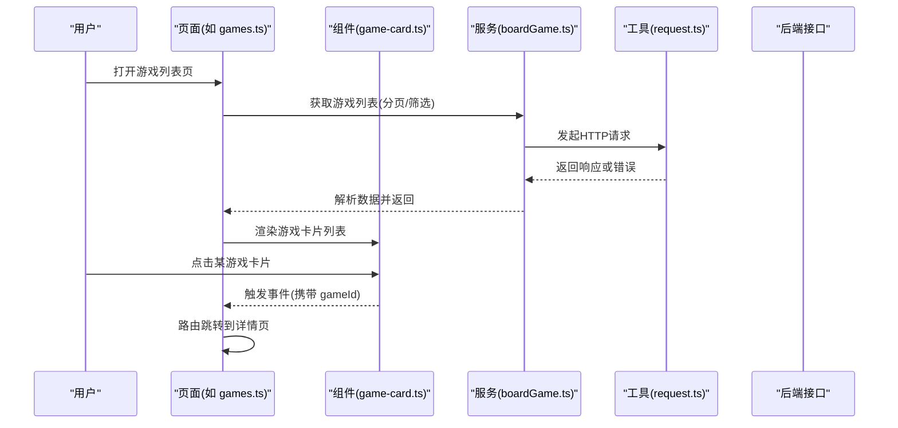
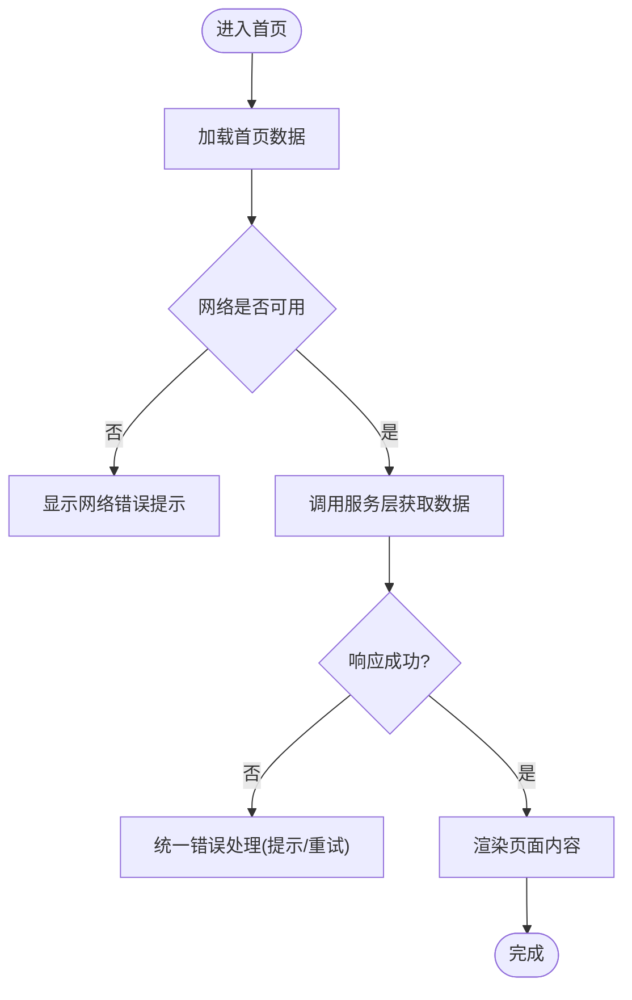
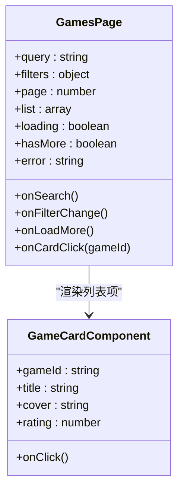
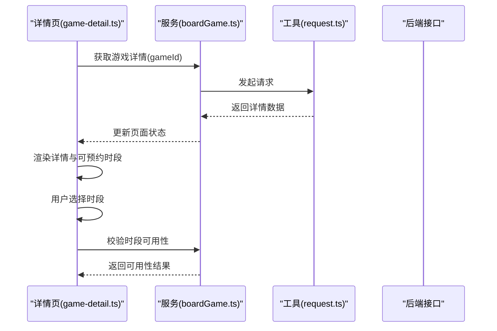
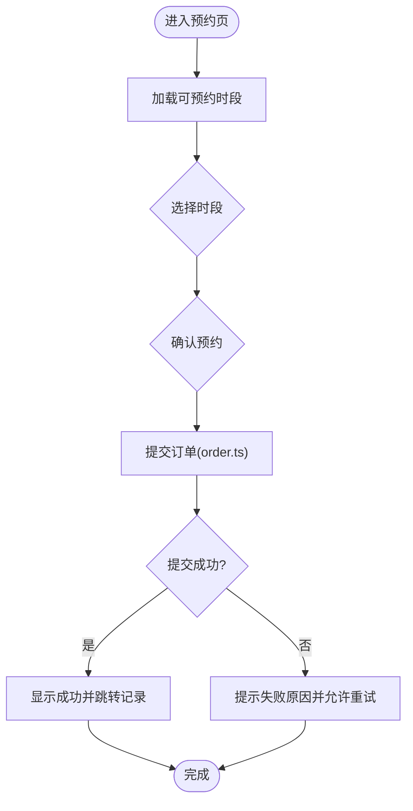
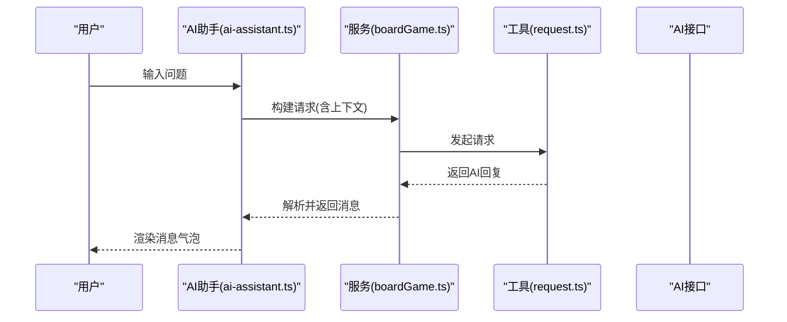
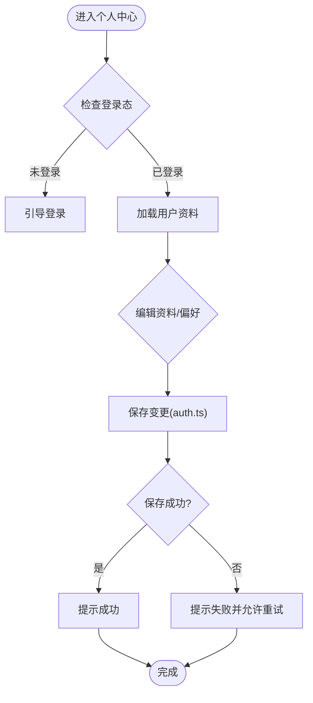
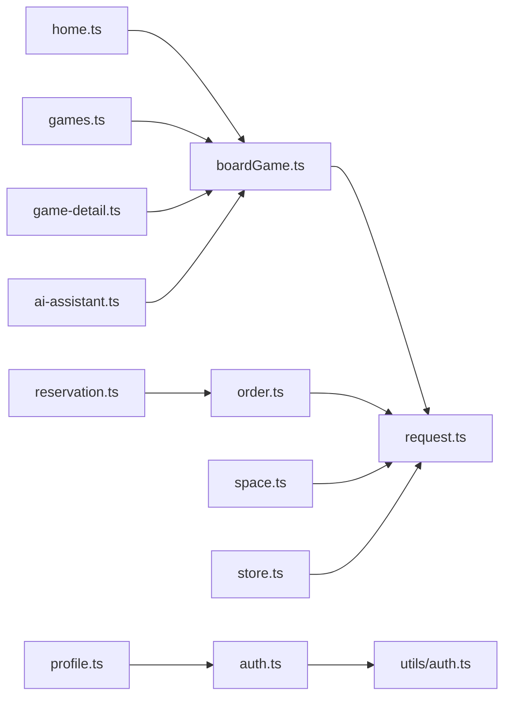

# 用户端功能

<cite>
**本文引用的文件**   
- [app.ts](file://miniprogram/app.ts)
- [config.ts](file://miniprogram/config.ts)
- [app.json](file://miniprogram/app.json)
- [custom-tab-bar/index.ts](file://miniprogram/custom-tab-bar/index.ts)
- [pages/user/home/home.ts](file://miniprogram/pages/user/home/home.ts)
- [pages/user/games/games.ts](file://miniprogram/pages/user/games/games.ts)
- [pages/user/game-detail/game-detail.ts](file://miniprogram/pages/user/game-detail/game-detail.ts)
- [pages/user/reservation/reservation.ts](file://miniprogram/pages/user/reservation/reservation.ts)
- [pages/user/ai-assistant/ai-assistant.ts](file://miniprogram/pages/user/ai-assistant/ai-assistant.ts)
- [pages/user/profile/profile.ts](file://miniprogram/pages/user/profile/profile.ts)
- [services/boardGame.ts](file://miniprogram/services/boardGame.ts)
- [services/order.ts](file://miniprogram/services/order.ts)
- [services/auth.ts](file://miniprogram/services/auth.ts)
- [services/space.ts](file://miniprogram/services/space.ts)
- [services/store.ts](file://miniprogram/services/store.ts)
- [utils/request.ts](file://miniprogram/utils/request.ts)
- [utils/auth.ts](file://miniprogram/utils/auth.ts)
- [components/game-card/game-card.ts](file://miniprogram/components/game-card/game-card.ts)
- [components/chat-bubble/chat-bubble.ts](file://miniprogram/components/chat-bubble/chat-bubble.ts)
- [components/time-grid/time-grid.ts](file://miniprogram/components/time-grid/time-grid.ts)
- [components/navigation-bar/navigation-bar.ts](file://miniprogram/components/navigation-bar/navigation-bar.ts)
- [components/empty-state/empty-state.ts](file://miniprogram/components/empty-state/empty-state.ts)
</cite>

## 目录
1. [简介](#简介)
2. [项目结构](#项目结构)
3. [核心组件与页面](#核心组件与页面)
4. [架构总览](#架构总览)
5. [详细功能分析](#详细功能分析)
6. [依赖关系分析](#依赖关系分析)
7. [性能与体验优化](#性能与体验优化)
8. [故障排查指南](#故障排查指南)
9. [结论](#结论)
10. [附录：数据模型与接口约定](#附录数据模型与接口约定)

## 简介
本文件面向“用户端”功能模块，覆盖首页展示、游戏浏览与搜索、游戏详情查看、预约管理、AI助手交互与个人资料管理。文档从界面说明、用户操作流程、数据交互逻辑、状态管理、错误处理、加载状态与用户反馈等方面展开，并提供代码级参考路径与可视化图示，帮助开发者快速理解并扩展功能。

## 项目结构
用户端采用小程序多页面架构，按“页面 + 组件 + 服务层 + 工具层”分层组织：
- 页面层：用户端各业务页面位于 pages/user 下，如 home、games、game-detail、reservation、ai-assistant、profile。
- 组件层：通用 UI 组件位于 components，如 game-card、chat-bubble、time-grid、navigation-bar、empty-state。
- 服务层：业务 API 封装位于 services，如 boardGame.ts、order.ts、auth.ts、space.ts、store.ts。
- 工具层：网络请求、鉴权等公共能力位于 utils，如 request.ts、auth.ts。
- 应用配置：入口 app.ts、全局配置 app.json、站点配置 config.ts、自定义 tabbar custom-tab-bar。

图表来源
- [app.ts:1-200](file://miniprogram/app.ts#L1-L200)
- [config.ts:1-200](file://miniprogram/config.ts#L1-L200)
- [app.json:1-200](file://miniprogram/app.json#L1-L200)
- [custom-tab-bar/index.ts:1-200](file://miniprogram/custom-tab-bar/index.ts#L1-L200)
- [pages/user/home/home.ts:1-200](file://miniprogram/pages/user/home/home.ts#L1-L200)
- [pages/user/games/games.ts:1-200](file://miniprogram/pages/user/games/games.ts#L1-L200)
- [pages/user/game-detail/game-detail.ts:1-200](file://miniprogram/pages/user/game-detail/game-detail.ts#L1-L200)
- [pages/user/reservation/reservation.ts:1-200](file://miniprogram/pages/user/reservation/reservation.ts#L1-L200)
- [pages/user/ai-assistant/ai-assistant.ts:1-200](file://miniprogram/pages/user/ai-assistant/ai-assistant.ts#L1-L200)
- [pages/user/profile/profile.ts:1-200](file://miniprogram/pages/user/profile/profile.ts#L1-L200)
- [services/boardGame.ts:1-200](file://miniprogram/services/boardGame.ts#L1-L200)
- [services/order.ts:1-200](file://miniprogram/services/order.ts#L1-L200)
- [services/auth.ts:1-200](file://miniprogram/services/auth.ts#L1-L200)
- [services/space.ts:1-200](file://miniprogram/services/space.ts#L1-L200)
- [services/store.ts:1-200](file://miniprogram/services/store.ts#L1-L200)
- [utils/request.ts:1-200](file://miniprogram/utils/request.ts#L1-L200)
- [utils/auth.ts:1-200](file://miniprogram/utils/auth.ts#L1-L200)
- [components/game-card/game-card.ts:1-200](file://miniprogram/components/game-card/game-card.ts#L1-L200)
- [components/chat-bubble/chat-bubble.ts:1-200](file://miniprogram/components/chat-bubble/chat-bubble.ts#L1-L200)
- [components/time-grid/time-grid.ts:1-200](file://miniprogram/components/time-grid/time-grid.ts#L1-L200)
- [components/navigation-bar/navigation-bar.ts:1-200](file://miniprogram/components/navigation-bar/navigation-bar.ts#L1-L200)
- [components/empty-state/empty-state.ts:1-200](file://miniprogram/components/empty-state/empty-state.ts#L1-L200)

章节来源
- [app.ts:1-200](file://miniprogram/app.ts#L1-L200)
- [app.json:1-200](file://miniprogram/app.json#L1-L200)
- [config.ts:1-200](file://miniprogram/config.ts#L1-L200)
- [custom-tab-bar/index.ts:1-200](file://miniprogram/custom-tab-bar/index.ts#L1-L200)

## 核心组件与页面
- 首页（home）：展示推荐、热门、分类入口；支持快捷跳转至游戏列表与搜索。
- 游戏浏览与搜索（games）：分页列表、筛选、关键词搜索、排序；点击卡片进入详情。
- 游戏详情（game-detail）：基本信息、图片轮播、规则说明、可预约时段、立即预约按钮。
- 预约管理（reservation）：选择时段、确认预约、提交订单、查看预约记录与状态。
- AI助手（ai-assistant）：对话式问答、推荐游戏、解答规则与玩法建议。
- 个人资料（profile）：头像昵称编辑、登录态管理、偏好设置、退出登录。

章节来源
- [pages/user/home/home.ts:1-200](file://miniprogram/pages/user/home/home.ts#L1-L200)
- [pages/user/games/games.ts:1-200](file://miniprogram/pages/user/games/games.ts#L1-L200)
- [pages/user/game-detail/game-detail.ts:1-200](file://miniprogram/pages/user/game-detail/game-detail.ts#L1-L200)
- [pages/user/reservation/reservation.ts:1-200](file://miniprogram/pages/user/reservation/reservation.ts#L1-L200)
- [pages/user/ai-assistant/ai-assistant.ts:1-200](file://miniprogram/pages/user/ai-assistant/ai-assistant.ts#L1-L200)
- [pages/user/profile/profile.ts:1-200](file://miniprogram/pages/user/profile/profile.ts#L1-L200)

## 架构总览
用户端遵循“页面调用服务层，服务层通过工具层发起网络请求”的分层模式。组件负责UI与局部状态，页面聚合组件并协调数据流，服务层统一封装API，工具层提供请求与鉴权能力。

图表来源
- [pages/user/games/games.ts:1-200](file://miniprogram/pages/user/games/games.ts#L1-L200)
- [components/game-card/game-card.ts:1-200](file://miniprogram/components/game-card/game-card.ts#L1-L200)
- [services/boardGame.ts:1-200](file://miniprogram/services/boardGame.ts#L1-L200)
- [utils/request.ts:1-200](file://miniprogram/utils/request.ts#L1-L200)

## 详细功能分析

### 首页展示
- 界面说明：顶部导航栏、Banner轮播、推荐位、分类入口、活动信息。
- 用户操作：滑动浏览、点击入口跳转对应页面。
- 数据交互：首页数据由 boardGame.ts 提供（推荐、热门、分类），通过 request.ts 拉取。
- 状态管理：页面维护 loading、error、data 状态；空数据时显示 empty-state 组件。
- 最佳实践：首次加载使用骨架屏或占位图；失败重试按钮；网络异常提示。

章节来源
- [pages/user/home/home.ts:1-200](file://miniprogram/pages/user/home/home.ts#L1-L200)
- [services/boardGame.ts:1-200](file://miniprogram/services/boardGame.ts#L1-L200)
- [utils/request.ts:1-200](file://miniprogram/utils/request.ts#L1-L200)
- [components/empty-state/empty-state.ts:1-200](file://miniprogram/components/empty-state/empty-state.ts#L1-L200)

### 游戏浏览与搜索
- 界面说明：搜索框、筛选条件（分类/评分/人数）、排序选项、分页列表。
- 用户操作：输入关键词、选择筛选、翻页、点击卡片进入详情。
- 数据交互：games.ts 调用 boardGame.ts 的列表接口，支持分页参数与查询条件。
- 状态管理：维护 query、filters、page、list、loading、hasMore、error。
- 通信机制：game-card 组件通过事件向页面传递 gameId，页面执行路由跳转。

图表来源
- [pages/user/games/games.ts:1-200](file://miniprogram/pages/user/games/games.ts#L1-L200)
- [components/game-card/game-card.ts:1-200](file://miniprogram/components/game-card/game-card.ts#L1-L200)

章节来源
- [pages/user/games/games.ts:1-200](file://miniprogram/pages/user/games/games.ts#L1-L200)
- [components/game-card/game-card.ts:1-200](file://miniprogram/components/game-card/game-card.ts#L1-L200)
- [services/boardGame.ts:1-200](file://miniprogram/services/boardGame.ts#L1-L200)

### 游戏详情查看
- 界面说明：封面图、标题、简介、标签、规则说明、可预约时段、预约按钮。
- 用户操作：查看详情、选择时段、点击预约。
- 数据交互：game-detail.ts 调用 boardGame.ts 获取详情与可预约时段；reservation.ts 负责下单。
- 状态管理：detail、slots、selectedSlot、loading、error。
- 错误处理：无数据时显示空状态；网络失败提示并重试。

图表来源
- [pages/user/game-detail/game-detail.ts:1-200](file://miniprogram/pages/user/game-detail/game-detail.ts#L1-L200)
- [services/boardGame.ts:1-200](file://miniprogram/services/boardGame.ts#L1-L200)
- [utils/request.ts:1-200](file://miniprogram/utils/request.ts#L1-L200)

章节来源
- [pages/user/game-detail/game-detail.ts:1-200](file://miniprogram/pages/user/game-detail/game-detail.ts#L1-L200)
- [services/boardGame.ts:1-200](file://miniprogram/services/boardGame.ts#L1-L200)

### 预约管理
- 界面说明：时间网格选择、数量选择、价格汇总、提交按钮、预约记录列表。
- 用户操作：选择日期与时段、确认预约、查看历史预约。
- 数据交互：reservation.ts 调用 order.ts 创建订单；boardGame.ts 获取可预约时段。
- 状态管理：selectedSlots、quantity、price、submitting、orderList、status。
- 错误处理：时段不可用提示、库存不足提示、支付失败回滚。

图表来源
- [pages/user/reservation/reservation.ts:1-200](file://miniprogram/pages/user/reservation/reservation.ts#L1-L200)
- [services/order.ts:1-200](file://miniprogram/services/order.ts#L1-L200)
- [components/time-grid/time-grid.ts:1-200](file://miniprogram/components/time-grid/time-grid.ts#L1-L200)

章节来源
- [pages/user/reservation/reservation.ts:1-200](file://miniprogram/pages/user/reservation/reservation.ts#L1-L200)
- [services/order.ts:1-200](file://miniprogram/services/order.ts#L1-L200)
- [components/time-grid/time-grid.ts:1-200](file://miniprogram/components/time-grid/time-grid.ts#L1-L200)

### AI助手交互
- 界面说明：聊天消息气泡、输入框、发送按钮、快捷问题。
- 用户操作：输入问题、选择快捷问题、查看回复。
- 数据交互：ai-assistant.ts 调用 boardGame.ts 或独立AI接口进行问答；本地缓存常用回答。
- 状态管理：messages、inputText、isTyping、error。
- 用户体验：打字指示器、错误重试、长文本折叠。

图表来源
- [pages/user/ai-assistant/ai-assistant.ts:1-200](file://miniprogram/pages/user/ai-assistant/ai-assistant.ts#L1-L200)
- [components/chat-bubble/chat-bubble.ts:1-200](file://miniprogram/components/chat-bubble/chat-bubble.ts#L1-L200)
- [services/boardGame.ts:1-200](file://miniprogram/services/boardGame.ts#L1-L200)
- [utils/request.ts:1-200](file://miniprogram/utils/request.ts#L1-L200)

章节来源
- [pages/user/ai-assistant/ai-assistant.ts:1-200](file://miniprogram/pages/user/ai-assistant/ai-assistant.ts#L1-L200)
- [components/chat-bubble/chat-bubble.ts:1-200](file://miniprogram/components/chat-bubble/chat-bubble.ts#L1-L200)
- [services/boardGame.ts:1-200](file://miniprogram/services/boardGame.ts#L1-L200)

### 个人资料管理
- 界面说明：头像、昵称、联系方式、登录状态、偏好设置、退出登录。
- 用户操作：编辑资料、切换登录态、修改偏好。
- 数据交互：profile.ts 调用 auth.ts 管理登录态；必要时调用其他服务更新用户信息。
- 状态管理：user、loginStatus、preferences、saving。
- 安全与反馈：敏感操作二次确认；保存成功提示；失败重试。

图表来源
- [pages/user/profile/profile.ts:1-200](file://miniprogram/pages/user/profile/profile.ts#L1-L200)
- [services/auth.ts:1-200](file://miniprogram/services/auth.ts#L1-L200)
- [utils/auth.ts:1-200](file://miniprogram/utils/auth.ts#L1-L200)

章节来源
- [pages/user/profile/profile.ts:1-200](file://miniprogram/pages/user/profile/profile.ts#L1-L200)
- [services/auth.ts:1-200](file://miniprogram/services/auth.ts#L1-L200)
- [utils/auth.ts:1-200](file://miniprogram/utils/auth.ts#L1-L200)

## 依赖关系分析
- 页面与服务层解耦：页面仅依赖服务层方法，不直接访问网络。
- 服务层与工具层解耦：服务层通过 request.ts 统一发起请求，便于拦截与错误处理。
- 组件与页面通信：组件通过事件向页面传递数据，避免紧耦合。
- 全局状态：store.ts 用于跨页面共享状态（如用户信息、主题）。

图表来源
- [pages/user/home/home.ts:1-200](file://miniprogram/pages/user/home/home.ts#L1-L200)
- [pages/user/games/games.ts:1-200](file://miniprogram/pages/user/games/games.ts#L1-L200)
- [pages/user/game-detail/game-detail.ts:1-200](file://miniprogram/pages/user/game-detail/game-detail.ts#L1-L200)
- [pages/user/reservation/reservation.ts:1-200](file://miniprogram/pages/user/reservation/reservation.ts#L1-L200)
- [pages/user/ai-assistant/ai-assistant.ts:1-200](file://miniprogram/pages/user/ai-assistant/ai-assistant.ts#L1-L200)
- [pages/user/profile/profile.ts:1-200](file://miniprogram/pages/user/profile/profile.ts#L1-L200)
- [services/boardGame.ts:1-200](file://miniprogram/services/boardGame.ts#L1-L200)
- [services/order.ts:1-200](file://miniprogram/services/order.ts#L1-L200)
- [services/auth.ts:1-200](file://miniprogram/services/auth.ts#L1-L200)
- [services/space.ts:1-200](file://miniprogram/services/space.ts#L1-L200)
- [services/store.ts:1-200](file://miniprogram/services/store.ts#L1-L200)
- [utils/request.ts:1-200](file://miniprogram/utils/request.ts#L1-L200)
- [utils/auth.ts:1-200](file://miniprogram/utils/auth.ts#L1-L200)

章节来源
- [services/boardGame.ts:1-200](file://miniprogram/services/boardGame.ts#L1-L200)
- [services/order.ts:1-200](file://miniprogram/services/order.ts#L1-L200)
- [services/auth.ts:1-200](file://miniprogram/services/auth.ts#L1-L200)
- [services/space.ts:1-200](file://miniprogram/services/space.ts#L1-L200)
- [services/store.ts:1-200](file://miniprogram/services/store.ts#L1-L200)
- [utils/request.ts:1-200](file://miniprogram/utils/request.ts#L1-L200)
- [utils/auth.ts:1-200](file://miniprogram/utils/auth.ts#L1-L200)

## 性能与体验优化
- 列表分页与虚拟滚动：games.ts 实现分页加载，避免一次性加载大量数据。
- 图片懒加载与压缩：game-card.ts 对封面图进行懒加载与尺寸适配。
- 请求去重与缓存：request.ts 支持相同请求合并与短期缓存，减少重复网络开销。
- 错误边界与重试：统一错误处理，关键操作提供重试按钮。
- 骨架屏与占位：首页与详情页在加载阶段展示骨架屏提升感知速度。
- 防抖与节流：搜索输入与频繁点击操作进行防抖/节流，降低无效请求。

[本节为通用指导，无需特定文件引用]

## 故障排查指南
- 网络错误：检查 request.ts 的错误拦截与提示逻辑；确认后端接口可达性与鉴权状态。
- 数据为空：检查 boardGame.ts 的数据解析与空值处理；确认 empty-state.ts 的展示条件。
- 预约失败：核对 order.ts 的参数校验与库存逻辑；查看 reservation.ts 的状态回滚。
- AI回复异常：检查 ai-assistant.ts 的消息格式与上下文拼接；确认接口返回字段一致性。
- 登录态失效：检查 auth.ts 的 token 刷新与过期处理；确认 store.ts 的用户信息同步。

章节来源
- [utils/request.ts:1-200](file://miniprogram/utils/request.ts#L1-L200)
- [services/boardGame.ts:1-200](file://miniprogram/services/boardGame.ts#L1-L200)
- [services/order.ts:1-200](file://miniprogram/services/order.ts#L1-L200)
- [pages/user/reservation/reservation.ts:1-200](file://miniprogram/pages/user/reservation/reservation.ts#L1-L200)
- [pages/user/ai-assistant/ai-assistant.ts:1-200](file://miniprogram/pages/user/ai-assistant/ai-assistant.ts#L1-L200)
- [services/auth.ts:1-200](file://miniprogram/services/auth.ts#L1-L200)
- [services/store.ts:1-200](file://miniprogram/services/store.ts#L1-L200)

## 结论
用户端功能模块以清晰的分层架构与组件化设计为基础，覆盖了首页、游戏浏览与搜索、详情查看、预约管理、AI助手与个人资料等核心场景。通过统一的服务层与工具层，实现了良好的可维护性与可扩展性。建议在后续迭代中持续优化性能与错误处理，提升用户体验。

[本节为总结，无需特定文件引用]

## 附录：数据模型与接口约定
- 游戏模型：包含 id、title、cover、description、tags、rating、players、rules 等字段。
- 预约模型：包含 orderId、gameId、slots、quantity、price、status、createdAt 等字段。
- 用户模型：包含 userId、nickname、avatar、contact、preferences 等字段。
- 接口约定：统一使用 request.ts 发起请求，返回标准结构 {code, data, message}；错误码与提示信息在服务层统一处理。

[本节为概念性说明，无需特定文件引用]