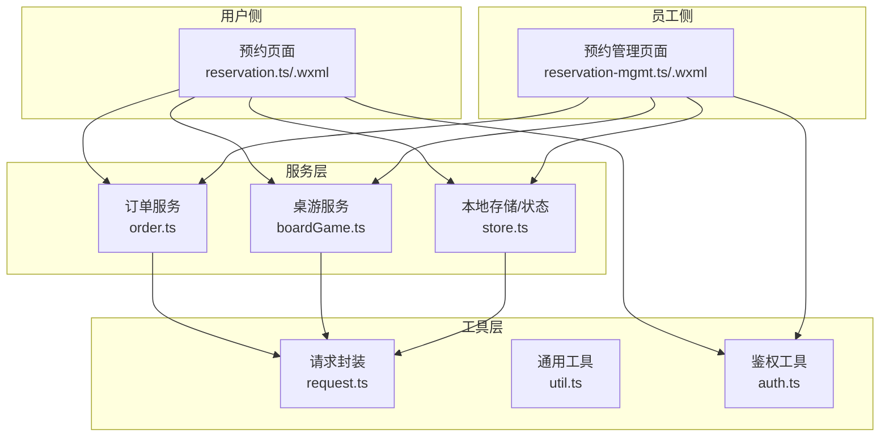
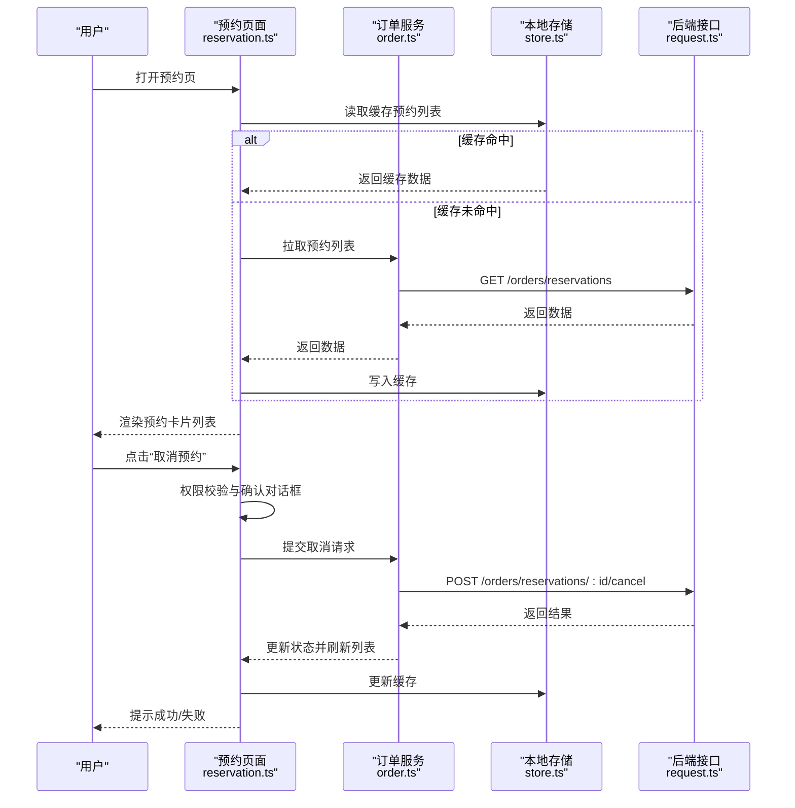
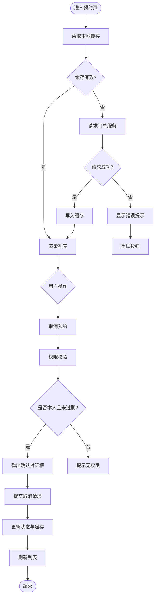
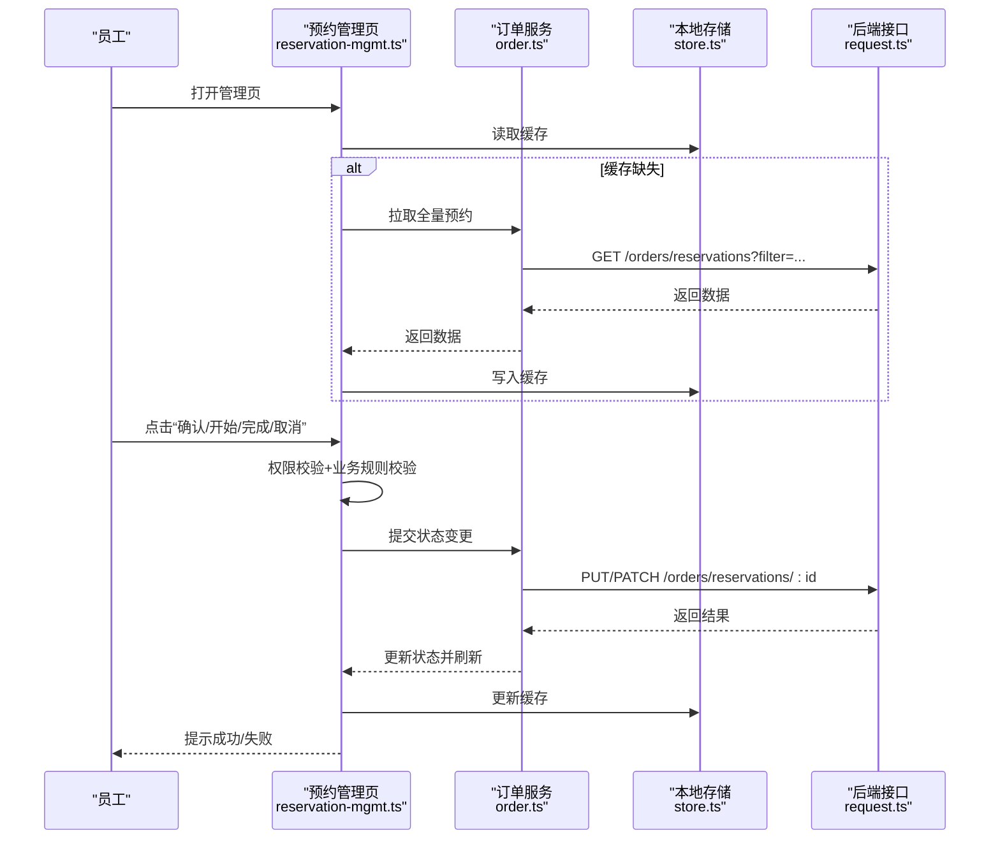
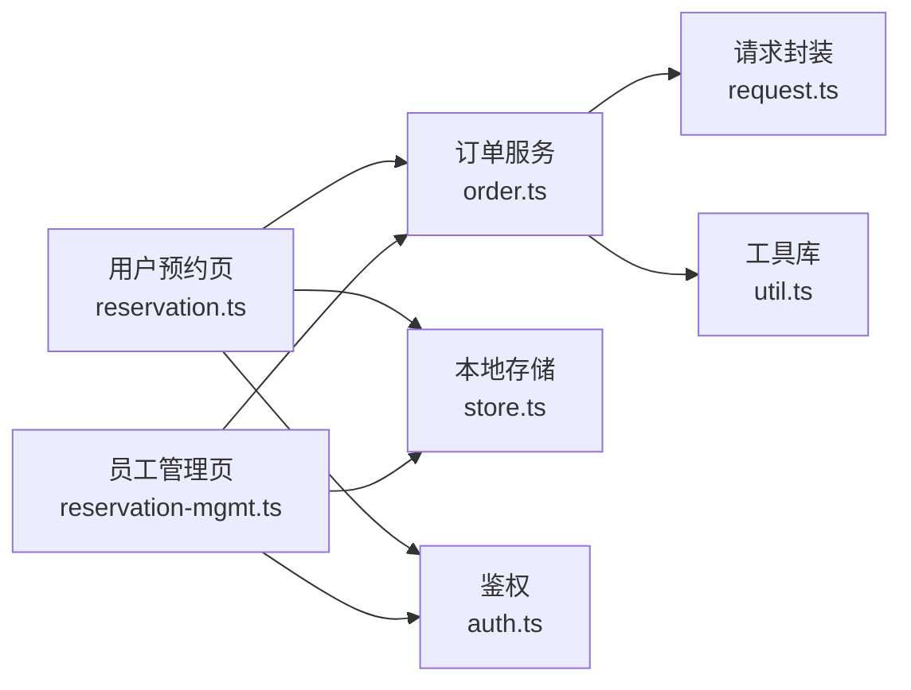

# 预约管理模块

<cite>
**本文引用的文件**   
- [reservation-mgmt.ts](file://miniprogram/pages/staff/reservation-mgmt/reservation-mgmt.ts)
- [reservation-mgmt.wxml](file://miniprogram/pages/staff/reservation-mgmt/reservation-mgmt.wxml)
- [reservation-mgmt.scss](file://miniprogram/pages/staff/reservation-mgmt/reservation-mgmt.scss)
- [reservation-mgmt.json](file://miniprogram/pages/staff/reservation-mgmt/reservation-mgmt.json)
- [reservation.ts](file://miniprogram/pages/user/reservation/reservation.ts)
- [reservation.wxml](file://miniprogram/pages/user/reservation/reservation.wxml)
- [reservation.scss](file://miniprogram/pages/user/reservation/reservation.scss)
- [reservation.json](file://miniprogram/pages/user/reservation/reservation.json)
- [order.ts](file://miniprogram/services/order.ts)
- [boardGame.ts](file://miniprogram/services/boardGame.ts)
- [store.ts](file://miniprogram/services/store.ts)
- [request.ts](file://miniprogram/utils/request.ts)
- [util.ts](file://miniprogram/utils/util.ts)
- [auth.ts](file://miniprogram/utils/auth.ts)
- [app.json](file://miniprogram/app.json)
</cite>

## 目录
1. [简介](#简介)
2. [项目结构](#项目结构)
3. [核心组件与页面](#核心组件与页面)
4. [架构总览](#架构总览)
5. [详细组件分析](#详细组件分析)
6. [依赖关系分析](#依赖关系分析)
7. [性能考虑](#性能考虑)
8. [故障排查指南](#故障排查指南)
9. [结论](#结论)
10. [附录](#附录)

## 简介
本模块面向“预约管理”场景，覆盖以下能力：
- 预约列表展示（用户侧与员工侧）
- 预约状态管理（创建、确认、进行中、完成、取消等）
- 取消预约流程与权限控制
- 预约历史查询与筛选
- 本地存储与同步机制（缓存与网络一致性）
- 预约卡片组件的使用与操作按钮的权限控制
- 与订单服务的集成与错误处理策略

该文档以代码级为依据，结合页面、服务与工具层，给出端到端的数据流与交互流程说明。

## 项目结构
预约相关功能分布在用户侧与员工侧两个页面中，并通过服务层与订单/桌台/桌游等服务进行集成。关键路径如下：
- 用户侧预约页：pages/user/reservation
- 员工侧预约管理页：pages/staff/reservation-mgmt
- 服务层：services/order.ts、services/boardGame.ts、services/store.ts
- 请求与工具：utils/request.ts、utils/util.ts、utils/auth.ts
- 应用配置：app.json（路由注册）

图表来源
- [reservation.ts](file://miniprogram/pages/user/reservation/reservation.ts)
- [reservation-mgmt.ts](file://miniprogram/pages/staff/reservation-mgmt/reservation-mgmt.ts)
- [order.ts](file://miniprogram/services/order.ts)
- [boardGame.ts](file://miniprogram/services/boardGame.ts)
- [store.ts](file://miniprogram/services/store.ts)
- [request.ts](file://miniprogram/utils/request.ts)
- [auth.ts](file://miniprogram/utils/auth.ts)

章节来源
- [app.json](file://miniprogram/app.json)

## 核心组件与页面
- 用户侧预约页面
  - 负责展示当前及历史预约、发起新预约、取消预约、查看预约详情
  - 通过订单服务获取预约数据，使用本地存储做缓存与离线可用
- 员工侧预约管理页面
  - 负责查看所有预约、按状态筛选、执行确认/开始/完成/取消等操作
  - 具备权限控制，仅允许有相应角色的员工执行敏感操作

章节来源
- [reservation.ts](file://miniprogram/pages/user/reservation/reservation.ts)
- [reservation-mgmt.ts](file://miniprogram/pages/staff/reservation-mgmt/reservation-mgmt.ts)

## 架构总览
预约管理采用“页面-服务-工具”的分层架构：
- 页面层：渲染预约列表、卡片、操作按钮与确认对话框
- 服务层：封装对订单服务、桌游服务、本地存储的调用
- 工具层：统一网络请求、鉴权、通用工具函数

图表来源
- [reservation.ts](file://miniprogram/pages/user/reservation/reservation.ts)
- [reservation-mgmt.ts](file://miniprogram/pages/staff/reservation-mgmt/reservation-mgmt.ts)
- [order.ts](file://miniprogram/services/order.ts)
- [store.ts](file://miniprogram/services/store.ts)
- [request.ts](file://miniprogram/utils/request.ts)

## 详细组件分析

### 用户侧预约页面（reservation.ts/.wxml/.scss）
- 功能要点
  - 列表展示：分页或滚动加载，支持按时间排序
  - 状态管理：待确认、已确认、进行中、已完成、已取消
  - 取消预约：权限校验（仅本人可取消）、二次确认弹窗
  - 历史查询：按时间段、状态筛选，支持搜索关键词
  - 本地存储：首次加载后写入缓存，后续优先读缓存再增量同步
- 交互流程
  - 进入页面时先读缓存，若过期或缺失则请求服务端
  - 操作成功后更新本地缓存与UI状态
  - 错误时提供重试与友好提示

图表来源
- [reservation.ts](file://miniprogram/pages/user/reservation/reservation.ts)
- [reservation.wxml](file://miniprogram/pages/user/reservation/reservation.wxml)
- [reservation.scss](file://miniprogram/pages/user/reservation/reservation.scss)

章节来源
- [reservation.ts](file://miniprogram/pages/user/reservation/reservation.ts)
- [reservation.wxml](file://miniprogram/pages/user/reservation/reservation.wxml)
- [reservation.scss](file://miniprogram/pages/user/reservation/reservation.scss)
- [reservation.json](file://miniprogram/pages/user/reservation/reservation.json)

### 员工侧预约管理页面（reservation-mgmt.ts/.wxml/.scss）
- 功能要点
  - 全量预约列表：支持按状态、时间、桌游名称筛选
  - 状态流转：确认、开始、完成、取消；不同状态对应不同按钮可见性
  - 权限控制：仅管理员/店长等角色可执行敏感操作
  - 批量操作：批量确认/取消（可选）
- 交互流程
  - 进入页面加载全部预约，优先本地缓存，必要时拉取服务端
  - 操作前校验权限与业务规则（如不可取消已开始预约）
  - 操作成功后同步本地缓存并刷新视图

图表来源
- [reservation-mgmt.ts](file://miniprogram/pages/staff/reservation-mgmt/reservation-mgmt.ts)
- [reservation-mgmt.wxml](file://miniprogram/pages/staff/reservation-mgmt/reservation-mgmt.wxml)
- [reservation-mgmt.scss](file://miniprogram/pages/staff/reservation-mgmt/reservation-mgmt.scss)
- [order.ts](file://miniprogram/services/order.ts)
- [store.ts](file://miniprogram/services/store.ts)
- [request.ts](file://miniprogram/utils/request.ts)

章节来源
- [reservation-mgmt.ts](file://miniprogram/pages/staff/reservation-mgmt/reservation-mgmt.ts)
- [reservation-mgmt.wxml](file://miniprogram/pages/staff/reservation-mgmt/reservation-mgmt.wxml)
- [reservation-mgmt.scss](file://miniprogram/pages/staff/reservation-mgmt/reservation-mgmt.scss)
- [reservation-mgmt.json](file://miniprogram/pages/staff/reservation-mgmt/reservation-mgmt.json)

### 预约卡片组件（复用建议）
- 职责
  - 展示预约基本信息（时间、桌游、状态、座位数等）
  - 根据状态与权限动态显示操作按钮（取消、确认、开始、完成）
  - 触发用户确认对话框，避免误操作
- 使用方式
  - 在列表项中渲染卡片组件，传入预约数据与回调事件
  - 通过属性控制按钮可见性与禁用状态
  - 事件回调由页面层处理权限校验与业务逻辑

章节来源
- [reservation.wxml](file://miniprogram/pages/user/reservation/reservation.wxml)
- [reservation-mgmt.wxml](file://miniprogram/pages/staff/reservation-mgmt/reservation-mgmt.wxml)

### 与订单服务的集成与错误处理
- 集成点
  - 获取预约列表：GET /orders/reservations（支持过滤参数）
  - 取消预约：POST /orders/reservations/:id/cancel
  - 状态变更：PUT/PATCH /orders/reservations/:id（确认、开始、完成）
- 错误处理策略
  - 网络异常：重试机制与降级到缓存
  - 业务异常：根据错误码提示用户（如“已过期不可取消”）
  - 权限不足：提示无权限并引导联系管理员
  - 数据不一致：冲突检测与乐观锁提示

章节来源
- [order.ts](file://miniprogram/services/order.ts)
- [request.ts](file://miniprogram/utils/request.ts)
- [util.ts](file://miniprogram/utils/util.ts)

## 依赖关系分析
- 页面依赖服务：reservation.ts 与 reservation-mgmt.ts 均依赖 order.ts 与 store.ts
- 服务依赖工具：order.ts 依赖 request.ts 进行网络请求，util.ts 提供通用方法
- 鉴权依赖：auth.ts 用于判断用户/员工角色与权限
- 路由配置：app.json 中注册预约与管理页面路由

图表来源
- [reservation.ts](file://miniprogram/pages/user/reservation/reservation.ts)
- [reservation-mgmt.ts](file://miniprogram/pages/staff/reservation-mgmt/reservation-mgmt.ts)
- [order.ts](file://miniprogram/services/order.ts)
- [store.ts](file://miniprogram/services/store.ts)
- [request.ts](file://miniprogram/utils/request.ts)
- [util.ts](file://miniprogram/utils/util.ts)
- [auth.ts](file://miniprogram/utils/auth.ts)

章节来源
- [app.json](file://miniprogram/app.json)

## 性能考虑
- 缓存策略
  - 首屏优先读取本地缓存，减少网络请求
  - 设置合理的缓存有效期与失效策略（如定时刷新或手动刷新）
- 列表渲染优化
  - 分页加载与虚拟列表（大数据量时）
  - 按需加载图片与懒加载
- 网络优化
  - 合并请求与去重
  - 错误重试与退避策略
- 状态同步
  - 乐观更新与冲突解决
  - 增量同步而非全量刷新

[本节为通用指导，不直接分析具体文件]

## 故障排查指南
- 常见问题
  - 列表为空：检查缓存是否过期、网络是否可达、接口是否返回空数据
  - 取消失败：检查权限、预约状态是否允许取消、后端返回的错误码
  - 状态不同步：检查本地缓存与服务端数据一致性，必要时强制刷新
- 调试建议
  - 打印请求与响应日志（request.ts）
  - 检查权限判断逻辑（auth.ts）
  - 验证本地存储键值与数据结构（store.ts）
  - 使用小程序开发者工具的断点与网络面板

章节来源
- [request.ts](file://miniprogram/utils/request.ts)
- [auth.ts](file://miniprogram/utils/auth.ts)
- [store.ts](file://miniprogram/services/store.ts)

## 结论
预约管理模块通过清晰的页面-服务-工具分层，实现了预约列表展示、状态管理、取消预约与历史查询等核心能力。借助本地缓存与网络同步，保证了良好的用户体验与数据一致性。权限控制与错误处理策略确保了操作的健壮性与安全性。建议在后续迭代中进一步优化列表渲染与网络请求效率，并完善冲突解决与监控告警机制。

[本节为总结性内容，不直接分析具体文件]

## 附录
- 术语表
  - 预约：用户预订桌游或空间的记录
  - 状态：预约的生命周期阶段（待确认、已确认、进行中、已完成、已取消）
  - 权限：基于角色的操作控制（用户、员工、管理员）
- 参考实现路径
  - 用户侧预约页：[reservation.ts](file://miniprogram/pages/user/reservation/reservation.ts)、[reservation.wxml](file://miniprogram/pages/user/reservation/reservation.wxml)
  - 员工侧预约管理页：[reservation-mgmt.ts](file://miniprogram/pages/staff/reservation-mgmt/reservation-mgmt.ts)、[reservation-mgmt.wxml](file://miniprogram/pages/staff/reservation-mgmt/reservation-mgmt.wxml)
  - 订单服务：[order.ts](file://miniprogram/services/order.ts)
  - 本地存储：[store.ts](file://miniprogram/services/store.ts)
  - 请求封装：[request.ts](file://miniprogram/utils/request.ts)

[本节为补充信息，不直接分析具体文件]