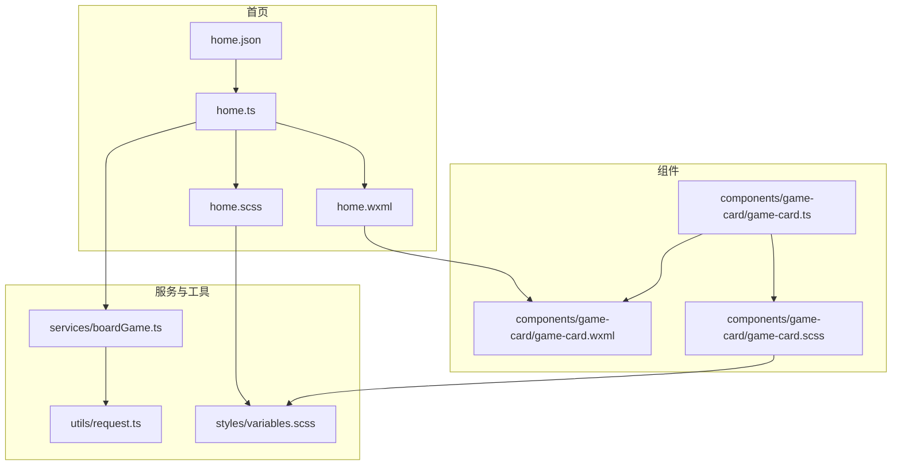
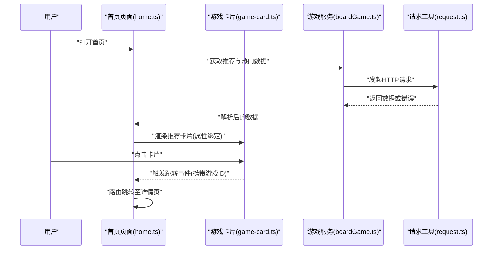
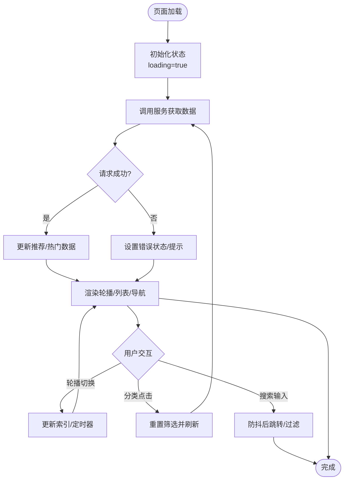
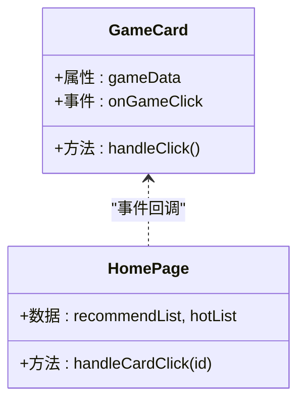
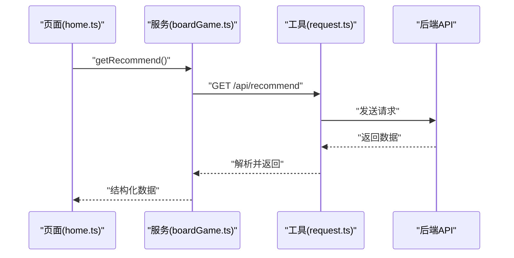
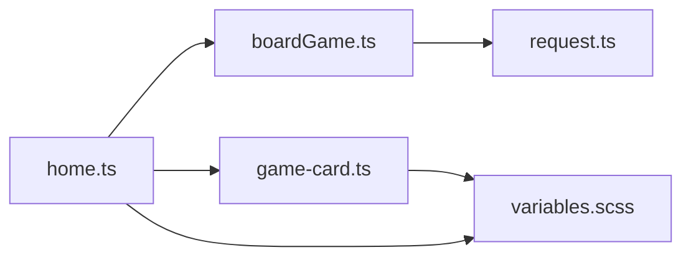

# 首页模块

<cite>
**本文引用的文件**   
- [home.ts](file://miniprogram/pages/user/home/home.ts)
- [home.wxml](file://miniprogram/pages/user/home/home.wxml)
- [home.scss](file://miniprogram/pages/user/home/home.scss)
- [home.json](file://miniprogram/pages/user/home/home.json)
- [boardGame.ts](file://miniprogram/services/boardGame.ts)
- [request.ts](file://miniprogram/utils/request.ts)
- [variables.scss](file://miniprogram/styles/variables.scss)
- [app.json](file://miniprogram/app.json)
- [game-card.ts](file://miniprogram/components/game-card/game-card.ts)
- [game-card.wxml](file://miniprogram/components/game-card/game-card.wxml)
- [game-card.scss](file://miniprogram/components/game-card/game-card.scss)
</cite>

## 目录
1. [简介](#简介)
2. [项目结构](#项目结构)
3. [核心组件与功能](#核心组件与功能)
4. [架构总览](#架构总览)
5. [详细组件分析](#详细组件分析)
6. [依赖关系分析](#依赖关系分析)
7. [性能考量](#性能考量)
8. [故障排查指南](#故障排查指南)
9. [结论](#结论)
10. [附录](#附录)

## 简介
本模块为小程序“用户端”的首页，承担以下核心职责：
- 游戏推荐展示：以卡片形式呈现推荐游戏，支持点击跳转详情。
- 热门游戏轮播：顶部轮播图展示热门游戏或活动，支持自动切换与手动滑动。
- 分类导航：提供按类别筛选入口，快速进入对应列表页。
- 快速搜索入口：提供搜索框，支持关键词检索并跳转到搜索结果页。

页面采用模块化组件化设计，数据通过服务层统一请求，状态由页面与组件分别管理，样式基于 SCSS 变量进行主题化管理与响应式适配。

## 项目结构
首页相关文件位于 pages/user/home 目录下，包含 TypeScript、模板、样式与配置；通用能力如请求封装、游戏服务在 services 与 utils 中实现；可复用 UI 组件（如游戏卡片）位于 components 下。

图表来源
- [home.json](file://miniprogram/pages/user/home/home.json)
- [home.ts](file://miniprogram/pages/user/home/home.ts)
- [home.wxml](file://miniprogram/pages/user/home/home.wxml)
- [home.scss](file://miniprogram/pages/user/home/home.scss)
- [boardGame.ts](file://miniprogram/services/boardGame.ts)
- [request.ts](file://miniprogram/utils/request.ts)
- [variables.scss](file://miniprogram/styles/variables.scss)
- [game-card.ts](file://miniprogram/components/game-card/game-card.ts)
- [game-card.wxml](file://miniprogram/components/game-card/game-card.wxml)
- [game-card.scss](file://miniprogram/components/game-card/game-card.scss)

章节来源
- [home.json](file://miniprogram/pages/user/home/home.json)
- [home.ts](file://miniprogram/pages/user/home/home.ts)
- [home.wxml](file://miniprogram/pages/user/home/home.wxml)
- [home.scss](file://miniprogram/pages/user/home/home.scss)
- [boardGame.ts](file://miniprogram/services/boardGame.ts)
- [request.ts](file://miniprogram/utils/request.ts)
- [variables.scss](file://miniprogram/styles/variables.scss)
- [game-card.ts](file://miniprogram/components/game-card/game-card.ts)
- [game-card.wxml](file://miniprogram/components/game-card/game-card.wxml)
- [game-card.scss](file://miniprogram/components/game-card/game-card.scss)

## 核心组件与功能
- 游戏推荐卡片（game-card）
  - 作用：渲染单个游戏的封面、标题、标签等，承载点击事件跳转详情页。
  - 数据绑定：通过属性接收游戏对象，内部渲染字段映射到模板。
  - 交互：点击卡片触发跳转逻辑，向父级或路由层传递目标 ID。

- 首页容器（home）
  - 作用：聚合轮播、分类导航、搜索入口与推荐列表。
  - 数据加载：页面初始化时调用服务获取推荐与热门数据，失败时降级为空态或重试。
  - 状态管理：维护 loading、error、数据列表、当前轮播索引、搜索关键词等。
  - 交互流程：搜索输入防抖后发起查询；分类点击刷新列表；轮播自动切换与手动滑动。

章节来源
- [game-card.ts](file://miniprogram/components/game-card/game-card.ts)
- [game-card.wxml](file://miniprogram/components/game-card/game-card.wxml)
- [game-card.scss](file://miniprogram/components/game-card/game-card.scss)
- [home.ts](file://miniprogram/pages/user/home/home.ts)
- [home.wxml](file://miniprogram/pages/user/home/home.wxml)
- [home.scss](file://miniprogram/pages/user/home/home.scss)

## 架构总览
首页采用“页面-服务-工具”的分层架构：
- 页面层（home）负责视图与交互，持有页面状态，调用服务获取数据。
- 服务层（boardGame）封装业务接口，统一参数组装与错误处理。
- 工具层（request）封装网络请求，处理拦截、超时、重试等通用逻辑。
- 组件层（game-card）负责局部渲染与交互，通过属性与事件与页面通信。

图表来源
- [home.ts](file://miniprogram/pages/user/home/home.ts)
- [game-card.ts](file://miniprogram/components/game-card/game-card.ts)
- [boardGame.ts](file://miniprogram/services/boardGame.ts)
- [request.ts](file://miniprogram/utils/request.ts)

## 详细组件分析

### 首页页面（home）
- 生命周期与数据加载
  - 页面 onLoad/onShow 阶段发起数据请求，设置 loading 状态。
  - 成功则更新推荐与热门数据，失败则记录错误并提示。
- 轮播控制
  - 维护当前索引与自动切换定时器，支持手动滑动与边界回弹。
- 分类导航
  - 点击分类项重置筛选条件并重新拉取数据。
- 搜索入口
  - 输入框变更触发防抖，提交后跳转到搜索结果页或本地过滤。
- 状态管理
  - 使用页面 data 管理 UI 状态与业务数据，避免跨层级共享复杂状态。

图表来源
- [home.ts](file://miniprogram/pages/user/home/home.ts)
- [home.wxml](file://miniprogram/pages/user/home/home.wxml)
- [home.scss](file://miniprogram/pages/user/home/home.scss)

章节来源
- [home.ts](file://miniprogram/pages/user/home/home.ts)
- [home.wxml](file://miniprogram/pages/user/home/home.wxml)
- [home.scss](file://miniprogram/pages/user/home/home.scss)

### 游戏卡片组件（game-card）
- 属性与模板
  - 通过属性接收游戏对象，模板渲染封面、标题、标签等字段。
- 事件与通信
  - 点击卡片触发事件，向父级页面传递游戏 ID，由页面统一处理路由。
- 样式与适配
  - 使用 SCSS 变量控制尺寸、圆角、阴影等，保证多端一致性。

图表来源
- [game-card.ts](file://miniprogram/components/game-card/game-card.ts)
- [game-card.wxml](file://miniprogram/components/game-card/game-card.wxml)
- [game-card.scss](file://miniprogram/components/game-card/game-card.scss)
- [home.ts](file://miniprogram/pages/user/home/home.ts)

章节来源
- [game-card.ts](file://miniprogram/components/game-card/game-card.ts)
- [game-card.wxml](file://miniprogram/components/game-card/game-card.wxml)
- [game-card.scss](file://miniprogram/components/game-card/game-card.scss)

### 数据服务与请求封装
- 游戏服务（boardGame）
  - 封装推荐与热门接口，统一参数校验、错误码处理与数据转换。
- 请求工具（request）
  - 封装 wx.request，处理基础 URL、超时、重试、拦截器（鉴权头、错误提示）。

图表来源
- [boardGame.ts](file://miniprogram/services/boardGame.ts)
- [request.ts](file://miniprogram/utils/request.ts)
- [home.ts](file://miniprogram/pages/user/home/home.ts)

章节来源
- [boardGame.ts](file://miniprogram/services/boardGame.ts)
- [request.ts](file://miniprogram/utils/request.ts)

## 依赖关系分析
- 页面依赖服务，服务依赖请求工具，形成单向依赖链，降低耦合。
- 组件通过属性与事件与页面解耦，便于复用与测试。
- 样式通过全局变量集中管理，确保主题一致性与可维护性。

图表来源
- [home.ts](file://miniprogram/pages/user/home/home.ts)
- [boardGame.ts](file://miniprogram/services/boardGame.ts)
- [request.ts](file://miniprogram/utils/request.ts)
- [game-card.ts](file://miniprogram/components/game-card/game-card.ts)
- [variables.scss](file://miniprogram/styles/variables.scss)

章节来源
- [home.ts](file://miniprogram/pages/user/home/home.ts)
- [boardGame.ts](file://miniprogram/services/boardGame.ts)
- [request.ts](file://miniprogram/utils/request.ts)
- [game-card.ts](file://miniprogram/components/game-card/game-card.ts)
- [variables.scss](file://miniprogram/styles/variables.scss)

## 性能考量
- 数据加载
  - 首屏按需加载推荐与热门数据，避免一次性拉取过多资源。
  - 对图片资源启用懒加载与压缩，减少首屏体积。
- 交互优化
  - 搜索输入防抖，避免频繁请求。
  - 轮播切换使用原生能力，减少重绘。
- 缓存策略
  - 对热点数据做短时缓存，提升二次访问速度。
- 错误与降级
  - 网络异常时显示空态或重试按钮，保障用户体验。

[本节为通用指导，不直接分析具体文件]

## 故障排查指南
- 常见问题
  - 数据为空：检查服务接口是否返回正确数据结构，确认请求工具是否正确拼接基础 URL 与鉴权头。
  - 轮播不切换：检查定时器是否被清理，索引更新是否触发视图更新。
  - 搜索无结果：确认防抖时间设置合理，跳转参数是否正确传递。
- 调试建议
  - 在请求工具中添加日志打印，观察请求与响应。
  - 使用开发者工具的 Network 面板检查接口状态码与耗时。
  - 在页面与组件中打印关键状态变化，定位渲染问题。

章节来源
- [request.ts](file://miniprogram/utils/request.ts)
- [boardGame.ts](file://miniprogram/services/boardGame.ts)
- [home.ts](file://miniprogram/pages/user/home/home.ts)

## 结论
首页模块通过清晰的页面-服务-工具分层与组件化设计，实现了游戏推荐、热门轮播、分类导航与搜索入口的核心功能。数据流与状态管理明确，样式与响应式通过变量统一管理，具备良好的可维护性与扩展性。建议在后续迭代中持续优化性能与错误体验，完善埋点与监控。

[本节为总结性内容，不直接分析具体文件]

## 附录
- 页面注册与路由
  - 在应用配置中注册首页路径，确保路由正常。
- 样式定制
  - 通过修改全局变量调整颜色、字号、间距等，保持风格统一。
- 最佳实践
  - 组件属性尽量只读，事件向上冒泡，避免深层嵌套传参。
  - 请求失败统一处理，提供用户友好的提示与重试机制。

章节来源
- [app.json](file://miniprogram/app.json)
- [variables.scss](file://miniprogram/styles/variables.scss)