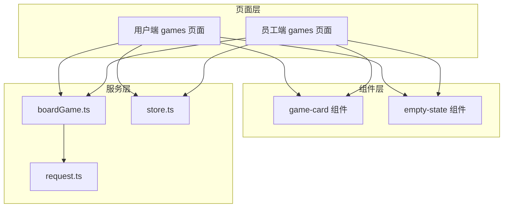
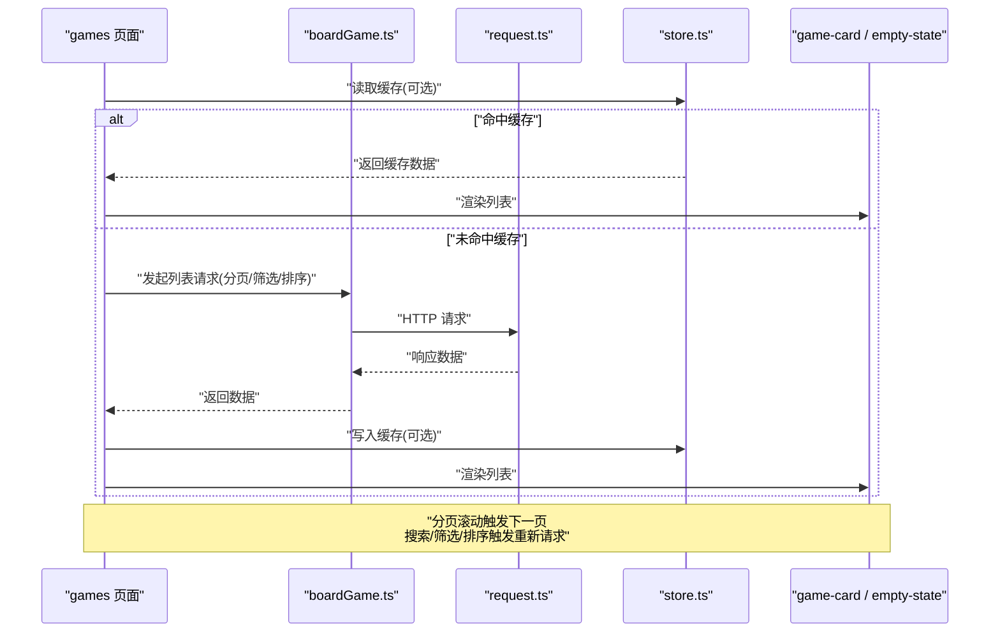
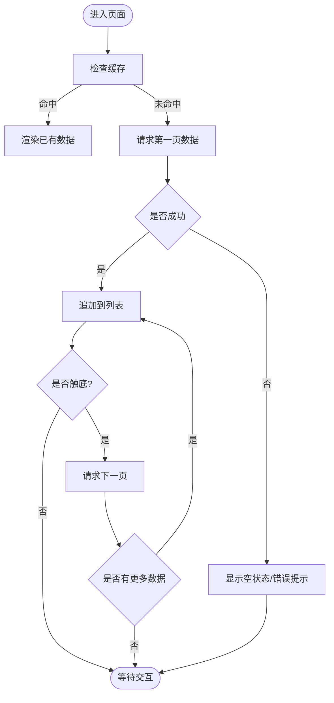
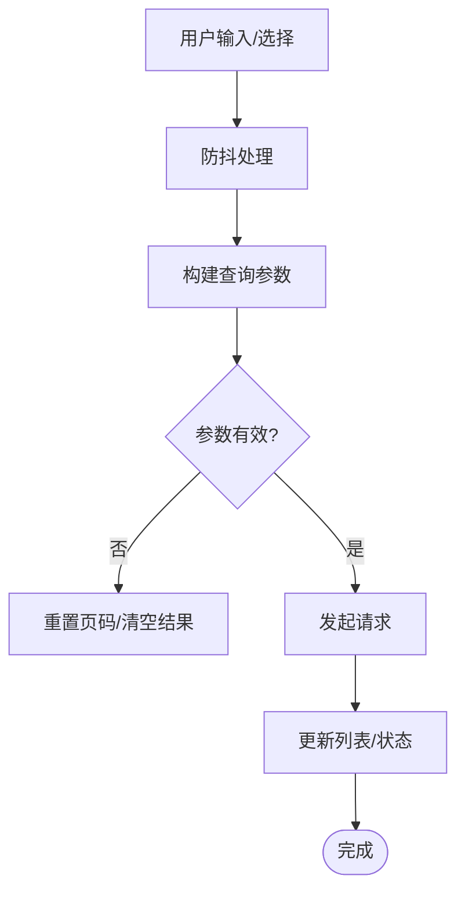
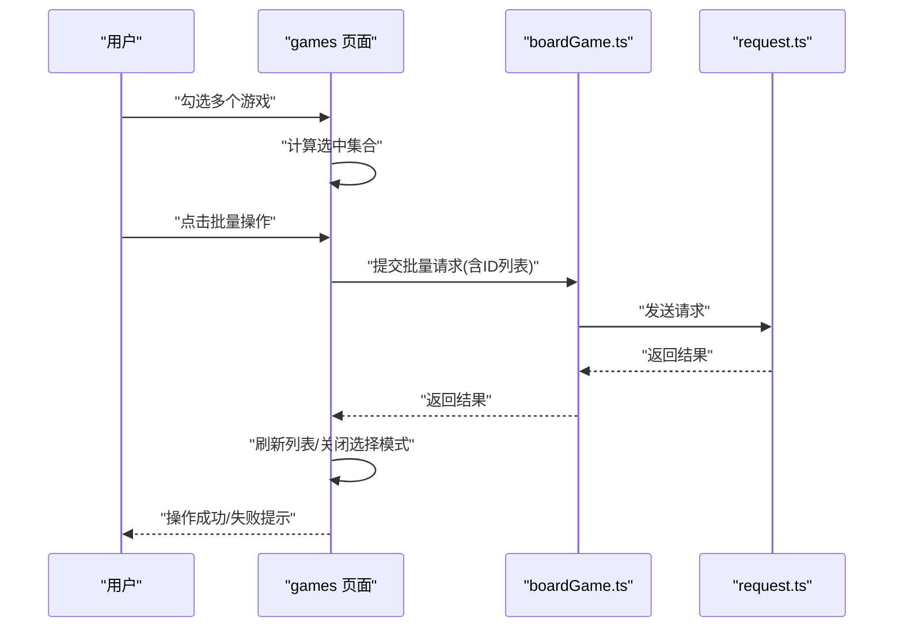
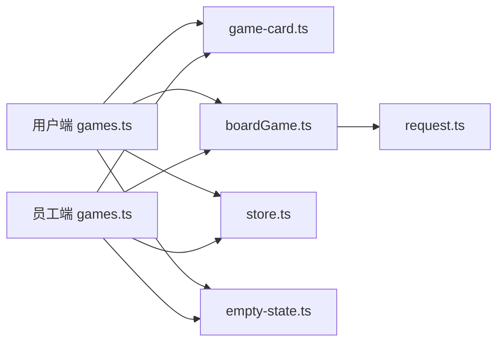

# 游戏列表管理

<cite>
**本文引用的文件**   
- [games.ts（用户端）](file://miniprogram/pages/user/games/games.ts)
- [games.wxml（用户端）](file://miniprogram/pages/user/games/games.wxml)
- [games.scss（用户端）](file://miniprogram/pages/user/games/games.scss)
- [games.ts（员工端）](file://miniprogram/pages/staff/games/games.ts)
- [games.wxml（员工端）](file://miniprogram/pages/staff/games/games.wxml)
- [games.scss（员工端）](file://miniprogram/pages/staff/games/games.scss)
- [game-card.ts](file://miniprogram/components/game-card/game-card.ts)
- [game-card.wxml](file://miniprogram/components/game-card/game-card.wxml)
- [boardGame.ts](file://miniprogram/services/boardGame.ts)
- [request.ts](file://miniprogram/utils/request.ts)
- [store.ts](file://miniprogram/services/store.ts)
- [empty-state.ts](file://miniprogram/components/empty-state/empty-state.ts)
- [empty-state.wxml](file://miniprogram/components/empty-state/empty-state.wxml)
</cite>

## 目录
1. [简介](#简介)
2. [项目结构](#项目结构)
3. [核心组件](#核心组件)
4. [架构总览](#架构总览)
5. [详细组件分析](#详细组件分析)
6. [依赖关系分析](#依赖关系分析)
7. [性能考量](#性能考量)
8. [故障排查指南](#故障排查指南)
9. [结论](#结论)
10. [附录](#附录)

## 简介
本文件围绕“游戏列表管理”功能，系统性梳理游戏列表的展示逻辑、分页加载机制、搜索与筛选、排序、空状态处理、批量操作实现，以及数据获取、状态管理与缓存策略。文档同时提供可视化架构图与流程图，帮助读者快速理解从页面到服务层的数据流转，并给出性能优化与用户体验改进建议。

## 项目结构
游戏列表功能涉及用户端与员工端两个入口，均复用通用组件与服务层能力：
- 页面层：用户端 games 页面与员工端 games 页面分别负责 UI 交互与本地状态管理。
- 组件层：game-card 用于渲染单个游戏卡片；empty-state 用于无数据或筛选结果为空的场景。
- 服务层：boardGame.ts 封装游戏相关 API；request.ts 统一网络请求；store.ts 提供全局状态与缓存。

图表来源
- [games.ts（用户端）](file://miniprogram/pages/user/games/games.ts)
- [games.ts（员工端）](file://miniprogram/pages/staff/games/games.ts)
- [game-card.ts](file://miniprogram/components/game-card/game-card.ts)
- [empty-state.ts](file://miniprogram/components/empty-state/empty-state.ts)
- [boardGame.ts](file://miniprogram/services/boardGame.ts)
- [request.ts](file://miniprogram/utils/request.ts)
- [store.ts](file://miniprogram/services/store.ts)

章节来源
- [games.ts（用户端）](file://miniprogram/pages/user/games/games.ts)
- [games.ts（员工端）](file://miniprogram/pages/staff/games/games.ts)
- [game-card.ts](file://miniprogram/components/game-card/game-card.ts)
- [boardGame.ts](file://miniprogram/services/boardGame.ts)
- [request.ts](file://miniprogram/utils/request.ts)
- [store.ts](file://miniprogram/services/store.ts)
- [empty-state.ts](file://miniprogram/components/empty-state/empty-state.ts)

## 核心组件
- 游戏卡片 game-card：负责单条游戏数据的展示与点击事件派发，支持图片、标题、标签等字段渲染。
- 空状态 empty-state：当列表为空或筛选无结果时显示友好提示与引导操作。
- 页面 games（用户端/员工端）：维护列表数据、分页参数、搜索关键词、分类筛选、排序方式、加载状态与选中项集合，驱动列表渲染与交互。
- 服务 boardGame.ts：封装游戏列表查询接口，支持分页、筛选、排序等参数传递。
- 工具 request.ts：统一请求封装，包含错误处理、重试、超时控制等。
- 状态 store.ts：提供全局状态与缓存能力，避免重复请求与提升首屏体验。

章节来源
- [game-card.ts](file://miniprogram/components/game-card/game-card.ts)
- [game-card.wxml](file://miniprogram/components/game-card/game-card.wxml)
- [empty-state.ts](file://miniprogram/components/empty-state/empty-state.ts)
- [empty-state.wxml](file://miniprogram/components/empty-state/empty-state.wxml)
- [games.ts（用户端）](file://miniprogram/pages/user/games/games.ts)
- [games.ts（员工端）](file://miniprogram/pages/staff/games/games.ts)
- [boardGame.ts](file://miniprogram/services/boardGame.ts)
- [request.ts](file://miniprogram/utils/request.ts)
- [store.ts](file://miniprogram/services/store.ts)

## 架构总览
下图展示了从页面到服务层再到网络层的完整调用链，以及状态与缓存的参与点。

图表来源
- [games.ts（用户端）](file://miniprogram/pages/user/games/games.ts)
- [games.ts（员工端）](file://miniprogram/pages/staff/games/games.ts)
- [boardGame.ts](file://miniprogram/services/boardGame.ts)
- [request.ts](file://miniprogram/utils/request.ts)
- [store.ts](file://miniprogram/services/store.ts)

## 详细组件分析

### 列表展示与分页加载
- 展示逻辑：页面维护列表数组与分页参数，按页拉取数据后追加至列表，避免一次性加载全部数据。
- 分页机制：通过页码与每页大小控制请求参数；在滚动到底部时自动触发下一页加载，防止重复请求需做防抖或节流。
- 空状态处理：当列表为空且无加载中状态时，显示 empty-state 组件并提供刷新或重置筛选的引导。
- 骨架屏与占位：建议在首次加载与翻页时展示骨架屏以提升感知速度。

图表来源
- [games.ts（用户端）](file://miniprogram/pages/user/games/games.ts)
- [games.ts（员工端）](file://miniprogram/pages/staff/games/games.ts)
- [empty-state.ts](file://miniprogram/components/empty-state/empty-state.ts)

章节来源
- [games.ts（用户端）](file://miniprogram/pages/user/games/games.ts)
- [games.ts（员工端）](file://miniprogram/pages/staff/games/games.ts)
- [empty-state.ts](file://miniprogram/components/empty-state/empty-state.ts)

### 搜索与筛选
- 搜索关键词处理：对输入进行去空白、长度限制与最小字符阈值校验；使用防抖减少频繁请求；必要时将关键词转为后端可识别格式。
- 分类筛选：根据所选分类动态更新请求参数；多分类组合时需明确优先级与互斥规则。
- 排序功能：支持按时间、热度、评分等维度排序；切换排序应重置页码为第一页并重新请求。
- 筛选联动：搜索与筛选同时存在时，合并条件发起一次请求，避免多次网络往返。

图表来源
- [games.ts（用户端）](file://miniprogram/pages/user/games/games.ts)
- [games.ts（员工端）](file://miniprogram/pages/staff/games/games.ts)

章节来源
- [games.ts（用户端）](file://miniprogram/pages/user/games/games.ts)
- [games.ts（员工端）](file://miniprogram/pages/staff/games/games.ts)

### 批量操作实现
- 选择模式：开启选择模式后，列表项左侧出现复选框，支持单选/全选/反选。
- 操作面板：底部悬浮栏显示已选项数量与可用操作（如上架/下架、删除、导出）。
- 执行流程：收集选中项 ID 列表，组装批量请求参数，提交后刷新列表并关闭选择模式。
- 反馈与回滚：操作成功后提示成功；失败时保留选择状态并提示重试。

图表来源
- [games.ts（用户端）](file://miniprogram/pages/user/games/games.ts)
- [games.ts（员工端）](file://miniprogram/pages/staff/games/games.ts)
- [boardGame.ts](file://miniprogram/services/boardGame.ts)
- [request.ts](file://miniprogram/utils/request.ts)

章节来源
- [games.ts（用户端）](file://miniprogram/pages/user/games/games.ts)
- [games.ts（员工端）](file://miniprogram/pages/staff/games/games.ts)
- [boardGame.ts](file://miniprogram/services/boardGame.ts)

### 数据获取与状态管理
- 数据获取：通过 boardGame.ts 封装的接口获取列表数据，统一由 request.ts 处理网络细节。
- 状态管理：页面级 state 维护列表、分页、筛选、排序、加载态与选中集合；store.ts 提供跨页面共享与缓存。
- 缓存策略：对热点列表数据进行短期缓存，设置过期时间与版本控制；搜索与筛选结果可按条件独立缓存。
- 错误处理：网络异常、业务错误与空数据均有对应处理路径，保证界面稳定与可恢复性。

章节来源
- [boardGame.ts](file://miniprogram/services/boardGame.ts)
- [request.ts](file://miniprogram/utils/request.ts)
- [store.ts](file://miniprogram/services/store.ts)
- [games.ts（用户端）](file://miniprogram/pages/user/games/games.ts)
- [games.ts（员工端）](file://miniprogram/pages/staff/games/games.ts)

### 空状态与错误处理
- 空状态：当列表为空或筛选无结果时，显示 empty-state 组件，并提供“刷新”“重置筛选”等操作。
- 错误提示：网络失败或接口报错时，显示友好提示并允许重试；记录关键日志便于定位问题。
- 降级方案：在弱网或接口不可用时，优先展示缓存数据并提示用户稍后再试。

章节来源
- [empty-state.ts](file://miniprogram/components/empty-state/empty-state.ts)
- [empty-state.wxml](file://miniprogram/components/empty-state/empty-state.wxml)
- [request.ts](file://miniprogram/utils/request.ts)

## 依赖关系分析
- 页面依赖组件：games 页面依赖 game-card 与 empty-state 进行渲染。
- 页面依赖服务：games 页面通过 boardGame.ts 访问游戏数据，经由 request.ts 发起网络请求。
- 状态与缓存：store.ts 作为全局状态与缓存中心，被页面与服务层共同使用。

图表来源
- [games.ts（用户端）](file://miniprogram/pages/user/games/games.ts)
- [games.ts（员工端）](file://miniprogram/pages/staff/games/games.ts)
- [game-card.ts](file://miniprogram/components/game-card/game-card.ts)
- [boardGame.ts](file://miniprogram/services/boardGame.ts)
- [request.ts](file://miniprogram/utils/request.ts)
- [store.ts](file://miniprogram/services/store.ts)
- [empty-state.ts](file://miniprogram/components/empty-state/empty-state.ts)

章节来源
- [games.ts（用户端）](file://miniprogram/pages/user/games/games.ts)
- [games.ts（员工端）](file://miniprogram/pages/staff/games/games.ts)
- [game-card.ts](file://miniprogram/components/game-card/game-card.ts)
- [boardGame.ts](file://miniprogram/services/boardGame.ts)
- [request.ts](file://miniprogram/utils/request.ts)
- [store.ts](file://miniprogram/services/store.ts)
- [empty-state.ts](file://miniprogram/components/empty-state/empty-state.ts)

## 性能考量
- 列表渲染优化：使用虚拟列表或按需渲染，避免一次性渲染大量节点；对图片进行懒加载与尺寸压缩。
- 请求优化：分页加载、合并请求、缓存热点数据；搜索与筛选使用防抖与节流，减少无效请求。
- 内存管理：及时释放不再使用的数据引用，避免内存泄漏；长列表滚动中注意回收与复用组件实例。
- 网络优化：启用 HTTP 缓存与 ETag；合理设置超时与重试策略；弱网环境下提供降级与提示。
- 交互优化：骨架屏与占位图提升首屏感知；批量操作提供进度反馈与失败重试。

[本节为通用指导，不直接分析具体文件]

## 故障排查指南
- 列表不更新：检查分页参数是否正确递增；确认搜索/筛选/排序触发后是否重置页码并重新请求。
- 空状态误显：确认数据是否为空或筛选条件过严；检查缓存是否过期或被覆盖。
- 批量操作失败：核对选中项 ID 列表与接口契约；查看服务端返回的错误码与提示信息。
- 网络异常：检查 request.ts 的错误处理与重试逻辑；确认后端接口可用性与时延。
- 性能卡顿：评估列表项复杂度与渲染开销；考虑引入虚拟列表与图片懒加载。

章节来源
- [request.ts](file://miniprogram/utils/request.ts)
- [boardGame.ts](file://miniprogram/services/boardGame.ts)
- [games.ts（用户端）](file://miniprogram/pages/user/games/games.ts)
- [games.ts（员工端）](file://miniprogram/pages/staff/games/games.ts)

## 结论
游戏列表管理功能通过清晰的页面-组件-服务分层，结合分页加载、搜索筛选、排序与批量操作，提供了良好的用户体验与可扩展性。借助缓存与统一的网络封装，系统在性能与稳定性方面具备良好基础。后续可进一步引入虚拟列表、更细粒度的缓存策略与更完善的错误恢复机制，以持续提升性能与健壮性。

[本节为总结性内容，不直接分析具体文件]

## 附录
- 术语说明
  - 分页加载：按页拉取数据，逐步填充列表。
  - 防抖/节流：控制函数执行频率，减少不必要的请求与渲染。
  - 骨架屏：在数据加载前展示的占位布局，提升感知速度。
  - 缓存策略：对热点数据进行短期存储，降低重复请求。

[本节为概念性内容，不直接分析具体文件]