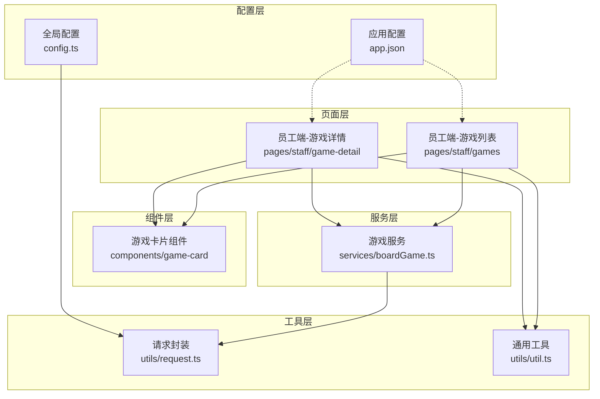
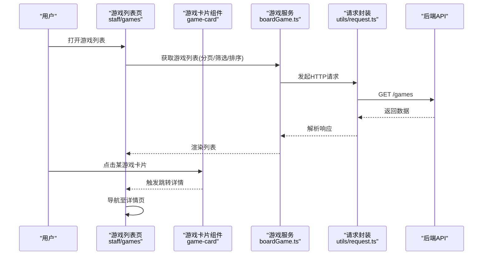
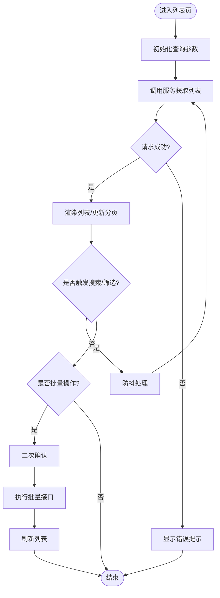
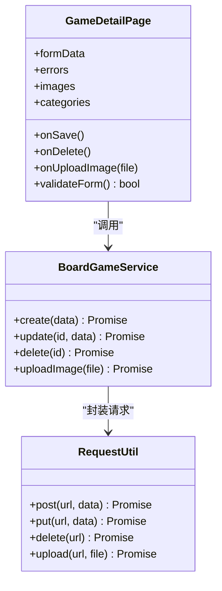
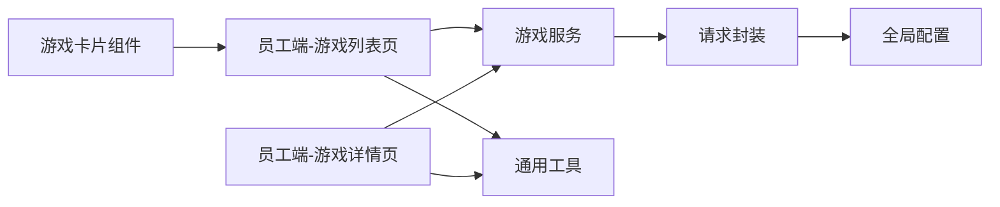

# 游戏管理

<cite>
**本文引用的文件**   
- [app.json](file://miniprogram/app.json)
- [config.ts](file://miniprogram/config.ts)
- [request.ts](file://miniprogram/utils/request.ts)
- [boardGame.ts](file://miniprogram/services/boardGame.ts)
- [games.ts（员工端）](file://miniprogram/pages/staff/games/games.ts)
- [games.wxml（员工端）](file://miniprogram/pages/staff/games/games.wxml)
- [games.scss（员工端）](file://miniprogram/pages/staff/games/games.scss)
- [game-detail.ts（员工端）](file://miniprogram/pages/staff/game-detail/game-detail.ts)
- [game-detail.wxml（员工端）](file://miniprogram/pages/staff/game-detail/game-detail.wxml)
- [game-detail.scss（员工端）](file://miniprogram/pages/staff/game-detail/game-detail.scss)
- [game-card.ts](file://miniprogram/components/game-card/game-card.ts)
- [game-card.wxml](file://miniprogram/components/game-card/game-card.wxml)
- [game-card.scss](file://miniprogram/components/game-card/game-card.scss)
- [util.ts](file://miniprogram/utils/util.ts)
</cite>

## 目录
1. [简介](#简介)
2. [项目结构](#项目结构)
3. [核心组件](#核心组件)
4. [架构总览](#架构总览)
5. [详细组件分析](#详细组件分析)
6. [依赖分析](#依赖分析)
7. [性能考虑](#性能考虑)
8. [故障排查指南](#故障排查指南)
9. [结论](#结论)
10. [附录](#附录)

## 简介
本模块面向“员工端”的游戏管理能力，覆盖游戏列表展示、搜索与筛选、批量操作、状态管理、增删改查、图片上传、分类管理与库存控制等。文档同时给出数据校验规则、错误提示机制、批量导入导出建议以及最佳实践与性能优化建议，帮助开发者快速理解并高效扩展该模块。

## 项目结构
游戏管理相关代码主要分布在以下位置：
- 页面层：员工端游戏列表与详情页面
- 组件层：游戏卡片组件
- 服务层：游戏业务接口封装
- 工具层：请求封装与通用工具
- 配置层：应用路由与全局配置



**图表来源** 
- [app.json](file://miniprogram/app.json)
- [config.ts](file://miniprogram/config.ts)
- [request.ts](file://miniprogram/utils/request.ts)
- [boardGame.ts](file://miniprogram/services/boardGame.ts)
- [games.ts（员工端）](file://miniprogram/pages/staff/games/games.ts)
- [game-detail.ts（员工端）](file://miniprogram/pages/staff/game-detail/game-detail.ts)
- [game-card.ts](file://miniprogram/components/game-card/game-card.ts)

**章节来源**
- [app.json](file://miniprogram/app.json)
- [config.ts](file://miniprogram/config.ts)
- [request.ts](file://miniprogram/utils/request.ts)
- [boardGame.ts](file://miniprogram/services/boardGame.ts)
- [games.ts（员工端）](file://miniprogram/pages/staff/games/games.ts)
- [game-detail.ts（员工端）](file://miniprogram/pages/staff/game-detail/game-detail.ts)
- [game-card.ts](file://miniprogram/components/game-card/game-card.ts)

## 核心组件
- 游戏列表页（员工端）：负责分页加载、关键词搜索、分类筛选、排序、批量选择与批量操作入口、跳转详情。
- 游戏详情页（员工端）：负责新增/编辑表单、图片上传、分类选择、库存控制、保存与删除。
- 游戏卡片组件：负责单条游戏的展示与交互（如进入详情、收藏等）。
- 游戏服务：封装所有游戏相关的网络请求，统一处理参数、响应与错误。
- 请求封装：统一拦截器、鉴权、重试、超时、日志等。
- 通用工具：表单校验、日期格式化、文件处理等。

**章节来源**
- [games.ts（员工端）](file://miniprogram/pages/staff/games/games.ts)
- [game-detail.ts（员工端）](file://miniprogram/pages/staff/game-detail/game-detail.ts)
- [game-card.ts](file://miniprogram/components/game-card/game-card.ts)
- [boardGame.ts](file://miniprogram/services/boardGame.ts)
- [request.ts](file://miniprogram/utils/request.ts)
- [util.ts](file://miniprogram/utils/util.ts)

## 架构总览
整体采用“页面-组件-服务-工具”的分层架构，职责清晰、耦合度低，便于测试与扩展。



**图表来源** 
- [games.ts（员工端）](file://miniprogram/pages/staff/games/games.ts)
- [game-card.ts](file://miniprogram/components/game-card/game-card.ts)
- [boardGame.ts](file://miniprogram/services/boardGame.ts)
- [request.ts](file://miniprogram/utils/request.ts)

## 详细组件分析

### 游戏列表（员工端）
- 功能要点
  - 分页加载：支持上拉加载更多，避免一次性加载过多数据。
  - 搜索与筛选：支持按名称模糊搜索、按分类筛选、按状态筛选、按库存阈值筛选。
  - 排序：支持按更新时间、销量、评分等维度排序。
  - 批量操作：多选后支持批量上架/下架、批量修改分类、批量调整库存等。
  - 跳转详情：点击卡片进入新增/编辑或查看详情。
- 数据流
  - 页面维护查询参数对象（关键词、分类、状态、页码、每页数量、排序字段等）。
  - 调用服务层方法获取数据，服务层通过请求封装发送网络请求。
  - 成功时更新本地列表与分页状态；失败时显示错误提示。
- 关键交互
  - 输入框防抖搜索，减少频繁请求。
  - 下拉刷新与上拉加载的边界处理。
  - 批量选择的状态同步与确认弹窗。



**图表来源** 
- [games.ts（员工端）](file://miniprogram/pages/staff/games/games.ts)
- [boardGame.ts](file://miniprogram/services/boardGame.ts)
- [request.ts](file://miniprogram/utils/request.ts)

**章节来源**
- [games.ts（员工端）](file://miniprogram/pages/staff/games/games.ts)
- [games.wxml（员工端）](file://miniprogram/pages/staff/games/games.wxml)
- [games.scss（员工端）](file://miniprogram/pages/staff/games/games.scss)
- [boardGame.ts](file://miniprogram/services/boardGame.ts)
- [request.ts](file://miniprogram/utils/request.ts)

### 游戏详情（员工端）
- 功能要点
  - 新增/编辑：表单包含名称、封面图、分类、描述、价格、库存、状态等。
  - 图片上传：支持预览、压缩、去重、进度提示、失败重试。
  - 分类管理：支持从分类库中选择，必要时支持新增分类。
  - 库存控制：支持设置初始库存、扣减逻辑、预警阈值。
  - 保存与删除：提交前进行表单校验，成功后刷新列表并返回。
- 表单校验规则（示例）
  - 必填项：名称、分类、价格、库存、状态。
  - 数值范围：价格>0，库存>=0。
  - 图片格式与大小限制：jpg/png，单张不超过指定大小。
  - 唯一性：名称在同类目下唯一。
- 错误提示机制
  - 前端即时校验错误（输入失焦/提交时）。
  - 服务端校验错误回显到对应字段。
  - 网络异常统一提示，支持重试。



**图表来源** 
- [game-detail.ts（员工端）](file://miniprogram/pages/staff/game-detail/game-detail.ts)
- [game-detail.wxml（员工端）](file://miniprogram/pages/staff/game-detail/game-detail.wxml)
- [game-detail.scss（员工端）](file://miniprogram/pages/staff/game-detail/game-detail.scss)
- [boardGame.ts](file://miniprogram/services/boardGame.ts)
- [request.ts](file://miniprogram/utils/request.ts)

**章节来源**
- [game-detail.ts（员工端）](file://miniprogram/pages/staff/game-detail/game-detail.ts)
- [game-detail.wxml（员工端）](file://miniprogram/pages/staff/game-detail/game-detail.wxml)
- [game-detail.scss（员工端）](file://miniprogram/pages/staff/game-detail/game-detail.scss)
- [boardGame.ts](file://miniprogram/services/boardGame.ts)
- [request.ts](file://miniprogram/utils/request.ts)

### 游戏卡片组件
- 展示字段：封面图、名称、分类、价格、库存、状态标签。
- 交互行为：点击跳转详情、长按进入编辑模式（可选）、收藏/分享（可选）。
- 样式适配：多列网格布局、图片懒加载、占位图。

```mermaid
classDiagram
class GameCard {
+props : { id, title, cover, category, price, stock, status }
+onClick()
+onLongPress()
+renderCover()
}
```

**图表来源** 
- [game-card.ts](file://miniprogram/components/game-card/game-card.ts)
- [game-card.wxml](file://miniprogram/components/game-card/game-card.wxml)
- [game-card.scss](file://miniprogram/components/game-card/game-card.scss)

**章节来源**
- [game-card.ts](file://miniprogram/components/game-card/game-card.ts)
- [game-card.wxml](file://miniprogram/components/game-card/game-card.wxml)
- [game-card.scss](file://miniprogram/components/game-card/game-card.scss)

### 游戏服务（接口封装）
- 职责：集中管理游戏相关的所有接口调用，包括列表、详情、创建、更新、删除、图片上传、批量操作等。
- 设计要点：
  - 统一的参数构建与响应解析。
  - 错误码映射与友好提示。
  - 可插拔的请求拦截（鉴权、重试、缓存）。
- 典型方法：
  - 获取列表：支持分页、筛选、排序。
  - 获取详情：根据ID获取完整信息。
  - 创建/更新：提交表单数据，返回结果。
  - 删除：软删除或硬删除策略。
  - 图片上传：分片上传、断点续传（可选）。
  - 批量操作：批量上架/下架、批量修改分类、批量调整库存。

**章节来源**
- [boardGame.ts](file://miniprogram/services/boardGame.ts)
- [request.ts](file://miniprogram/utils/request.ts)

### 请求封装与工具
- 请求封装：
  - 统一基础URL、超时时间、重试策略。
  - 自动附加鉴权头、错误码处理、日志记录。
  - 支持取消请求、并发控制。
- 通用工具：
  - 表单校验函数集合。
  - 文件处理（压缩、转Base64、类型判断）。
  - 日期/金额格式化。

**章节来源**
- [request.ts](file://miniprogram/utils/request.ts)
- [util.ts](file://miniprogram/utils/util.ts)

## 依赖分析
- 页面依赖服务，服务依赖请求封装，组件仅依赖页面传入的数据与事件。
- 配置集中在应用与全局配置文件中，便于环境切换。
- 无循环依赖，层级清晰。



**图表来源** 
- [games.ts（员工端）](file://miniprogram/pages/staff/games/games.ts)
- [game-detail.ts（员工端）](file://miniprogram/pages/staff/game-detail/game-detail.ts)
- [game-card.ts](file://miniprogram/components/game-card/game-card.ts)
- [boardGame.ts](file://miniprogram/services/boardGame.ts)
- [request.ts](file://miniprogram/utils/request.ts)
- [config.ts](file://miniprogram/config.ts)

**章节来源**
- [games.ts（员工端）](file://miniprogram/pages/staff/games/games.ts)
- [game-detail.ts（员工端）](file://miniprogram/pages/staff/game-detail/game-detail.ts)
- [game-card.ts](file://miniprogram/components/game-card/game-card.ts)
- [boardGame.ts](file://miniprogram/services/boardGame.ts)
- [request.ts](file://miniprogram/utils/request.ts)
- [config.ts](file://miniprogram/config.ts)

## 性能考虑
- 列表加载
  - 使用分页与虚拟滚动（大数据量场景）。
  - 图片懒加载与缩略图优先。
  - 搜索防抖与节流，避免频繁请求。
- 网络优化
  - 合理设置超时与重试次数。
  - 启用HTTP缓存（对不常变数据）。
  - 合并批量接口，减少往返次数。
- 渲染优化
  - 组件拆分与按需加载。
  - 避免不必要的setData/状态更新。
  - 使用骨架屏提升感知速度。
- 内存与资源
  - 及时释放图片与临时文件。
  - 控制并发请求数，防止阻塞。

[本节为通用指导，无需引用具体文件]

## 故障排查指南
- 常见问题
  - 列表无法加载：检查网络权限、接口地址、鉴权头、分页参数。
  - 搜索无结果：确认关键词匹配逻辑、大小写、空格处理。
  - 图片上传失败：检查格式、大小、服务器路径、跨域设置。
  - 表单校验失败：核对必填项、数值范围、唯一性约束。
  - 批量操作失败：确认选中项有效性、权限、后端状态机。
- 定位步骤
  - 查看控制台日志与网络请求。
  - 复现最小用例，逐步缩小范围。
  - 对比前后端数据结构与字段命名。
  - 增加调试断点与埋点统计。

**章节来源**
- [request.ts](file://miniprogram/utils/request.ts)
- [util.ts](file://miniprogram/utils/util.ts)
- [boardGame.ts](file://miniprogram/services/boardGame.ts)

## 结论
游戏管理模块以清晰的层次结构与完善的工具链为基础，实现了完整的CRUD、图片上传、分类与库存管理等能力。通过合理的校验与错误提示机制，提升了用户体验与稳定性。建议在后续迭代中持续优化性能与可维护性，并完善批量导入导出与审计日志等高级特性。

[本节为总结，无需引用具体文件]

## 附录
- 批量导入导出建议
  - 导入：提供Excel模板，服务端校验并返回差异报告，支持部分成功。
  - 导出：支持按条件导出CSV/Excel，异步任务与下载链接。
- 最佳实践
  - 统一错误码与提示文案规范。
  - 敏感操作二次确认与操作日志。
  - 表单校验前后端一致，避免重复逻辑。
  - 图片上传采用CDN与压缩策略。
  - 库存变更采用事务与幂等设计。

[本节为补充说明，无需引用具体文件]