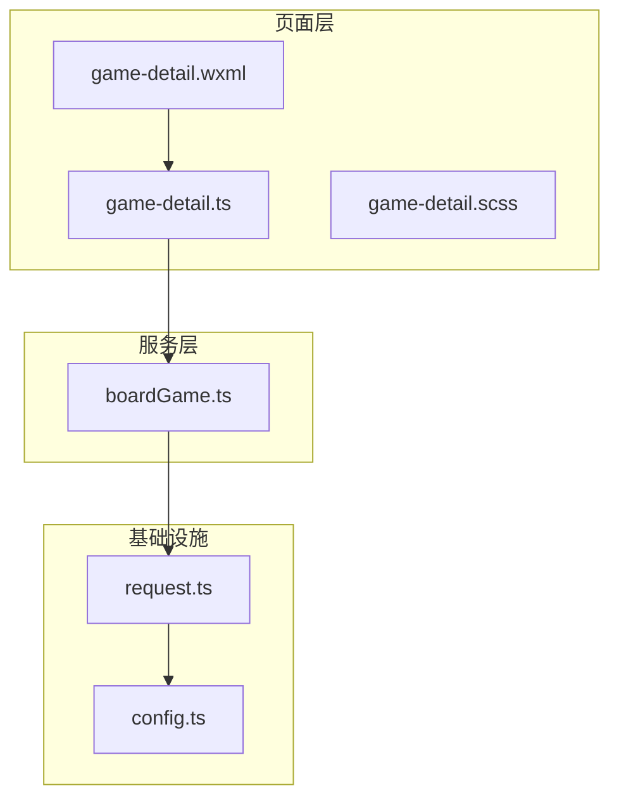
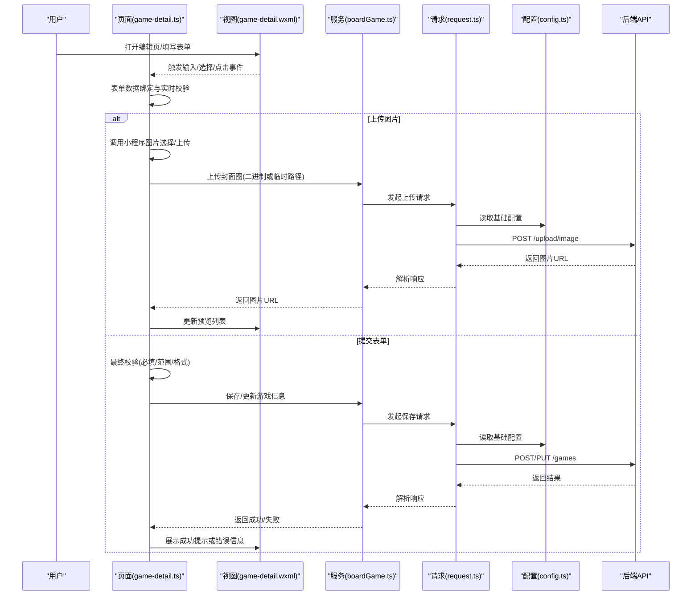
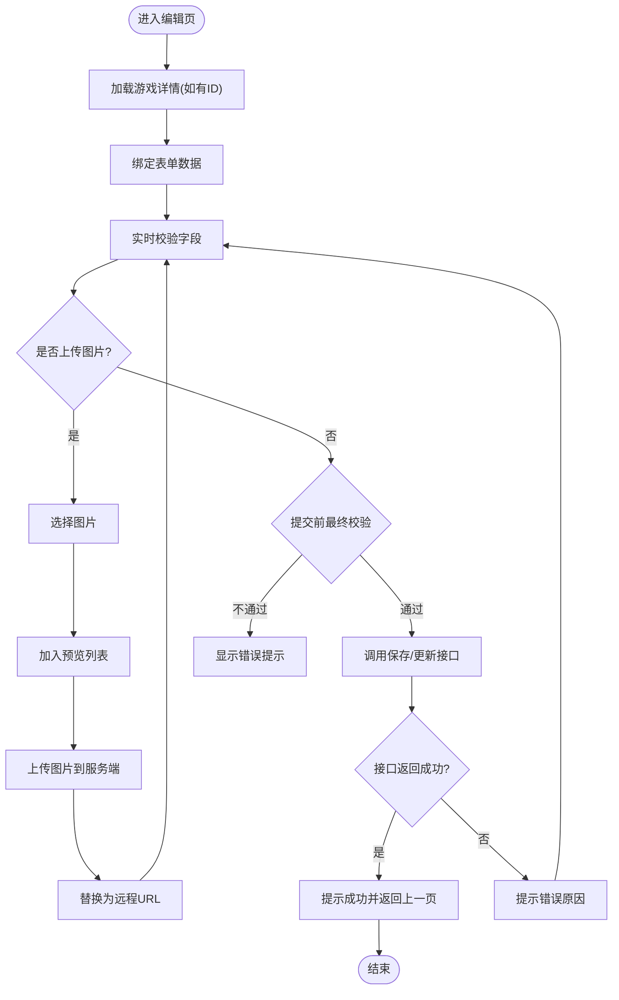

# 游戏详情编辑

<cite>
**本文引用的文件**   
- [miniprogram/pages/staff/game-detail/game-detail.ts](file://miniprogram/pages/staff/game-detail/game-detail.ts)
- [miniprogram/pages/staff/game-detail/game-detail.wxml](file://miniprogram/pages/staff/game-detail/game-detail.wxml)
- [miniprogram/pages/staff/game-detail/game-detail.scss](file://miniprogram/pages/staff/game-detail/game-detail.scss)
- [miniprogram/services/boardGame.ts](file://miniprogram/services/boardGame.ts)
- [miniprogram/utils/request.ts](file://miniprogram/utils/request.ts)
- [miniprogram/config.ts](file://miniprogram/config.ts)
</cite>

## 目录
1. [简介](#简介)
2. [项目结构](#项目结构)
3. [核心组件](#核心组件)
4. [架构总览](#架构总览)
5. [详细组件分析](#详细组件分析)
6. [依赖分析](#依赖分析)
7. [性能考虑](#性能考虑)
8. [故障排查指南](#故障排查指南)
9. [结论](#结论)
10. [附录](#附录) 

## 简介
本文件面向“游戏详情编辑”功能，覆盖以下能力与流程：
- 游戏信息的增删改查（CRUD）操作
- 表单验证规则与数据提交流程
- 图片上传处理、预览与删除
- 游戏分类管理、库存设置、价格配置与状态控制
- 表单数据校验、错误处理与用户反馈机制

该文档既适合开发者快速定位实现细节，也便于非技术读者理解整体流程。

## 项目结构
围绕“游戏详情编辑”的核心代码位于员工端页面与相关服务层：
- 页面层：miniprogram/pages/staff/game-detail/*（WXML/TS/SCSS/JSON）
- 服务层：miniprogram/services/boardGame.ts（游戏相关 API 封装）
- 请求层：miniprogram/utils/request.ts（统一网络请求）
- 配置层：miniprogram/config.ts（全局配置）

**图表来源** 
- [miniprogram/pages/staff/game-detail/game-detail.wxml](file://miniprogram/pages/staff/game-detail/game-detail.wxml)
- [miniprogram/pages/staff/game-detail/game-detail.ts](file://miniprogram/pages/staff/game-detail/game-detail.ts)
- [miniprogram/services/boardGame.ts](file://miniprogram/services/boardGame.ts)
- [miniprogram/utils/request.ts](file://miniprogram/utils/request.ts)
- [miniprogram/config.ts](file://miniprogram/config.ts)

**章节来源**
- [miniprogram/pages/staff/game-detail/game-detail.ts](file://miniprogram/pages/staff/game-detail/game-detail.ts)
- [miniprogram/pages/staff/game-detail/game-detail.wxml](file://miniprogram/pages/staff/game-detail/game-detail.wxml)
- [miniprogram/services/boardGame.ts](file://miniprogram/services/boardGame.ts)
- [miniprogram/utils/request.ts](file://miniprogram/utils/request.ts)
- [miniprogram/config.ts](file://miniprogram/config.ts)

## 核心组件
- 页面控制器（game-detail.ts）
  - 负责表单数据绑定、校验、提交、图片上传与预览、删除、状态切换等交互逻辑
  - 调用 boardGame.ts 提供的接口完成数据的获取与更新
- 模板视图（game-detail.wxml）
  - 渲染表单字段（名称、分类、描述、库存、价格、状态、图片等）
  - 绑定事件（输入、选择、点击上传/预览/删除、提交）
- 样式（game-detail.scss）
  - 定义表单布局、图片预览区域、错误提示样式等
- 业务服务（boardGame.ts）
  - 封装游戏详情查询、创建、更新、删除等 API 调用
- 请求工具（request.ts）
  - 统一发起 HTTP 请求、处理鉴权、错误码、超时等
- 配置（config.ts）
  - 提供基础 URL、超时时间、默认参数等

**章节来源**
- [miniprogram/pages/staff/game-detail/game-detail.ts](file://miniprogram/pages/staff/game-detail/game-detail.ts)
- [miniprogram/pages/staff/game-detail/game-detail.wxml](file://miniprogram/pages/staff/game-detail/game-detail.wxml)
- [miniprogram/pages/staff/game-detail/game-detail.scss](file://miniprogram/pages/staff/game-detail/game-detail.scss)
- [miniprogram/services/boardGame.ts](file://miniprogram/services/boardGame.ts)
- [miniprogram/utils/request.ts](file://miniprogram/utils/request.ts)
- [miniprogram/config.ts](file://miniprogram/config.ts)

## 架构总览
下图展示了从用户操作到服务端响应的完整链路，包括表单校验、图片上传、数据提交与错误反馈。

**图表来源** 
- [miniprogram/pages/staff/game-detail/game-detail.ts](file://miniprogram/pages/staff/game-detail/game-detail.ts)
- [miniprogram/pages/staff/game-detail/game-detail.wxml](file://miniprogram/pages/staff/game-detail/game-detail.wxml)
- [miniprogram/services/boardGame.ts](file://miniprogram/services/boardGame.ts)
- [miniprogram/utils/request.ts](file://miniprogram/utils/request.ts)
- [miniprogram/config.ts](file://miniprogram/config.ts)

## 详细组件分析

### 页面控制器（game-detail.ts）
- 数据模型与状态
  - 表单字段：标题、分类、描述、库存、价格、状态、图片列表等
  - 校验状态：各字段的错误消息与是否通过
  - 上传状态：当前上传进度、预览列表、已选图片索引
- 表单校验规则
  - 必填项：标题、分类、库存、价格等
  - 数值范围：库存≥0，价格>0且保留两位小数
  - 文本长度：标题与描述的最大长度限制
  - 图片数量与大小限制
- 图片处理
  - 选择图片：调用小程序图片选择接口，限制数量与大小
  - 预览：将本地临时路径加入预览数组
  - 删除：移除指定索引的图片并更新预览
  - 上传：将图片上传至服务端，成功后替换为远程 URL
- 数据提交
  - 组装表单数据，执行最终校验
  - 调用 boardGame.ts 的保存/更新接口
  - 根据返回结果给出成功/失败反馈，必要时回退状态
- 错误处理与用户反馈
  - 网络异常、服务端错误码、校验失败的统一提示
  - 使用 Toast/Modal 等方式反馈给用户

**图表来源** 
- [miniprogram/pages/staff/game-detail/game-detail.ts](file://miniprogram/pages/staff/game-detail/game-detail.ts)

**章节来源**
- [miniprogram/pages/staff/game-detail/game-detail.ts](file://miniprogram/pages/staff/game-detail/game-detail.ts)

### 模板视图（game-detail.wxml）
- 表单控件
  - 文本输入：标题、描述
  - 下拉选择：分类
  - 数字输入：库存、价格
  - 开关/单选：状态（上架/下架等）
  - 图片区域：选择、预览、删除按钮
- 事件绑定
  - bindinput/bindchange：实时更新表单数据与校验状态
  - bindtap：触发上传、预览、删除、提交等操作
- 错误提示
  - 针对每个字段显示错误消息
  - 全局错误提示用于网络或服务端错误

**章节来源**
- [miniprogram/pages/staff/game-detail/game-detail.wxml](file://miniprogram/pages/staff/game-detail/game-detail.wxml)

### 样式（game-detail.scss）
- 表单布局：栅格/间距/对齐
- 图片预览：缩略图尺寸、圆角、遮罩、删除按钮位置
- 错误提示：颜色、字体、动画过渡
- 响应式适配：不同屏幕尺寸下的排版

**章节来源**
- [miniprogram/pages/staff/game-detail/game-detail.scss](file://miniprogram/pages/staff/game-detail/game-detail.scss)

### 业务服务（boardGame.ts）
- 接口封装
  - 获取游戏详情：GET /games/:id
  - 创建游戏：POST /games
  - 更新游戏：PUT /games/:id
  - 删除游戏：DELETE /games/:id
  - 上传封面图：POST /upload/image
- 参数处理
  - 序列化表单数据，处理布尔值、空值、日期等
  - 构建 multipart/form-data 或 JSON payload（依后端约定）
- 错误处理
  - 统一解析错误码与消息，抛出可被页面捕获的错误对象

**章节来源**
- [miniprogram/services/boardGame.ts](file://miniprogram/services/boardGame.ts)

### 请求工具（request.ts）
- 统一请求方法
  - GET/POST/PUT/DELETE 封装
  - 自动附加鉴权头（如 Token）
- 错误处理
  - 网络异常重试/降级
  - 超时处理与友好提示
- 配置读取
  - 从 config.ts 读取基础 URL、超时、默认参数等

**章节来源**
- [miniprogram/utils/request.ts](file://miniprogram/utils/request.ts)

### 配置（config.ts）
- 基础 URL、环境区分（开发/生产）
- 默认超时时间、重试次数
- 公共请求头与拦截器配置

**章节来源**
- [miniprogram/config.ts](file://miniprogram/config.ts)

## 依赖分析
- 页面控制器依赖服务层进行数据交互
- 服务层依赖请求工具进行网络通信
- 请求工具依赖配置模块获取运行时参数
- 视图与控制器通过事件绑定形成双向数据流

**图表来源** 
- [miniprogram/pages/staff/game-detail/game-detail.ts](file://miniprogram/pages/staff/game-detail/game-detail.ts)
- [miniprogram/pages/staff/game-detail/game-detail.wxml](file://miniprogram/pages/staff/game-detail/game-detail.wxml)
- [miniprogram/pages/staff/game-detail/game-detail.scss](file://miniprogram/pages/staff/game-detail/game-detail.scss)
- [miniprogram/services/boardGame.ts](file://miniprogram/services/boardGame.ts)
- [miniprogram/utils/request.ts](file://miniprogram/utils/request.ts)
- [miniprogram/config.ts](file://miniprogram/config.ts)

**章节来源**
- [miniprogram/pages/staff/game-detail/game-detail.ts](file://miniprogram/pages/staff/game-detail/game-detail.ts)
- [miniprogram/services/boardGame.ts](file://miniprogram/services/boardGame.ts)
- [miniprogram/utils/request.ts](file://miniprogram/utils/request.ts)
- [miniprogram/config.ts](file://miniprogram/config.ts)

## 性能考虑
- 图片上传优化
  - 压缩图片体积后再上传，减少带宽占用
  - 分片上传大文件（若后端支持）
  - 并发上传限制，避免阻塞 UI
- 表单校验优化
  - 防抖输入校验，减少频繁计算
  - 延迟校验关键长文本字段
- 网络请求优化
  - 合理设置超时与重试策略
  - 缓存静态资源与分类字典，减少重复请求
- 渲染优化
  - 图片懒加载与占位图
  - 列表分页与虚拟滚动（如涉及多张图片）

[本节为通用指导，无需具体文件引用]

## 故障排查指南
- 常见错误与处理
  - 网络异常：检查网络状态、代理、域名白名单；查看 request.ts 的错误日志
  - 鉴权失败：确认 Token 是否过期或丢失；检查请求头是否正确附加
  - 服务端错误码：根据 boardGame.ts 的错误映射定位问题
  - 表单校验失败：检查必填项、数值范围、图片大小与数量限制
- 调试建议
  - 在 game-detail.ts 中打印关键步骤日志（选择图片、上传、提交）
  - 使用小程序开发者工具的 Network 面板查看请求与响应
  - 对图片上传单独测试，确认临时路径与远程 URL 转换正确

**章节来源**
- [miniprogram/utils/request.ts](file://miniprogram/utils/request.ts)
- [miniprogram/services/boardGame.ts](file://miniprogram/services/boardGame.ts)
- [miniprogram/pages/staff/game-detail/game-detail.ts](file://miniprogram/pages/staff/game-detail/game-detail.ts)

## 结论
“游戏详情编辑”功能以页面控制器为核心，结合服务层与请求工具，实现了完整的表单校验、图片上传、数据提交与错误反馈闭环。通过合理的架构分层与清晰的职责划分，保证了可维护性与扩展性。建议在后续迭代中持续优化图片上传体验与表单校验性能，提升用户满意度。

[本节为总结性内容，无需具体文件引用]

## 附录
- 表单字段说明（示例）
  - 标题：必填，最大长度限制
  - 分类：必填，枚举值来自分类字典
  - 描述：可选，最大长度限制
  - 库存：必填，整数≥0
  - 价格：必填，正数，保留两位小数
  - 状态：必填，枚举（上架/下架）
  - 图片：数量限制，单张大小限制，支持预览与删除
- 错误码映射（示例）
  - 400：参数校验失败
  - 401：未授权或 Token 失效
  - 403：权限不足
  - 404：资源不存在
  - 500：服务端内部错误

[本节为补充说明，无需具体文件引用]