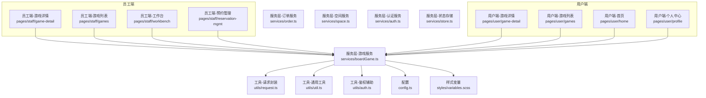
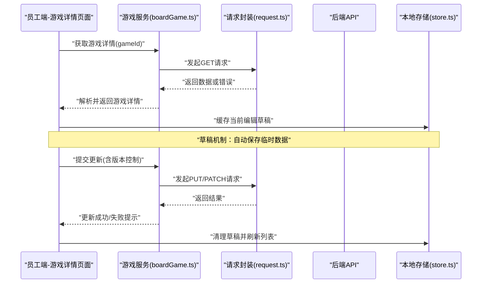
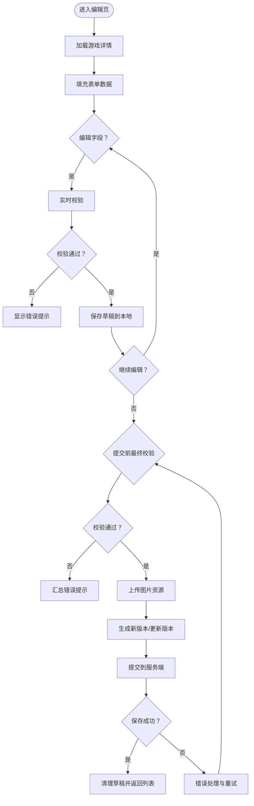
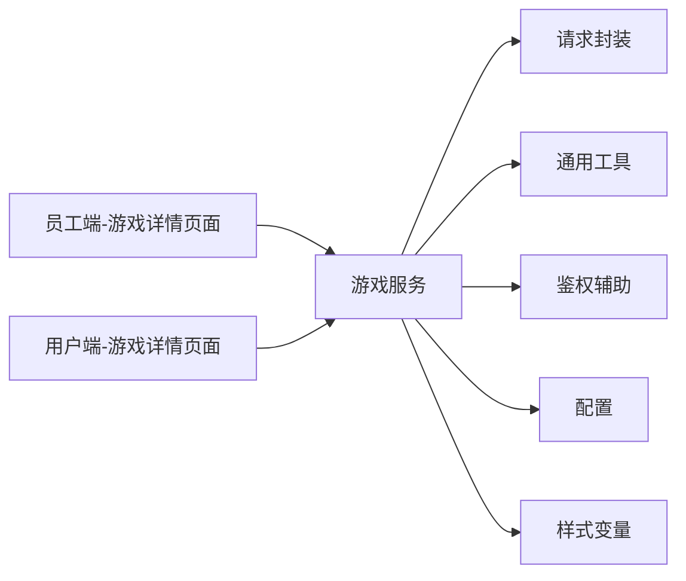

# 游戏详情管理

<cite>
**本文引用的文件**   
- [app.json](file://miniprogram/app.json)
- [config.ts](file://miniprogram/config.ts)
- [boardGame.ts](file://miniprogram/services/boardGame.ts)
- [request.ts](file://miniprogram/utils/request.ts)
- [util.ts](file://miniprogram/utils/util.ts)
- [game-detail.ts（员工端）](file://miniprogram/pages/staff/game-detail/game-detail.ts)
- [game-detail.wxml（员工端）](file://miniprogram/pages/staff/game-detail/game-detail.wxml)
- [game-detail.scss（员工端）](file://miniprogram/pages/staff/game-detail/game-detail.scss)
- [games.ts（员工端）](file://miniprogram/pages/staff/games/games.ts)
- [games.wxml（员工端）](file://miniprogram/pages/staff/games/games.wxml)
- [workbench.ts（员工端）](file://miniprogram/pages/staff/workbench/workbench.ts)
- [reservation-mgmt.ts（员工端）](file://miniprogram/pages/staff/reservation-mgmt/reservation-mgmt.ts)
- [game-detail.ts（用户端）](file://miniprogram/pages/user/game-detail/game-detail.ts)
- [game-detail.wxml（用户端）](file://miniprogram/pages/user/game-detail/game-detail.wxml)
- [game-detail.scss（用户端）](file://miniprogram/pages/user/game-detail/game-detail.scss)
- [games.ts（用户端）](file://miniprogram/pages/user/games/games.ts)
- [home.ts（用户端）](file://miniprogram/pages/user/home/home.ts)
- [profile.ts（用户端）](file://miniprogram/pages/user/profile/profile.ts)
- [auth.ts（认证服务）](file://miniprogram/services/auth.ts)
- [order.ts（订单服务）](file://miniprogram/services/order.ts)
- [space.ts（空间服务）](file://miniprogram/services/space.ts)
- [store.ts（状态存储）](file://miniprogram/services/store.ts)
- [auth.ts（工具）](file://miniprogram/utils/auth.ts)
- [variables.scss](file://miniprogram/styles/variables.scss)
</cite>

## 目录
1. [简介](#简介)
2. [项目结构](#项目结构)
3. [核心组件](#核心组件)
4. [架构总览](#架构总览)
5. [详细组件分析](#详细组件分析)
6. [依赖关系分析](#依赖关系分析)
7. [性能考量](#性能考量)
8. [故障排查指南](#故障排查指南)
9. [结论](#结论)
10. [附录](#附录)

## 简介
本文件面向“游戏详情管理”页面，聚焦员工端对游戏信息的完整编辑界面、表单验证规则、图片上传处理与富文本编辑器使用；同时说明游戏配置的字段含义、关联关系设置与版本管理功能。文档还涵盖数据保存策略、草稿机制与变更历史记录，并提供最佳实践与常见问题解决方案，帮助维护人员高效、稳定地管理游戏信息。

## 项目结构
本项目为微信小程序工程，采用多页面与多角色（员工端/用户端）组织方式。与“游戏详情管理”直接相关的代码主要分布在以下位置：
- 员工端页面：pages/staff/game-detail（编辑页）、pages/staff/games（列表页）、pages/staff/workbench（工作台入口）、pages/staff/reservation-mgmt（预约管理）
- 用户端页面：pages/user/game-detail（展示页）、pages/user/games（列表页）、pages/user/home（首页）、pages/user/profile（个人中心）
- 服务层：services/boardGame.ts（游戏相关接口封装）、services/order.ts、services/space.ts、services/auth.ts、services/store.ts
- 工具层：utils/request.ts（网络请求封装）、utils/util.ts（通用工具）、utils/auth.ts（鉴权辅助）
- 配置与样式：config.ts（全局配置）、styles/variables.scss（样式变量）

图表来源
- [game-detail.ts（员工端）](file://miniprogram/pages/staff/game-detail/game-detail.ts)
- [games.ts（员工端）](file://miniprogram/pages/staff/games/games.ts)
- [workbench.ts（员工端）](file://miniprogram/pages/staff/workbench/workbench.ts)
- [reservation-mgmt.ts（员工端）](file://miniprogram/pages/staff/reservation-mgmt/reservation-mgmt.ts)
- [game-detail.ts（用户端）](file://miniprogram/pages/user/game-detail/game-detail.ts)
- [games.ts（用户端）](file://miniprogram/pages/user/games/games.ts)
- [home.ts（用户端）](file://miniprogram/pages/user/home/home.ts)
- [profile.ts（用户端）](file://miniprogram/pages/user/profile/profile.ts)
- [boardGame.ts](file://miniprogram/services/boardGame.ts)
- [request.ts](file://miniprogram/utils/request.ts)
- [util.ts](file://miniprogram/utils/util.ts)
- [auth.ts（工具）](file://miniprogram/utils/auth.ts)
- [config.ts](file://miniprogram/config.ts)
- [variables.scss](file://miniprogram/styles/variables.scss)

章节来源
- [app.json](file://miniprogram/app.json)
- [config.ts](file://miniprogram/config.ts)

## 核心组件
- 员工端游戏详情编辑页：负责游戏信息的录入、校验、图片上传、富文本内容编辑、版本管理与保存。
- 员工端游戏列表页：用于搜索、筛选、批量操作与跳转至详情页。
- 用户端游戏详情展示页：只读展示游戏信息、图片与富文本内容。
- 服务层（boardGame.ts）：封装游戏数据的增删改查、图片上传、版本管理等接口调用。
- 工具层（request.ts、util.ts、auth.ts）：统一网络请求、通用工具函数与鉴权逻辑。
- 配置与样式（config.ts、variables.scss）：全局常量、API 基础路径、主题变量等。

章节来源
- [game-detail.ts（员工端）](file://miniprogram/pages/staff/game-detail/game-detail.ts)
- [game-detail.wxml（员工端）](file://miniprogram/pages/staff/game-detail/game-detail.wxml)
- [game-detail.scss（员工端）](file://miniprogram/pages/staff/game-detail/game-detail.scss)
- [games.ts（员工端）](file://miniprogram/pages/staff/games/games.ts)
- [games.wxml（员工端）](file://miniprogram/pages/staff/games/games.wxml)
- [boardGame.ts](file://miniprogram/services/boardGame.ts)
- [request.ts](file://miniprogram/utils/request.ts)
- [util.ts](file://miniprogram/utils/util.ts)
- [auth.ts（工具）](file://miniprogram/utils/auth.ts)
- [config.ts](file://miniprogram/config.ts)
- [variables.scss](file://miniprogram/styles/variables.scss)

## 架构总览
整体采用“页面层 → 服务层 → 工具层 → 配置/样式”的分层架构。页面层负责交互与视图渲染，服务层封装业务接口，工具层提供网络与通用能力，配置与样式提供全局常量与主题支持。

图表来源
- [game-detail.ts（员工端）](file://miniprogram/pages/staff/game-detail/game-detail.ts)
- [boardGame.ts](file://miniprogram/services/boardGame.ts)
- [request.ts](file://miniprogram/utils/request.ts)
- [store.ts](file://miniprogram/services/store.ts)

## 详细组件分析

### 员工端-游戏详情编辑页
该页面是游戏信息维护的核心入口，包含以下关键能力：
- 表单字段与含义
  - 基本信息：名称、封面图、分类、标签、适用人数、时长、年龄限制、语言、简介、详细介绍（富文本）。
  - 运营配置：价格、库存、是否上架、推荐位、排序权重。
  - 关联关系：所属空间、可预约时段、关联活动/套餐、推荐游戏集合。
  - 版本管理：版本号、发布说明、历史版本列表、回滚与对比。
- 表单验证规则
  - 必填项：名称、分类、简介、详细介绍、价格、库存、是否上架。
  - 格式校验：价格需为正数，库存为非负整数，时长为分钟正数，人数区间合法。
  - 富文本校验：内容长度上限、禁止危险标签（由服务端兜底）。
  - 图片校验：尺寸、大小、类型限制，失败时给出明确提示。
- 图片上传处理
  - 选择图片后预览，支持多图顺序调整与删除。
  - 上传前压缩与格式转换，失败重试与断点续传（若后端支持）。
  - 上传成功后生成缩略图与高清大图地址，分别用于列表与详情展示。
- 富文本编辑器使用
  - 支持标题、段落、列表、链接、图片插入。
  - 输入防抖与自动保存草稿，避免丢失。
  - 移动端适配键盘高度与滚动区域。
- 版本管理功能
  - 每次发布生成新版本号，记录发布说明与时间戳。
  - 支持查看历史版本、对比差异、一键回滚到指定版本。
  - 版本状态：草稿、已发布、已下线。
- 数据保存策略与草稿机制
  - 本地草稿：编辑过程中按字段增量保存到本地存储，支持恢复。
  - 自动保存：输入停止后延迟保存，减少频繁写入。
  - 冲突处理：并发编辑时以服务端最新为准，提示合并策略。
- 变更历史记录
  - 记录字段级变更：谁在何时修改了哪些字段，支持审计与回溯。
  - 导出变更记录：便于复盘与合规检查。

图表来源
- [game-detail.ts（员工端）](file://miniprogram/pages/staff/game-detail/game-detail.ts)
- [game-detail.wxml（员工端）](file://miniprogram/pages/staff/game-detail/game-detail.wxml)
- [game-detail.scss（员工端）](file://miniprogram/pages/staff/game-detail/game-detail.scss)
- [boardGame.ts](file://miniprogram/services/boardGame.ts)

章节来源
- [game-detail.ts（员工端）](file://miniprogram/pages/staff/game-detail/game-detail.ts)
- [game-detail.wxml（员工端）](file://miniprogram/pages/staff/game-detail/game-detail.wxml)
- [game-detail.scss（员工端）](file://miniprogram/pages/staff/game-detail/game-detail.scss)

### 员工端-游戏列表页
- 功能要点：搜索关键词、分类筛选、状态过滤、分页加载、批量操作（上架/下架、删除）、快速编辑。
- 数据流：从服务层拉取列表数据，本地缓存与分页合并，支持下拉刷新与上拉加载更多。
- 交互优化：骨架屏占位、错误重试、空状态提示。

章节来源
- [games.ts（员工端）](file://miniprogram/pages/staff/games/games.ts)
- [games.wxml（员工端）](file://miniprogram/pages/staff/games/games.wxml)

### 用户端-游戏详情展示页
- 功能要点：只读展示游戏信息、图片轮播、富文本详情、预约入口、相关推荐。
- 数据流：从服务层获取详情数据，渲染视图，支持分享与收藏。
- 性能优化：图片懒加载、富文本按需渲染、缓存最近浏览记录。

章节来源
- [game-detail.ts（用户端）](file://miniprogram/pages/user/game-detail/game-detail.ts)
- [game-detail.wxml（用户端）](file://miniprogram/pages/user/game-detail/game-detail.wxml)
- [game-detail.scss（用户端）](file://miniprogram/pages/user/game-detail/game-detail.scss)

### 服务层-游戏服务（boardGame.ts）
- 职责：封装游戏相关的所有接口调用，包括详情获取、列表查询、创建/更新、图片上传、版本管理、关联关系设置。
- 错误处理：统一异常捕获、网络超时重试、错误码映射为用户友好提示。
- 数据转换：将后端数据结构转换为前端模型，确保字段一致性。

章节来源
- [boardGame.ts](file://miniprogram/services/boardGame.ts)

### 工具层（request.ts、util.ts、auth.ts）
- request.ts：统一请求封装，支持拦截器、Token注入、错误处理、日志记录。
- util.ts：通用工具函数，如日期格式化、金额计算、字符串处理、校验辅助。
- auth.ts：鉴权辅助，登录态检测、权限判断、敏感操作二次确认。

章节来源
- [request.ts](file://miniprogram/utils/request.ts)
- [util.ts](file://miniprogram/utils/util.ts)
- [auth.ts（工具）](file://miniprogram/utils/auth.ts)

### 配置与样式（config.ts、variables.scss）
- config.ts：全局配置项，如API基础路径、超时时间、默认分页大小、功能开关。
- variables.scss：主题变量，颜色、字号、间距等，保证UI一致性。

章节来源
- [config.ts](file://miniprogram/config.ts)
- [variables.scss](file://miniprogram/styles/variables.scss)

## 依赖关系分析
- 页面与服务层解耦：页面仅依赖服务层接口，不直接访问网络层。
- 服务层依赖工具层：统一网络请求与通用工具，降低重复代码。
- 配置与样式集中管理：便于全局调整与维护。
- 潜在循环依赖：需避免页面与服务层相互引用，保持单向依赖。

图表来源
- [game-detail.ts（员工端）](file://miniprogram/pages/staff/game-detail/game-detail.ts)
- [game-detail.ts（用户端）](file://miniprogram/pages/user/game-detail/game-detail.ts)
- [boardGame.ts](file://miniprogram/services/boardGame.ts)
- [request.ts](file://miniprogram/utils/request.ts)
- [util.ts](file://miniprogram/utils/util.ts)
- [auth.ts（工具）](file://miniprogram/utils/auth.ts)
- [config.ts](file://miniprogram/config.ts)
- [variables.scss](file://miniprogram/styles/variables.scss)

章节来源
- [boardGame.ts](file://miniprogram/services/boardGame.ts)
- [request.ts](file://miniprogram/utils/request.ts)
- [util.ts](file://miniprogram/utils/util.ts)
- [auth.ts（工具）](file://miniprogram/utils/auth.ts)
- [config.ts](file://miniprogram/config.ts)
- [variables.scss](file://miniprogram/styles/variables.scss)

## 性能考量
- 图片优化：上传前压缩、生成多尺寸缩略图、懒加载与CDN加速。
- 富文本渲染：按需加载模块、避免大段HTML直接渲染、使用虚拟列表。
- 网络请求：合并请求、缓存热点数据、错误重试与降级策略。
- 本地存储：草稿分片存储、定期清理过期数据、避免主线程阻塞。

[本节为通用指导，无需特定文件来源]

## 故障排查指南
- 常见错误
  - 图片上传失败：检查文件大小、类型、网络状态与服务器配额。
  - 富文本内容丢失：确认自动保存触发条件与本地存储容量。
  - 版本冲突：并发编辑导致的数据覆盖，需引入乐观锁或合并策略。
  - 表单校验失败：检查字段类型、范围与必填项，定位具体错误提示。
- 调试建议
  - 启用请求日志与错误上报，定位问题链路。
  - 使用开发者工具的模拟器与真机调试，复现边界场景。
  - 逐步隔离问题：先验证服务层接口，再检查页面逻辑。

章节来源
- [request.ts](file://miniprogram/utils/request.ts)
- [util.ts](file://miniprogram/utils/util.ts)
- [boardGame.ts](file://miniprogram/services/boardGame.ts)

## 结论
“游戏详情管理”页面通过清晰的分层架构与完善的表单验证、图片上传、富文本编辑与版本管理功能，为游戏信息维护提供了高效、稳定的解决方案。遵循本文的最佳实践与故障排查指南，可显著提升维护效率与用户体验。

[本节为总结性内容，无需特定文件来源]

## 附录
- 字段字典：详见员工端游戏详情页面的表单定义与服务层数据模型。
- 接口文档：参考 services/boardGame.ts 中的方法注释与参数说明。
- 样式规范：参考 styles/variables.scss 中的变量定义与使用示例。

[本节为补充信息，无需特定文件来源]