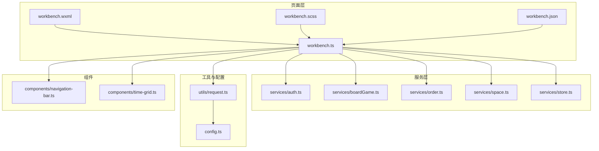
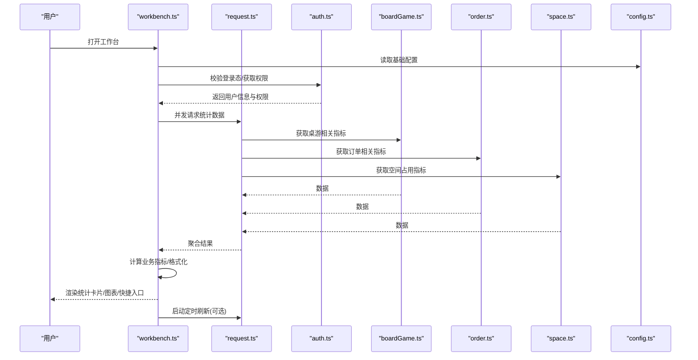
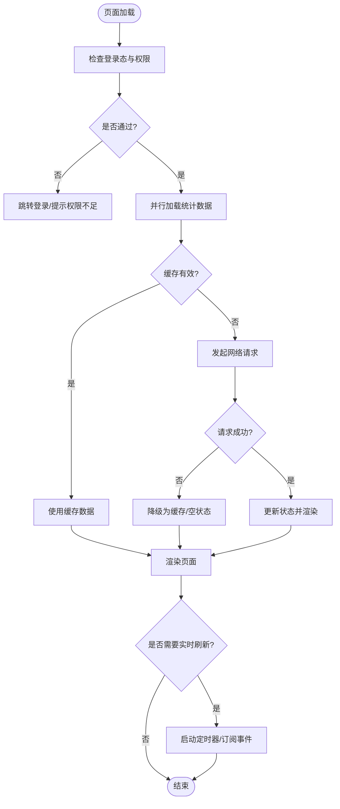
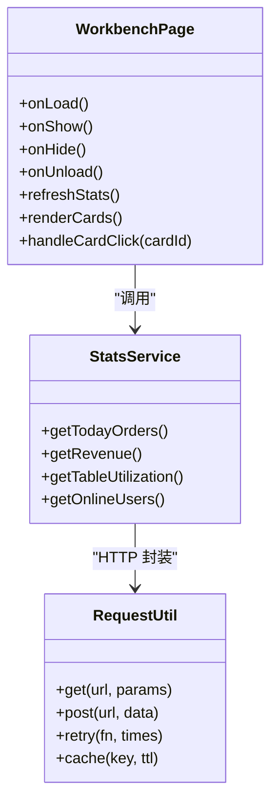
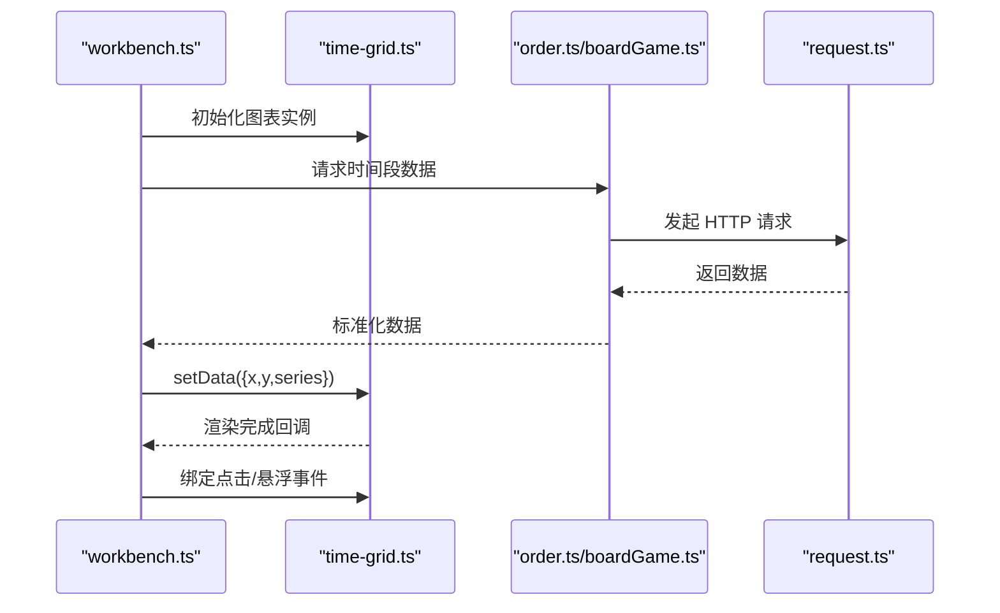
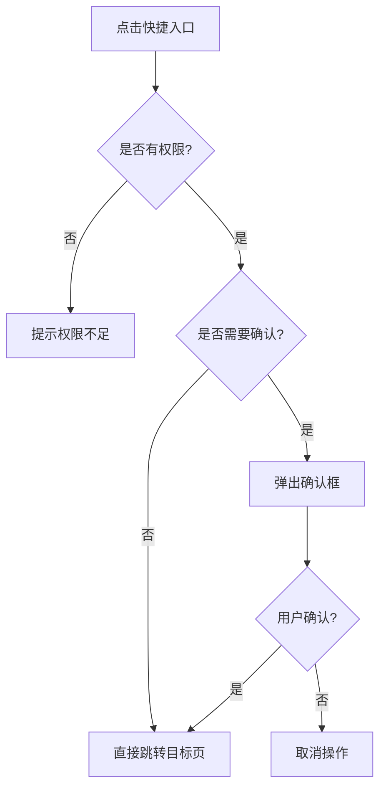
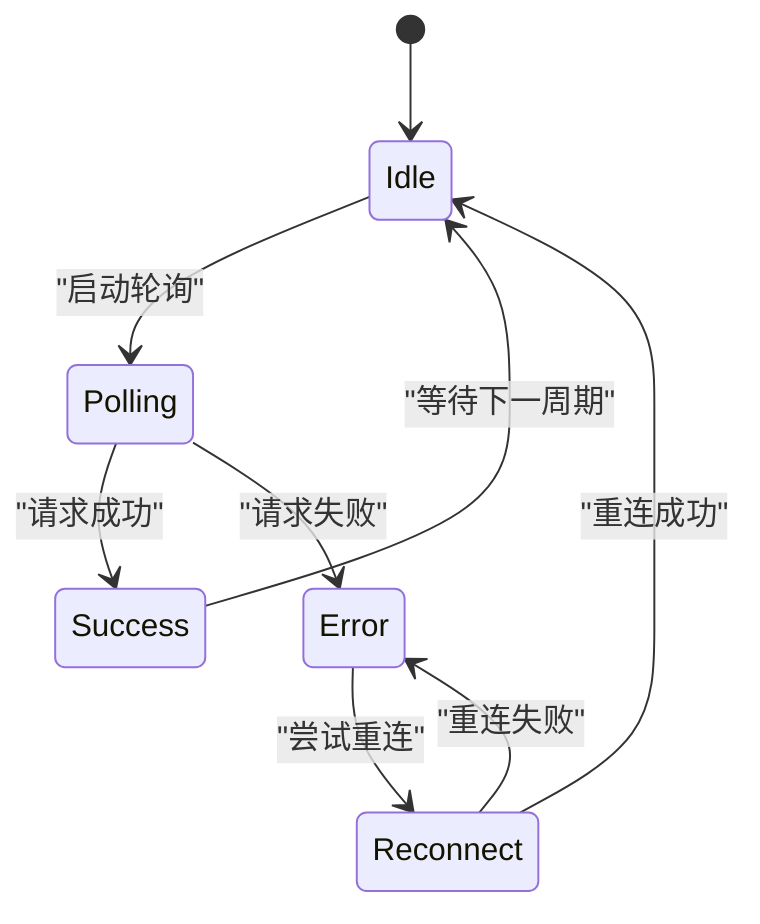
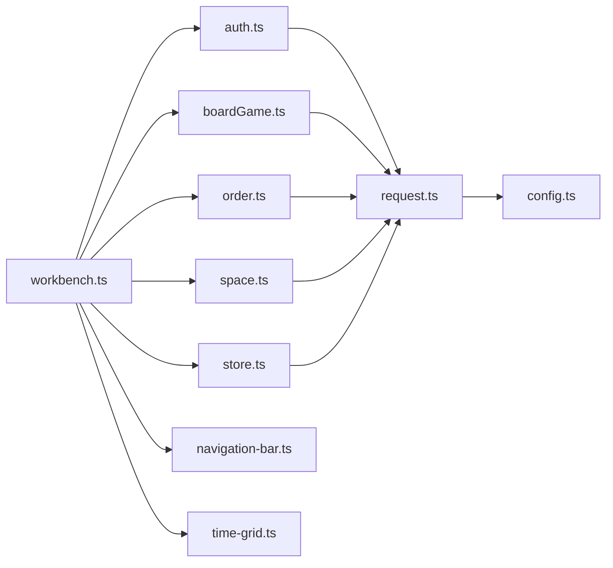

# 管理员工作台

<cite>
**本文引用的文件**   
- [workbench.ts](file://miniprogram/pages/staff/workbench/workbench.ts)
- [workbench.wxml](file://miniprogram/pages/staff/workbench/workbench.wxml)
- [workbench.scss](file://miniprogram/pages/staff/workbench/workbench.scss)
- [workbench.json](file://miniprogram/pages/staff/workbench/workbench.json)
- [app.json](file://miniprogram/app.json)
- [config.ts](file://miniprogram/config.ts)
- [request.ts](file://miniprogram/utils/request.ts)
- [auth.ts](file://miniprogram/services/auth.ts)
- [boardGame.ts](file://miniprogram/services/boardGame.ts)
- [order.ts](file://miniprogram/services/order.ts)
- [space.ts](file://miniprogram/services/space.ts)
- [store.ts](file://miniprogram/services/store.ts)
- [navigation-bar.ts](file://miniprogram/components/navigation-bar/navigation-bar.ts)
- [time-grid.ts](file://miniprogram/components/time-grid/time-grid.ts)
</cite>

## 目录
1. [简介](#简介)
2. [项目结构](#项目结构)
3. [核心组件](#核心组件)
4. [架构总览](#架构总览)
5. [详细组件分析](#详细组件分析)
6. [依赖关系分析](#依赖关系分析)
7. [性能考虑](#性能考虑)
8. [故障排查指南](#故障排查指南)
9. [结论](#结论)
10. [附录](#附录)

## 简介
本文件为“管理员工作台”页面的完整技术文档，面向开发者与产品/运营人员。内容覆盖：
- 数据展示布局、统计信息卡片、快捷操作入口
- 实时数据更新机制（轮询/事件）
- 初始化流程、数据加载策略、错误处理与缓存机制
- 业务指标计算逻辑、图表展示实现、用户交互设计
- 性能优化建议与自定义配置选项

该页面属于小程序“员工端”模块，用于管理员快速掌握门店运营概况并执行高频管理动作。

## 项目结构
工作台位于员工端 pages/staff/workbench 目录下，采用小程序标准页面组织方式：
- workbench.wxml：页面结构与模板
- workbench.scss：样式与主题变量引用
- workbench.ts：页面逻辑、数据绑定、生命周期、网络请求与状态管理
- workbench.json：页面级配置（导航栏、依赖组件等）

全局与公共能力：
- app.json：应用路由与 TabBar 配置
- config.ts：接口域名、超时、重试等基础配置
- utils/request.ts：统一 HTTP 封装（拦截器、错误码处理、重试、缓存）
- services/*：领域服务（认证、桌游、订单、空间、通用 store）
- components/*：可复用 UI 组件（导航栏、时间网格等）

**图示来源** 
- [workbench.ts](file://miniprogram/pages/staff/workbench/workbench.ts)
- [workbench.wxml](file://miniprogram/pages/staff/workbench/workbench.wxml)
- [workbench.scss](file://miniprogram/pages/staff/workbench/workbench.scss)
- [workbench.json](file://miniprogram/pages/staff/workbench/workbench.json)
- [request.ts](file://miniprogram/utils/request.ts)
- [config.ts](file://miniprogram/config.ts)
- [auth.ts](file://miniprogram/services/auth.ts)
- [boardGame.ts](file://miniprogram/services/boardGame.ts)
- [order.ts](file://miniprogram/services/order.ts)
- [space.ts](file://miniprogram/services/space.ts)
- [store.ts](file://miniprogram/services/store.ts)
- [navigation-bar.ts](file://miniprogram/components/navigation-bar/navigation-bar.ts)
- [time-grid.ts](file://miniprogram/components/time-grid/time-grid.ts)

**章节来源**
- [workbench.ts](file://miniprogram/pages/staff/workbench/workbench.ts)
- [workbench.wxml](file://miniprogram/pages/staff/workbench/workbench.wxml)
- [workbench.scss](file://miniprogram/pages/staff/workbench/workbench.scss)
- [workbench.json](file://miniprogram/pages/staff/workbench/workbench.json)
- [app.json](file://miniprogram/app.json)
- [config.ts](file://miniprogram/config.ts)
- [request.ts](file://miniprogram/utils/request.ts)

## 核心组件
- 页面容器与导航
  - 顶部导航由 navigation-bar 组件提供，支持标题、返回、右侧操作按钮等。
- 统计信息卡片
  - 使用 grid/list 布局展示关键指标（如订单数、营收、桌台利用率、在线人数等），支持点击跳转详情。
- 快捷操作入口
  - 常用功能以图标+文案形式呈现，如“新增预约”“查看排班”“库存盘点”“报表导出”。
- 数据图表区
  - 通过 time-grid 或第三方图表组件渲染趋势图、柱状图等，支持时间维度切换（日/周/月）。
- 实时数据面板
  - 基于轮询或 WebSocket 的事件订阅，刷新关键指标与列表。

**章节来源**
- [navigation-bar.ts](file://miniprogram/components/navigation-bar/navigation-bar.ts)
- [time-grid.ts](file://miniprogram/components/time-grid/time-grid.ts)
- [workbench.wxml](file://miniprogram/pages/staff/workbench/workbench.wxml)
- [workbench.scss](file://miniprogram/pages/staff/workbench/workbench.scss)

## 架构总览
工作台采用“页面-服务-工具”分层架构：
- 页面层：负责视图渲染、用户交互、状态管理与调用服务
- 服务层：按领域划分（认证、桌游、订单、空间、通用存储），屏蔽底层 API 差异
- 工具与配置：统一请求封装、错误处理、缓存、环境变量

**图示来源** 
- [workbench.ts](file://miniprogram/pages/staff/workbench/workbench.ts)
- [request.ts](file://miniprogram/utils/request.ts)
- [auth.ts](file://miniprogram/services/auth.ts)
- [boardGame.ts](file://miniprogram/services/boardGame.ts)
- [order.ts](file://miniprogram/services/order.ts)
- [space.ts](file://miniprogram/services/space.ts)
- [config.ts](file://miniprogram/config.ts)

## 详细组件分析

### 页面初始化与数据加载
- 生命周期
  - onLoad：读取路由参数、初始化权限、预取必要配置
  - onShow：每次显示时触发增量刷新（如未过期则走缓存）
  - onUnload：清理定时器、取消订阅
- 数据加载策略
  - 首次进入：并行拉取多域指标，失败降级为本地缓存或空状态
  - 后续刷新：根据时间窗口与版本号决定是否回源
  - 增量更新：对热点数据（如在线人数、待办）启用短轮询或事件推送
- 错误处理
  - 网络异常：提示“网络不可用”，自动重试一次
  - 业务错误：根据错误码分类提示，必要时回退到上次可用数据
  - 权限不足：引导重新登录或申请权限

**图示来源** 
- [workbench.ts](file://miniprogram/pages/staff/workbench/workbench.ts)
- [request.ts](file://miniprogram/utils/request.ts)
- [auth.ts](file://miniprogram/services/auth.ts)

**章节来源**
- [workbench.ts](file://miniprogram/pages/staff/workbench/workbench.ts)
- [request.ts](file://miniprogram/utils/request.ts)
- [auth.ts](file://miniprogram/services/auth.ts)

### 统计信息卡片与业务指标计算
- 指标定义（示例）
  - 今日订单数：当日订单总量
  - 营收总额：当日订单实收金额合计
  - 桌台利用率：已占用时长/总开放时长
  - 在线人数：当前活跃用户数（来自空间/会话服务）
- 计算逻辑
  - 聚合：从各服务返回的明细数据汇总计算
  - 归一化：百分比、千分位、货币格式化处理
  - 对比：与昨日/上周同周期对比，计算同比/环比
- 展示规则
  - 数值过大时使用单位换算（万/百万）
  - 负值或异常值以警示色标识
  - 点击卡片跳转到对应详情页

**图示来源** 
- [workbench.ts](file://miniprogram/pages/staff/workbench/workbench.ts)
- [boardGame.ts](file://miniprogram/services/boardGame.ts)
- [order.ts](file://miniprogram/services/order.ts)
- [space.ts](file://miniprogram/services/space.ts)
- [request.ts](file://miniprogram/utils/request.ts)

**章节来源**
- [boardGame.ts](file://miniprogram/services/boardGame.ts)
- [order.ts](file://miniprogram/services/order.ts)
- [space.ts](file://miniprogram/services/space.ts)
- [workbench.ts](file://miniprogram/pages/staff/workbench/workbench.ts)

### 图表展示实现
- 图表类型
  - 折线图：营收趋势、订单量趋势
  - 柱状图：时段客流、桌台占用分布
  - 饼图：渠道占比、支付方式占比
- 数据适配
  - 将服务返回的原始数据映射为图表所需格式（x/y 轴、系列名、颜色）
  - 支持时间维度切换（日/周/月）
- 交互行为
  - 点击图例筛选数据
  - 长按/悬浮显示具体数值
  - 支持下拉刷新与缩放

**图示来源** 
- [workbench.ts](file://miniprogram/pages/staff/workbench/workbench.ts)
- [time-grid.ts](file://miniprogram/components/time-grid/time-grid.ts)
- [order.ts](file://miniprogram/services/order.ts)
- [boardGame.ts](file://miniprogram/services/boardGame.ts)
- [request.ts](file://miniprogram/utils/request.ts)

**章节来源**
- [time-grid.ts](file://miniprogram/components/time-grid/time-grid.ts)
- [workbench.ts](file://miniprogram/pages/staff/workbench/workbench.ts)

### 快捷操作入口
- 入口项
  - 新增预约、查看排班、库存盘点、报表导出、消息中心、设置
- 交互设计
  - 点击后跳转至对应子页面或弹出确认框
  - 部分操作需要二次确认或权限校验
- 权限控制
  - 根据角色动态显示/隐藏入口
  - 无权限时显示“暂无权限”占位

**图示来源** 
- [workbench.wxml](file://miniprogram/pages/staff/workbench/workbench.wxml)
- [workbench.ts](file://miniprogram/pages/staff/workbench/workbench.ts)
- [auth.ts](file://miniprogram/services/auth.ts)

**章节来源**
- [workbench.wxml](file://miniprogram/pages/staff/workbench/workbench.wxml)
- [workbench.ts](file://miniprogram/pages/staff/workbench/workbench.ts)
- [auth.ts](file://miniprogram/services/auth.ts)

### 实时数据更新机制
- 方案选择
  - 短轮询：适用于非强实时场景（每 10~30s）
  - 事件推送：WebSocket/订阅模式，适合在线人数、待办提醒
- 实现要点
  - 防抖与节流：避免频繁刷新导致抖动
  - 断线重连：网络异常自动恢复
  - 优先级：关键指标优先刷新，次要指标延迟或合并刷新

**图示来源** 
- [workbench.ts](file://miniprogram/pages/staff/workbench/workbench.ts)
- [request.ts](file://miniprogram/utils/request.ts)

**章节来源**
- [workbench.ts](file://miniprogram/pages/staff/workbench/workbench.ts)
- [request.ts](file://miniprogram/utils/request.ts)

## 依赖关系分析
- 页面依赖服务：workbench.ts 依赖 auth、boardGame、order、space、store
- 服务依赖工具：所有服务通过 request.ts 进行网络访问与错误处理
- 组件依赖：navigation-bar、time-grid 作为 UI 支撑
- 配置依赖：config.ts 提供全局常量（域名、超时、重试次数等）

**图示来源** 
- [workbench.ts](file://miniprogram/pages/staff/workbench/workbench.ts)
- [auth.ts](file://miniprogram/services/auth.ts)
- [boardGame.ts](file://miniprogram/services/boardGame.ts)
- [order.ts](file://miniprogram/services/order.ts)
- [space.ts](file://miniprogram/services/space.ts)
- [store.ts](file://miniprogram/services/store.ts)
- [request.ts](file://miniprogram/utils/request.ts)
- [config.ts](file://miniprogram/config.ts)
- [navigation-bar.ts](file://miniprogram/components/navigation-bar/navigation-bar.ts)
- [time-grid.ts](file://miniprogram/components/time-grid/time-grid.ts)

**章节来源**
- [workbench.ts](file://miniprogram/pages/staff/workbench/workbench.ts)
- [request.ts](file://miniprogram/utils/request.ts)
- [config.ts](file://miniprogram/config.ts)

## 性能考虑
- 数据加载
  - 并发请求：使用 Promise.all 并行拉取多域数据
  - 懒加载：图表按需初始化，首屏仅渲染关键指标
  - 分页与虚拟列表：长列表使用分页与虚拟化减少渲染压力
- 缓存策略
  - 内存缓存：短期热点数据（如在线人数）
  - 本地缓存：中长期数据（如配置、字典）
  - 版本控制：通过版本号或时间戳判断缓存有效性
- 渲染优化
  - 减少setData频率与数据量，批量更新
  - 使用条件渲染与骨架屏提升感知速度
- 网络优化
  - 合理超时与重试策略
  - 压缩与分页接口
  - CDN 与静态资源缓存

[本节为通用指导，不直接分析具体文件]

## 故障排查指南
- 常见问题
  - 页面空白：检查登录态、权限、接口可用性
  - 数据不更新：检查轮询开关、网络状态、缓存失效策略
  - 图表不显示：检查数据格式、时间维度、组件初始化顺序
- 定位步骤
  - 查看控制台日志与错误码
  - 检查 request.ts 拦截器返回的错误信息
  - 验证 config.ts 中的域名与超时配置
  - 使用 store.ts 查看本地缓存状态
- 修复建议
  - 增加重试与降级逻辑
  - 完善空状态与错误提示
  - 补充埋点与监控

**章节来源**
- [request.ts](file://miniprogram/utils/request.ts)
- [config.ts](file://miniprogram/config.ts)
- [store.ts](file://miniprogram/services/store.ts)
- [workbench.ts](file://miniprogram/pages/staff/workbench/workbench.ts)

## 结论
管理员工作台通过清晰的分层架构与模块化设计，实现了高效的数据展示与便捷的管理操作。合理的加载策略、错误处理与缓存机制保障了用户体验与系统稳定性。未来可在实时性、可视化与个性化配置方面持续优化。

[本节为总结性内容，不直接分析具体文件]

## 附录
- 自定义配置选项（建议）
  - 刷新间隔：默认 15s，可按场景调整
  - 缓存有效期：分钟级/小时级，依据数据时效性设定
  - 图表主题：支持明暗主题与品牌色定制
  - 快捷入口排序：支持拖拽与后台配置
- 扩展建议
  - 接入 WebSocket 实现强实时
  - 引入 A/B 测试评估不同布局效果
  - 增加导出与分享能力

[本节为概念性内容，不直接分析具体文件]