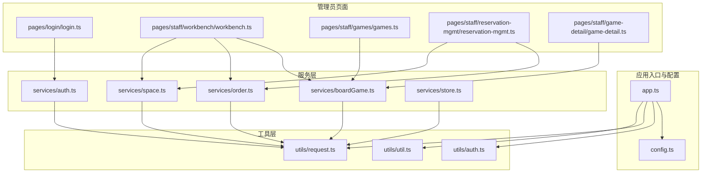
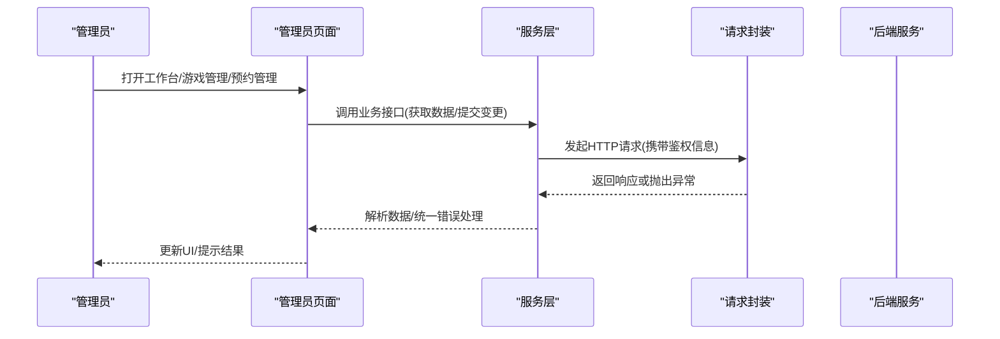
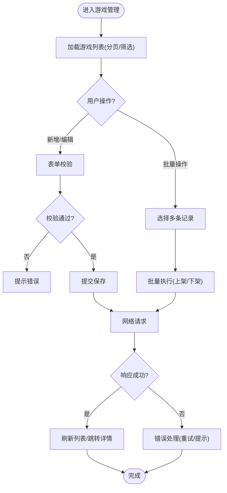
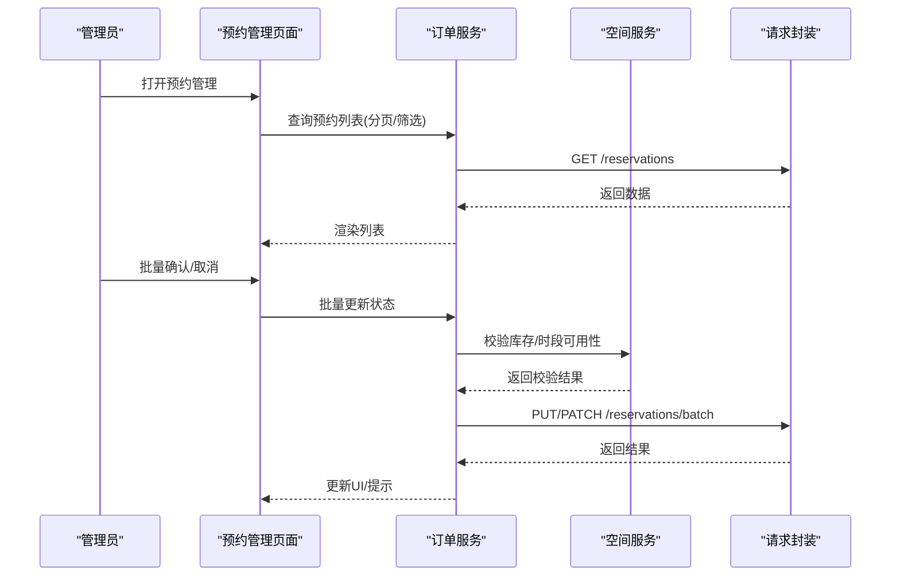
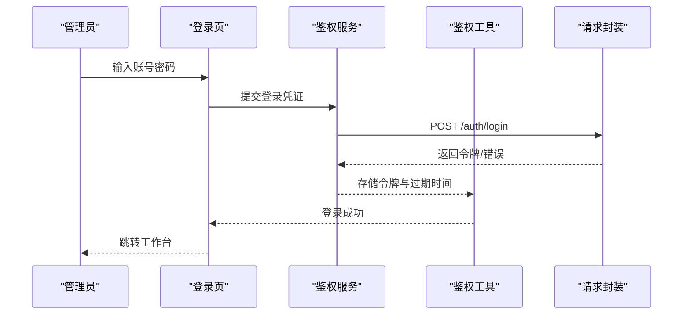
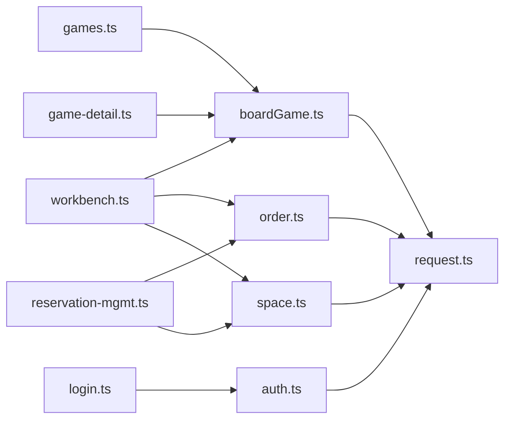

# 管理员端功能

<cite>
**本文引用的文件**   
- [app.ts](file://miniprogram/app.ts)
- [config.ts](file://miniprogram/config.ts)
- [auth.ts](file://miniprogram/utils/auth.ts)
- [request.ts](file://miniprogram/utils/request.ts)
- [util.ts](file://miniprogram/utils/util.ts)
- [auth.ts](file://miniprogram/services/auth.ts)
- [boardGame.ts](file://miniprogram/services/boardGame.ts)
- [order.ts](file://miniprogram/services/order.ts)
- [space.ts](file://miniprogram/services/space.ts)
- [store.ts](file://miniprogram/services/store.ts)
- [workbench.ts](file://miniprogram/pages/staff/workbench/workbench.ts)
- [games.ts](file://miniprogram/pages/staff/games/games.ts)
- [reservation-mgmt.ts](file://miniprogram/pages/staff/reservation-mgmt/reservation-mgmt.ts)
- [game-detail.ts](file://miniprogram/pages/staff/game-detail/game-detail.ts)
- [login.ts](file://miniprogram/pages/login/login.ts)
</cite>

## 目录
1. [简介](#简介)
2. [项目结构](#项目结构)
3. [核心组件](#核心组件)
4. [架构总览](#架构总览)
5. [详细组件分析](#详细组件分析)
6. [依赖关系分析](#依赖关系分析)
7. [性能考虑](#性能考虑)
8. [故障排查指南](#故障排查指南)
9. [结论](#结论)
10. [附录](#附录)

## 简介
本文件面向“管理员端”功能模块，覆盖管理员工作台、游戏管理、预约管理与数据统计等核心能力。文档从系统架构、数据流、权限控制、数据操作界面、批量处理与报表生成等方面展开，结合代码级实现路径与流程图，帮助读者快速理解并高效使用管理员端。

## 项目结构
管理员端位于小程序的 staff 页面集合中，包含工作台、游戏列表与详情、预约管理等子页面；服务层通过 services 目录统一封装业务接口；工具层提供鉴权、请求封装与通用方法；应用入口与配置负责全局初始化与常量定义。

图表来源 
- [app.ts](file://miniprogram/app.ts)
- [config.ts](file://miniprogram/config.ts)
- [auth.ts](file://miniprogram/utils/auth.ts)
- [request.ts](file://miniprogram/utils/request.ts)
- [util.ts](file://miniprogram/utils/util.ts)
- [auth.ts](file://miniprogram/services/auth.ts)
- [boardGame.ts](file://miniprogram/services/boardGame.ts)
- [order.ts](file://miniprogram/services/order.ts)
- [space.ts](file://miniprogram/services/space.ts)
- [store.ts](file://miniprogram/services/store.ts)
- [login.ts](file://miniprogram/pages/login/login.ts)
- [workbench.ts](file://miniprogram/pages/staff/workbench/workbench.ts)
- [games.ts](file://miniprogram/pages/staff/games/games.ts)
- [reservation-mgmt.ts](file://miniprogram/pages/staff/reservation-mgmt/reservation-mgmt.ts)
- [game-detail.ts](file://miniprogram/pages/staff/game-detail/game-detail.ts)

章节来源
- [app.ts](file://miniprogram/app.ts)
- [config.ts](file://miniprogram/config.ts)

## 核心组件
- 管理员工作台：聚合关键指标（如当日预约、待处理订单、在线人数等），支持快捷跳转至游戏管理与预约管理。
- 游戏管理：展示游戏列表、筛选与分页、创建/编辑/上下架、库存与价格维护。
- 预约管理：按时间维度查看预约明细、状态流转（已预约/已确认/已完成/已取消）、批量操作（批量确认/取消）。
- 数据统计：按日/周/月统计预约量、收入、热门游戏等，支持导出报表。

章节来源
- [workbench.ts](file://miniprogram/pages/staff/workbench/workbench.ts)
- [games.ts](file://miniprogram/pages/staff/games/games.ts)
- [reservation-mgmt.ts](file://miniprogram/pages/staff/reservation-mgmt/reservation-mgmt.ts)

## 架构总览
管理员端采用“页面-服务-工具”分层架构：
- 页面层：负责 UI 渲染与用户交互，调用服务层 API。
- 服务层：封装业务逻辑与网络请求，统一错误处理与重试策略。
- 工具层：提供鉴权、HTTP 请求封装、通用工具函数。
- 应用层：统一初始化、路由与全局状态。

图表来源 
- [workbench.ts](file://miniprogram/pages/staff/workbench/workbench.ts)
- [games.ts](file://miniprogram/pages/staff/games/games.ts)
- [reservation-mgmt.ts](file://miniprogram/pages/staff/reservation-mgmt/reservation-mgmt.ts)
- [auth.ts](file://miniprogram/services/auth.ts)
- [boardGame.ts](file://miniprogram/services/boardGame.ts)
- [order.ts](file://miniprogram/services/order.ts)
- [space.ts](file://miniprogram/services/space.ts)
- [request.ts](file://miniprogram/utils/request.ts)

## 详细组件分析

### 管理员工作台
- 功能要点
  - 展示关键运营指标（预约数、订单数、活跃用户等）
  - 快捷入口跳转至游戏管理与预约管理
  - 刷新机制与加载态处理
- 数据流
  - 页面初始化时调用服务层接口拉取统计数据
  - 失败时进行降级显示与重试提示
- 权限控制
  - 进入前校验管理员身份，未授权则跳转登录页
- 最佳实践
  - 对敏感数据进行脱敏展示
  - 使用防抖/节流避免重复刷新

章节来源
- [workbench.ts](file://miniprogram/pages/staff/workbench/workbench.ts)
- [auth.ts](file://miniprogram/utils/auth.ts)
- [auth.ts](file://miniprogram/services/auth.ts)

### 游戏管理
- 功能要点
  - 游戏列表分页、搜索与筛选
  - 新增/编辑游戏信息（名称、描述、图片、价格、库存、状态）
  - 批量上架/下架
- 数据验证
  - 必填字段校验、价格与库存范围校验、图片格式校验
- 异常处理
  - 网络异常重试、服务端错误码映射、用户友好提示
- 批量处理
  - 选择多条记录后统一执行状态变更

图表来源 
- [games.ts](file://miniprogram/pages/staff/games/games.ts)
- [boardGame.ts](file://miniprogram/services/boardGame.ts)
- [request.ts](file://miniprogram/utils/request.ts)

章节来源
- [games.ts](file://miniprogram/pages/staff/games/games.ts)
- [boardGame.ts](file://miniprogram/services/boardGame.ts)

### 预约管理
- 功能要点
  - 按日期/时段查看预约明细
  - 状态流转：已预约→已确认→已完成/已取消
  - 批量确认/批量取消
- 数据验证
  - 预约时间与库存冲突检测、用户信息完整性校验
- 异常处理
  - 并发冲突回滚、超时重试、幂等性保证
- 报表导出
  - 支持按时间段导出预约明细（CSV/Excel）

图表来源 
- [reservation-mgmt.ts](file://miniprogram/pages/staff/reservation-mgmt/reservation-mgmt.ts)
- [order.ts](file://miniprogram/services/order.ts)
- [space.ts](file://miniprogram/services/space.ts)
- [request.ts](file://miniprogram/utils/request.ts)

章节来源
- [reservation-mgmt.ts](file://miniprogram/pages/staff/reservation-mgmt/reservation-mgmt.ts)
- [order.ts](file://miniprogram/services/order.ts)
- [space.ts](file://miniprogram/services/space.ts)

### 游戏详情
- 功能要点
  - 展示游戏详细信息（基础信息、库存、价格、状态）
  - 编辑与保存、历史变更记录
- 数据验证
  - 编辑前后一致性校验、必填项检查
- 异常处理
  - 版本冲突提示、保存失败重试

章节来源
- [game-detail.ts](file://miniprogram/pages/staff/game-detail/game-detail.ts)
- [boardGame.ts](file://miniprogram/services/boardGame.ts)

### 登录与权限控制
- 登录流程
  - 输入账号密码/验证码，调用鉴权服务获取令牌
  - 存储令牌并设置过期时间，后续请求自动携带
- 权限校验
  - 页面级守卫：进入管理员页面前校验角色
  - 接口级守卫：敏感操作需二次确认与权限校验
- 安全建议
  - 令牌加密存储、敏感操作日志审计、会话超时退出

图表来源 
- [login.ts](file://miniprogram/pages/login/login.ts)
- [auth.ts](file://miniprogram/services/auth.ts)
- [auth.ts](file://miniprogram/utils/auth.ts)
- [request.ts](file://miniprogram/utils/request.ts)

章节来源
- [login.ts](file://miniprogram/pages/login/login.ts)
- [auth.ts](file://miniprogram/services/auth.ts)
- [auth.ts](file://miniprogram/utils/auth.ts)

## 依赖关系分析
- 页面与服务层解耦：页面仅负责交互与渲染，业务逻辑下沉至服务层。
- 服务层依赖请求封装：统一处理鉴权头、重试、错误码映射。
- 工具层被多模块复用：鉴权、通用工具函数在多处使用。
- 潜在循环依赖：确保页面不直接依赖工具层中的请求封装，避免耦合。

图表来源 
- [workbench.ts](file://miniprogram/pages/staff/workbench/workbench.ts)
- [games.ts](file://miniprogram/pages/staff/games/games.ts)
- [reservation-mgmt.ts](file://miniprogram/pages/staff/reservation-mgmt/reservation-mgmt.ts)
- [game-detail.ts](file://miniprogram/pages/staff/game-detail/game-detail.ts)
- [login.ts](file://miniprogram/pages/login/login.ts)
- [boardGame.ts](file://miniprogram/services/boardGame.ts)
- [order.ts](file://miniprogram/services/order.ts)
- [space.ts](file://miniprogram/services/space.ts)
- [auth.ts](file://miniprogram/services/auth.ts)
- [request.ts](file://miniprogram/utils/request.ts)

章节来源
- [workbench.ts](file://miniprogram/pages/staff/workbench/workbench.ts)
- [games.ts](file://miniprogram/pages/staff/games/games.ts)
- [reservation-mgmt.ts](file://miniprogram/pages/staff/reservation-mgmt/reservation-mgmt.ts)
- [game-detail.ts](file://miniprogram/pages/staff/game-detail/game-detail.ts)
- [login.ts](file://miniprogram/pages/login/login.ts)
- [boardGame.ts](file://miniprogram/services/boardGame.ts)
- [order.ts](file://miniprogram/services/order.ts)
- [space.ts](file://miniprogram/services/space.ts)
- [auth.ts](file://miniprogram/services/auth.ts)
- [request.ts](file://miniprogram/utils/request.ts)

## 性能考虑
- 列表分页与懒加载：减少首屏数据量，提升渲染速度。
- 请求合并与去重：同一时刻相同请求合并，避免重复网络开销。
- 缓存策略：对静态配置与热点数据做本地缓存，缩短响应时间。
- 批量操作优化：前端分批提交，降低服务器压力与失败回滚成本。
- 错误重试与退避：指数退避重试，避免雪崩效应。

[本节为通用指导，无需特定文件引用]

## 故障排查指南
- 登录失败
  - 检查账号密码与验证码是否正确
  - 查看鉴权服务返回的错误码与提示信息
  - 确认令牌存储是否成功
- 数据加载失败
  - 检查网络连通性与请求头（鉴权令牌）
  - 查看服务层错误处理与重试逻辑
  - 核对后端接口状态码与返回结构
- 批量操作异常
  - 检查并发冲突与库存校验逻辑
  - 查看事务回滚与幂等性保障
  - 定位具体失败的条目并单独重试

章节来源
- [auth.ts](file://miniprogram/utils/auth.ts)
- [request.ts](file://miniprogram/utils/request.ts)
- [auth.ts](file://miniprogram/services/auth.ts)
- [order.ts](file://miniprogram/services/order.ts)
- [space.ts](file://miniprogram/services/space.ts)

## 结论
管理员端以清晰的分层架构与统一的工具支撑，实现了工作台、游戏管理、预约管理与数据统计等核心能力。通过严格的权限控制、完善的数据验证与健壮的错误处理，保障了管理员操作的稳定性与安全性。建议在后续迭代中持续优化性能与用户体验，并加强监控与审计能力。

[本节为总结性内容，无需特定文件引用]

## 附录
- 管理员工作流程建议
  - 每日巡检：登录工作台，查看关键指标与异常告警
  - 游戏维护：定期审核游戏信息与库存，及时上下架
  - 预约处理：按时段处理预约确认与取消，避免超售
  - 数据复盘：导出报表，分析趋势并制定运营策略
- 最佳实践
  - 敏感操作二次确认与留痕
  - 统一错误提示与可恢复性设计
  - 合理划分权限粒度，最小化授权原则

[本节为通用指导，无需特定文件引用]