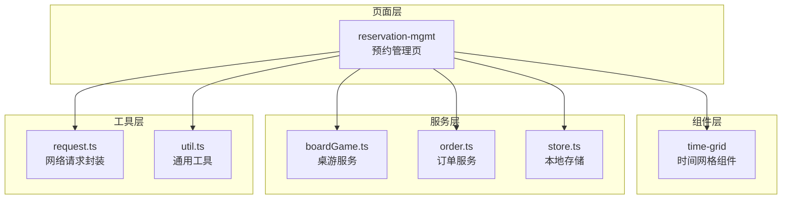
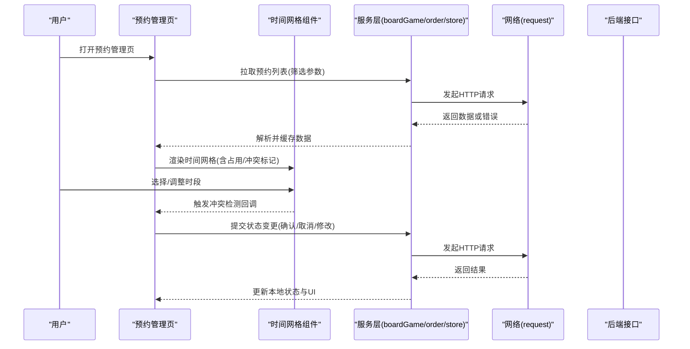
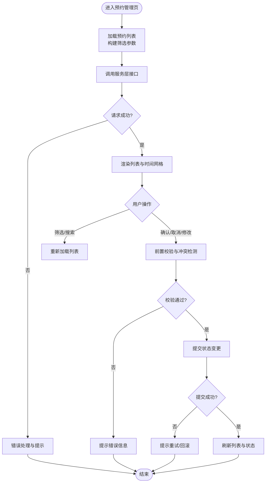
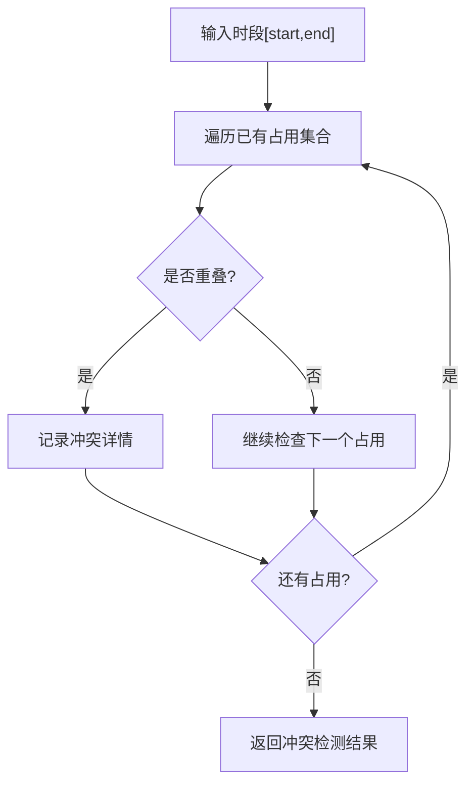
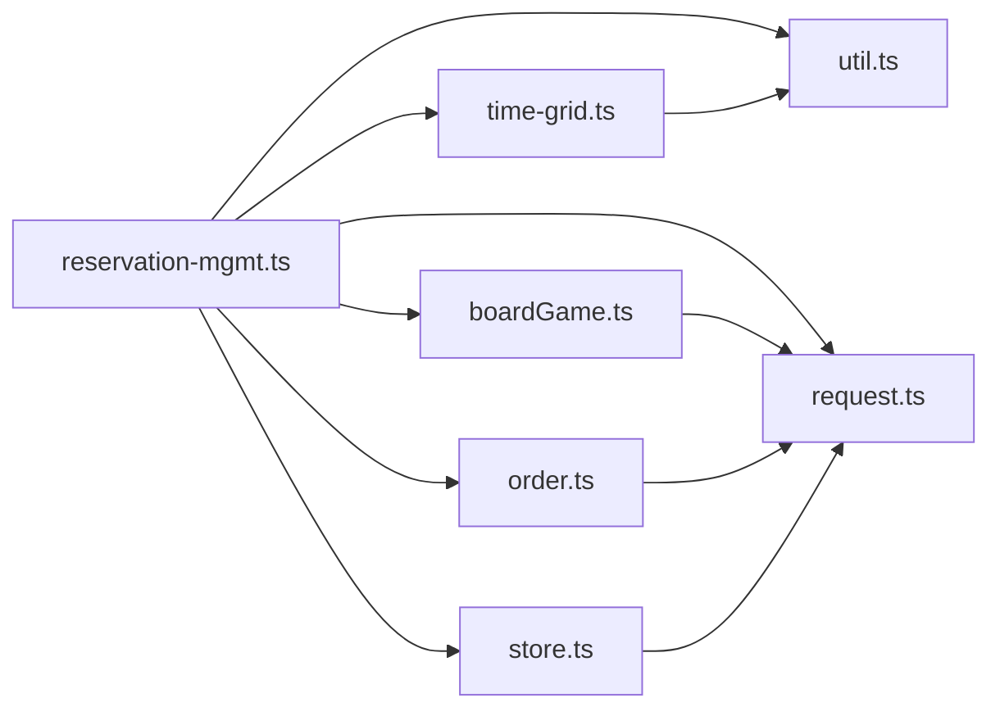

# 预约管理

<cite>
**本文引用的文件**   
- [reservation-mgmt.ts](file://miniprogram/pages/staff/reservation-mgmt/reservation-mgmt.ts)
- [reservation-mgmt.wxml](file://miniprogram/pages/staff/reservation-mgmt/reservation-mgmt.wxml)
- [reservation-mgmt.scss](file://miniprogram/pages/staff/reservation-mgmt/reservation-mgmt.scss)
- [reservation-mgmt.json](file://miniprogram/pages/staff/reservation-mgmt/reservation-mgmt.json)
- [time-grid.ts](file://miniprogram/components/time-grid/time-grid.ts)
- [time-grid.wxml](file://miniprogram/components/time-grid/time-grid.wxml)
- [time-grid.scss](file://miniprogram/components/time-grid/time-grid.scss)
- [time-grid.json](file://miniprogram/components/time-grid/time-grid.json)
- [boardGame.ts](file://miniprogram/services/boardGame.ts)
- [order.ts](file://miniprogram/services/order.ts)
- [store.ts](file://miniprogram/services/store.ts)
- [request.ts](file://miniprogram/utils/request.ts)
- [util.ts](file://miniprogram/utils/util.ts)
- [app.json](file://miniprogram/app.json)
</cite>

## 目录
1. [简介](#简介)
2. [项目结构](#项目结构)
3. [核心组件](#核心组件)
4. [架构总览](#架构总览)
5. [详细组件分析](#详细组件分析)
6. [依赖分析](#依赖分析)
7. [性能考虑](#性能考虑)
8. [故障排查指南](#故障排查指南)
9. [结论](#结论)
10. [附录](#附录)

## 简介
本模块面向门店员工，提供预约的集中管理能力。功能覆盖：
- 预约列表展示与筛选查询（按日期、状态、游戏等）
- 预约状态管理与流转（待确认、已确认、进行中、已完成、已取消等）
- 时间冲突检测（同一场地/时段不可重复占用）
- 批量处理（批量确认、批量取消、批量导出等）
- 预约的确认、取消、修改、删除操作
- 统计报表生成（按日/周/月维度汇总）
- 异常预约处理机制（超时未到店、资源不足、数据不一致等）

## 项目结构
预约管理相关代码主要分布在员工端页面与通用组件中：
- 页面层：staff/reservation-mgmt（预约管理页）
- 组件层：components/time-grid（时间网格组件，用于可视化时段与冲突）
- 服务层：services/boardGame.ts、services/order.ts、services/store.ts（业务数据与状态）
- 工具层：utils/request.ts、utils/util.ts（网络请求与通用工具）
- 配置与路由：app.json（页面路由注册）

图表来源
- [reservation-mgmt.ts](file://miniprogram/pages/staff/reservation-mgmt/reservation-mgmt.ts)
- [time-grid.ts](file://miniprogram/components/time-grid/time-grid.ts)
- [boardGame.ts](file://miniprogram/services/boardGame.ts)
- [order.ts](file://miniprogram/services/order.ts)
- [store.ts](file://miniprogram/services/store.ts)
- [request.ts](file://miniprogram/utils/request.ts)
- [util.ts](file://miniprogram/utils/util.ts)

章节来源
- [reservation-mgmt.ts](file://miniprogram/pages/staff/reservation-mgmt/reservation-mgmt.ts)
- [time-grid.ts](file://miniprogram/components/time-grid/time-grid.ts)
- [boardGame.ts](file://miniprogram/services/boardGame.ts)
- [order.ts](file://miniprogram/services/order.ts)
- [store.ts](file://miniprogram/services/store.ts)
- [request.ts](file://miniprogram/utils/request.ts)
- [util.ts](file://miniprogram/utils/util.ts)
- [app.json](file://miniprogram/app.json)

## 核心组件
- 预约管理页（reservation-mgmt）
  - 负责预约列表渲染、筛选条件、分页加载、批量选择与批量操作、状态变更交互、错误提示与重试
  - 通过服务层调用后端接口获取预约数据，并维护本地状态与缓存
- 时间网格组件（time-grid）
  - 以网格形式展示时间段与占用情况，支持点击选择、冲突高亮、拖拽调整（如适用）
  - 内部实现时间区间计算与冲突检测逻辑，向父组件暴露事件回调

章节来源
- [reservation-mgmt.ts](file://miniprogram/pages/staff/reservation-mgmt/reservation-mgmt.ts)
- [reservation-mgmt.wxml](file://miniprogram/pages/staff/reservation-mgmt/reservation-mgmt.wxml)
- [reservation-mgmt.scss](file://miniprogram/pages/staff/reservation-mgmt/reservation-mgmt.scss)
- [time-grid.ts](file://miniprogram/components/time-grid/time-grid.ts)
- [time-grid.wxml](file://miniprogram/components/time-grid/time-grid.wxml)
- [time-grid.scss](file://miniprogram/components/time-grid/time-grid.scss)

## 架构总览
预约管理采用“页面-组件-服务-工具”的分层架构：
- 页面层负责用户交互与视图更新
- 组件层提供可复用的时间网格能力
- 服务层封装业务API与本地存储
- 工具层统一网络请求与常用工具方法

图表来源
- [reservation-mgmt.ts](file://miniprogram/pages/staff/reservation-mgmt/reservation-mgmt.ts)
- [time-grid.ts](file://miniprogram/components/time-grid/time-grid.ts)
- [boardGame.ts](file://miniprogram/services/boardGame.ts)
- [order.ts](file://miniprogram/services/order.ts)
- [store.ts](file://miniprogram/services/store.ts)
- [request.ts](file://miniprogram/utils/request.ts)

## 详细组件分析

### 预约管理页（reservation-mgmt）
- 职责
  - 列表加载与分页：根据筛选条件（日期、状态、游戏、场地等）分页拉取数据
  - 筛选与搜索：支持多条件组合筛选，实时刷新列表
  - 状态管理：维护预约对象的状态字段，驱动UI显示不同标签与操作按钮
  - 批量处理：多选后执行批量确认、批量取消、批量导出等操作
  - 冲突检测：在修改时段时调用时间网格组件的冲突检测回调，阻止非法操作
  - 异常处理：对网络失败、服务端错误、数据校验失败进行提示与重试
- 关键流程
  - 列表加载：构建筛选参数 -> 调用服务层 -> 解析响应 -> 更新本地状态 -> 渲染列表
  - 状态变更：用户操作 -> 校验前置条件 -> 调用服务层接口 -> 成功后刷新列表
  - 批量操作：收集选中项 -> 批量校验 -> 分批调用服务层接口 -> 汇总结果与提示

图表来源
- [reservation-mgmt.ts](file://miniprogram/pages/staff/reservation-mgmt/reservation-mgmt.ts)
- [reservation-mgmt.wxml](file://miniprogram/pages/staff/reservation-mgmt/reservation-mgmt.wxml)
- [reservation-mgmt.scss](file://miniprogram/pages/staff/reservation-mgmt/reservation-mgmt.scss)

章节来源
- [reservation-mgmt.ts](file://miniprogram/pages/staff/reservation-mgmt/reservation-mgmt.ts)
- [reservation-mgmt.wxml](file://miniprogram/pages/staff/reservation-mgmt/reservation-mgmt.wxml)
- [reservation-mgmt.scss](file://miniprogram/pages/staff/reservation-mgmt/reservation-mgmt.scss)

### 时间网格组件（time-grid）
- 职责
  - 展示时间段网格，标注占用与空闲
  - 支持点击选择、拖拽调整（如适用），并在调整过程中进行冲突检测
  - 向父组件暴露事件：onSelect、onAdjust、onConflict 等
- 冲突检测算法
  - 输入：目标时段[start, end]、已有占用集合
  - 判断：是否存在重叠区间；若存在则返回冲突详情
  - 输出：布尔值与冲突明细（用于高亮与阻止提交）

图表来源
- [time-grid.ts](file://miniprogram/components/time-grid/time-grid.ts)
- [time-grid.wxml](file://miniprogram/components/time-grid/time-grid.wxml)
- [time-grid.scss](file://miniprogram/components/time-grid/time-grid.scss)

章节来源
- [time-grid.ts](file://miniprogram/components/time-grid/time-grid.ts)
- [time-grid.wxml](file://miniprogram/components/time-grid/time-grid.wxml)
- [time-grid.scss](file://miniprogram/components/time-grid/time-grid.scss)

### 服务层（boardGame.ts / order.ts / store.ts）
- boardGame.ts
  - 提供桌游相关的数据查询与状态同步接口
- order.ts
  - 提供预约订单的创建、状态变更、批量操作接口
- store.ts
  - 本地缓存与状态持久化，减少重复请求，提升用户体验

章节来源
- [boardGame.ts](file://miniprogram/services/boardGame.ts)
- [order.ts](file://miniprogram/services/order.ts)
- [store.ts](file://miniprogram/services/store.ts)

### 工具层（request.ts / util.ts）
- request.ts
  - 统一封装网络请求，处理鉴权、重试、错误码映射
- util.ts
  - 提供日期时间处理、格式化、校验等通用方法

章节来源
- [request.ts](file://miniprogram/utils/request.ts)
- [util.ts](file://miniprogram/utils/util.ts)

## 依赖分析
- 页面依赖组件与服务层，组件依赖工具层
- 服务层依赖网络请求与本地存储
- 各模块间通过明确的接口契约通信，避免循环依赖

图表来源
- [reservation-mgmt.ts](file://miniprogram/pages/staff/reservation-mgmt/reservation-mgmt.ts)
- [time-grid.ts](file://miniprogram/components/time-grid/time-grid.ts)
- [boardGame.ts](file://miniprogram/services/boardGame.ts)
- [order.ts](file://miniprogram/services/order.ts)
- [store.ts](file://miniprogram/services/store.ts)
- [request.ts](file://miniprogram/utils/request.ts)
- [util.ts](file://miniprogram/utils/util.ts)

章节来源
- [reservation-mgmt.ts](file://miniprogram/pages/staff/reservation-mgmt/reservation-mgmt.ts)
- [time-grid.ts](file://miniprogram/components/time-grid/time-grid.ts)
- [boardGame.ts](file://miniprogram/services/boardGame.ts)
- [order.ts](file://miniprogram/services/order.ts)
- [store.ts](file://miniprogram/services/store.ts)
- [request.ts](file://miniprogram/utils/request.ts)
- [util.ts](file://miniprogram/utils/util.ts)

## 性能考虑
- 列表分页与懒加载：按需加载数据，减少首屏压力
- 本地缓存：对热点数据（如筛选字典、最近列表）进行缓存，降低重复请求
- 防抖与节流：筛选输入与滚动加载使用防抖/节流，避免频繁请求
- 批量操作分片：将大批量任务拆分为小批次，避免阻塞主线程
- 冲突检测优化：增量计算与索引优化，减少遍历开销

[本节为通用指导，不直接分析具体文件]

## 故障排查指南
- 网络错误
  - 现象：列表加载失败、状态变更失败
  - 排查：检查网络请求封装的错误码映射与重试策略
- 数据不一致
  - 现象：前端状态与后端不一致
  - 排查：对比本地缓存与服务器响应，必要时清空缓存并重试
- 时间冲突
  - 现象：提交被拒绝，提示时段冲突
  - 排查：查看时间网格组件的冲突检测结果与输入参数
- 权限与鉴权
  - 现象：无权限操作
  - 排查：检查鉴权令牌与角色权限配置

章节来源
- [request.ts](file://miniprogram/utils/request.ts)
- [store.ts](file://miniprogram/services/store.ts)
- [time-grid.ts](file://miniprogram/components/time-grid/time-grid.ts)

## 结论
预约管理模块通过清晰的层次结构与可复用组件，实现了高效的预约列表展示、状态管理、冲突检测与批量处理能力。配合统一的网络请求与本地缓存策略，保证了良好的用户体验与系统稳定性。建议在生产环境中完善监控与日志采集，持续优化性能与可靠性。

[本节为总结性内容，不直接分析具体文件]

## 附录

### 业务流程规范
- 预约状态定义
  - 待确认：用户提交预约后，等待门店确认
  - 已确认：门店确认预约，锁定时段与资源
  - 进行中：预约开始，进入服务阶段
  - 已完成：服务结束，释放资源
  - 已取消：预约被取消，释放资源
- 状态流转规则
  - 待确认 -> 已确认：门店确认后生效
  - 已确认 -> 进行中：到达预约时间自动或手动切换
  - 进行中 -> 已完成：服务结束后切换
  - 任意状态 -> 已取消：允许取消（需满足业务约束）
- 时间冲突检测
  - 同一场地在同一时段仅允许一个有效预约
  - 修改时段时需重新检测冲突，禁止覆盖其他预约
- 批量处理规范
  - 批量确认/取消前需进行前置校验（如状态合法性、资源可用性）
  - 分批提交，记录每批结果，便于问题定位与补偿

### 操作指南
- 预约列表展示
  - 打开预约管理页，默认展示当日预约；可通过日期选择器切换
  - 使用筛选栏按状态、游戏、场地等条件过滤
- 预约确认
  - 选中待确认预约，点击确认；系统校验资源与时段后提交
- 预约取消
  - 选中可取消状态的预约，点击取消；填写原因并确认
- 预约修改
  - 点击编辑，调整时段或资源；系统自动进行冲突检测
- 预约删除
  - 仅允许删除无效或测试数据；正式数据不建议删除，优先使用取消
- 统计报表
  - 按日/周/月维度生成预约数量、完成率、取消率等指标
  - 支持导出CSV/PDF格式

[本节为概念性说明，不直接分析具体文件]