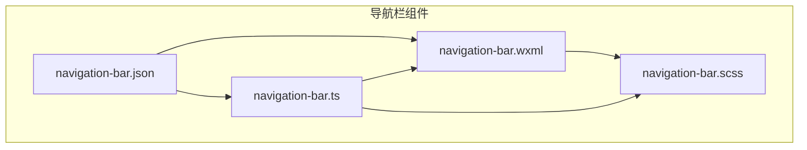
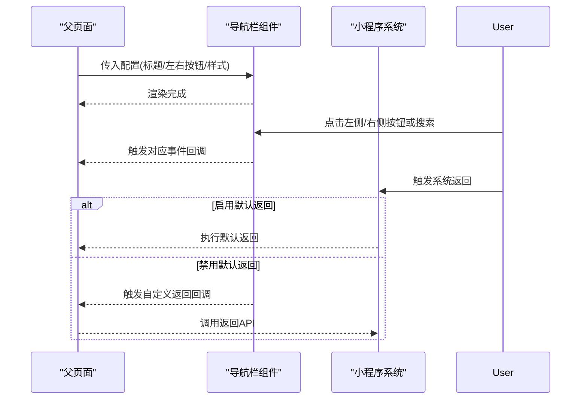
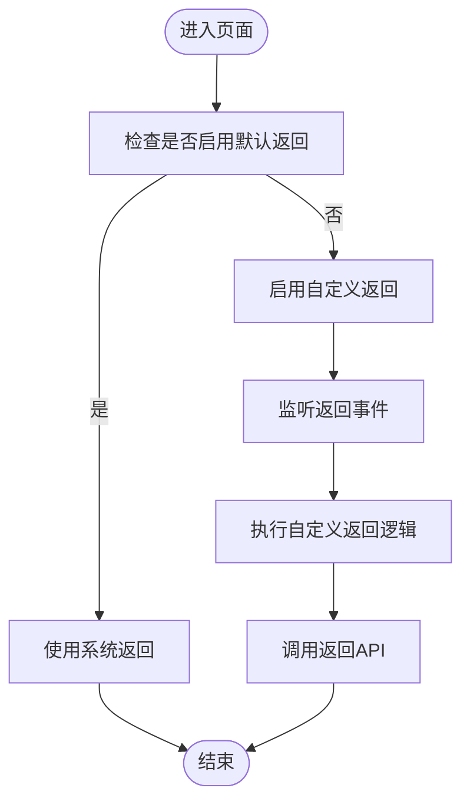
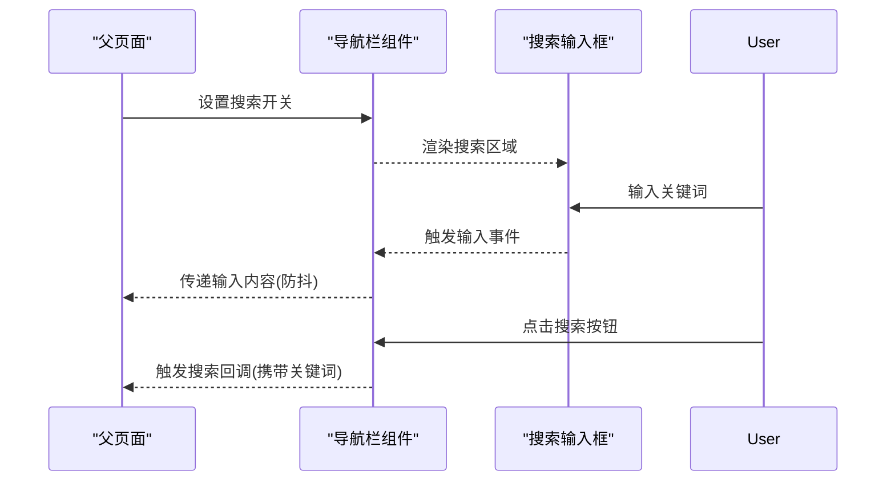
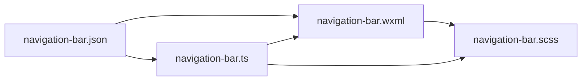

# 导航栏组件

<cite>
**本文引用的文件**   
- [navigation-bar.json](file://miniprogram/components/navigation-bar/navigation-bar.json)
- [navigation-bar.scss](file://miniprogram/components/navigation-bar/navigation-bar.scss)
- [navigation-bar.ts](file://miniprogram/components/navigation-bar/navigation-bar.ts)
- [navigation-bar.wxml](file://miniprogram/components/navigation-bar/navigation-bar.wxml)
- [app.json](file://miniprogram/app.json)
- [config.ts](file://miniprogram/config.ts)
</cite>

## 目录
1. [简介](#简介)
2. [项目结构](#项目结构)
3. [核心组件](#核心组件)
4. [架构总览](#架构总览)
5. [详细组件分析](#详细组件分析)
6. [依赖分析](#依赖分析)
7. [性能考虑](#性能考虑)
8. [故障排查指南](#故障排查指南)
9. [结论](#结论)
10. [附录](#附录)

## 简介
本文件为“导航栏组件”的完整技术文档，聚焦以下目标：
- 页面导航逻辑、标题管理与返回处理机制
- 组件配置项（标题文本、左侧按钮、右侧操作、背景样式等）与事件回调
- 多场景使用示例（标准页面导航、带搜索功能的导航栏、自定义操作的导航栏）
- 与小程序原生导航栏的集成方式与兼容性处理
- 样式定制、动画效果与可访问性最佳实践

## 项目结构
导航栏组件位于 miniprogram/components/navigation-bar 目录下，包含四个标准小程序组件文件：
- navigation-bar.json：组件声明与依赖
- navigation-bar.wxml：模板结构
- navigation-bar.scss：样式定义
- navigation-bar.ts：组件逻辑与对外接口

图表来源 
- [navigation-bar.json](file://miniprogram/components/navigation-bar/navigation-bar.json)
- [navigation-bar.wxml](file://miniprogram/components/navigation-bar/navigation-bar.wxml)
- [navigation-bar.scss](file://miniprogram/components/navigation-bar/navigation-bar.scss)
- [navigation-bar.ts](file://miniprogram/components/navigation-bar/navigation-bar.ts)

章节来源
- [navigation-bar.json](file://miniprogram/components/navigation-bar/navigation-bar.json)
- [navigation-bar.wxml](file://miniprogram/components/navigation-bar/navigation-bar.wxml)
- [navigation-bar.scss](file://miniprogram/components/navigation-bar/navigation-bar.scss)
- [navigation-bar.ts](file://miniprogram/components/navigation-bar/navigation-bar.ts)

## 核心组件
导航栏组件承担以下职责：
- 统一渲染顶部导航区域（标题、左侧返回/图标、右侧操作区）
- 管理页面标题与动态更新
- 处理返回行为（兼容小程序默认返回与自定义返回）
- 暴露事件回调（点击左侧按钮、右侧操作、搜索触发等）
- 提供样式与主题扩展点（背景色、高度、字体颜色等）

章节来源
- [navigation-bar.ts](file://miniprogram/components/navigation-bar/navigation-bar.ts)
- [navigation-bar.wxml](file://miniprogram/components/navigation-bar/navigation-bar.wxml)
- [navigation-bar.scss](file://miniprogram/components/navigation-bar/navigation-bar.scss)

## 架构总览
导航栏组件通过属性接收父级页面的配置，并在内部维护状态（如是否显示搜索框、当前标题、按钮可见性等）。其数据流如下：
- 父页面在 wxml 中引入组件并传入 props（标题、左右按钮、背景样式等）
- 组件根据 props 渲染 UI，并监听用户交互事件
- 组件通过事件向上抛出（如 onLeftTap、onRightTap、onSearch），由父页面处理业务逻辑
- 对于返回行为，组件优先遵循小程序默认返回；若父页面禁用默认返回，则交由自定义返回逻辑处理

图表来源 
- [navigation-bar.ts](file://miniprogram/components/navigation-bar/navigation-bar.ts)
- [navigation-bar.wxml](file://miniprogram/components/navigation-bar/navigation-bar.wxml)

## 详细组件分析

### 组件属性与事件
- 标题相关
  - 标题文本：用于设置导航栏标题
  - 标题居中：控制标题是否居中显示
  - 动态标题：支持运行时更新标题
- 左侧区域
  - 左侧按钮：可配置图标与点击事件
  - 返回模式：默认跟随系统返回；可切换为自定义返回
- 右侧区域
  - 右侧操作：支持多个操作按钮及点击回调
  - 搜索功能：开启后显示搜索输入框与搜索按钮
- 样式与主题
  - 背景色：支持自定义背景色
  - 高度与内边距：适配不同屏幕与视觉规范
  - 文字颜色：与背景对比度保证可读性
- 事件回调
  - 左侧按钮点击
  - 右侧操作点击
  - 搜索触发（含输入内容）
  - 自定义返回回调

章节来源
- [navigation-bar.ts](file://miniprogram/components/navigation-bar/navigation-bar.ts)
- [navigation-bar.wxml](file://miniprogram/components/navigation-bar/navigation-bar.wxml)

### 页面导航逻辑与返回处理
- 默认返回：当未禁用系统返回时，点击返回按钮直接执行小程序默认返回
- 自定义返回：当父页面禁用默认返回时，组件触发自定义返回回调，由父页面决定返回策略（如关闭弹窗、清空表单后再返回）
- 页面栈管理：避免重复入栈与异常返回路径，确保返回顺序符合预期

图表来源 
- [navigation-bar.ts](file://miniprogram/components/navigation-bar/navigation-bar.ts)

章节来源
- [navigation-bar.ts](file://miniprogram/components/navigation-bar/navigation-bar.ts)

### 标题管理机制
- 初始标题：从组件属性读取并渲染
- 动态更新：父页面可通过事件或方法更新标题
- 标题对齐：支持居中与左对齐，适配不同页面风格

章节来源
- [navigation-bar.wxml](file://miniprogram/components/navigation-bar/navigation-bar.wxml)
- [navigation-bar.ts](file://miniprogram/components/navigation-bar/navigation-bar.ts)

### 搜索功能实现
- 开关控制：通过属性控制是否显示搜索区域
- 输入处理：实时获取输入值，防抖处理减少频繁回调
- 搜索触发：点击搜索按钮或回车触发搜索事件，将输入内容传递给父页面

图表来源 
- [navigation-bar.wxml](file://miniprogram/components/navigation-bar/navigation-bar.wxml)
- [navigation-bar.ts](file://miniprogram/components/navigation-bar/navigation-bar.ts)

章节来源
- [navigation-bar.wxml](file://miniprogram/components/navigation-bar/navigation-bar.wxml)
- [navigation-bar.ts](file://miniprogram/components/navigation-bar/navigation-bar.ts)

### 样式定制与动画效果
- 背景样式：支持纯色、渐变与透明背景
- 高度与间距：适配刘海屏与不同设备
- 过渡动画：按钮点击反馈、搜索区域展开收起动画
- 主题变量：通过 SCSS 变量统一管理颜色与尺寸

章节来源
- [navigation-bar.scss](file://miniprogram/components/navigation-bar/navigation-bar.scss)

### 可访问性支持
- 语义化标签：使用合适的元素类型提升读屏体验
- 焦点管理：确保键盘导航与焦点顺序合理
- 对比度与字号：满足无障碍阅读要求
- 提示文案：为图标按钮提供 aria-label 或等价文案

章节来源
- [navigation-bar.wxml](file://miniprogram/components/navigation-bar/navigation-bar.wxml)
- [navigation-bar.scss](file://miniprogram/components/navigation-bar/navigation-bar.scss)

## 依赖分析
- 组件声明依赖：navigation-bar.json 声明组件及其依赖
- 模板与样式：wxml 与 scss 紧密耦合，确保结构与样式一致
- 逻辑与视图：ts 负责状态与事件，wxml 负责渲染，scs 负责样式

图表来源 
- [navigation-bar.json](file://miniprogram/components/navigation-bar/navigation-bar.json)
- [navigation-bar.wxml](file://miniprogram/components/navigation-bar/navigation-bar.wxml)
- [navigation-bar.scss](file://miniprogram/components/navigation-bar/navigation-bar.scss)
- [navigation-bar.ts](file://miniprogram/components/navigation-bar/navigation-bar.ts)

章节来源
- [navigation-bar.json](file://miniprogram/components/navigation-bar/navigation-bar.json)
- [navigation-bar.wxml](file://miniprogram/components/navigation-bar/navigation-bar.wxml)
- [navigation-bar.scss](file://miniprogram/components/navigation-bar/navigation-bar.scss)
- [navigation-bar.ts](file://miniprogram/components/navigation-bar/navigation-bar.ts)

## 性能考虑
- 事件防抖：搜索输入与高频点击事件进行防抖，降低回调频率
- 条件渲染：按需渲染搜索区域与右侧操作，减少不必要的 DOM 节点
- 样式优化：合理使用 SCSS 变量与复用类名，避免重复计算
- 内存管理：及时解绑事件监听，防止内存泄漏

[本节为通用指导，不直接分析具体文件]

## 故障排查指南
- 标题不更新
  - 检查属性是否正确传入
  - 确认动态更新逻辑是否被触发
- 返回行为异常
  - 确认是否禁用了默认返回
  - 检查自定义返回回调是否调用正确的 API
- 搜索无响应
  - 检查搜索开关是否开启
  - 确认输入事件与搜索按钮点击事件绑定正确
- 样式错乱
  - 检查 SCSS 变量与类名是否冲突
  - 确认组件容器高度与内边距设置

章节来源
- [navigation-bar.ts](file://miniprogram/components/navigation-bar/navigation-bar.ts)
- [navigation-bar.wxml](file://miniprogram/components/navigation-bar/navigation-bar.wxml)
- [navigation-bar.scss](file://miniprogram/components/navigation-bar/navigation-bar.scss)

## 结论
导航栏组件提供了统一的顶部导航能力，涵盖标题管理、返回处理、搜索与自定义操作等功能。通过清晰的属性与事件接口，便于在不同页面中灵活复用。结合样式定制与可访问性支持，可满足多样化业务需求与用户体验要求。

[本节为总结性内容，不直接分析具体文件]

## 附录

### 使用示例

- 标准页面导航
  - 场景：普通详情页，显示返回按钮与页面标题
  - 要点：启用默认返回，设置标题文本与背景色
  - 参考文件
    - [navigation-bar.wxml](file://miniprogram/components/navigation-bar/navigation-bar.wxml)
    - [navigation-bar.ts](file://miniprogram/components/navigation-bar/navigation-bar.ts)

- 带搜索功能的导航栏
  - 场景：列表页需要搜索过滤
  - 要点：开启搜索开关，处理输入与搜索回调，防抖优化
  - 参考文件
    - [navigation-bar.wxml](file://miniprogram/components/navigation-bar/navigation-bar.wxml)
    - [navigation-bar.ts](file://miniprogram/components/navigation-bar/navigation-bar.ts)

- 自定义操作的导航栏
  - 场景：需要右侧多个操作按钮（如编辑、分享）
  - 要点：配置右侧操作数组，绑定各自点击事件
  - 参考文件
    - [navigation-bar.wxml](file://miniprogram/components/navigation-bar/navigation-bar.wxml)
    - [navigation-bar.ts](file://miniprogram/components/navigation-bar/navigation-bar.ts)

### 与小程序原生导航栏的集成与兼容性
- 集成方式
  - 组件覆盖原生导航栏区域，需确保 z-index 与布局层级正确
  - 通过 app.json 与 config.ts 管理全局导航栏配置（如背景色、标题）
- 兼容性处理
  - 刘海屏与安全区域适配
  - 不同平台（iOS/Android）的返回手势差异
  - 动态修改标题时的闪烁问题（必要时延迟更新）

章节来源
- [app.json](file://miniprogram/app.json)
- [config.ts](file://miniprogram/config.ts)

### 样式定制与动画最佳实践
- 使用 SCSS 变量集中管理颜色与尺寸
- 为按钮添加点击反馈动画（缩放、透明度变化）
- 搜索区域展开收起使用过渡动画，提升交互流畅度
- 保持高对比度与合适字号，确保可读性

章节来源
- [navigation-bar.scss](file://miniprogram/components/navigation-bar/navigation-bar.scss)

### 可访问性最佳实践
- 为图标按钮提供语义化文案
- 确保键盘可达性与焦点顺序
- 避免仅用颜色传达信息，辅以图标或文字说明

章节来源
- [navigation-bar.wxml](file://miniprogram/components/navigation-bar/navigation-bar.wxml)
- [navigation-bar.scss](file://miniprogram/components/navigation-bar/navigation-bar.scss)