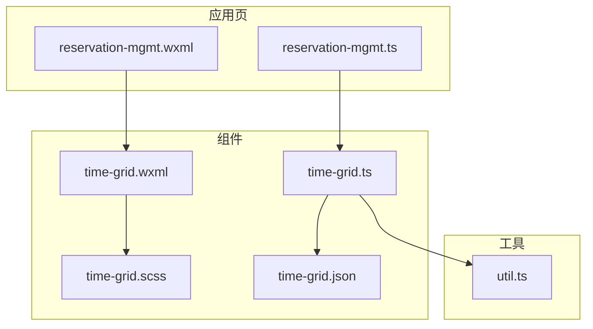
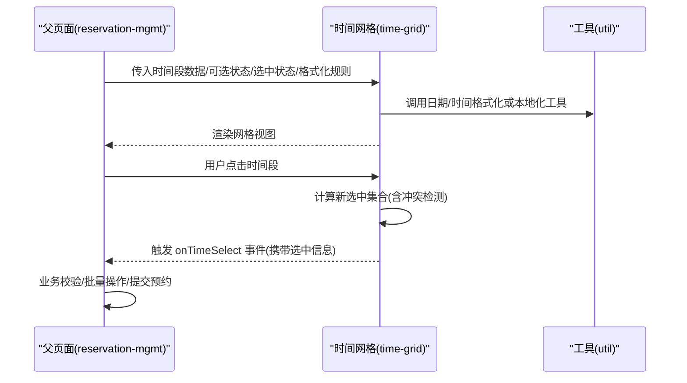
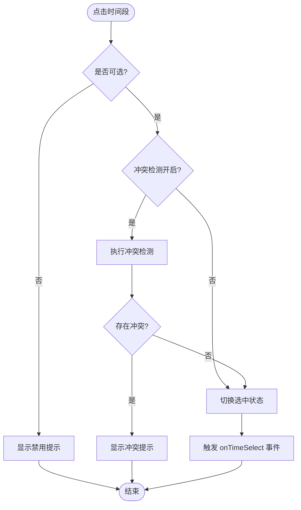
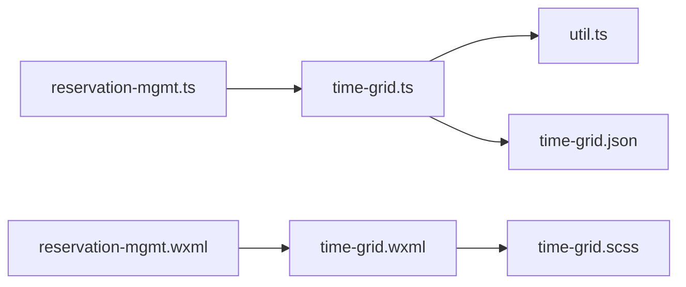

# 时间网格组件

<cite>
**本文档引用的文件**   
- [time-grid.ts](file://miniprogram/components/time-grid/time-grid.ts)
- [time-grid.wxml](file://miniprogram/components/time-grid/time-grid.wxml)
- [time-grid.scss](file://miniprogram/components/time-grid/time-grid.scss)
- [time-grid.json](file://miniprogram/components/time-grid/time-grid.json)
- [reservation-mgmt.ts](file://miniprogram/pages/staff/reservation-mgmt/reservation-mgmt.ts)
- [reservation-mgmt.wxml](file://miniprogram/pages/staff/reservation-mgmt/reservation-mgmt.wxml)
- [util.ts](file://miniprogram/utils/util.ts)
</cite>

## 目录
1. [简介](#简介)
2. [项目结构](#项目结构)
3. [核心组件](#核心组件)
4. [架构总览](#架构总览)
5. [详细组件分析](#详细组件分析)
6. [依赖分析](#依赖分析)
7. [性能考虑](#性能考虑)
8. [故障排查指南](#故障排查指南)
9. [结论](#结论)
10. [附录](#附录)

## 简介
本文件为“时间网格组件”的完整技术文档，聚焦于时间段管理、预约状态显示与交互选择逻辑。内容覆盖属性接口（时间段数据、可选/选中状态、格式化规则等）、事件处理（时间选择、状态变更）、在预约系统中的应用示例（时间段选择、冲突检测、批量操作），以及日期计算、时区处理与本地化支持。同时提供性能优化策略（虚拟滚动、数据缓存）和样式定制与主题适配指南，帮助开发者快速集成并高效使用。

## 项目结构
时间网格组件位于小程序 components/time-grid 目录下，包含 TypeScript 逻辑、WXML 模板、SCSS 样式与 JSON 配置。预约管理页面 reservation-mgmt 作为典型应用场景，演示了如何传入时间段数据、处理用户选择与提交预约。

图表来源
- [time-grid.ts](file://miniprogram/components/time-grid/time-grid.ts)
- [time-grid.wxml](file://miniprogram/components/time-grid/time-grid.wxml)
- [time-grid.scss](file://miniprogram/components/time-grid/time-grid.scss)
- [time-grid.json](file://miniprogram/components/time-grid/time-grid.json)
- [reservation-mgmt.ts](file://miniprogram/pages/staff/reservation-mgmt/reservation-mgmt.ts)
- [reservation-mgmt.wxml](file://miniprogram/pages/staff/reservation-mgmt/reservation-mgmt.wxml)
- [util.ts](file://miniprogram/utils/util.ts)

章节来源
- [time-grid.ts](file://miniprogram/components/time-grid/time-grid.ts)
- [time-grid.wxml](file://miniprogram/components/time-grid/time-grid.wxml)
- [time-grid.scss](file://miniprogram/components/time-grid/time-grid.scss)
- [time-grid.json](file://miniprogram/components/time-grid/time-grid.json)
- [reservation-mgmt.ts](file://miniprogram/pages/staff/reservation-mgmt/reservation-mgmt.ts)
- [reservation-mgmt.wxml](file://miniprogram/pages/staff/reservation-mgmt/reservation-mgmt.wxml)
- [util.ts](file://miniprogram/utils/util.ts)

## 核心组件
时间网格组件负责：
- 渲染时间段网格（行×列），展示每个时间段的可用/不可用/已选状态
- 接收外部传入的时间段数据与格式规则，进行本地化显示
- 响应用户点击，更新选中状态并触发事件回调
- 提供批量操作能力（如全选/清空）与冲突检测提示

关键职责边界：
- 不直接访问后端，仅通过事件将用户选择结果上报给父页面
- 内部维护选中集合与只读的状态映射，避免与外部数据源产生耦合
- 样式与主题通过 SCSS 变量与类名暴露，便于上层定制

章节来源
- [time-grid.ts](file://miniprogram/components/time-grid/time-grid.ts)
- [time-grid.wxml](file://miniprogram/components/time-grid/time-grid.wxml)
- [time-grid.scss](file://miniprogram/components/time-grid/time-grid.scss)

## 架构总览
时间网格组件采用“数据驱动 + 事件驱动”的模式：
- 父页面通过属性传入时间段列表、可选状态、选中状态与格式化函数
- 组件内部根据数据生成网格布局，并在用户交互时更新选中集合
- 组件通过自定义事件向父页面回传选择结果，由父页面完成业务校验与提交

图表来源
- [reservation-mgmt.ts](file://miniprogram/pages/staff/reservation-mgmt/reservation-mgmt.ts)
- [time-grid.ts](file://miniprogram/components/time-grid/time-grid.ts)
- [util.ts](file://miniprogram/utils/util.ts)

## 详细组件分析

### 属性接口（Props）
- timeSlots: 时间段数组，每项包含唯一标识、开始时间、结束时间、是否可选、是否已被占用等字段
- selectedTimes: 当前已选中的时间段 ID 集合（用于受控模式）
- selectable: 全局可选开关，控制是否允许用户选择
- formatRules: 格式化规则对象，包含时间显示格式、本地化语言、时区偏移等
- disabledStates: 禁用状态映射，按时间段 ID 指定不可选原因（如已满、维护中）
- batchMode: 是否启用批量操作模式（支持多选/全选/清空）
- conflictCheck: 冲突检测开关，开启后在选择时会检查与已有预约的重叠

章节来源
- [time-grid.ts](file://miniprogram/components/time-grid/time-grid.ts)

### 数据结构与复杂度
- 时间段数组 timeSlots 通常按时间顺序排列，查找与排序复杂度 O(n)
- 选中集合 selectedTimes 使用哈希表（Map/Set）存储，插入/删除/查询复杂度 O(1)
- 冲突检测基于区间重叠判断，单次检测复杂度 O(k)，k 为候选时间段数量

章节来源
- [time-grid.ts](file://miniprogram/components/time-grid/time-grid.ts)
- [util.ts](file://miniprogram/utils/util.ts)

### 时间段管理与状态显示
- 渲染阶段：根据 timeSlots 与 disabledStates 生成网格项，标记可用/禁用/已选三类视觉状态
- 可选性：selectable 为 false 或 disabledStates 中标记为不可用时，禁止用户交互
- 已选状态：selectedTimes 中包含的时间段高亮显示，并可通过批量操作统一修改

章节来源
- [time-grid.wxml](file://miniprogram/components/time-grid/time-grid.wxml)
- [time-grid.scss](file://miniprogram/components/time-grid/time-grid.scss)

### 交互选择逻辑
- 单击时间段：切换选中状态；若开启 conflictCheck，则先进行冲突检测再决定是否更新
- 批量操作：支持全选（仅可选项）、清空（移除所有选中）、反选（反转选中状态）
- 事件上报：每次选择变更后触发 onTimeSelect，携带最新选中集合与变更详情

图表来源
- [time-grid.ts](file://miniprogram/components/time-grid/time-grid.ts)

### 事件处理（Events）
- onTimeSelect: 时间段选择变更事件，返回 { selectedIds, changedId, action }
- onBatchAction: 批量操作事件，返回 { action: 'selectAll'|'clearAll'|'invert', payload }
- onConflictDetected: 冲突检测事件，返回 { candidateSlot, conflicts }

章节来源
- [time-grid.ts](file://miniprogram/components/time-grid/time-grid.ts)

### 日期计算与时区处理
- 日期计算：基于 UTC 时间戳进行加减与比较，避免夏令时与跨日边界问题
- 时区处理：通过 formatRules.timezoneOffset 指定偏移量，确保显示时间与用户本地一致
- 本地化：formatRules.locale 控制语言与数字/日期格式，默认中文简体

章节来源
- [time-grid.ts](file://miniprogram/components/time-grid/time-grid.ts)
- [util.ts](file://miniprogram/utils/util.ts)

### 预约系统应用示例
- 时间段选择：父页面传入 timeSlots 与 selectedTimes，监听 onTimeSelect 更新本地状态
- 冲突检测：开启 conflictCheck，结合后端已有预约数据进行重叠判断
- 批量操作：在 staff 工作台场景下，管理员可一次性选择多个时间段并提交预约

章节来源
- [reservation-mgmt.ts](file://miniprogram/pages/staff/reservation-mgmt/reservation-mgmt.ts)
- [reservation-mgmt.wxml](file://miniprogram/pages/staff/reservation-mgmt/reservation-mgmt.wxml)

## 依赖分析
时间网格组件依赖关系如下：
- 组件逻辑层 time-grid.ts 依赖 util.ts 的日期/时间工具函数
- 模板层 time-grid.wxml 依赖样式层 time-grid.scss 的类名与变量
- 父页面 reservation-mgmt.ts/wxml 通过属性与事件与组件通信

图表来源
- [reservation-mgmt.ts](file://miniprogram/pages/staff/reservation-mgmt/reservation-mgmt.ts)
- [reservation-mgmt.wxml](file://miniprogram/pages/staff/reservation-mgmt/reservation-mgmt.wxml)
- [time-grid.ts](file://miniprogram/components/time-grid/time-grid.ts)
- [time-grid.wxml](file://miniprogram/components/time-grid/time-grid.wxml)
- [time-grid.scss](file://miniprogram/components/time-grid/time-grid.scss)
- [time-grid.json](file://miniprogram/components/time-grid/time-grid.json)
- [util.ts](file://miniprogram/utils/util.ts)

章节来源
- [time-grid.ts](file://miniprogram/components/time-grid/time-grid.ts)
- [reservation-mgmt.ts](file://miniprogram/pages/staff/reservation-mgmt/reservation-mgmt.ts)

## 性能考虑
- 虚拟滚动：当时间段数量较大时，仅渲染可视区域节点，减少 DOM 压力
- 数据缓存：对格式化结果与冲突检测结果进行缓存，避免重复计算
- 事件节流：高频点击场景下对 onTimeSelect 进行节流，降低父页面更新频率
- 增量更新：仅更新选中状态变化的节点，避免全量重绘

[本节为通用指导，无需具体文件引用]

## 故障排查指南
常见问题与解决思路：
- 时间段不可选：检查 selectable 与 disabledStates 配置是否正确
- 冲突检测误报：确认时间区间计算与 timezoneOffset 设置是否符合预期
- 选中状态不同步：确保 selectedTimes 为受控属性，父页面正确响应 onTimeSelect
- 样式异常：检查 SCSS 变量与类名是否与模板绑定一致

章节来源
- [time-grid.ts](file://miniprogram/components/time-grid/time-grid.ts)
- [time-grid.scss](file://miniprogram/components/time-grid/time-grid.scss)

## 结论
时间网格组件以清晰的数据与事件契约，实现了时间段的选择、状态显示与冲突检测，适用于预约系统的多场景需求。通过合理的性能优化与样式定制能力，开发者可在保证用户体验的同时，灵活适配不同主题与业务规则。

[本节为总结性内容，无需具体文件引用]

## 附录
- 属性定义参考：time-grid.ts 中的 props 定义与默认值
- 事件回调参考：time-grid.ts 中的事件触发位置与参数结构
- 样式变量参考：time-grid.scss 中的颜色、尺寸与间距变量
- 工具函数参考：util.ts 中的日期/时间格式化与本地化方法

章节来源
- [time-grid.ts](file://miniprogram/components/time-grid/time-grid.ts)
- [time-grid.scss](file://miniprogram/components/time-grid/time-grid.scss)
- [util.ts](file://miniprogram/utils/util.ts)