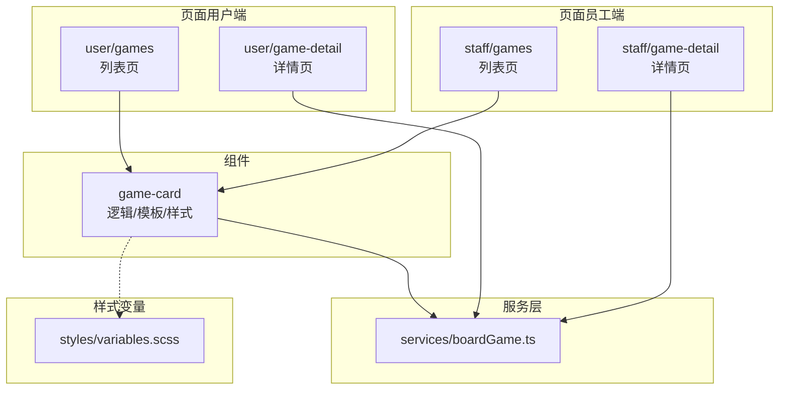
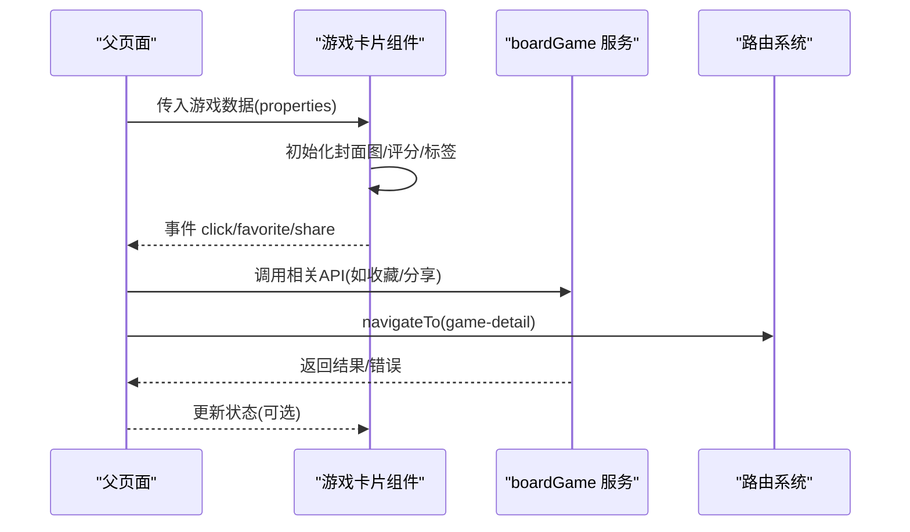
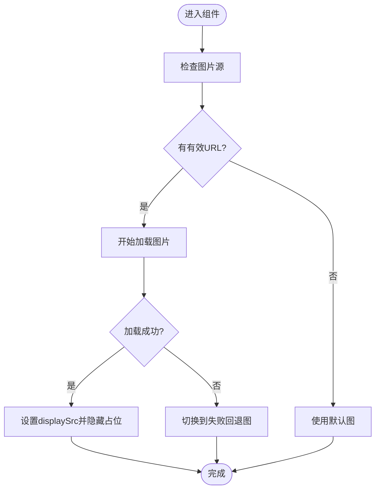
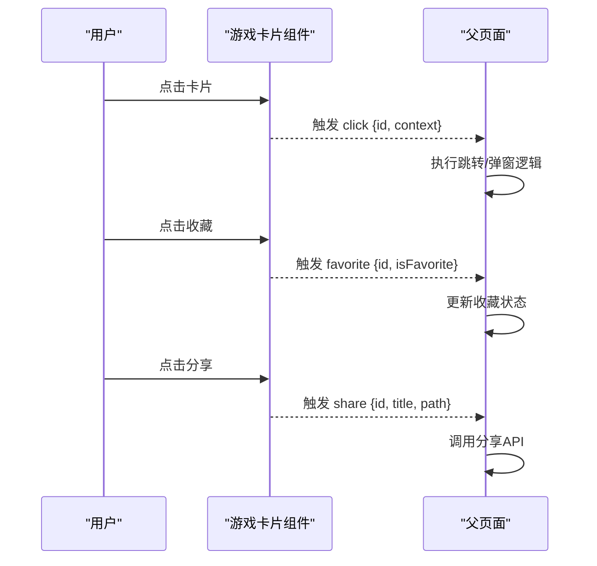
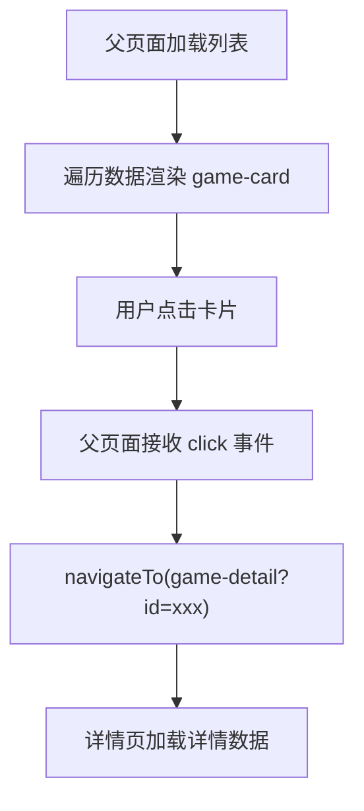
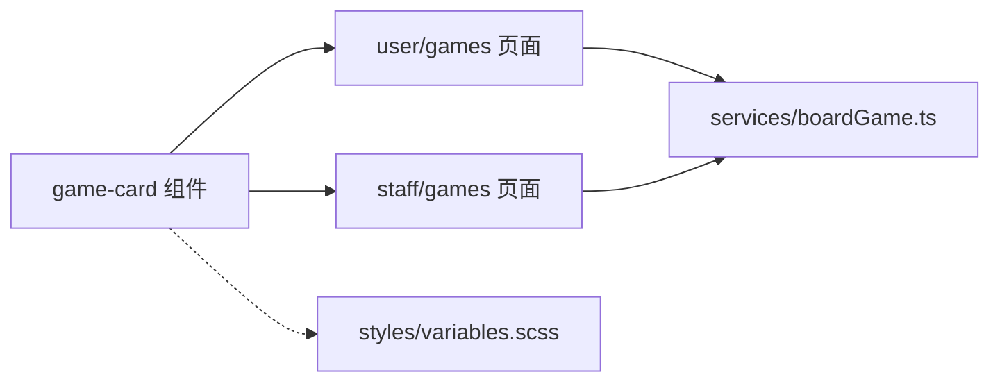

# 游戏卡片组件

<cite>
**本文引用的文件**   
- [game-card.ts](file://miniprogram/components/game-card/game-card.ts)
- [game-card.wxml](file://miniprogram/components/game-card/game-card.wxml)
- [game-card.scss](file://miniprogram/components/game-card/game-card.scss)
- [game-card.json](file://miniprogram/components/game-card/game-card.json)
- [games.ts（用户端）](file://miniprogram/pages/user/games/games.ts)
- [games.wxml（用户端）](file://miniprogram/pages/user/games/games.wxml)
- [games.ts（员工端）](file://miniprogram/pages/staff/games/games.ts)
- [games.wxml（员工端）](file://miniprogram/pages/staff/games/games.wxml)
- [boardGame.ts](file://miniprogram/services/boardGame.ts)
- [variables.scss](file://miniprogram/styles/variables.scss)
</cite>

## 目录
1. [简介](#简介)
2. [项目结构](#项目结构)
3. [核心组件](#核心组件)
4. [架构总览](#架构总览)
5. [详细组件分析](#详细组件分析)
6. [依赖分析](#依赖分析)
7. [性能考虑](#性能考虑)
8. [故障排查指南](#故障排查指南)
9. [结论](#结论)
10. [附录](#附录)

## 简介
本文件面向“游戏卡片组件”的使用与实现，覆盖数据绑定、图片处理、布局设计、属性接口、交互事件、尺寸样式示例、网格展示与详情跳转、懒加载与错误处理、性能优化、自定义样式覆盖与响应式适配等主题。文档以仓库中的实际代码为依据，提供可追溯的来源标注与可视化图示，帮助开发者快速上手并高质量集成该组件。

## 项目结构
游戏卡片组件位于 miniprogram/components/game-card 目录下，包含 TypeScript 逻辑、WXML 模板、SCSS 样式与组件注册 JSON。组件在用户端与员工端的“游戏列表”页面中被复用，用于展示游戏封面、名称、价格、评分与标签等信息，并支持点击跳转详情页、收藏与分享等交互。

图表来源 
- [game-card.ts](file://miniprogram/components/game-card/game-card.ts)
- [game-card.wxml](file://miniprogram/components/game-card/game-card.wxml)
- [game-card.scss](file://miniprogram/components/game-card/game-card.scss)
- [games.ts（用户端）](file://miniprogram/pages/user/games/games.ts)
- [games.wxml（用户端）](file://miniprogram/pages/user/games/games.wxml)
- [games.ts（员工端）](file://miniprogram/pages/staff/games/games.ts)
- [games.wxml（员工端）](file://miniprogram/pages/staff/games/games.wxml)
- [boardGame.ts](file://miniprogram/services/boardGame.ts)
- [variables.scss](file://miniprogram/styles/variables.scss)

章节来源
- [game-card.json](file://miniprogram/components/game-card/game-card.json)
- [game-card.ts](file://miniprogram/components/game-card/game-card.ts)
- [game-card.wxml](file://miniprogram/components/game-card/game-card.wxml)
- [game-card.scss](file://miniprogram/components/game-card/game-card.scss)

## 核心组件
- 组件职责：渲染单个游戏的卡片视图，包括封面图、标题、价格、评分、标签等；承载点击、收藏、分享等交互；对外暴露属性与事件，供父页面进行数据绑定与行为控制。
- 关键能力：
  - 数据绑定：通过 properties 接收游戏信息，内部状态管理封面图占位、加载状态、收藏状态等。
  - 图片处理：支持默认图、失败回退图、懒加载策略与尺寸适配。
  - 布局设计：基于 SCSS 的弹性布局与栅格化展示，适配不同屏幕宽度。
  - 交互事件：点击卡片、收藏切换、分享回调，统一通过 triggerEvent 上报给父页面。
  - 样式覆盖：通过 class 与 CSS 变量，允许外部覆盖颜色、圆角、阴影等视觉表现。

章节来源
- [game-card.ts](file://miniprogram/components/game-card/game-card.ts)
- [game-card.wxml](file://miniprogram/components/game-card/game-card.wxml)
- [game-card.scss](file://miniprogram/components/game-card/game-card.scss)

## 架构总览
组件与页面、服务层的协作关系如下：页面负责拉取游戏列表数据并传入组件；组件渲染并触发事件；页面根据事件类型执行导航或业务逻辑；服务层提供统一的 API 封装。

图表来源 
- [game-card.ts](file://miniprogram/components/game-card/game-card.ts)
- [games.ts（用户端）](file://miniprogram/pages/user/games/games.ts)
- [games.ts（员工端）](file://miniprogram/pages/staff/games/games.ts)
- [boardGame.ts](file://miniprogram/services/boardGame.ts)

## 详细组件分析

### 组件属性接口（properties）
- 游戏名称：字符串，用于显示卡片标题。
- 封面图片：字符串或对象，支持 URL、本地路径或含宽高信息的对象；组件内部解析为图片源与占位策略。
- 价格信息：数字或格式化后的字符串，支持货币符号与精度控制。
- 评分显示：数值或星级对象，支持小数与四舍五入规则。
- 标签管理：数组或字符串，支持多标签展示与截断策略。
- 其他扩展字段：如是否已收藏、是否上架、活动标识等，由父页面传入并在组件内映射到 UI。

说明：以上属性均通过 properties 声明，并在 data 中维护渲染所需的状态（如 loading、error、displaySrc 等）。

章节来源
- [game-card.ts](file://miniprogram/components/game-card/game-card.ts)
- [game-card.wxml](file://miniprogram/components/game-card/game-card.wxml)

### 数据绑定机制
- 单向绑定：父页面通过 properties 将数据传递给组件，组件内部仅做展示与状态计算。
- 双向联动：对于需要用户修改的属性（如收藏状态），组件通过事件上报，父页面更新数据后重新传入，保证一致性。
- 计算属性：评分、价格格式化、标签拼接等在组件内完成，避免重复逻辑。

章节来源
- [game-card.ts](file://miniprogram/components/game-card/game-card.ts)
- [game-card.wxml](file://miniprogram/components/game-card/game-card.wxml)

### 图片处理与懒加载
- 默认图与失败回退：当图片加载失败时自动切换到默认图或占位图，提升用户体验。
- 懒加载：结合小程序的图片懒加载能力，仅在可见区域加载，减少首屏压力。
- 尺寸适配：根据容器宽高动态计算最佳尺寸，避免拉伸变形。
- 缓存策略：利用小程序图片缓存机制，减少重复请求。

图表来源 
- [game-card.ts](file://miniprogram/components/game-card/game-card.ts)
- [game-card.wxml](file://miniprogram/components/game-card/game-card.wxml)

章节来源
- [game-card.ts](file://miniprogram/components/game-card/game-card.ts)
- [game-card.wxml](file://miniprogram/components/game-card/game-card.wxml)

### 布局设计与尺寸样式
- 基础布局：采用弹性布局，封面图与内容区左右排列，标题、价格、评分、标签自上而下堆叠。
- 尺寸变体：提供小、中、大三种尺寸，通过 class 或属性切换，适用于列表、推荐位、首页横幅等场景。
- 栅格适配：在网格布局中，卡片宽度随列数变化，行高与间距保持一致。
- 响应式：依据屏幕宽度与设备像素比调整字体大小、间距与图片比例。

章节来源
- [game-card.scss](file://miniprogram/components/game-card/game-card.scss)
- [variables.scss](file://miniprogram/styles/variables.scss)

### 交互事件（click、favorite、share）
- 点击事件：触发后向父页面发送 click 事件，携带游戏 ID 与必要上下文，父页面执行跳转详情页或弹窗操作。
- 收藏事件：切换收藏状态，上报 favorite 事件，父页面更新本地状态与服务端同步。
- 分享事件：触发 share 事件，父页面调用分享 API 或打开分享面板。

图表来源 
- [game-card.ts](file://miniprogram/components/game-card/game-card.ts)
- [games.ts（用户端）](file://miniprogram/pages/user/games/games.ts)
- [games.ts（员工端）](file://miniprogram/pages/staff/games/games.ts)

章节来源
- [game-card.ts](file://miniprogram/components/game-card/game-card.ts)
- [games.wxml（用户端）](file://miniprogram/pages/user/games/games.wxml)
- [games.wxml（员工端）](file://miniprogram/pages/staff/games/games.wxml)

### 网格布局中的卡片展示与详情跳转
- 网格展示：父页面使用 flex/grid 布局循环渲染多个 game-card，每行固定列数，卡片自适应宽度。
- 详情跳转：点击卡片后，父页面根据游戏 ID 调用 navigateTo 跳转到对应详情页，并传递必要参数。
- 数据流：父页面从 boardGame 服务获取列表数据，过滤/排序后传入组件；组件仅负责展示与事件上报。

图表来源 
- [games.ts（用户端）](file://miniprogram/pages/user/games/games.ts)
- [games.wxml（用户端）](file://miniprogram/pages/user/games/games.wxml)
- [games.ts（员工端）](file://miniprogram/pages/staff/games/games.ts)
- [games.wxml（员工端）](file://miniprogram/pages/staff/games/games.wxml)

章节来源
- [games.ts（用户端）](file://miniprogram/pages/user/games/games.ts)
- [games.wxml（用户端）](file://miniprogram/pages/user/games/games.wxml)
- [games.ts（员工端）](file://miniprogram/pages/staff/games/games.ts)
- [games.wxml（员工端）](file://miniprogram/pages/staff/games/games.wxml)

### 错误处理与健壮性
- 图片异常：捕获加载失败，切换到默认图或占位图，避免空白。
- 数据缺失：对空值进行兜底处理，如默认标题、默认评分、默认价格格式。
- 网络错误：父页面在服务层统一处理错误提示与重试策略，组件侧不直接处理网络逻辑。

章节来源
- [game-card.ts](file://miniprogram/components/game-card/game-card.ts)
- [boardGame.ts](file://miniprogram/services/boardGame.ts)

### 自定义样式覆盖与响应式适配
- 样式覆盖：通过 class 命名空间与 CSS 变量，允许外部覆盖主色、圆角、阴影、字体大小等。
- 响应式：基于媒体查询与相对单位，适配不同屏幕尺寸与设备密度。
- 主题切换：通过全局变量注入主题色，组件自动适配。

章节来源
- [game-card.scss](file://miniprogram/components/game-card/game-card.scss)
- [variables.scss](file://miniprogram/styles/variables.scss)

## 依赖分析
- 组件与页面：组件被用户端与员工端的“游戏列表”页面复用，父页面负责数据源与事件处理。
- 组件与服务：组件不直接依赖服务层，但父页面通过 services/boardGame.ts 获取数据，确保数据一致性与可测试性。
- 样式依赖：组件样式引用全局变量，便于主题统一管理。

图表来源 
- [game-card.ts](file://miniprogram/components/game-card/game-card.ts)
- [games.ts（用户端）](file://miniprogram/pages/user/games/games.ts)
- [games.ts（员工端）](file://miniprogram/pages/staff/games/games.ts)
- [boardGame.ts](file://miniprogram/services/boardGame.ts)
- [variables.scss](file://miniprogram/styles/variables.scss)

章节来源
- [game-card.json](file://miniprogram/components/game-card/game-card.json)
- [game-card.ts](file://miniprogram/components/game-card/game-card.ts)
- [games.ts（用户端）](file://miniprogram/pages/user/games/games.ts)
- [games.ts（员工端）](file://miniprogram/pages/staff/games/games.ts)
- [boardGame.ts](file://miniprogram/services/boardGame.ts)
- [variables.scss](file://miniprogram/styles/variables.scss)

## 性能考虑
- 图片懒加载：仅在可视区域加载，降低首屏资源体积与请求数。
- 占位图与骨架屏：在图片加载期间显示占位图，提升感知速度。
- 事件节流：对频繁触发的交互（如收藏切换）进行节流，避免重复请求。
- 数据最小化：只传递必要字段，减少序列化与传输开销。
- 样式优化：使用 CSS 变量与模块化样式，减少重复定义与重排重绘。

[本节为通用指导，无需特定文件来源]

## 故障排查指南
- 图片不显示：
  - 检查图片 URL 是否有效、跨域配置是否正确。
  - 确认 fallback 逻辑是否生效，查看控制台是否有加载失败日志。
- 评分/价格显示异常：
  - 校验传入数据类型与格式，确保组件内部格式化函数能正确处理边界值。
- 事件未触发：
  - 检查父页面是否正确监听组件事件，并确保事件名与参数一致。
- 样式错乱：
  - 确认 class 命名空间未被覆盖，CSS 变量是否正确注入。

章节来源
- [game-card.ts](file://miniprogram/components/game-card/game-card.ts)
- [game-card.wxml](file://miniprogram/components/game-card/game-card.wxml)
- [game-card.scss](file://miniprogram/components/game-card/game-card.scss)

## 结论
游戏卡片组件以清晰的数据绑定、稳健的图片处理与灵活的布局设计为核心，配合标准化的事件接口，能够在多种页面场景中高效复用。通过懒加载、错误回退与样式变量，组件在性能与可定制性之间取得良好平衡。建议在实际使用中遵循本文档的属性与事件约定，并结合业务需求进行适度扩展。

[本节为总结性内容，无需特定文件来源]

## 附录
- 使用示例（概念性）：
  - 网格布局：在父页面中使用循环渲染多个 game-card，设置列数为 2 或 3，卡片宽度自适应。
  - 详情跳转：点击卡片后，父页面调用 navigateTo 并传递游戏 ID。
  - 收藏与分享：监听 favorite 与 share 事件，分别更新收藏状态与调用分享 API。
- 最佳实践：
  - 始终提供默认图与失败回退图。
  - 对评分与价格进行统一格式化。
  - 使用 CSS 变量管理主题，便于后续扩展。

[本节为概念性内容，无需特定文件来源]