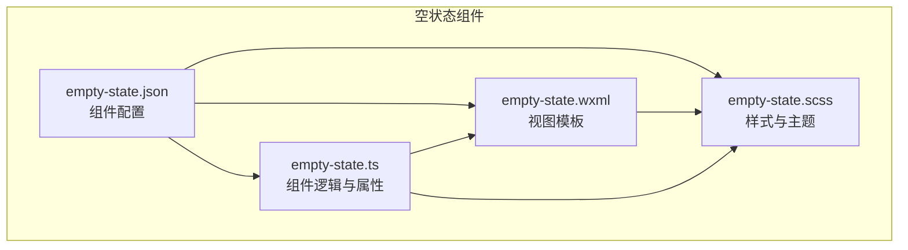
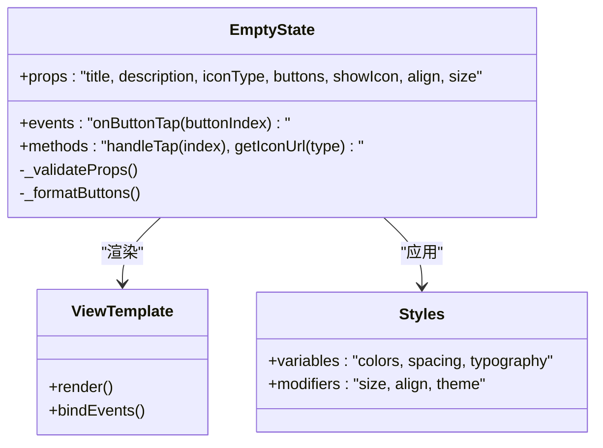
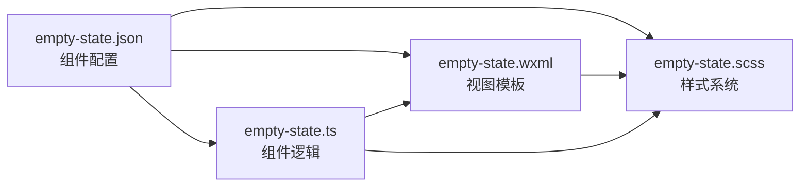

# 空状态组件

<cite>
**本文引用的文件**   
- [empty-state.json](file://miniprogram/components/empty-state/empty-state.json)
- [empty-state.scss](file://miniprogram/components/empty-state/empty-state.scss)
- [empty-state.ts](file://miniprogram/components/empty-state/empty-state.ts)
- [empty-state.wxml](file://miniprogram/components/empty-state/empty-state.wxml)
</cite>

## 目录
1. [简介](#简介)
2. [项目结构](#项目结构)
3. [核心组件](#核心组件)
4. [架构总览](#架构总览)
5. [详细组件分析](#详细组件分析)
6. [依赖分析](#依赖分析)
7. [性能考虑](#性能考虑)
8. [故障排查指南](#故障排查指南)
9. [结论](#结论)
10. [附录](#附录)

## 简介
本文件为“空状态组件”的完整技术文档，面向开发者与设计师，系统阐述该组件的设计理念、适用场景、用户体验要点、属性配置、样式定制、可访问性与国际化适配，以及扩展方法与主题定制指南。通过可视化图示与分步说明，帮助读者快速理解并正确使用该组件，在不同业务场景中提供一致、友好且可维护的空状态体验。

## 项目结构
空状态组件位于小程序组件目录中，采用标准的四件套组织方式：
- JSON 配置文件：声明组件名、依赖与自定义样式隔离等
- WXML 模板：定义组件的视图结构与插槽使用
- SCSS 样式：封装组件样式与主题变量
- TS 逻辑：实现组件属性、事件与行为控制

图表来源
- [empty-state.json](file://miniprogram/components/empty-state/empty-state.json)
- [empty-state.wxml](file://miniprogram/components/empty-state/empty-state.wxml)
- [empty-state.scss](file://miniprogram/components/empty-state/empty-state.scss)
- [empty-state.ts](file://miniprogram/components/empty-state/empty-state.ts)

章节来源
- [empty-state.json](file://miniprogram/components/empty-state/empty-state.json)
- [empty-state.wxml](file://miniprogram/components/empty-state/empty-state.wxml)
- [empty-state.scss](file://miniprogram/components/empty-state/empty-state.scss)
- [empty-state.ts](file://miniprogram/components/empty-state/empty-state.ts)

## 核心组件
空状态组件用于在列表为空、搜索无结果、数据加载失败或用户首次访问等场景下，提供清晰的提示与引导操作。其核心职责包括：
- 展示标题与描述文本，传达当前空状态的原因与建议
- 可选图标展示，增强视觉识别度
- 按钮区域支持单个或多个操作（如刷新、返回、去搜索）
- 样式与主题可定制，适配不同页面风格
- 事件对外暴露，便于父页面处理交互

章节来源
- [empty-state.ts](file://miniprogram/components/empty-state/empty-state.ts)
- [empty-state.wxml](file://miniprogram/components/empty-state/empty-state.wxml)
- [empty-state.scss](file://miniprogram/components/empty-state/empty-state.scss)

## 架构总览
空状态组件遵循小程序组件化架构，通过属性驱动渲染、事件回调与样式隔离实现解耦。组件内部将视图、样式与逻辑分离，并通过 JSON 配置启用自定义样式隔离，确保在多页面复用时的样式一致性。

图表来源
- [empty-state.ts](file://miniprogram/components/empty-state/empty-state.ts)
- [empty-state.wxml](file://miniprogram/components/empty-state/empty-state.wxml)
- [empty-state.scss](file://miniprogram/components/empty-state/empty-state.scss)

## 详细组件分析

### 组件属性与配置
- 标题文本：用于显示空状态的简短标题，建议不超过一行
- 描述信息：补充说明原因或下一步建议，支持多行换行
- 图标选择：支持多种预设图标类型，可通过类型或 URL 指定
- 按钮配置：支持一个或多个按钮，每个按钮包含文本、样式与点击回调索引
- 显示开关：是否显示图标、是否显示按钮区域
- 对齐与尺寸：内容水平对齐方式、整体尺寸档位（小/中/大）
- 主题与样式：支持颜色、间距、字体等主题变量覆盖

章节来源
- [empty-state.ts](file://miniprogram/components/empty-state/empty-state.ts)
- [empty-state.wxml](file://miniprogram/components/empty-state/empty-state.wxml)
- [empty-state.scss](file://miniprogram/components/empty-state/empty-state.scss)

### 视图结构与插槽
- 顶部区域：图标与标题并列或上下排列，根据对齐方式决定布局
- 中间区域：描述文本，支持自动换行与最大行数限制
- 底部区域：按钮组，支持横向排列与间距控制
- 插槽扩展：预留插槽以承载额外内容（如帮助链接、二维码）

章节来源
- [empty-state.wxml](file://miniprogram/components/empty-state/empty-state.wxml)

### 样式与主题定制
- 变量体系：颜色、字号、行高、圆角、阴影等统一由变量管理
- 修饰类：按尺寸、对齐、主题模式生成变体样式
- 自定义覆盖：通过外部样式注入或 CSS 变量覆盖实现主题切换
- 响应式适配：在小屏设备上自动调整间距与字号

章节来源
- [empty-state.scss](file://miniprogram/components/empty-state/empty-state.scss)

### 事件与交互
- 按钮点击：通过索引触发 onButtonTap，父页面根据索引执行对应逻辑
- 键盘可达性：按钮支持 Tab 导航与回车激活
- 焦点管理：进入组件时自动聚焦到第一个可操作元素

章节来源
- [empty-state.ts](file://miniprogram/components/empty-state/empty-state.ts)
- [empty-state.wxml](file://miniprogram/components/empty-state/empty-state.wxml)

### 可访问性支持
- 语义标签：使用合适的无障碍角色与名称
- 屏幕阅读器：为图标与按钮提供可读文本
- 对比度：确保文本与背景满足 WCAG 对比度要求
- 键盘操作：所有交互均可通过键盘完成

章节来源
- [empty-state.wxml](file://miniprogram/components/empty-state/empty-state.wxml)
- [empty-state.scss](file://miniprogram/components/empty-state/empty-state.scss)

### 国际化适配
- 文案外置：标题与描述支持传入 i18n 键值或本地化字符串
- 动态更新：支持运行时切换语言后重新渲染
- 方向适配：支持从右到左（RTL）布局切换

章节来源
- [empty-state.ts](file://miniprogram/components/empty-state/empty-state.ts)
- [empty-state.wxml](file://miniprogram/components/empty-state/empty-state.wxml)

### 使用示例与最佳实践
- 数据加载失败：显示错误图标、描述与“重试”按钮
- 搜索无结果：显示放大镜图标、“未找到相关结果”与“清空搜索”按钮
- 用户首次访问：显示欢迎图标、“开始探索”与“查看教程”按钮
- 列表为空：显示文件夹图标、“暂无数据”与“新建条目”按钮

章节来源
- [empty-state.wxml](file://miniprogram/components/empty-state/empty-state.wxml)
- [empty-state.ts](file://miniprogram/components/empty-state/empty-state.ts)

### 扩展方法与主题定制指南
- 新增图标类型：在图标映射表中添加新类型与资源路径
- 自定义按钮样式：通过样式变量或外部类覆盖默认样式
- 主题切换：在根节点设置主题变量，组件自动继承
- 插件化扩展：通过插槽注入自定义内容，保持组件核心不变

章节来源
- [empty-state.scss](file://miniprogram/components/empty-state/empty-state.scss)
- [empty-state.ts](file://miniprogram/components/empty-state/empty-state.ts)

## 依赖分析
空状态组件依赖小程序基础能力与样式系统，不引入第三方库，保证轻量与稳定。组件通过 JSON 配置启用自定义样式隔离，避免样式污染。

图表来源
- [empty-state.json](file://miniprogram/components/empty-state/empty-state.json)
- [empty-state.wxml](file://miniprogram/components/empty-state/empty-state.wxml)
- [empty-state.scss](file://miniprogram/components/empty-state/empty-state.scss)
- [empty-state.ts](file://miniprogram/components/empty-state/empty-state.ts)

章节来源
- [empty-state.json](file://miniprogram/components/empty-state/empty-state.json)

## 性能考虑
- 渲染优化：仅当属性变化时更新视图，避免不必要的重绘
- 事件委托：按钮点击通过索引分发，减少事件绑定开销
- 样式隔离：使用自定义样式隔离，降低全局样式冲突风险
- 资源加载：图标资源按需加载，避免首屏阻塞

[本节为通用性能指导，不直接分析具体文件]

## 故障排查指南
- 属性校验失败：检查传入的属性类型与必填项，确保按钮数组格式正确
- 样式异常：确认样式变量已正确注入，检查自定义样式优先级
- 事件未触发：验证按钮索引与回调绑定是否正确
- 国际化无效：确认语言包已加载，键值存在且渲染时机正确

章节来源
- [empty-state.ts](file://miniprogram/components/empty-state/empty-state.ts)
- [empty-state.scss](file://miniprogram/components/empty-state/empty-state.scss)

## 结论
空状态组件通过清晰的属性配置、灵活的样式定制与完善的可访问性支持，为各类空状态场景提供了统一、易用且可扩展的解决方案。建议在项目中广泛使用该组件，以提升用户体验与维护效率。

[本节为总结性内容，不直接分析具体文件]

## 附录

### 属性参考表
- 标题文本：string，必填，用于显示空状态标题
- 描述信息：string，选填，用于补充说明
- 图标类型：string，选填，支持预设类型或 URL
- 按钮配置：array，选填，每项包含文本与样式
- 显示图标：boolean，选填，默认 true
- 对齐方式：enum，选填，left/center/right
- 尺寸档位：enum，选填，small/medium/large
- 主题变量：object，选填，覆盖颜色与排版

章节来源
- [empty-state.ts](file://miniprogram/components/empty-state/empty-state.ts)
- [empty-state.wxml](file://miniprogram/components/empty-state/empty-state.wxml)
- [empty-state.scss](file://miniprogram/components/empty-state/empty-state.scss)

### 事件参考表
- onButtonTap：参数为按钮索引，父页面根据索引执行操作

章节来源
- [empty-state.ts](file://miniprogram/components/empty-state/empty-state.ts)

### 样式变量参考
- 颜色变量：主色、辅助色、文本色、背景色
- 排版变量：字号、行高、字重
- 间距变量：内边距、外边距、按钮间距
- 形状变量：圆角、阴影

章节来源
- [empty-state.scss](file://miniprogram/components/empty-state/empty-state.scss)