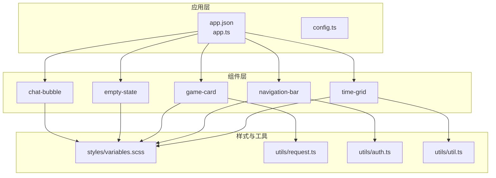
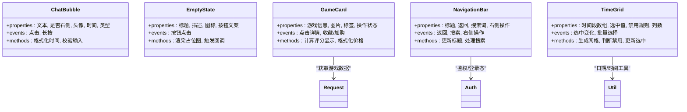
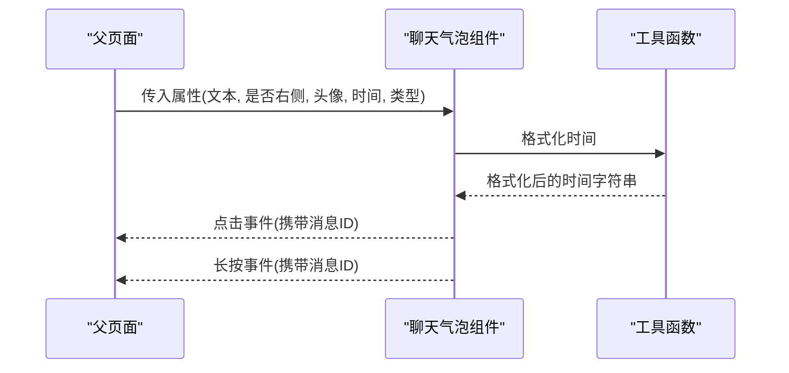
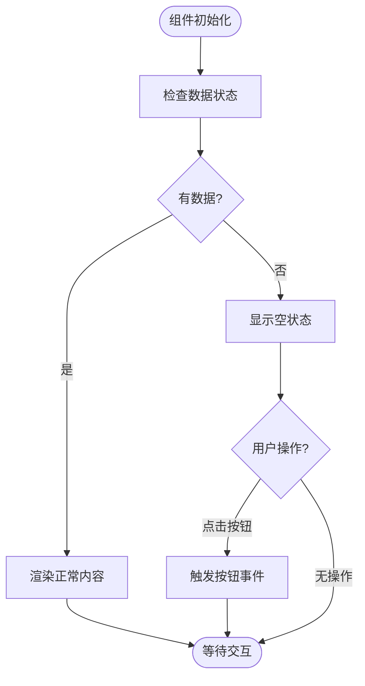
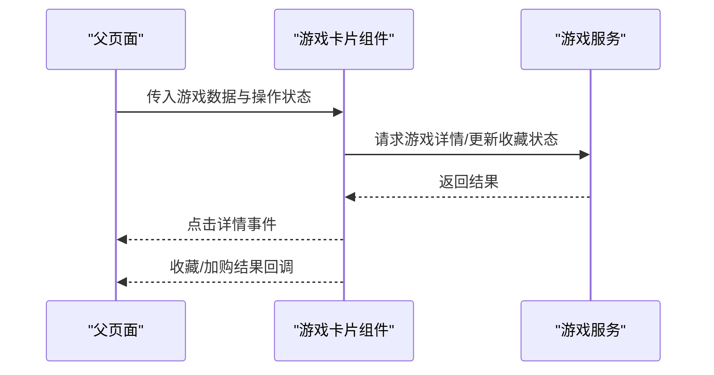
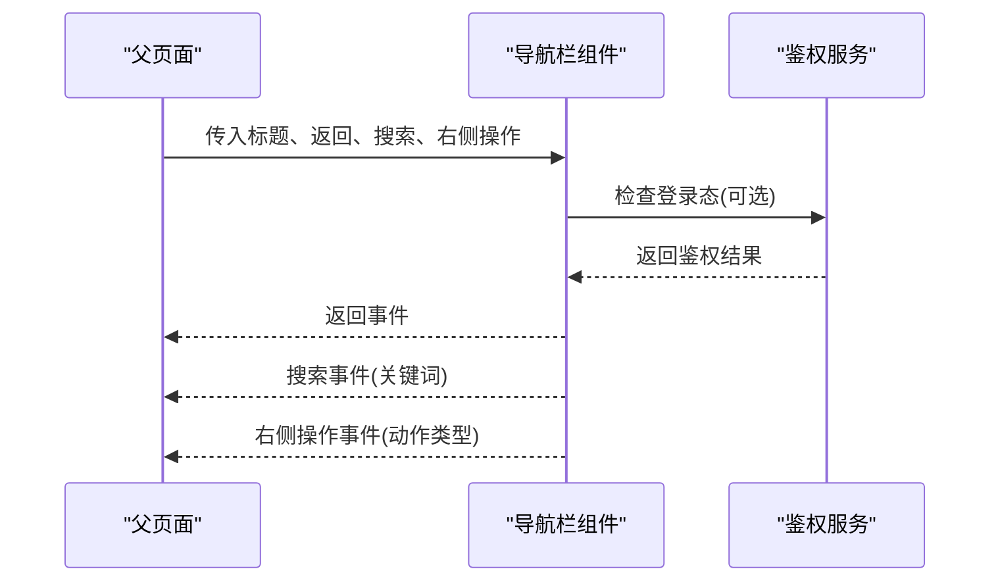
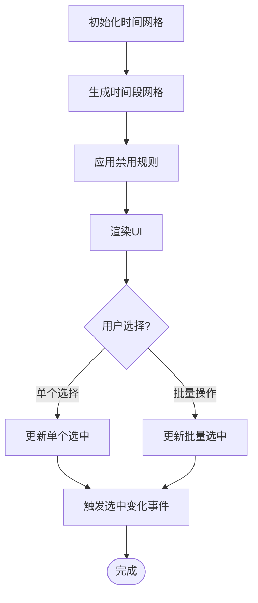
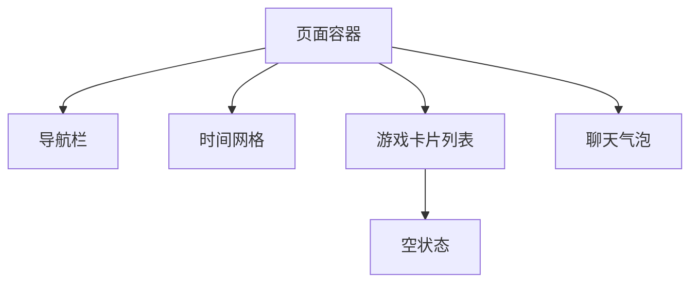
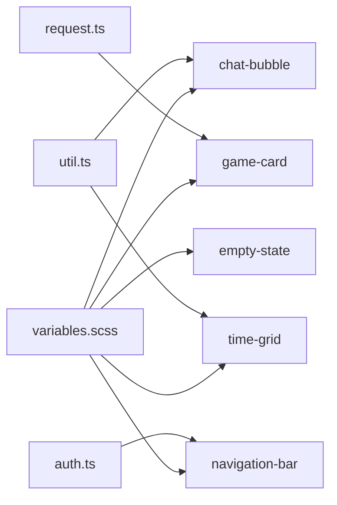

# 组件系统

<cite>
**本文引用的文件**   
- [app.json](file://miniprogram/app.json)
- [config.ts](file://miniprogram/config.ts)
- [chat-bubble.ts](file://miniprogram/components/chat-bubble/chat-bubble.ts)
- [chat-bubble.wxml](file://miniprogram/components/chat-bubble/chat-bubble.wxml)
- [chat-bubble.scss](file://miniprogram/components/chat-bubble/chat-bubble.scss)
- [empty-state.ts](file://miniprogram/components/empty-state/empty-state.ts)
- [empty-state.wxml](file://miniprogram/components/empty-state/empty-state.wxml)
- [empty-state.scss](file://miniprogram/components/empty-state/empty-state.scss)
- [game-card.ts](file://miniprogram/components/game-card/game-card.ts)
- [game-card.wxml](file://miniprogram/components/game-card/game-card.wxml)
- [game-card.scss](file://miniprogram/components/game-card/game-card.scss)
- [navigation-bar.ts](file://miniprogram/components/navigation-bar/navigation-bar.ts)
- [navigation-bar.wxml](file://miniprogram/components/navigation-bar/navigation-bar.wxml)
- [navigation-bar.scss](file://miniprogram/components/navigation-bar/navigation-bar.scss)
- [time-grid.ts](file://miniprogram/components/time-grid/time-grid.ts)
- [time-grid.wxml](file://miniprogram/components/time-grid/time-grid.wxml)
- [time-grid.scss](file://miniprogram/components/time-grid/time-grid.scss)
- [variables.scss](file://miniprogram/styles/variables.scss)
- [request.ts](file://miniprogram/utils/request.ts)
- [auth.ts](file://miniprogram/utils/auth.ts)
- [util.ts](file://miniprogram/utils/util.ts)
</cite>

## 目录
1. [简介](#简介)
2. [项目结构](#项目结构)
3. [核心组件](#核心组件)
4. [架构总览](#架构总览)
5. [详细组件分析](#详细组件分析)
6. [依赖关系分析](#依赖关系分析)
7. [性能考虑](#性能考虑)
8. [故障排查指南](#故障排查指南)
9. [结论](#结论)
10. [附录](#附录)

## 简介
本文件面向小程序“组件系统”的完整文档，聚焦可复用组件的设计原则、架构模式与开发规范。围绕聊天气泡、空状态、游戏卡片、导航栏、时间网格五个通用组件，系统性说明其功能特性、属性接口、事件处理、样式定制选项，并提供使用示例、组合模式与最佳实践。同时给出组件测试策略与性能优化建议，帮助团队在统一规范下高效构建一致的用户体验。

## 项目结构
组件系统位于 miniprogram/components 目录下，每个组件包含独立的 JSON、TS、WXML、SCSS 文件，遵循“按功能划分”的组织方式。全局样式变量集中在 styles/variables.scss，工具函数集中于 utils/*，应用配置与入口在 app.json、config.ts、app.ts 等文件中。

图表来源
- [app.json](file://miniprogram/app.json)
- [config.ts](file://miniprogram/config.ts)
- [chat-bubble.ts](file://miniprogram/components/chat-bubble/chat-bubble.ts)
- [empty-state.ts](file://miniprogram/components/empty-state/empty-state.ts)
- [game-card.ts](file://miniprogram/components/game-card/game-card.ts)
- [navigation-bar.ts](file://miniprogram/components/navigation-bar/navigation-bar.ts)
- [time-grid.ts](file://miniprogram/components/time-grid/time-grid.ts)
- [variables.scss](file://miniprogram/styles/variables.scss)
- [request.ts](file://miniprogram/utils/request.ts)
- [auth.ts](file://miniprogram/utils/auth.ts)
- [util.ts](file://miniprogram/utils/util.ts)

章节来源
- [app.json](file://miniprogram/app.json)
- [config.ts](file://miniprogram/config.ts)

## 核心组件
本节概述各组件的职责边界、输入输出与交互约定，便于快速定位与集成。

- 聊天气泡（chat-bubble）
  - 职责：展示单条或列表式对话气泡，支持左右对齐、头像、时间戳、消息类型区分。
  - 输入：文本内容、是否右侧发送、头像地址、时间、消息类型等。
  - 输出：点击事件（如复制、转发）、长按菜单回调。
  - 样式：通过 SCSS 变量控制颜色、圆角、间距；支持主题切换。

- 空状态（empty-state）
  - 职责：无数据或加载失败时的占位提示，提供引导操作按钮。
  - 输入：标题、描述文案、图标、按钮文案、是否显示重试。
  - 输出：按钮点击事件（如刷新、返回）。
  - 样式：居中布局、图标尺寸、文案字号可通过变量覆盖。

- 游戏卡片（game-card）
  - 职责：展示游戏封面、名称、标签、价格、评分等关键信息，支持点击跳转详情。
  - 输入：游戏基础信息、图片资源、标签数组、操作按钮状态。
  - 输出：点击事件（进入详情）、收藏/加购等动作回调。
  - 样式：卡片阴影、圆角、图片比例、标签样式由变量控制。

- 导航栏（navigation-bar）
  - 职责：统一页面头部导航，支持标题、返回、搜索、自定义插槽。
  - 输入：标题、是否显示返回、搜索词、右侧操作项。
  - 输出：返回、搜索、右侧操作事件。
  - 样式：高度、背景色、字体颜色、阴影可通过变量覆盖。

- 时间网格（time-grid）
  - 职责：以网格形式展示时间段，支持选中、禁用、批量选择。
  - 输入：时间段数组、当前选中值、禁用规则、列数。
  - 输出：选中变化事件、批量选择结果。
  - 样式：单元格尺寸、选中态、禁用态样式由变量控制。

章节来源
- [chat-bubble.ts](file://miniprogram/components/chat-bubble/chat-bubble.ts)
- [chat-bubble.wxml](file://miniprogram/components/chat-bubble/chat-bubble.wxml)
- [chat-bubble.scss](file://miniprogram/components/chat-bubble/chat-bubble.scss)
- [empty-state.ts](file://miniprogram/components/empty-state/empty-state.ts)
- [empty-state.wxml](file://miniprogram/components/empty-state/empty-state.wxml)
- [empty-state.scss](file://miniprogram/components/empty-state/empty-state.scss)
- [game-card.ts](file://miniprogram/components/game-card/game-card.ts)
- [game-card.wxml](file://miniprogram/components/game-card/game-card.wxml)
- [game-card.scss](file://miniprogram/components/game-card/game-card.scss)
- [navigation-bar.ts](file://miniprogram/components/navigation-bar/navigation-bar.ts)
- [navigation-bar.wxml](file://miniprogram/components/navigation-bar/navigation-bar.wxml)
- [navigation-bar.scss](file://miniprogram/components/navigation-bar/navigation-bar.scss)
- [time-grid.ts](file://miniprogram/components/time-grid/time-grid.ts)
- [time-grid.wxml](file://miniprogram/components/time-grid/time-grid.wxml)
- [time-grid.scss](file://miniprogram/components/time-grid/time-grid.scss)

## 架构总览
组件系统采用“低耦合、高内聚”的模块化设计：
- 组件内部自包含 WXML/TS/SCSS，通过 properties/events 与父页面通信。
- 样式通过全局变量集中管理，确保视觉一致性。
- 业务逻辑下沉至 services/utils，组件仅暴露必要接口。
- 路由与导航由 navigation-bar 统一封装，减少重复代码。

图表来源
- [chat-bubble.ts](file://miniprogram/components/chat-bubble/chat-bubble.ts)
- [empty-state.ts](file://miniprogram/components/empty-state/empty-state.ts)
- [game-card.ts](file://miniprogram/components/game-card/game-card.ts)
- [navigation-bar.ts](file://miniprogram/components/navigation-bar/navigation-bar.ts)
- [time-grid.ts](file://miniprogram/components/time-grid/time-grid.ts)
- [request.ts](file://miniprogram/utils/request.ts)
- [auth.ts](file://miniprogram/utils/auth.ts)
- [util.ts](file://miniprogram/utils/util.ts)

## 详细组件分析

### 聊天气泡（chat-bubble）
- 功能特性
  - 支持左右对齐、头像、时间戳、消息类型（文本/图片/链接等）。
  - 提供点击与长按事件，便于扩展复制、转发、删除等操作。
- 属性接口
  - 文本内容、是否右侧发送、头像地址、时间、消息类型、是否显示时间。
- 事件处理
  - 点击事件：用于打开详情或执行快捷操作。
  - 长按事件：弹出上下文菜单。
- 样式定制
  - 通过 SCSS 变量控制气泡颜色、圆角、间距、头像尺寸。
  - 支持明暗主题切换。

图表来源
- [chat-bubble.ts](file://miniprogram/components/chat-bubble/chat-bubble.ts)
- [chat-bubble.wxml](file://miniprogram/components/chat-bubble/chat-bubble.wxml)
- [chat-bubble.scss](file://miniprogram/components/chat-bubble/chat-bubble.scss)
- [util.ts](file://miniprogram/utils/util.ts)

章节来源
- [chat-bubble.ts](file://miniprogram/components/chat-bubble/chat-bubble.ts)
- [chat-bubble.wxml](file://miniprogram/components/chat-bubble/chat-bubble.wxml)
- [chat-bubble.scss](file://miniprogram/components/chat-bubble/chat-bubble.scss)

### 空状态（empty-state）
- 功能特性
  - 展示无数据或错误状态的占位界面，提供引导按钮。
- 属性接口
  - 标题、描述文案、图标路径、按钮文案、是否显示重试。
- 事件处理
  - 按钮点击：触发刷新或返回上一页。
- 样式定制
  - 通过变量控制图标大小、文案字号、按钮样式。

图表来源
- [empty-state.ts](file://miniprogram/components/empty-state/empty-state.ts)
- [empty-state.wxml](file://miniprogram/components/empty-state/empty-state.wxml)
- [empty-state.scss](file://miniprogram/components/empty-state/empty-state.scss)

章节来源
- [empty-state.ts](file://miniprogram/components/empty-state/empty-state.ts)
- [empty-state.wxml](file://miniprogram/components/empty-state/empty-state.wxml)
- [empty-state.scss](file://miniprogram/components/empty-state/empty-state.scss)

### 游戏卡片（game-card）
- 功能特性
  - 展示游戏封面、名称、标签、价格、评分，支持点击跳转详情。
- 属性接口
  - 游戏基本信息、图片资源、标签数组、操作按钮状态（收藏/加购）。
- 事件处理
  - 点击详情：跳转到详情页。
  - 收藏/加购：调用服务层更新状态并反馈 UI。
- 样式定制
  - 卡片阴影、圆角、图片比例、标签样式由变量控制。

图表来源
- [game-card.ts](file://miniprogram/components/game-card/game-card.ts)
- [game-card.wxml](file://miniprogram/components/game-card/game-card.wxml)
- [game-card.scss](file://miniprogram/components/game-card/game-card.scss)
- [request.ts](file://miniprogram/utils/request.ts)

章节来源
- [game-card.ts](file://miniprogram/components/game-card/game-card.ts)
- [game-card.wxml](file://miniprogram/components/game-card/game-card.wxml)
- [game-card.scss](file://miniprogram/components/game-card/game-card.scss)

### 导航栏（navigation-bar）
- 功能特性
  - 统一页面头部导航，支持标题、返回、搜索、右侧操作。
- 属性接口
  - 标题、是否显示返回、搜索词、右侧操作项数组。
- 事件处理
  - 返回：调用小程序 API 返回上一页。
  - 搜索：触发搜索回调。
  - 右侧操作：根据配置触发不同行为。
- 样式定制
  - 高度、背景色、字体颜色、阴影可通过变量覆盖。

图表来源
- [navigation-bar.ts](file://miniprogram/components/navigation-bar/navigation-bar.ts)
- [navigation-bar.wxml](file://miniprogram/components/navigation-bar/navigation-bar.wxml)
- [navigation-bar.scss](file://miniprogram/components/navigation-bar/navigation-bar.scss)
- [auth.ts](file://miniprogram/utils/auth.ts)

章节来源
- [navigation-bar.ts](file://miniprogram/components/navigation-bar/navigation-bar.ts)
- [navigation-bar.wxml](file://miniprogram/components/navigation-bar/navigation-bar.wxml)
- [navigation-bar.scss](file://miniprogram/components/navigation-bar/navigation-bar.scss)

### 时间网格（time-grid）
- 功能特性
  - 以网格形式展示时间段，支持选中、禁用、批量选择。
- 属性接口
  - 时间段数组、当前选中值、禁用规则、列数。
- 事件处理
  - 选中变化：返回新的选中集合。
  - 批量选择：支持全选/清空。
- 样式定制
  - 单元格尺寸、选中态、禁用态样式由变量控制。

图表来源
- [time-grid.ts](file://miniprogram/components/time-grid/time-grid.ts)
- [time-grid.wxml](file://miniprogram/components/time-grid/time-grid.wxml)
- [time-grid.scss](file://miniprogram/components/time-grid/time-grid.scss)
- [util.ts](file://miniprogram/utils/util.ts)

章节来源
- [time-grid.ts](file://miniprogram/components/time-grid/time-grid.ts)
- [time-grid.wxml](file://miniprogram/components/time-grid/time-grid.wxml)
- [time-grid.scss](file://miniprogram/components/time-grid/time-grid.scss)

### 概念总览
以下为组件间协作的概念流程图，展示典型页面如何组合多个组件形成完整界面。

[此图为概念流程，不直接映射具体源码文件]

## 依赖关系分析
组件对外部依赖主要集中在样式变量、工具函数与服务层：
- 样式变量：所有组件通过 variables.scss 统一管理视觉风格。
- 工具函数：时间格式化、数据处理等逻辑集中在 util.ts。
- 服务层：网络请求与鉴权分别由 request.ts 与 auth.ts 提供。

图表来源
- [variables.scss](file://miniprogram/styles/variables.scss)
- [chat-bubble.ts](file://miniprogram/components/chat-bubble/chat-bubble.ts)
- [empty-state.ts](file://miniprogram/components/empty-state/empty-state.ts)
- [game-card.ts](file://miniprogram/components/game-card/game-card.ts)
- [navigation-bar.ts](file://miniprogram/components/navigation-bar/navigation-bar.ts)
- [time-grid.ts](file://miniprogram/components/time-grid/time-grid.ts)
- [util.ts](file://miniprogram/utils/util.ts)
- [request.ts](file://miniprogram/utils/request.ts)
- [auth.ts](file://miniprogram/utils/auth.ts)

章节来源
- [variables.scss](file://miniprogram/styles/variables.scss)
- [util.ts](file://miniprogram/utils/util.ts)
- [request.ts](file://miniprogram/utils/request.ts)
- [auth.ts](file://miniprogram/utils/auth.ts)

## 性能考虑
- 渲染优化
  - 列表渲染使用虚拟滚动或分页加载，避免一次性渲染大量节点。
  - 图片懒加载与压缩，减少首屏体积。
- 事件优化
  - 防抖/节流处理高频事件（如搜索、滚动）。
  - 事件冒泡最小化，仅在必要时触发父级回调。
- 样式优化
  - 使用 CSS 变量替代硬编码，减少重绘。
  - 避免过度嵌套与复杂选择器。
- 数据流优化
  - 组件内部状态最小化，尽量由父组件驱动。
  - 异步数据缓存与去重，减少重复请求。

[本节为通用指导，无需特定文件引用]

## 故障排查指南
- 常见问题
  - 样式未生效：检查 SCSS 变量是否正确引入，类名是否冲突。
  - 事件未触发：确认 properties/events 定义与绑定是否正确。
  - 数据为空：检查空状态组件是否正确使用，API 返回格式是否符合预期。
- 调试技巧
  - 使用 console.log 输出关键状态变化。
  - 通过开发者工具的 Network 面板检查网络请求。
  - 逐步缩小问题范围，隔离组件与页面逻辑。

章节来源
- [chat-bubble.ts](file://miniprogram/components/chat-bubble/chat-bubble.ts)
- [empty-state.ts](file://miniprogram/components/empty-state/empty-state.ts)
- [game-card.ts](file://miniprogram/components/game-card/game-card.ts)
- [navigation-bar.ts](file://miniprogram/components/navigation-bar/navigation-bar.ts)
- [time-grid.ts](file://miniprogram/components/time-grid/time-grid.ts)

## 结论
本组件系统通过统一的架构与规范，实现了高内聚、低耦合的可复用组件集合。聊天气泡、空状态、游戏卡片、导航栏、时间网格五大组件覆盖了常见 UI 场景，配合全局样式变量与工具函数，确保了视觉一致性与开发效率。建议在后续迭代中持续完善组件文档、单元测试与性能监控，进一步提升系统的可维护性与用户体验。

[本节为总结性内容，无需特定文件引用]

## 附录
- 组件使用示例
  - 在页面中引入组件，并通过 properties 传递数据。
  - 监听 events 回调，处理用户交互。
- 组合模式
  - 将多个组件组合成复杂页面，如导航栏+时间网格+游戏卡片列表。
- 最佳实践
  - 保持组件单一职责，避免过度封装。
  - 使用 TypeScript 严格定义接口，提升可维护性。
  - 编写单元测试，覆盖核心逻辑与边界条件。

[本节为补充说明，无需特定文件引用]