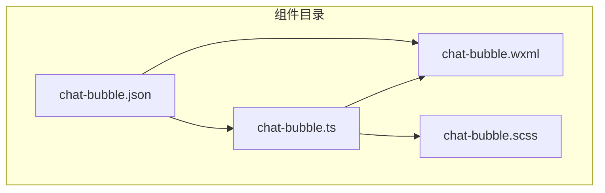
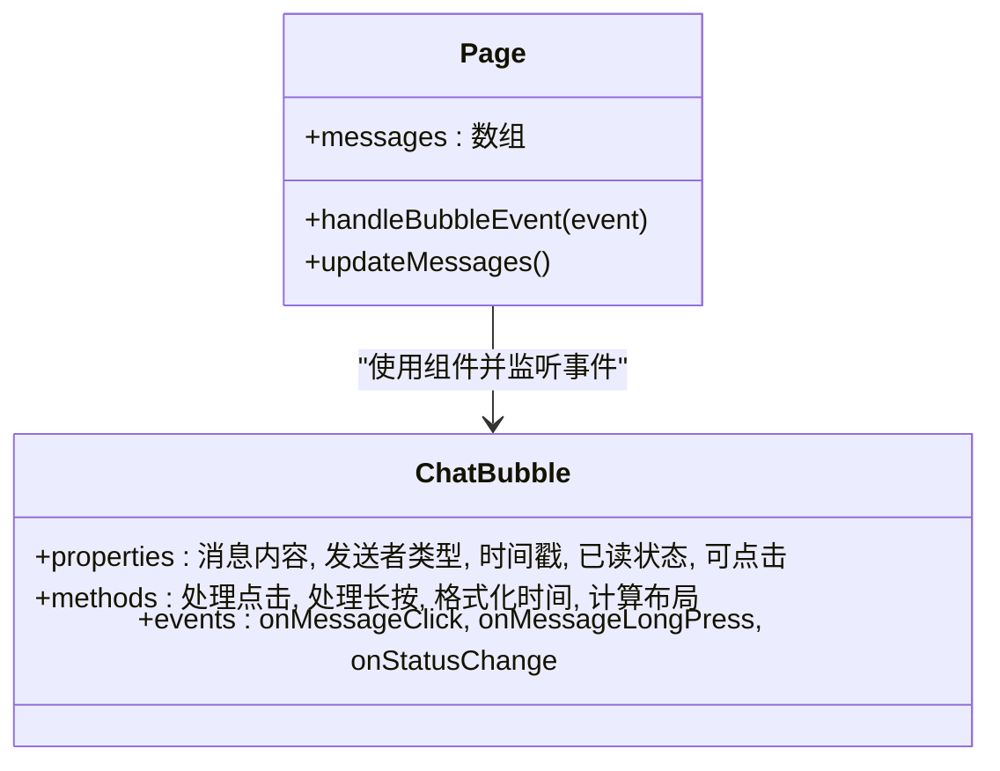
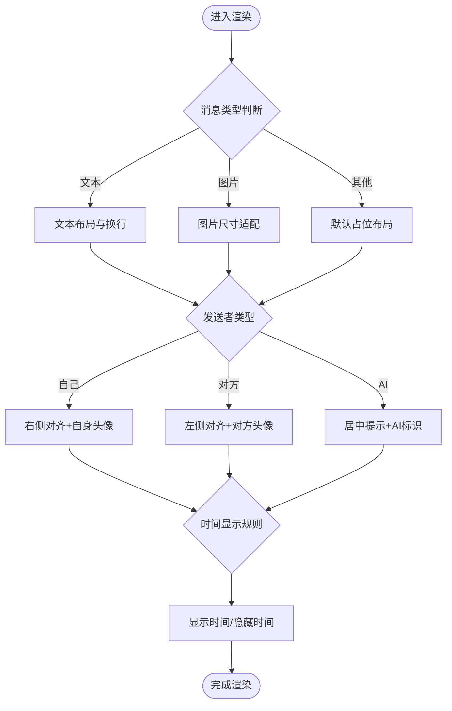
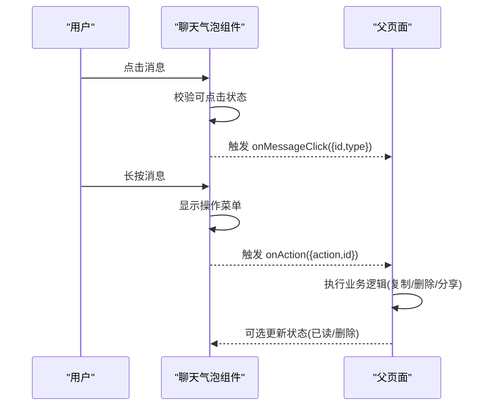
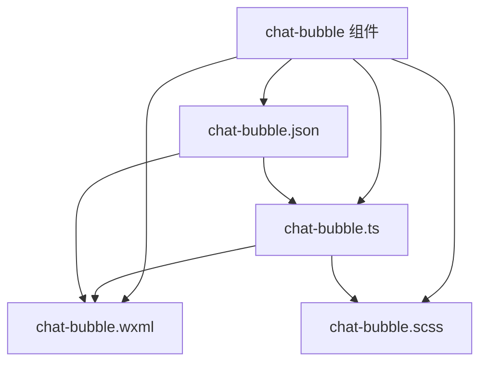

# 聊天气泡组件

<cite>
**本文档引用的文件**   
- [chat-bubble.ts](file://miniprogram/components/chat-bubble/chat-bubble.ts)
- [chat-bubble.wxml](file://miniprogram/components/chat-bubble/chat-bubble.wxml)
- [chat-bubble.scss](file://miniprogram/components/chat-bubble/chat-bubble.scss)
- [chat-bubble.json](file://miniprogram/components/chat-bubble/chat-bubble.json)
</cite>

## 目录
1. [简介](#简介)
2. [项目结构](#项目结构)
3. [核心组件](#核心组件)
4. [架构总览](#架构总览)
5. [详细组件分析](#详细组件分析)
6. [依赖分析](#依赖分析)
7. [性能考虑](#性能考虑)
8. [故障排查指南](#故障排查指南)
9. [结论](#结论)
10. [附录](#附录)

## 简介
本章节面向开发者与产品人员，系统化阐述聊天气泡组件的设计原理、消息显示逻辑与交互行为。文档覆盖属性接口（如消息内容、发送者类型、时间戳等）、事件处理机制、样式定制选项，并提供单条消息显示、消息列表渲染、动态消息更新的使用示例与最佳实践。同时给出响应式设计与性能优化策略，帮助在小程序环境中高效集成与扩展。

## 项目结构
聊天气泡组件位于 miniprogram/components/chat-bubble 目录下，包含以下文件：
- chat-bubble.ts：组件逻辑与数据绑定
- chat-bubble.wxml：组件模板与事件绑定
- chat-bubble.scss：组件样式与主题变量
- chat-bubble.json：组件配置（如 usingComponents）

图表来源
- [chat-bubble.ts](file://miniprogram/components/chat-bubble/chat-bubble.ts)
- [chat-bubble.wxml](file://miniprogram/components/chat-bubble/chat-bubble.wxml)
- [chat-bubble.scss](file://miniprogram/components/chat-bubble/chat-bubble.scss)
- [chat-bubble.json](file://miniprogram/components/chat-bubble/chat-bubble.json)

章节来源
- [chat-bubble.ts](file://miniprogram/components/chat-bubble/chat-bubble.ts)
- [chat-bubble.wxml](file://miniprogram/components/chat-bubble/chat-bubble.wxml)
- [chat-bubble.scss](file://miniprogram/components/chat-bubble/chat-bubble.scss)
- [chat-bubble.json](file://miniprogram/components/chat-bubble/chat-bubble.json)

## 核心组件
聊天气泡组件以“单条消息”为最小展示单元，支持多种消息类型与发送者角色，提供可配置的样式与事件回调。典型能力包括：
- 属性接口：消息文本/富文本、图片、时间戳、发送者类型（自己/对方/AI）、是否已读、是否可点击等
- 显示逻辑：根据发送者类型与消息类型决定气泡位置、对齐方式、头像与时间显示
- 交互行为：点击消息触发事件、长按复制/删除、链接跳转或预览
- 样式定制：颜色、圆角、间距、字体大小、阴影等通过 SCSS 变量或类名控制
- 事件机制：对外暴露点击、长按、状态变更等事件，供父页面订阅

章节来源
- [chat-bubble.ts](file://miniprogram/components/chat-bubble/chat-bubble.ts)
- [chat-bubble.wxml](file://miniprogram/components/chat-bubble/chat-bubble.wxml)
- [chat-bubble.scss](file://miniprogram/components/chat-bubble/chat-bubble.scss)

## 架构总览
聊天气泡组件采用小程序标准组件模式：
- 组件层（WXML/SCSS）负责结构与样式
- 逻辑层（TS）负责数据绑定、计算与事件分发
- 配置层（JSON）声明组件依赖与启用特性

图表来源
- [chat-bubble.ts](file://miniprogram/components/chat-bubble/chat-bubble.ts)
- [chat-bubble.wxml](file://miniprogram/components/chat-bubble/chat-bubble.wxml)
- [chat-bubble.scss](file://miniprogram/components/chat-bubble/chat-bubble.scss)
- [chat-bubble.json](file://miniprogram/components/chat-bubble/chat-bubble.json)

章节来源
- [chat-bubble.ts](file://miniprogram/components/chat-bubble/chat-bubble.ts)
- [chat-bubble.wxml](file://miniprogram/components/chat-bubble/chat-bubble.wxml)
- [chat-bubble.scss](file://miniprogram/components/chat-bubble/chat-bubble.scss)
- [chat-bubble.json](file://miniprogram/components/chat-bubble/chat-bubble.json)

## 详细组件分析

### 组件属性与数据结构
- 消息内容：支持纯文本、富文本片段、图片 URL 等
- 发送者类型：self（自己）、other（对方）、ai（AI助手）
- 时间戳：毫秒级时间戳，组件内部进行本地化与相对时间格式化
- 状态字段：已读/未读、加载态、错误态
- 交互字段：是否可点击、是否显示头像、是否显示时间

章节来源
- [chat-bubble.ts](file://miniprogram/components/chat-bubble/chat-bubble.ts)
- [chat-bubble.wxml](file://miniprogram/components/chat-bubble/chat-bubble.wxml)

### 显示逻辑与布局算法
- 根据发送者类型决定气泡左右对齐与头像位置
- 根据消息类型选择不同模板分支（文本、图片、卡片等）
- 时间显示策略：相邻消息合并显示、首条消息显示完整时间
- 自适应宽度：长文本换行、图片按比例缩放、避免溢出

图表来源
- [chat-bubble.wxml](file://miniprogram/components/chat-bubble/chat-bubble.wxml)
- [chat-bubble.ts](file://miniprogram/components/chat-bubble/chat-bubble.ts)

章节来源
- [chat-bubble.wxml](file://miniprogram/components/chat-bubble/chat-bubble.wxml)
- [chat-bubble.ts](file://miniprogram/components/chat-bubble/chat-bubble.ts)

### 事件处理机制
- 点击事件：转发至父页面，携带消息 ID 与类型
- 长按事件：弹出操作菜单（复制、删除、分享）
- 状态变更：已读回执、加载失败重试
- 自定义回调：允许父页面注入业务逻辑

图表来源
- [chat-bubble.wxml](file://miniprogram/components/chat-bubble/chat-bubble.wxml)
- [chat-bubble.ts](file://miniprogram/components/chat-bubble/chat-bubble.ts)

章节来源
- [chat-bubble.wxml](file://miniprogram/components/chat-bubble/chat-bubble.wxml)
- [chat-bubble.ts](file://miniprogram/components/chat-bubble/chat-bubble.ts)

### 样式定制与主题
- 通过 SCSS 变量统一控制颜色、圆角、间距、字体
- 支持按发送者类型切换主题色
- 提供类名开关控制显示元素（头像、时间、分隔线）
- 响应式断点适配不同屏幕尺寸

章节来源
- [chat-bubble.scss](file://miniprogram/components/chat-bubble/chat-bubble.scss)

### 使用示例

#### 单条消息显示
- 在页面 WXML 中引入组件，传入必要属性（内容、发送者类型、时间戳）
- 监听点击事件，实现跳转或详情查看

章节来源
- [chat-bubble.wxml](file://miniprogram/components/chat-bubble/chat-bubble.wxml)
- [chat-bubble.json](file://miniprogram/components/chat-bubble/chat-bubble.json)

#### 消息列表渲染
- 父页面维护消息数组，遍历渲染多个聊天气泡
- 使用 key 稳定渲染顺序，避免重排抖动
- 结合虚拟滚动或分页加载提升性能

章节来源
- [chat-bubble.wxml](file://miniprogram/components/chat-bubble/chat-bubble.wxml)
- [chat-bubble.ts](file://miniprogram/components/chat-bubble/chat-bubble.ts)

#### 动态消息更新
- 新增消息时追加到数组末尾，触发视图更新
- 支持插入中间位置的消息（如系统提示）
- 实时更新已读状态与加载态

章节来源
- [chat-bubble.ts](file://miniprogram/components/chat-bubble/chat-bubble.ts)

### 响应式设计实现
- 基于容器宽度自适应气泡长度与换行
- 小屏设备隐藏次要信息（如时间），大屏显示完整信息
- 图片与富文本在不同分辨率下保持可读性

章节来源
- [chat-bubble.scss](file://miniprogram/components/chat-bubble/chat-bubble.scss)

### 性能优化策略
- 按需渲染：仅渲染可见区域的消息
- 数据不可变更新：避免不必要的重绘
- 图片懒加载：延迟加载非首屏图片
- 事件节流：高频操作（如滚动）进行节流处理

章节来源
- [chat-bubble.ts](file://miniprogram/components/chat-bubble/chat-bubble.ts)
- [chat-bubble.wxml](file://miniprogram/components/chat-bubble/chat-bubble.wxml)

## 依赖分析
聊天气泡组件依赖小程序基础 API 与样式系统，无外部第三方库依赖。组件通过 JSON 声明自身为独立模块，便于在其他页面复用。

图表来源
- [chat-bubble.ts](file://miniprogram/components/chat-bubble/chat-bubble.ts)
- [chat-bubble.wxml](file://miniprogram/components/chat-bubble/chat-bubble.wxml)
- [chat-bubble.scss](file://miniprogram/components/chat-bubble/chat-bubble.scss)
- [chat-bubble.json](file://miniprogram/components/chat-bubble/chat-bubble.json)

章节来源
- [chat-bubble.json](file://miniprogram/components/chat-bubble/chat-bubble.json)
- [chat-bubble.ts](file://miniprogram/components/chat-bubble/chat-bubble.ts)

## 性能考虑
- 渲染优化：减少 setData 调用频率，批量更新状态
- 内存管理：及时释放图片资源与事件监听器
- 网络优化：图片压缩与 CDN 加速
- 交互优化：防抖与节流，避免频繁触发

[本节为通用指导，不直接分析具体文件]

## 故障排查指南
- 消息不显示：检查属性是否正确传递，确认模板分支匹配
- 样式错乱：核对 SCSS 变量与类名，确保未被全局样式覆盖
- 事件无效：确认事件绑定与冒泡设置，检查父页面监听器
- 性能问题：定位重复渲染与大图加载，启用懒加载与虚拟化

章节来源
- [chat-bubble.ts](file://miniprogram/components/chat-bubble/chat-bubble.ts)
- [chat-bubble.wxml](file://miniprogram/components/chat-bubble/chat-bubble.wxml)
- [chat-bubble.scss](file://miniprogram/components/chat-bubble/chat-bubble.scss)

## 结论
聊天气泡组件以模块化设计实现高内聚、低耦合的消息展示与交互能力。通过清晰的属性接口、灵活的事件机制与完善的样式定制，满足多样化业务场景。配合响应式设计与性能优化策略，可在小程序环境中提供流畅的用户体验。建议在实际项目中遵循本文的最佳实践，确保组件的可维护性与可扩展性。

[本节为总结性内容，不直接分析具体文件]

## 附录
- 属性清单：消息内容、发送者类型、时间戳、已读状态、可点击标志
- 事件清单：点击、长按、状态变更
- 样式变量：颜色、圆角、间距、字体、阴影
- 最佳实践：数据不可变更新、懒加载、事件节流、虚拟滚动

[本节为补充说明，不直接分析具体文件]