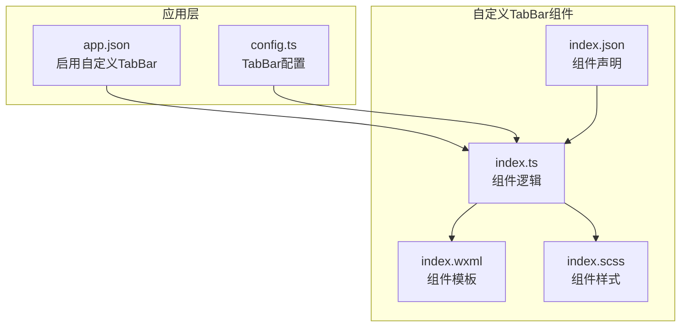
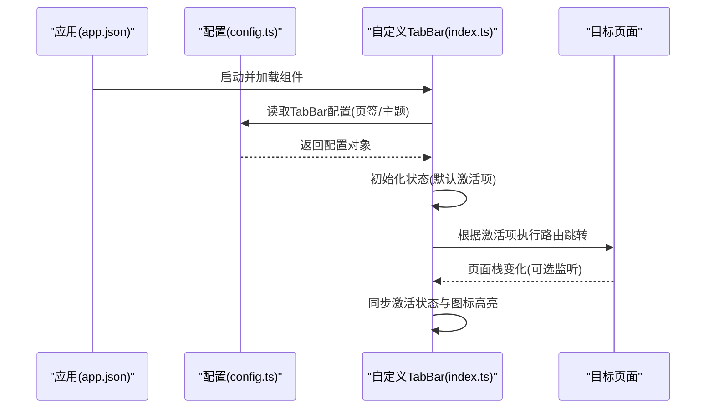
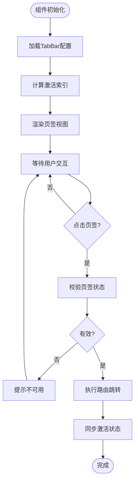
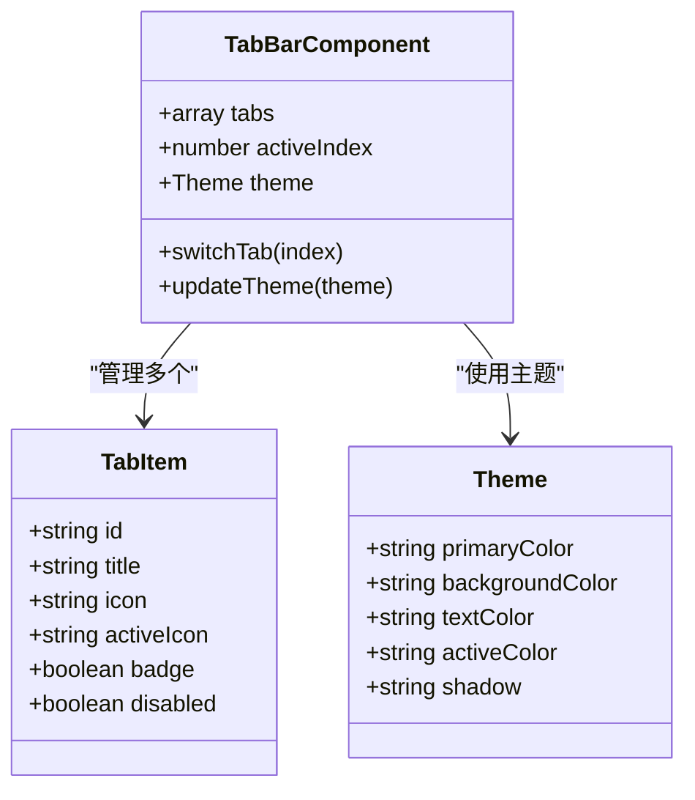
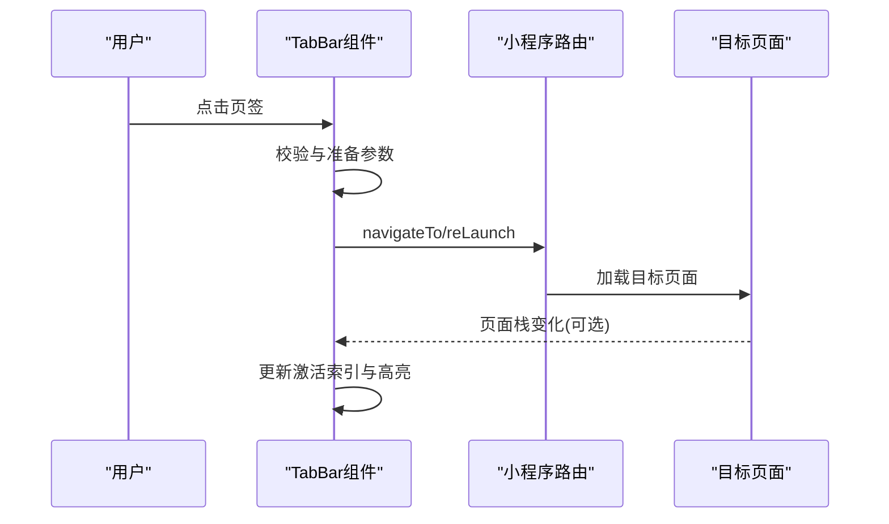
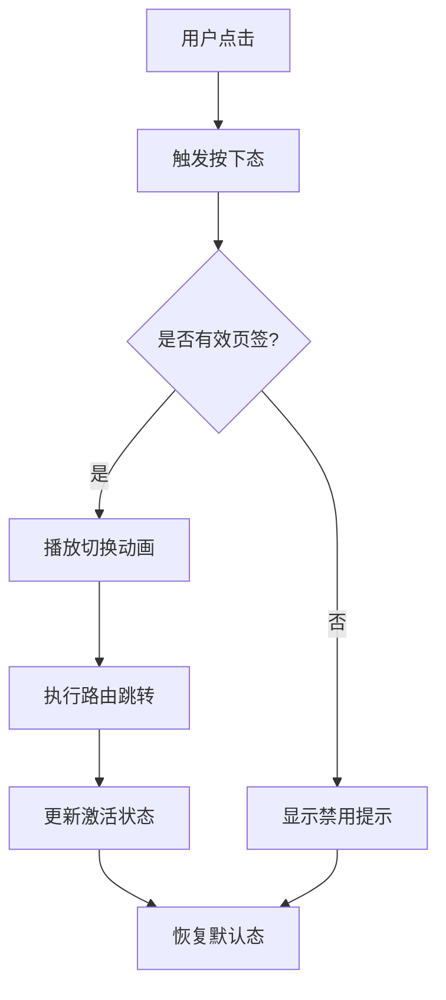
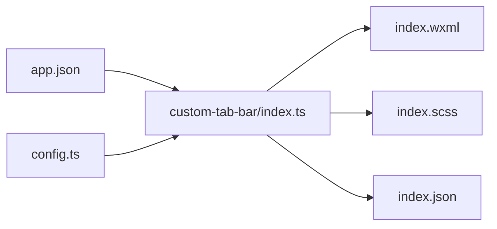

# 自定义TabBar

<cite>
**本文档引用的文件**   
- [miniprogram/custom-tab-bar/index.ts](file://miniprogram/custom-tab-bar/index.ts)
- [miniprogram/custom-tab-bar/index.wxml](file://miniprogram/custom-tab-bar/index.wxml)
- [miniprogram/custom-tab-bar/index.scss](file://miniprogram/custom-tab-bar/index.scss)
- [miniprogram/custom-tab-bar/index.json](file://miniprogram/custom-tab-bar/index.json)
- [miniprogram/app.json](file://miniprogram/app.json)
- [miniprogram/config.ts](file://miniprogram/config.ts)
</cite>

## 目录
1. [简介](#简介)
2. [项目结构](#项目结构)
3. [核心组件](#核心组件)
4. [架构总览](#架构总览)
5. [详细组件分析](#详细组件分析)
6. [依赖分析](#依赖分析)
7. [性能考虑](#性能考虑)
8. [故障排查指南](#故障排查指南)
9. [结论](#结论)
10. [附录](#附录)

## 简介
本文件为小程序“自定义TabBar”组件的完整技术文档。内容涵盖：
- TabBar 的自定义实现原理与渲染机制
- 样式定制选项与主题配置
- 交互行为配置（点击、动画、状态同步）
- 图标管理与页面路由控制
- 性能优化方案与扩展方法
- 典型配置示例与最佳实践

该组件基于小程序自定义 tabBar 能力，通过独立组件承载底部导航栏，提供灵活的样式与行为扩展，同时与全局配置和页面路由保持同步。

## 项目结构
自定义TabBar位于 miniprogram/custom-tab-bar 目录下，包含组件的 TypeScript 逻辑、WXML 模板、SCSS 样式与 JSON 配置。应用级入口 app.json 中启用自定义 tabBar，并通过配置文件集中管理 Tab 项信息。

**图表来源**
- [miniprogram/app.json](file://miniprogram/app.json)
- [miniprogram/config.ts](file://miniprogram/config.ts)
- [miniprogram/custom-tab-bar/index.ts](file://miniprogram/custom-tab-bar/index.ts)
- [miniprogram/custom-tab-bar/index.wxml](file://miniprogram/custom-tab-bar/index.wxml)
- [miniprogram/custom-tab-bar/index.scss](file://miniprogram/custom-tab-bar/index.scss)
- [miniprogram/custom-tab-bar/index.json](file://miniprogram/custom-tab-bar/index.json)

**章节来源**
- [miniprogram/custom-tab-bar/index.ts](file://miniprogram/custom-tab-bar/index.ts)
- [miniprogram/custom-tab-bar/index.wxml](file://miniprogram/custom-tab-bar/index.wxml)
- [miniprogram/custom-tab-bar/index.scss](file://miniprogram/custom-tab-bar/index.scss)
- [miniprogram/custom-tab-bar/index.json](file://miniprogram/custom-tab-bar/index.json)
- [miniprogram/app.json](file://miniprogram/app.json)
- [miniprogram/config.ts](file://miniprogram/config.ts)

## 核心组件
- 组件职责
  - 渲染底部导航栏，支持多页签切换
  - 维护当前激活页签状态，与页面路由保持一致
  - 管理图标资源（含选中/未选中态）
  - 处理用户交互（点击、长按等），触发路由跳转或业务回调
  - 提供主题与样式定制接口
- 关键数据模型
  - 页签项：标识、标题、图标路径、选中图标路径、是否角标、是否禁用
  - 当前激活索引：用于高亮与路由同步
  - 主题变量：主色、背景色、文字颜色、选中态颜色、阴影等
- 生命周期与事件
  - 初始化时加载配置并计算默认激活项
  - 监听页面路由变化以同步激活状态
  - 对外暴露切换方法与状态查询接口

**章节来源**
- [miniprogram/custom-tab-bar/index.ts](file://miniprogram/custom-tab-bar/index.ts)
- [miniprogram/custom-tab-bar/index.wxml](file://miniprogram/custom-tab-bar/index.wxml)
- [miniprogram/custom-tab-bar/index.scss](file://miniprogram/custom-tab-bar/index.scss)

## 架构总览
自定义TabBar采用“配置驱动 + 组件化”的架构：
- 配置层：在 config.ts 中定义 Tab 列表与主题变量，便于统一维护
- 组件层：index.ts 负责状态与交互，index.wxml 负责模板渲染，index.scss 负责样式
- 应用层：app.json 启用自定义 tabBar，将组件注册为底部导航

**图表来源**
- [miniprogram/app.json](file://miniprogram/app.json)
- [miniprogram/config.ts](file://miniprogram/config.ts)
- [miniprogram/custom-tab-bar/index.ts](file://miniprogram/custom-tab-bar/index.ts)

## 详细组件分析

### 组件结构与渲染流程
- 模板结构
  - 容器：底部固定定位，包含多个页签项
  - 页签项：图标、标题、角标（可选）、选中态指示器
  - 遮罩/阴影：提升层级与视觉层次
- 渲染流程
  - 组件挂载后读取配置，生成页签数组
  - 根据当前路由计算激活索引，更新视图
  - 用户点击页签时，校验权限与状态，执行路由跳转或回调

**图表来源**
- [miniprogram/custom-tab-bar/index.wxml](file://miniprogram/custom-tab-bar/index.wxml)
- [miniprogram/custom-tab-bar/index.ts](file://miniprogram/custom-tab-bar/index.ts)

**章节来源**
- [miniprogram/custom-tab-bar/index.wxml](file://miniprogram/custom-tab-bar/index.wxml)
- [miniprogram/custom-tab-bar/index.ts](file://miniprogram/custom-tab-bar/index.ts)

### 图标管理与主题定制
- 图标管理
  - 每个页签项包含未选中与选中两套图标路径
  - 支持动态替换图标（如根据主题或业务状态切换）
  - 建议将图标资源统一管理，避免硬编码路径
- 主题定制
  - 通过 SCSS 变量或 CSS 变量定义主色、背景色、文字颜色、选中态颜色、阴影等
  - 支持运行时切换主题（需配合组件状态更新）
  - 提供默认主题与深色模式适配

**图表来源**
- [miniprogram/custom-tab-bar/index.ts](file://miniprogram/custom-tab-bar/index.ts)
- [miniprogram/custom-tab-bar/index.scss](file://miniprogram/custom-tab-bar/index.scss)

**章节来源**
- [miniprogram/custom-tab-bar/index.ts](file://miniprogram/custom-tab-bar/index.ts)
- [miniprogram/custom-tab-bar/index.scss](file://miniprogram/custom-tab-bar/index.scss)

### 页面路由控制与状态同步
- 路由控制
  - 点击页签时调用小程序路由 API 进行跳转
  - 支持 tab 与非 tab 页面的混合导航（非 tab 页面可通过重定向或弹窗方式）
  - 可配置是否允许重复点击同一页签
- 状态同步
  - 监听页面栈变化，确保 TabBar 激活状态与实际页面一致
  - 支持外部主动设置激活索引（如从其他入口进入某页签）

**图表来源**
- [miniprogram/custom-tab-bar/index.ts](file://miniprogram/custom-tab-bar/index.ts)

**章节来源**
- [miniprogram/custom-tab-bar/index.ts](file://miniprogram/custom-tab-bar/index.ts)

### 动画效果与交互行为
- 动画效果
  - 切换页签时的图标缩放、位移、透明度渐变
  - 选中态指示器的滑动或淡入淡出
  - 支持自定义缓动函数与时长
- 交互行为
  - 点击反馈（按下态、涟漪效果）
  - 长按触发额外操作（如刷新、菜单）
  - 禁用态与灰显处理

**图表来源**
- [miniprogram/custom-tab-bar/index.wxml](file://miniprogram/custom-tab-bar/index.wxml)
- [miniprogram/custom-tab-bar/index.scss](file://miniprogram/custom-tab-bar/index.scss)

**章节来源**
- [miniprogram/custom-tab-bar/index.wxml](file://miniprogram/custom-tab-bar/index.wxml)
- [miniprogram/custom-tab-bar/index.scss](file://miniprogram/custom-tab-bar/index.scss)

## 依赖分析
- 内部依赖
  - index.ts 依赖 index.wxml 与 index.scss 完成渲染与样式
  - index.json 声明组件属性与事件
- 外部依赖
  - app.json 启用自定义 tabBar，关联组件路径
  - config.ts 提供 TabBar 配置数据
- 耦合关系
  - 组件与配置解耦，便于扩展与维护
  - 与小程序路由 API 紧密集成，需遵循平台规范

**图表来源**
- [miniprogram/app.json](file://miniprogram/app.json)
- [miniprogram/config.ts](file://miniprogram/config.ts)
- [miniprogram/custom-tab-bar/index.ts](file://miniprogram/custom-tab-bar/index.ts)
- [miniprogram/custom-tab-bar/index.wxml](file://miniprogram/custom-tab-bar/index.wxml)
- [miniprogram/custom-tab-bar/index.scss](file://miniprogram/custom-tab-bar/index.scss)
- [miniprogram/custom-tab-bar/index.json](file://miniprogram/custom-tab-bar/index.json)

**章节来源**
- [miniprogram/app.json](file://miniprogram/app.json)
- [miniprogram/config.ts](file://miniprogram/config.ts)
- [miniprogram/custom-tab-bar/index.ts](file://miniprogram/custom-tab-bar/index.ts)

## 性能考虑
- 渲染优化
  - 使用 wx:key 提升列表渲染效率
  - 避免频繁 setData，合并状态更新
  - 图片资源懒加载与缓存
- 交互优化
  - 防抖与节流处理高频点击
  - 禁用不必要的动画与重绘
- 内存管理
  - 及时释放事件监听与定时器
  - 避免闭包引用大对象

[本节为通用指导，不直接分析具体文件]

## 故障排查指南
- 常见问题
  - 自定义 tabBar 未生效：检查 app.json 中 tabBar.custom 配置与组件路径
  - 页签不切换：确认路由地址正确且未被禁用
  - 样式错乱：检查 SCSS 变量与选择器优先级
  - 图标不显示：验证图片路径与格式，确保资源已打包
- 调试建议
  - 使用开发者工具断点调试 index.ts 逻辑
  - 打印配置对象与当前激活索引，核对数据流
  - 检查页面栈与路由 API 调用结果

**章节来源**
- [miniprogram/app.json](file://miniprogram/app.json)
- [miniprogram/custom-tab-bar/index.ts](file://miniprogram/custom-tab-bar/index.ts)

## 结论
自定义TabBar组件通过配置驱动与组件化设计，实现了高度可定制的底部导航体验。其清晰的架构、完善的样式与交互定制能力，以及良好的性能优化策略，使其适用于多种业务场景。建议在实际项目中结合业务需求灵活扩展，并遵循本文提供的最佳实践以确保稳定与可维护性。

[本节为总结性内容，不直接分析具体文件]

## 附录
- 配置示例要点
  - 在 config.ts 中定义页签数组与主题变量
  - 在 app.json 中启用自定义 tabBar 并指向组件路径
  - 在 index.json 中声明组件属性与事件
- 扩展方法
  - 新增页签：在配置中添加新项，确保图标与路由正确
  - 自定义主题：修改 SCSS 变量或运行时更新主题对象
  - 增强交互：在 index.ts 中添加事件处理逻辑

[本节为补充说明，不直接分析具体文件]