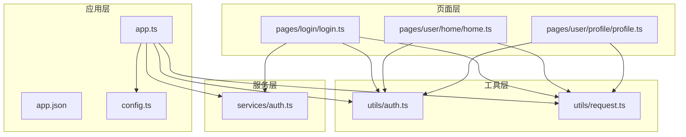
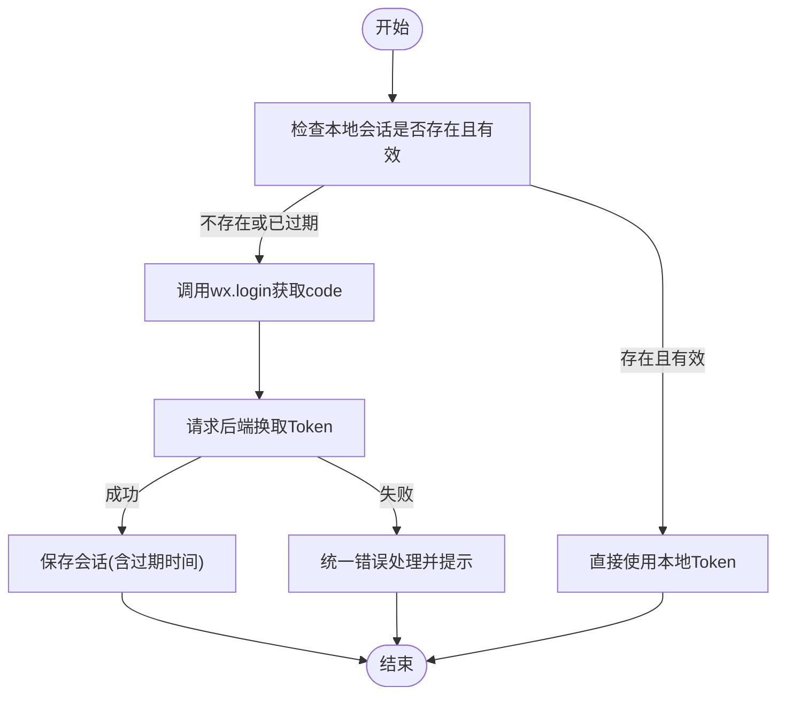
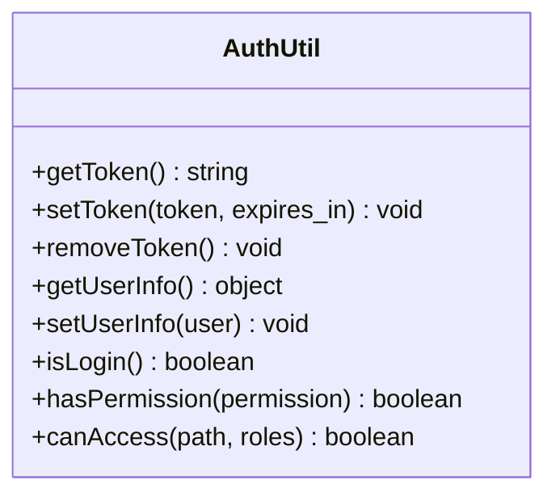
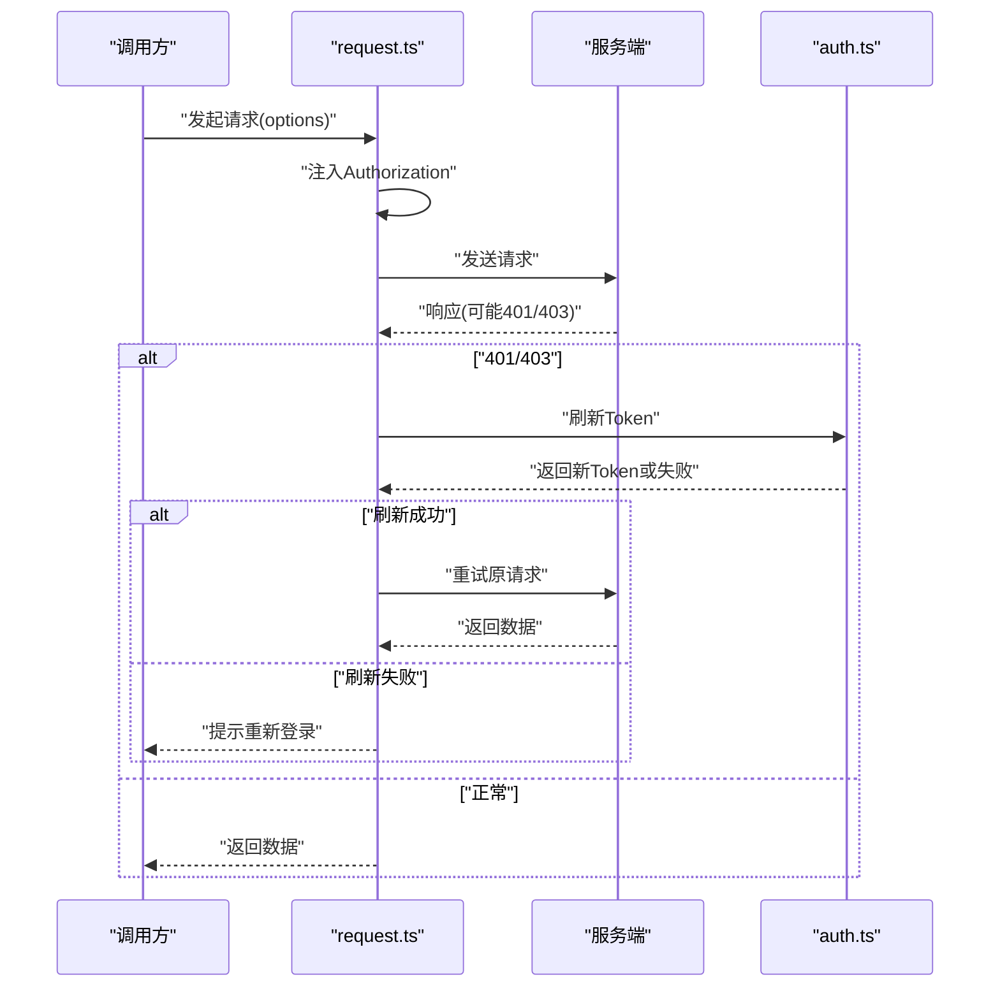
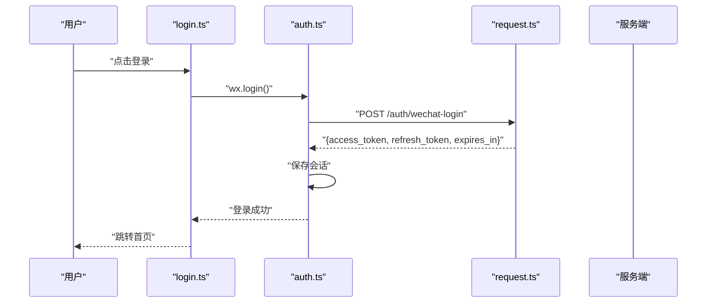
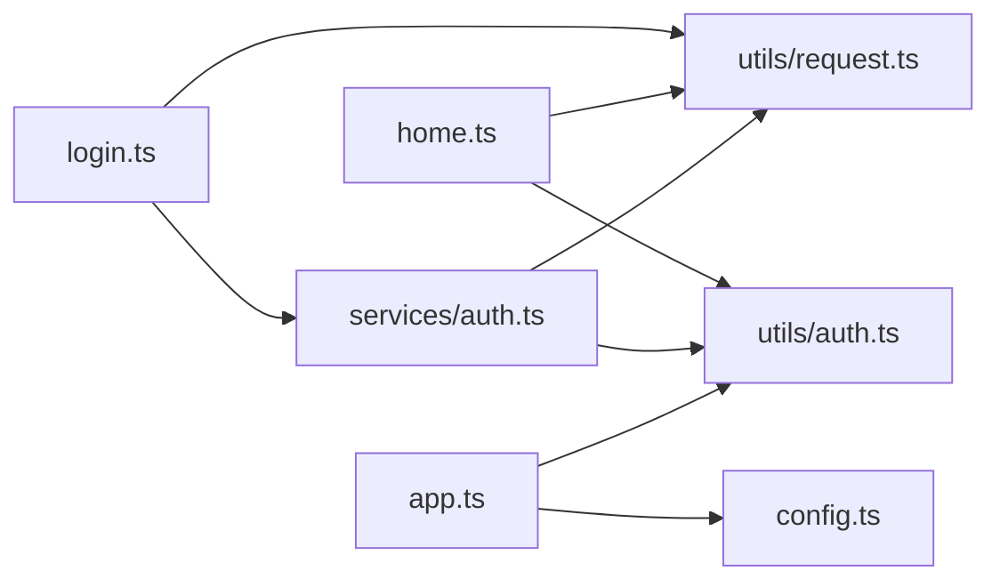

# 认证模块

<cite>
**本文引用的文件**   
- [app.ts](file://miniprogram/app.ts)
- [config.ts](file://miniprogram/config.ts)
- [auth.ts](file://miniprogram/services/auth.ts)
- [auth.ts](file://miniprogram/utils/auth.ts)
- [request.ts](file://miniprogram/utils/request.ts)
- [login.ts](file://miniprogram/pages/login/login.ts)
- [home.ts](file://miniprogram/pages/user/home/home.ts)
- [profile.ts](file://miniprogram/pages/user/profile/profile.ts)
- [app.json](file://miniprogram/app.json)
</cite>

## 目录
1. [简介](#简介)
2. [项目结构](#项目结构)
3. [核心组件](#核心组件)
4. [架构总览](#架构总览)
5. [详细组件分析](#详细组件分析)
6. [依赖分析](#依赖分析)
7. [性能考虑](#性能考虑)
8. [故障排查指南](#故障排查指南)
9. [结论](#结论)
10. [附录](#附录)

## 简介
本文件为小程序“认证模块”的完整技术文档，覆盖用户登录流程、权限验证机制与会话管理策略。重点说明微信授权登录、Token 管理与用户状态同步的实现方式，并给出安全最佳实践、错误处理与用户体验优化建议。同时提供认证流程的代码级参考路径与常见问题解决方案，帮助开发者快速定位与排障。

## 项目结构
认证相关代码主要分布在以下位置：
- 应用入口与配置：app.ts、app.json、config.ts
- 认证服务层：services/auth.ts
- 工具层：utils/auth.ts、utils/request.ts
- 页面层：pages/login/login.ts（登录页）、pages/user/home/home.ts（首页鉴权拦截）、pages/user/profile/profile.ts（个人信息）

**图表来源**
- [app.ts](file://miniprogram/app.ts)
- [config.ts](file://miniprogram/config.ts)
- [auth.ts](file://miniprogram/services/auth.ts)
- [auth.ts](file://miniprogram/utils/auth.ts)
- [request.ts](file://miniprogram/utils/request.ts)
- [login.ts](file://miniprogram/pages/login/login.ts)
- [home.ts](file://miniprogram/pages/user/home/home.ts)
- [profile.ts](file://miniprogram/pages/user/profile/profile.ts)

**章节来源**
- [app.ts](file://miniprogram/app.ts)
- [app.json](file://miniprogram/app.json)
- [config.ts](file://miniprogram/config.ts)

## 核心组件
- 认证服务（services/auth.ts）
  - 职责：封装微信登录、获取用户信息、服务端 Token 交换、刷新与登出等认证相关能力。
  - 关键能力：调用 wx.login 获取临时 code；与服务端交换获得 access_token/refresh_token；维护本地会话状态；统一错误码映射。
- 认证工具（utils/auth.ts）
  - 职责：本地会话存取（如 token、过期时间、用户信息）、权限判断、路由守卫辅助。
  - 关键能力：读取/写入 storage；计算 token 有效期；判断是否登录、是否具备某角色或权限。
- 请求封装（utils/request.ts）
  - 职责：统一网络请求，自动附加 Token、处理 401/403、重试与错误提示。
  - 关键能力：拦截器注入 Authorization；失败时触发刷新或跳转登录；统一错误消息展示。
- 登录页（pages/login/login.ts）
  - 职责：引导用户授权登录，处理微信授权回调，完成 Token 交换并进入主页。
  - 关键能力：调用 auth 服务发起登录；处理用户拒绝授权；成功后持久化会话并导航。
- 首页鉴权（pages/user/home/home.ts）
  - 职责：进入首页前校验登录态，未登录则跳转登录页。
  - 关键能力：检查本地会话；必要时静默刷新 Token；失败则重定向。
- 配置文件（config.ts）
  - 职责：集中管理后端接口地址、超时、重试策略、调试开关等。
- 应用入口（app.ts）
  - 职责：全局初始化（如加载配置、恢复会话、注册全局拦截），保证应用启动时的认证上下文可用。

**章节来源**
- [auth.ts](file://miniprogram/services/auth.ts)
- [auth.ts](file://miniprogram/utils/auth.ts)
- [request.ts](file://miniprogram/utils/request.ts)
- [login.ts](file://miniprogram/pages/login/login.ts)
- [home.ts](file://miniprogram/pages/user/home/home.ts)
- [config.ts](file://miniprogram/config.ts)
- [app.ts](file://miniprogram/app.ts)

## 架构总览
下图展示了从用户点击登录到成功进入主页的端到端流程，以及后续请求中的 Token 注入与失效处理。

```mermaid
sequenceDiagram
participant U as "用户"
participant P as "登录页(login.ts)"
participant A as "认证服务(auth.ts)"
participant R as "请求封装(request.ts)"
participant S as "服务端"
participant H as "首页(home.ts)"
U->>P : "点击登录"
P->>A : "发起微信登录(code)"
A->>R : "POST /auth/wechat-login"
R-->>A : "返回{access_token, refresh_token, expires_in}"
A->>A : "持久化会话(含过期时间)"
A-->>P : "登录成功"
P->>H : "跳转到首页"
H->>R : "业务请求(携带Authorization)"
R-->>S : "带Token的请求"
S-->>R : "401/403 或正常响应"
alt "Token 失效"
R->>A : "尝试刷新Token"
A->>R : "返回新Token或失败"
R-->>H : "重试原请求或提示重新登录"
else "正常"
R-->>H : "返回数据"
end
```

**图表来源**
- [login.ts](file://miniprogram/pages/login/login.ts)
- [auth.ts](file://miniprogram/services/auth.ts)
- [request.ts](file://miniprogram/utils/request.ts)
- [home.ts](file://miniprogram/pages/user/home/home.ts)

## 详细组件分析

### 认证服务（services/auth.ts）
- 功能要点
  - 微信登录：调用 wx.login 获取 code，再调用后端换取 access_token 与 refresh_token。
  - 会话管理：保存 token、过期时间、用户信息；提供 isLogin、logout、refresh 等方法。
  - 错误处理：将服务端错误码映射为前端友好提示；对网络异常进行兜底。
- 数据结构
  - 会话对象：包含 access_token、refresh_token、expires_in、user_info 等字段。
  - 错误对象：包含 code、message、retryable 等字段。
- 复杂度与性能
  - 登录流程涉及两次异步调用（wx.login + 后端交换），注意避免重复调用导致并发问题。
  - 刷新 Token 采用幂等设计，避免多次刷新造成竞争条件。
- 错误处理
  - 区分网络错误、服务端错误、用户拒绝授权三类场景，分别给出不同提示与后续动作。
- 优化建议
  - 在首次启动时预取一次用户信息，减少后续页面渲染等待。
  - 对 refresh_token 设置合理的安全边界（如最小剩余有效期阈值）。

**图表来源**
- [auth.ts](file://miniprogram/services/auth.ts)

**章节来源**
- [auth.ts](file://miniprogram/services/auth.ts)

### 认证工具（utils/auth.ts）
- 功能要点
  - 本地存储：封装 get/set/remove，确保 token、过期时间、用户信息的一致性。
  - 权限判断：基于角色或权限标识做细粒度控制，供页面或组件使用。
  - 路由守卫：提供 canAccess(path, roles) 等辅助方法，简化页面级鉴权。
- 数据结构
  - 本地键名规范：如 auth.token、auth.expires_at、auth.user_info。
  - 权限模型：roles[]、permissions[] 等数组结构。
- 复杂度与性能
  - 本地读写为 O(1)，但应避免频繁序列化/反序列化，建议批量更新。
- 错误处理
  - 对 storage 操作异常进行捕获，降级为无状态模式并提示用户。
- 优化建议
  - 对敏感信息加密存储（如使用小程序加密 API）。
  - 对过期时间进行缓冲（提前 N 秒判定为过期），降低刷新频率。

**图表来源**
- [auth.ts](file://miniprogram/utils/auth.ts)

**章节来源**
- [auth.ts](file://miniprogram/utils/auth.ts)

### 请求封装（utils/request.ts）
- 功能要点
  - 统一请求：封装 wx.request，支持超时、重试、取消。
  - 拦截器：自动注入 Authorization；处理 401/403；失败重试与降级。
  - 错误聚合：将不同错误归一化为标准格式，便于上层处理。
- 数据结构
  - 请求选项：url、method、data、headers、timeout、retry 等。
  - 响应体：code、message、data、retryable。
- 复杂度与性能
  - 重试策略需限制次数与退避间隔，避免雪崩。
  - 大请求可考虑分片或分页，减少内存占用。
- 错误处理
  - 网络异常：提示“网络不可用”，并提供重试按钮。
  - 鉴权失败：自动刷新 Token，失败则跳转登录页。
- 优化建议
  - 对相同接口进行短时缓存（GET），提升体验。
  - 对敏感接口启用签名与防重放。

**图表来源**
- [request.ts](file://miniprogram/utils/request.ts)
- [auth.ts](file://miniprogram/services/auth.ts)

**章节来源**
- [request.ts](file://miniprogram/utils/request.ts)

### 登录页（pages/login/login.ts）
- 功能要点
  - 引导授权：调用微信授权接口，收集必要信息。
  - 登录流程：调用 services/auth.ts 完成 code 交换与 Token 获取。
  - 状态同步：成功后更新本地会话，并导航至首页或指定页面。
- 错误处理
  - 用户拒绝授权：提示原因并提供再次授权入口。
  - 网络异常：显示重试按钮与友好文案。
- 优化建议
  - 增加加载态与进度反馈，避免重复点击。
  - 记录关键日志（脱敏）以便排查。

**图表来源**
- [login.ts](file://miniprogram/pages/login/login.ts)
- [auth.ts](file://miniprogram/services/auth.ts)
- [request.ts](file://miniprogram/utils/request.ts)

**章节来源**
- [login.ts](file://miniprogram/pages/login/login.ts)

### 首页鉴权（pages/user/home/home.ts）
- 功能要点
  - 进入首页前检查登录态，未登录则跳转登录页。
  - 若 Token 即将过期，静默刷新后继续访问。
- 错误处理
  - 刷新失败：提示重新登录并清理本地状态。
- 优化建议
  - 对首页数据进行懒加载与缓存，缩短首屏时间。

**章节来源**
- [home.ts](file://miniprogram/pages/user/home/home.ts)

### 配置文件（config.ts）
- 内容要点
  - 后端基础地址、接口版本、超时时间、重试次数、调试开关等。
  - 安全相关：是否启用 HTTPS、是否开启请求签名。
- 优化建议
  - 按环境分离配置（开发/测试/生产），避免硬编码。

**章节来源**
- [config.ts](file://miniprogram/config.ts)

### 应用入口（app.ts）
- 内容要点
  - 初始化配置、恢复会话、注册全局拦截器。
  - 监听应用生命周期，处理后台切换导致的 Token 失效。
- 优化建议
  - 在 onLaunch 中预加载必要资源，减少冷启动耗时。

**章节来源**
- [app.ts](file://miniprogram/app.ts)

## 依赖分析
- 组件耦合关系
  - login.ts 依赖 services/auth.ts 与 utils/request.ts。
  - home.ts 依赖 utils/auth.ts 与 utils/request.ts。
  - services/auth.ts 依赖 utils/auth.ts 与 utils/request.ts。
  - app.ts 依赖 config.ts 与 utils/auth.ts。
- 外部依赖
  - 微信小程序 API（wx.login、wx.getUserProfile、wx.request 等）。
  - 后端认证接口（/auth/wechat-login、/auth/refresh 等）。

**图表来源**
- [login.ts](file://miniprogram/pages/login/login.ts)
- [auth.ts](file://miniprogram/services/auth.ts)
- [auth.ts](file://miniprogram/utils/auth.ts)
- [request.ts](file://miniprogram/utils/request.ts)
- [home.ts](file://miniprogram/pages/user/home/home.ts)
- [app.ts](file://miniprogram/app.ts)
- [config.ts](file://miniprogram/config.ts)

**章节来源**
- [login.ts](file://miniprogram/pages/login/login.ts)
- [auth.ts](file://miniprogram/services/auth.ts)
- [auth.ts](file://miniprogram/utils/auth.ts)
- [request.ts](file://miniprogram/utils/request.ts)
- [home.ts](file://miniprogram/pages/user/home/home.ts)
- [app.ts](file://miniprogram/app.ts)
- [config.ts](file://miniprogram/config.ts)

## 性能考虑
- 减少不必要的网络请求：合并接口、缓存 GET 结果、延迟加载。
- Token 刷新策略：设置合理的过期缓冲，避免频繁刷新。
- 本地存储优化：批量写入、避免频繁序列化。
- 首屏优化：预加载必要资源，按需加载页面。
- 错误重试：指数退避与最大重试次数限制，防止雪崩。

## 故障排查指南
- 常见错误与处理
  - 微信授权被拒绝：检查授权弹窗逻辑与用户选择，提供再次授权入口。
  - 401/403：确认 Token 是否有效，触发刷新；失败则跳转登录并清理状态。
  - 网络异常：提示网络不可用，提供重试按钮；记录错误日志。
  - 会话不一致：检查本地存储键名与值结构，确保一致性。
- 排查步骤
  - 查看控制台日志与网络请求，确认接口返回码与消息。
  - 检查本地存储中的 token、expires_at、user_info 是否正确。
  - 复现问题并记录操作步骤，便于定位。
- 日志与监控
  - 记录关键节点（登录、刷新、失败）的脱敏日志。
  - 上报错误堆栈与设备信息，便于远程诊断。

**章节来源**
- [request.ts](file://miniprogram/utils/request.ts)
- [auth.ts](file://miniprogram/services/auth.ts)
- [auth.ts](file://miniprogram/utils/auth.ts)

## 结论
本认证模块以“服务层 + 工具层 + 请求封装 + 页面层”的分层架构实现微信授权登录、Token 管理与用户状态同步。通过统一的错误处理与健壮的重试机制，保障用户体验与系统稳定性。建议在生产环境中加强安全配置（HTTPS、签名、最小权限）与监控告警，持续优化性能与可观测性。

## 附录
- 安全最佳实践
  - 强制 HTTPS，禁用明文传输。
  - Token 最小权限原则，按需下发。
  - 敏感信息加密存储，避免明文。
  - 接口签名与防重放，防止篡改与重放攻击。
- 用户体验优化
  - 明确的加载态与错误提示。
  - 一键重试与快捷登录入口。
  - 渐进式加载与缓存，缩短首屏时间。
- 常见问题解决方案
  - 登录后仍提示未登录：检查会话持久化与读取逻辑。
  - 刷新失败导致频繁跳转登录：优化刷新时机与失败回退策略。
  - 多端状态不一致：引入服务端会话中心与事件同步。