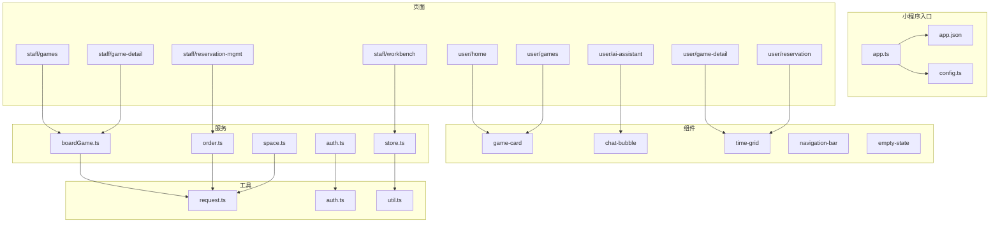
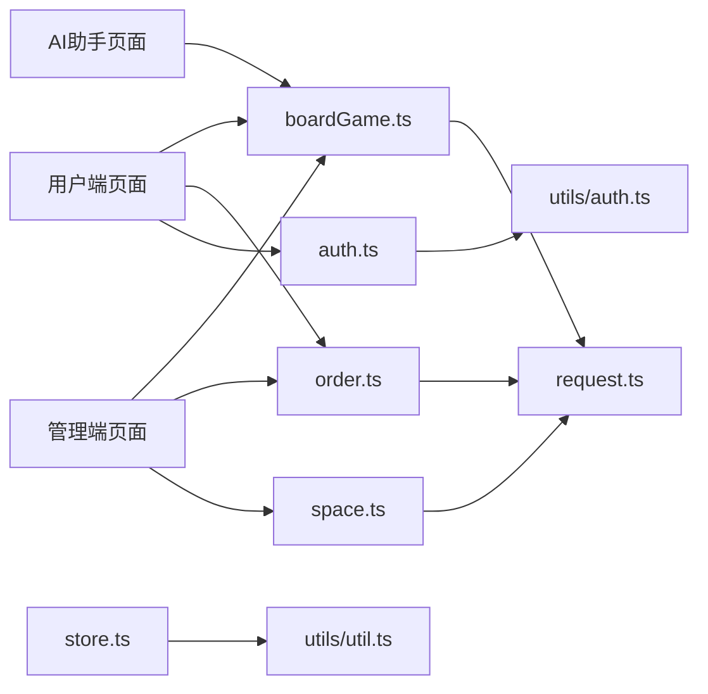
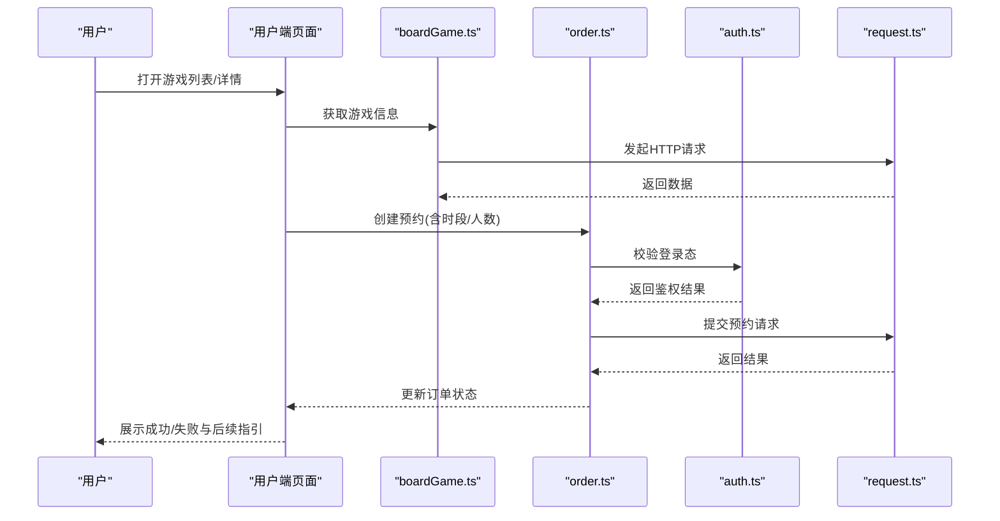
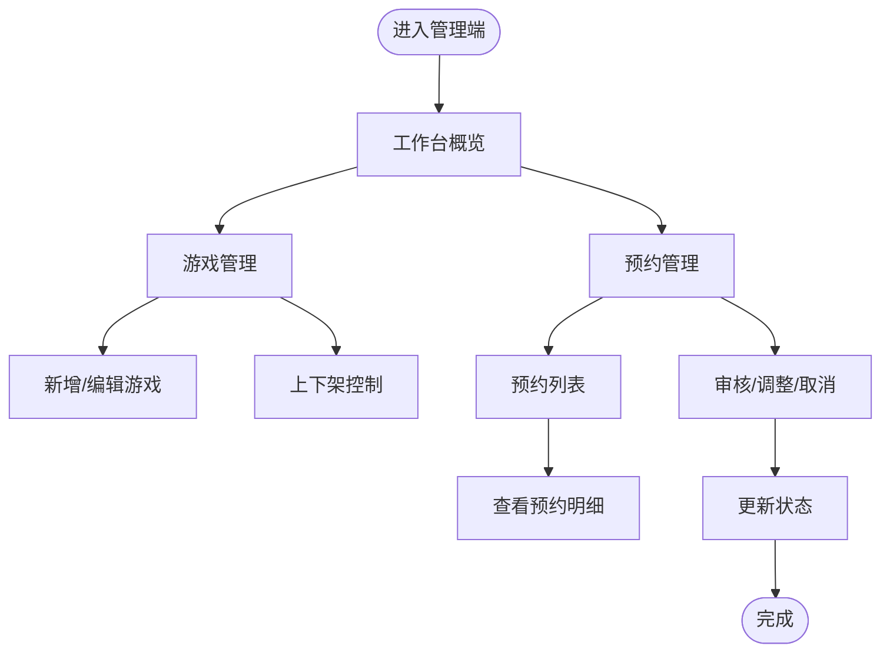
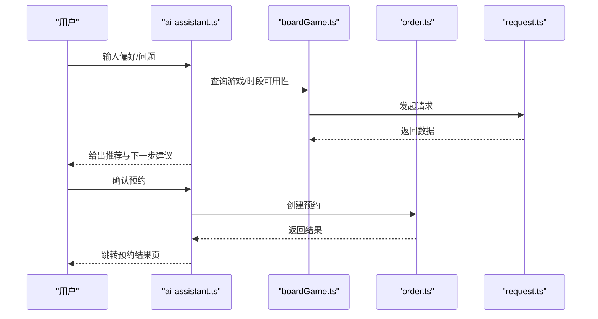
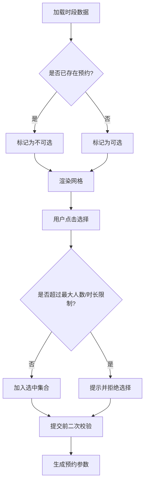
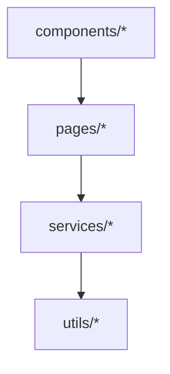

# 项目概述

<cite>
**本文引用的文件**   
- [app.json](file://miniprogram/app.json)
- [app.ts](file://miniprogram/app.ts)
- [config.ts](file://miniprogram/config.ts)
- [package.json](file://package.json)
- [project.config.json](file://project.config.json)
- [tsconfig.json](file://tsconfig.json)
- [services/auth.ts](file://miniprogram/services/auth.ts)
- [services/boardGame.ts](file://miniprogram/services/boardGame.ts)
- [services/order.ts](file://miniprogram/services/order.ts)
- [services/space.ts](file://miniprogram/services/space.ts)
- [services/store.ts](file://miniprogram/services/store.ts)
- [utils/request.ts](file://miniprogram/utils/request.ts)
- [utils/auth.ts](file://miniprogram/utils/auth.ts)
- [utils/util.ts](file://miniprogram/utils/util.ts)
- [pages/user/home/home.ts](file://miniprogram/pages/user/home/home.ts)
- [pages/user/games/games.ts](file://miniprogram/pages/user/games/games.ts)
- [pages/user/game-detail/game-detail.ts](file://miniprogram/pages/user/game-detail/game-detail.ts)
- [pages/user/reservation/reservation.ts](file://miniprogram/pages/user/reservation/reservation.ts)
- [pages/user/ai-assistant/ai-assistant.ts](file://miniprogram/pages/user/ai-assistant/ai-assistant.ts)
- [pages/staff/workbench/workbench.ts](file://miniprogram/pages/staff/workbench/workbench.ts)
- [pages/staff/games/games.ts](file://miniprogram/pages/staff/games/games.ts)
- [pages/staff/game-detail/game-detail.ts](file://miniprogram/pages/staff/game-detail/game-detail.ts)
- [pages/staff/reservation-mgmt/reservation-mgmt.ts](file://miniprogram/pages/staff/reservation-mgmt/reservation-mgmt.ts)
- [components/game-card/game-card.ts](file://miniprogram/components/game-card/game-card.ts)
- [components/chat-bubble/chat-bubble.ts](file://miniprogram/components/chat-bubble/chat-bubble.ts)
- [components/time-grid/time-grid.ts](file://miniprogram/components/time-grid/time-grid.ts)
- [components/navigation-bar/navigation-bar.ts](file://miniprogram/components/navigation-bar/navigation-bar.ts)
- [components/empty-state/empty-state.ts](file://miniprogram/components/empty-state/empty-state.ts)
</cite>

## 目录
1. [简介](#简介)
2. [项目结构](#项目结构)
3. [核心组件](#核心组件)
4. [架构总览](#架构总览)
5. [详细组件分析](#详细组件分析)
6. [依赖关系分析](#依赖关系分析)
7. [性能考量](#性能考量)
8. [故障排查指南](#故障排查指南)
9. [结论](#结论)
10. [附录：快速开始](#附录快速开始)

## 简介
本项目是一个面向桌面游戏预约的微信小程序，提供用户端与管理员端双角色能力，并内置AI助手辅助选游与预约。核心目标包括：
- 简化用户预约流程：在线浏览、选择时段、一键预约、查看订单状态。
- 提升管理效率：管理员可集中管理游戏、时段与预约单，支持审核与调度。
- 智能体验：AI助手基于规则或接口建议合适游戏与时间段，减少决策成本。
- 技术栈统一：采用微信小程序原生框架 + TypeScript + SCSS，保证类型安全与样式可维护性。

业务价值：
- 对用户：降低预约门槛，提升找游、约位、改退订的体验一致性。
- 对门店：标准化预约流程，减少人工沟通成本，提高翻台率与资源利用率。
- 对运营：数据可视化与流程可控，便于统计分析与策略优化。

## 项目结构
项目采用小程序标准目录组织，按“页面-组件-服务-工具”分层，职责清晰：
- miniprogram/pages：用户端与管理端页面，按角色划分目录。
- miniprogram/components：可复用UI组件（游戏卡片、聊天气泡、时间网格等）。
- miniprogram/services：领域服务层（认证、桌游、订单、空间、本地存储）。
- miniprogram/utils：通用工具（网络请求、鉴权、工具函数）。
- miniprogram/styles：全局样式变量。
- 根级配置：小程序工程配置、TypeScript编译配置、包管理与项目设置。

图表来源
- [app.ts](file://miniprogram/app.ts)
- [app.json](file://miniprogram/app.json)
- [config.ts](file://miniprogram/config.ts)
- [pages/user/home/home.ts](file://miniprogram/pages/user/home/home.ts)
- [pages/user/games/games.ts](file://miniprogram/pages/user/games/games.ts)
- [pages/user/game-detail/game-detail.ts](file://miniprogram/pages/user/game-detail/game-detail.ts)
- [pages/user/reservation/reservation.ts](file://miniprogram/pages/user/reservation/reservation.ts)
- [pages/user/ai-assistant/ai-assistant.ts](file://miniprogram/pages/user/ai-assistant/ai-assistant.ts)
- [pages/staff/workbench/workbench.ts](file://miniprogram/pages/staff/workbench/workbench.ts)
- [pages/staff/games/games.ts](file://miniprogram/pages/staff/games/games.ts)
- [pages/staff/game-detail/game-detail.ts](file://miniprogram/pages/staff/game-detail/game-detail.ts)
- [pages/staff/reservation-mgmt/reservation-mgmt.ts](file://miniprogram/pages/staff/reservation-mgmt/reservation-mgmt.ts)
- [components/game-card/game-card.ts](file://miniprogram/components/game-card/game-card.ts)
- [components/chat-bubble/chat-bubble.ts](file://miniprogram/components/chat-bubble/chat-bubble.ts)
- [components/time-grid/time-grid.ts](file://miniprogram/components/time-grid/time-grid.ts)
- [components/navigation-bar/navigation-bar.ts](file://miniprogram/components/navigation-bar/navigation-bar.ts)
- [components/empty-state/empty-state.ts](file://miniprogram/components/empty-state/empty-state.ts)
- [services/auth.ts](file://miniprogram/services/auth.ts)
- [services/boardGame.ts](file://miniprogram/services/boardGame.ts)
- [services/order.ts](file://miniprogram/services/order.ts)
- [services/space.ts](file://miniprogram/services/space.ts)
- [services/store.ts](file://miniprogram/services/store.ts)
- [utils/request.ts](file://miniprogram/utils/request.ts)
- [utils/auth.ts](file://miniprogram/utils/auth.ts)
- [utils/util.ts](file://miniprogram/utils/util.ts)

章节来源
- [app.json](file://miniprogram/app.json)
- [app.ts](file://miniprogram/app.ts)
- [config.ts](file://miniprogram/config.ts)
- [package.json](file://package.json)
- [project.config.json](file://project.config.json)
- [tsconfig.json](file://tsconfig.json)

## 核心组件
- 用户端
  - 首页与游戏列表：浏览游戏、筛选与搜索，进入详情。
  - 游戏详情：展示规则、人数、时长、图片等信息。
  - 预约页：选择日期与时段，提交预约，查看订单状态。
  - AI助手：对话式推荐与预约引导，提升转化与体验。
- 管理端
  - 工作台：概览关键指标与待办事项。
  - 游戏管理：新增/编辑/上下架游戏信息。
  - 预约管理：审核、调整、取消预约，查看明细。
- 公共组件
  - 游戏卡片：统一展示游戏基础信息与操作入口。
  - 时间网格：可视化可选/不可用时段，支持多选与校验。
  - 聊天气泡：消息渲染与滚动对齐。
  - 导航栏：统一返回与标题样式。
  - 空状态：无数据时的友好提示。

章节来源
- [pages/user/home/home.ts](file://miniprogram/pages/user/home/home.ts)
- [pages/user/games/games.ts](file://miniprogram/pages/user/games/games.ts)
- [pages/user/game-detail/game-detail.ts](file://miniprogram/pages/user/game-detail/game-detail.ts)
- [pages/user/reservation/reservation.ts](file://miniprogram/pages/user/reservation/reservation.ts)
- [pages/user/ai-assistant/ai-assistant.ts](file://miniprogram/pages/user/ai-assistant/ai-assistant.ts)
- [pages/staff/workbench/workbench.ts](file://miniprogram/pages/staff/workbench/workbench.ts)
- [pages/staff/games/games.ts](file://miniprogram/pages/staff/games/games.ts)
- [pages/staff/game-detail/game-detail.ts](file://miniprogram/pages/staff/game-detail/game-detail.ts)
- [pages/staff/reservation-mgmt/reservation-mgmt.ts](file://miniprogram/pages/staff/reservation-mgmt/reservation-mgmt.ts)
- [components/game-card/game-card.ts](file://miniprogram/components/game-card/game-card.ts)
- [components/time-grid/time-grid.ts](file://miniprogram/components/time-grid/time-grid.ts)
- [components/chat-bubble/chat-bubble.ts](file://miniprogram/components/chat-bubble/chat-bubble.ts)
- [components/navigation-bar/navigation-bar.ts](file://miniprogram/components/navigation-bar/navigation-bar.ts)
- [components/empty-state/empty-state.ts](file://miniprogram/components/empty-state/empty-state.ts)

## 架构总览
系统采用“页面-组件-服务-工具”的分层架构，前后端通过HTTP交互，状态由服务层与本地存储共同维护。

图表来源
- [pages/user/games/games.ts](file://miniprogram/pages/user/games/games.ts)
- [pages/user/reservation/reservation.ts](file://miniprogram/pages/user/reservation/reservation.ts)
- [pages/user/ai-assistant/ai-assistant.ts](file://miniprogram/pages/user/ai-assistant/ai-assistant.ts)
- [pages/staff/games/games.ts](file://miniprogram/pages/staff/games/games.ts)
- [pages/staff/reservation-mgmt/reservation-mgmt.ts](file://miniprogram/pages/staff/reservation-mgmt/reservation-mgmt.ts)
- [services/boardGame.ts](file://miniprogram/services/boardGame.ts)
- [services/order.ts](file://miniprogram/services/order.ts)
- [services/auth.ts](file://miniprogram/services/auth.ts)
- [services/space.ts](file://miniprogram/services/space.ts)
- [services/store.ts](file://miniprogram/services/store.ts)
- [utils/request.ts](file://miniprogram/utils/request.ts)
- [utils/auth.ts](file://miniprogram/utils/auth.ts)
- [utils/util.ts](file://miniprogram/utils/util.ts)

## 详细组件分析

### 用户端游戏预约流程
用户从首页进入游戏列表，查看详情后选择时段并提交预约，最终在个人中心查看订单状态。

图表来源
- [pages/user/games/games.ts](file://miniprogram/pages/user/games/games.ts)
- [pages/user/game-detail/game-detail.ts](file://miniprogram/pages/user/game-detail/game-detail.ts)
- [pages/user/reservation/reservation.ts](file://miniprogram/pages/user/reservation/reservation.ts)
- [services/boardGame.ts](file://miniprogram/services/boardGame.ts)
- [services/order.ts](file://miniprogram/services/order.ts)
- [services/auth.ts](file://miniprogram/services/auth.ts)
- [utils/request.ts](file://miniprogram/utils/request.ts)

章节来源
- [pages/user/games/games.ts](file://miniprogram/pages/user/games/games.ts)
- [pages/user/game-detail/game-detail.ts](file://miniprogram/pages/user/game-detail/game-detail.ts)
- [pages/user/reservation/reservation.ts](file://miniprogram/pages/user/reservation/reservation.ts)
- [services/boardGame.ts](file://miniprogram/services/boardGame.ts)
- [services/order.ts](file://miniprogram/services/order.ts)
- [services/auth.ts](file://miniprogram/services/auth.ts)
- [utils/request.ts](file://miniprogram/utils/request.ts)

### 管理端游戏与预约管理
管理员在工作台查看概览，进行游戏信息管理、预约审核与处理。

图表来源
- [pages/staff/workbench/workbench.ts](file://miniprogram/pages/staff/workbench/workbench.ts)
- [pages/staff/games/games.ts](file://miniprogram/pages/staff/games/games.ts)
- [pages/staff/game-detail/game-detail.ts](file://miniprogram/pages/staff/game-detail/game-detail.ts)
- [pages/staff/reservation-mgmt/reservation-mgmt.ts](file://miniprogram/pages/staff/reservation-mgmt/reservation-mgmt.ts)
- [services/boardGame.ts](file://miniprogram/services/boardGame.ts)
- [services/order.ts](file://miniprogram/services/order.ts)

章节来源
- [pages/staff/workbench/workbench.ts](file://miniprogram/pages/staff/workbench/workbench.ts)
- [pages/staff/games/games.ts](file://miniprogram/pages/staff/games/games.ts)
- [pages/staff/game-detail/game-detail.ts](file://miniprogram/pages/staff/game-detail/game-detail.ts)
- [pages/staff/reservation-mgmt/reservation-mgmt.ts](file://miniprogram/pages/staff/reservation-mgmt/reservation-mgmt.ts)
- [services/boardGame.ts](file://miniprogram/services/boardGame.ts)
- [services/order.ts](file://miniprogram/services/order.ts)

### AI助手交互流程
AI助手通过对话形式帮助用户选择游戏与时间段，并可引导至预约页。

图表来源
- [pages/user/ai-assistant/ai-assistant.ts](file://miniprogram/pages/user/ai-assistant/ai-assistant.ts)
- [services/boardGame.ts](file://miniprogram/services/boardGame.ts)
- [services/order.ts](file://miniprogram/services/order.ts)
- [utils/request.ts](file://miniprogram/utils/request.ts)

章节来源
- [pages/user/ai-assistant/ai-assistant.ts](file://miniprogram/pages/user/ai-assistant/ai-assistant.ts)
- [services/boardGame.ts](file://miniprogram/services/boardGame.ts)
- [services/order.ts](file://miniprogram/services/order.ts)
- [utils/request.ts](file://miniprogram/utils/request.ts)

### 时间网格选择算法
时间网格用于可视化展示可选/不可用时段，并提供多选与冲突校验。

图表来源
- [components/time-grid/time-grid.ts](file://miniprogram/components/time-grid/time-grid.ts)
- [services/boardGame.ts](file://miniprogram/services/boardGame.ts)
- [services/order.ts](file://miniprogram/services/order.ts)

章节来源
- [components/time-grid/time-grid.ts](file://miniprogram/components/time-grid/time-grid.ts)
- [services/boardGame.ts](file://miniprogram/services/boardGame.ts)
- [services/order.ts](file://miniprogram/services/order.ts)

## 依赖关系分析
- 页面依赖服务：各页面通过服务层调用领域能力，避免直接耦合网络与存储实现。
- 服务依赖工具：网络请求统一封装于request.ts；鉴权逻辑集中于auth.ts；通用工具在util.ts。
- 组件解耦：UI组件仅关注展示与交互，数据由父组件或服务注入。

图表来源
- [pages/user/games/games.ts](file://miniprogram/pages/user/games/games.ts)
- [pages/user/reservation/reservation.ts](file://miniprogram/pages/user/reservation/reservation.ts)
- [pages/staff/games/games.ts](file://miniprogram/pages/staff/games/games.ts)
- [pages/staff/reservation-mgmt/reservation-mgmt.ts](file://miniprogram/pages/staff/reservation-mgmt/reservation-mgmt.ts)
- [services/boardGame.ts](file://miniprogram/services/boardGame.ts)
- [services/order.ts](file://miniprogram/services/order.ts)
- [services/auth.ts](file://miniprogram/services/auth.ts)
- [services/space.ts](file://miniprogram/services/space.ts)
- [services/store.ts](file://miniprogram/services/store.ts)
- [utils/request.ts](file://miniprogram/utils/request.ts)
- [utils/auth.ts](file://miniprogram/utils/auth.ts)
- [utils/util.ts](file://miniprogram/utils/util.ts)
- [components/game-card/game-card.ts](file://miniprogram/components/game-card/game-card.ts)
- [components/chat-bubble/chat-bubble.ts](file://miniprogram/components/chat-bubble/chat-bubble.ts)
- [components/time-grid/time-grid.ts](file://miniprogram/components/time-grid/time-grid.ts)

章节来源
- [services/boardGame.ts](file://miniprogram/services/boardGame.ts)
- [services/order.ts](file://miniprogram/services/order.ts)
- [services/auth.ts](file://miniprogram/services/auth.ts)
- [services/space.ts](file://miniprogram/services/space.ts)
- [services/store.ts](file://miniprogram/services/store.ts)
- [utils/request.ts](file://miniprogram/utils/request.ts)
- [utils/auth.ts](file://miniprogram/utils/auth.ts)
- [utils/util.ts](file://miniprogram/utils/util.ts)

## 性能考量
- 网络请求：统一封装请求层，支持重试、超时与错误码归一化，减少重复代码与异常分支。
- 数据缓存：结合本地存储与服务层缓存，降低频繁请求带来的延迟。
- 渲染优化：组件粒度拆分，按需加载与懒渲染，避免长列表卡顿。
- 资源体积：图片压缩与按需引入样式，减少首屏加载时间。

[本节为通用指导，不直接分析具体文件]

## 故障排查指南
- 登录态异常：检查鉴权流程与token有效期，确保请求头携带必要凭证。
- 网络错误：查看请求封装的错误处理分支，区分超时、服务器错误与业务错误码。
- 预约冲突：核对时段选择与库存校验逻辑，确认并发场景下的锁机制或幂等设计。
- 页面空白：检查路由配置与页面初始化逻辑，确认数据加载与空状态组件使用是否正确。

章节来源
- [services/auth.ts](file://miniprogram/services/auth.ts)
- [utils/request.ts](file://miniprogram/utils/request.ts)
- [services/order.ts](file://miniprogram/services/order.ts)
- [components/empty-state/empty-state.ts](file://miniprogram/components/empty-state/empty-state.ts)

## 结论
本项目以清晰的层次结构与统一的工具封装，实现了用户端与管理端的完整预约闭环，并通过AI助手提升用户体验与转化率。技术选型兼顾开发效率与可维护性，适合中小规模桌面游戏门店快速上线与迭代。

[本节为总结性内容，不直接分析具体文件]

## 附录：快速开始
- 环境要求
  - 微信开发者工具（最新版）
  - Node.js 与 npm/yarn（如需构建脚本）
  - 后端API可用（或启用Mock）
- 安装步骤
  - 克隆仓库到本地
  - 使用微信开发者工具导入项目根目录
  - 根据 project.config.json 配置AppID与调试环境
  - 在 tsconfig.json 中确认编译选项
- 基本使用示例
  - 用户端：登录 -> 浏览游戏 -> 查看详情 -> 选择时段 -> 提交预约 -> 查看订单
  - 管理端：登录 -> 工作台 -> 游戏管理/预约管理 -> 审核与调整
- 常见问题
  - 无法登录：检查网络与鉴权接口连通性
  - 预约失败：核对时段库存与人数限制
  - 样式异常：确认SCSS变量与主题配置

章节来源
- [project.config.json](file://project.config.json)
- [tsconfig.json](file://tsconfig.json)
- [package.json](file://package.json)
- [config.ts](file://miniprogram/config.ts)
- [pages/user/home/home.ts](file://miniprogram/pages/user/home/home.ts)
- [pages/user/reservation/reservation.ts](file://miniprogram/pages/user/reservation/reservation.ts)
- [pages/staff/workbench/workbench.ts](file://miniprogram/pages/staff/workbench/workbench.ts)